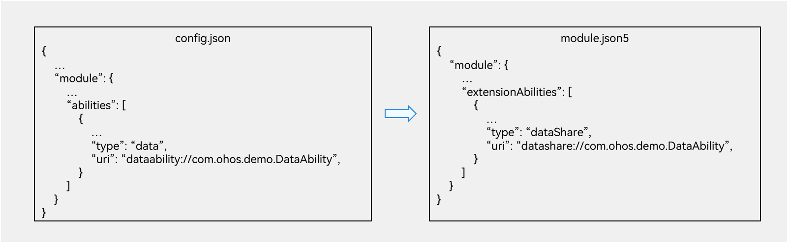

# FA模型访问Stage模型DataShareExtensionAbility

## 概述

无论FA模型还是Stage模型，数据读写功能都包含客户端和服务端两部分。

- FA模型中，客户端是由DataAbilityHelper提供对外接口，服务端是由DataAbility提供数据库的读写服务。

- Stage模型中，客户端是由DataShareHelper提供对外接口，服务端是由DataShareExtensionAbility提供数据库的读写服务。

服务端由FA模型升级到Stage模型后，会导致FA模型的客户端在API 9(含)之后的版本上无法访问服务端。

为了解决上述问题，系统在框架侧提供了一个解决方案，让开发者平滑过渡到API 9(含)之后的版本。

## 基本原理

一种兼容方法是DataAbilityHelper根据传入的URI的前缀是DataAbility还是DataShare来决定是否调DataShareHelper的接口。但是这种方法需要开发者修改原客户端代码的URI，做不到无感知切换。

因此DataAbilityHelper不能仅依赖URI的前缀决定访问DataAbility还是DataShareExtensionAbility，系统采用的方法是：

1. 先按照传入的URI拉起DataAbility；如果拉起失败，再将传入的URI的前缀转换成DataShare再去尝试拉起DataShareExtensionAbility。

2. 如果URI无对应的DataAbility和DataShareExtensionAbility，则拉起失败；反之，必定会拉起DataAbility或者DataShareExtensionAbility。

## 约束与限制

1. 由DataAbility切换到DataShareExtensionAbility时，只能修改URI的前缀，不能修改URI的其他部分。

2. DataShareHelper并没有实现原DataAbilityHelper对外API接口的所有功能，因此有部分接口是无法兼容的，具体如表1所示。

     **表1** FA模型访问stage模型DataShareExtensionAbility接口支持情况
   
   | 接口 | DataAbilityHelper是否提供 | DataShareHelper是否提供 | 是否兼容 | 
   | -------- | -------- | -------- | -------- |
   | on | 是 | 是 | 是 | 
   | off | 是 | 是 | 是 | 
   | notifyChange | 是 | 是 | 是 | 
   | insert | 是 | 是 | 是 | 
   | delete | 是 | 是 | 是 | 
   | query | 是 | 是 | 是 | 
   | update | 是 | 是 | 是 | 
   | batchInsert | 是 | 是 | 是 | 
   | getType | 是 | 否 | 否 | 
   | getFileTypes | 是 | 否 | 否 | 
   | normalizeUri | 是 | 是 | 是 | 
   | denormalizeUri | 是 | 是 | 是 | 
   | openFile | 是 | 否 | 否 | 
   | call | 是 | 否 | 否 | 
   | executeBatch | 是 | 否 | 否 | 
