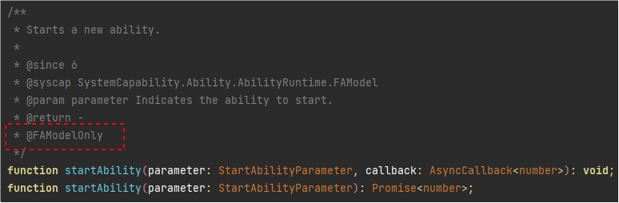

# API切换概述

<!--Kit: Ability Kit-->
<!--Subsystem: Ability-->
<!--Owner: @wkljy-->
<!--Designer: @li-weifeng2024-->
<!--Tester: @lixueqing513-->
<!--Adviser: @huipeizi-->


[FA模型](ability-terminology.md#fa模型)和[Stage模型](ability-terminology.md#stage模型)由于线程模型和进程模型的差异，部分接口仅在FA模型下才能使用，针对这部分接口在SDK的接口中有FAModelOnly的标记，用于提醒开发者这部分接口仅能在FA模型下使用。因此在切换到Stage模型时，需要将应用中用到的FAModelOnly接口替换成Stage模型下对应的接口。下面是startAbility的接口切换示例，全量接口列表请查看后续章节：



startAbility接口由FA模型切换到Stage模型的示例：

- FA模型示例

  ```ts
  import featureAbility from '@ohos.ability.featureAbility';
  import Want from '@ohos.app.ability.Want';
  import hilog from '@ohos.hilog';
  
  const TAG: string = 'PagePageAbilityFirst';
  const domain: number = 0xFF00;
  
  @Entry
  @Component
  struct PagePageAbilityFirst {
    
    build() {
      Column() {
        List({ initialIndex: 0 }) {
          ListItem() {
            Flex({ justifyContent: FlexAlign.SpaceBetween, alignContent: FlexAlign.Center }) {
              //...
            }
            .onClick(() => {
              (async (): Promise<void> => {
                try {
                  hilog.info(domain, TAG, 'Begin to start ability');
                  let want: Want = {
                    bundleName: 'com.samples.famodelabilitydevelop',
                    moduleName: 'entry',
                    abilityName: 'com.samples.famodelabilitydevelop.PageAbilitySingleton'
                  };
                  await featureAbility.startAbility({ want: want });
                  hilog.info(domain, TAG, `Start ability succeed`);
                }
                catch (error) {
                  hilog.error(domain, TAG, 'Start ability failed with ' + error);
                }
              })()
            })
          }
          //...
        }
        //...
      }
      //...
    }
  }

  ```

- Stage示例示例

  ```ts
  import { hilog } from '@kit.PerformanceAnalysisKit';
  import { Want, common, Caller } from '@kit.AbilityKit';
  import { BusinessError } from '@kit.BasicServicesKit';

  const TAG: string = '[Page_UIAbilityComponentsInteractive]';
  const DOMAIN_NUMBER: number = 0xFF00;

  @Entry
  @Component
  struct Page_UIAbilityComponentsInteractive {
    private context = this.getUIContext().getHostContext() as common.UIAbilityContext;
    caller: Caller | undefined = undefined;
    build() {
      Column() {
        //...
        List({ initialIndex: 0 }) {
          ListItem() {
            Row() {
              //...
            }
            .onClick(() => {
              // context为Ability对象的成员，在非Ability对象内部调用需要
              // 将Context对象传递过去
              let wantInfo: Want = {
                deviceId: '', // deviceId为空表示本设备
                bundleName: 'com.samples.stagemodelabilitydevelop',
                moduleName: 'entry', // moduleName非必选
                abilityName: 'FuncAbilityA',
                parameters: { // 自定义信息
                  info: '来自EntryAbility Page_UIAbilityComponentsInteractive页面'
                },
              };
              // context为调用方UIAbility的UIAbilityContext
              this.context.startAbility(wantInfo).then(() => {
                hilog.info(DOMAIN_NUMBER, TAG, 'startAbility success.');
              }).catch((error: BusinessError) => {
                hilog.error(DOMAIN_NUMBER, TAG, 'startAbility failed.');
              });
            })
          }
          //...
        }
        //...
      }
      //...
    }
  }
  ```
