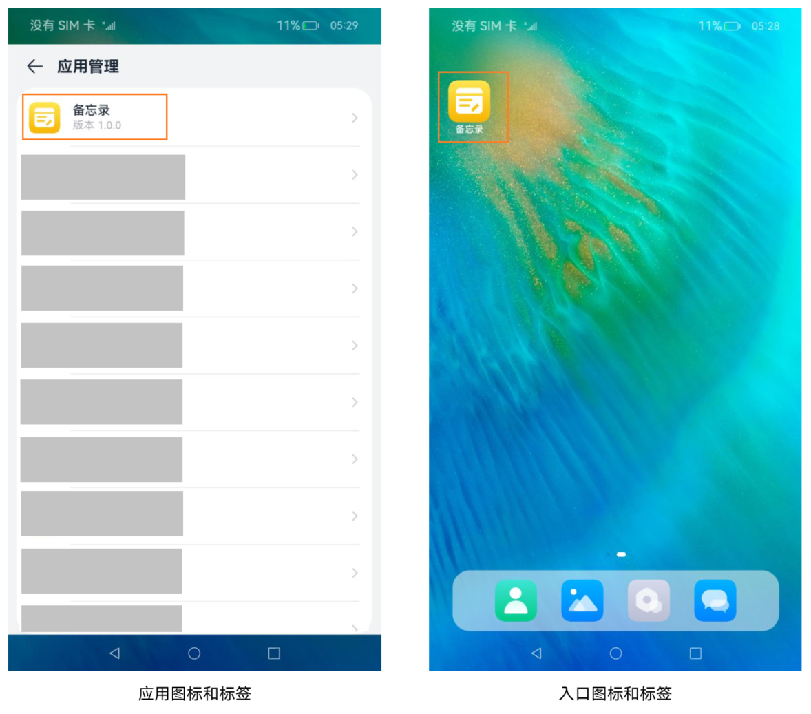

# 应用/组件级配置


在开发应用时，需要配置应用的一些标签，例如应用的包名、图标等标识特征的属性。本文描述了在开发应用需要配置的一些关键标签。图标和标签通常一起配置，可以分为应用图标、应用标签和入口图标、入口标签，分别对应[app.json5配置文件](../quick-start/app-configuration-file.md)和[module.json5配置文件](../quick-start/module-configuration-file.md)文件中的icon和label标签。应用图标和标签是在设置应用中使用，例如设置应用中的应用列表。入口图标是应用安装完成后在设备桌面上显示出来的，如图一所示。入口图标是以[UIAbility](uiability-overview.md)为粒度，支持同一个应用存在多个入口图标和标签，点击后进入对应的UIAbility界面。


  **图1** 应用图标和标签  




- **应用包名配置**
  
  应用需要在工程的AppScope目录下的[app.json5配置文件](../quick-start/app-configuration-file.md)中配置bundleName标签，该标签用于标识应用的唯一性。推荐采用反域名形式命名（如com.example.demo，建议第一级为域名后缀com，第二级为厂商/个人名，第三级为应用名，也可以多级）。
  
- **应用图标和标签配置**

  应用图标需要在工程的AppScope目录下的[app.json5配置文件](../quick-start/app-configuration-file.md)中配置icon标签。应用图标需配置为图片的资源索引，配置完成后，该图片即为应用的图标。应用图标通常用于显示在应用列表中，例如设置中的应用列表。

  应用标签需要在工程的AppScope模块下的[app.json5配置文件](../quick-start/app-configuration-file.md)中配置label标签。标识应用对用户显示的名称，需要配置为字符串资源的索引。

  Stage模型的应用支持单独配置应用图标和标签，在[app.json5配置文件](../quick-start/app-configuration-file.md)中配置。应用图标和标签是在设置应用中使用，例如设置应用中的应用列表，会显示出对应的图标和标签。在app字段下面分别有icon和label字段，根据对应的规则进行配置。

  ```json
    {
      "app": {
        "icon": "$media:app_icon",
        "label": "$string:app_name"
        // ...
      }
    }
  ```

- **入口图标和标签配置**
  
    入口图标和标签需要在[app.json5配置文件](../quick-start/app-configuration-file.md)中配置，在abilities标签下面分别有icon和label标签。例如希望在桌面上显示该UIAbility的图标和标签，则需要在skills标签下面的entities中添加"entity.system.home"、actions中添加"action.system.home"。同一个应用有多个UIAbility配置上述字段时，桌面上会显示出多个图标和标签，分别对应各自的UIAbility。
  
  ```json
  {
    "module": {
      // ...
      "abilities": [
        {
          // $开头的为资源值
          "icon": "$media:icon",
          "label": "$string:EntryAbility_label",
          "skills": [
            {
              "entities": [
                "entity.system.home"
              ],
              "actions": [
                "action.system.home"
              ]
            }
          ],
        }
      ]
    }
  }
  ```
- **应用版本声明配置**
  
  应用版本声明需要在工程的AppScope目录下的[app.json5配置文件](../quick-start/app-configuration-file.md)中配置versionCode标签和versionName标签。versionCode用于标识应用的版本号，该标签值为32位非负整数。此数字仅用于确定某个版本是否比另一个版本更新，数值越大表示版本越高。versionName标签标识版本号的文字描述。
  
- **Module支持的设备类型配置**

  Module支持的设备类型需要在[module.json5配置文件](../quick-start/module-configuration-file.md)中配置deviceTypes标签，如果deviceTypes标签中添加了某种设备，则表明当前的Module支持在该设备上运行。

- **Module权限配置**

  Module访问系统或其他应用受保护部分所需的权限信息需要在[module.json5配置文件](../quick-start/module-configuration-file.md)中配置requestPermission标签。该标签用于声明需要申请权限的名称、申请权限的原因以及权限使用的场景。