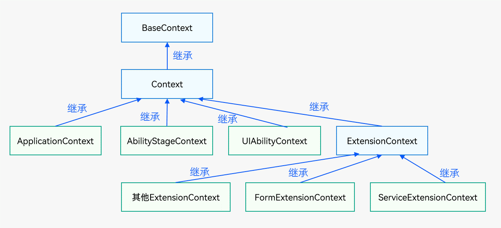
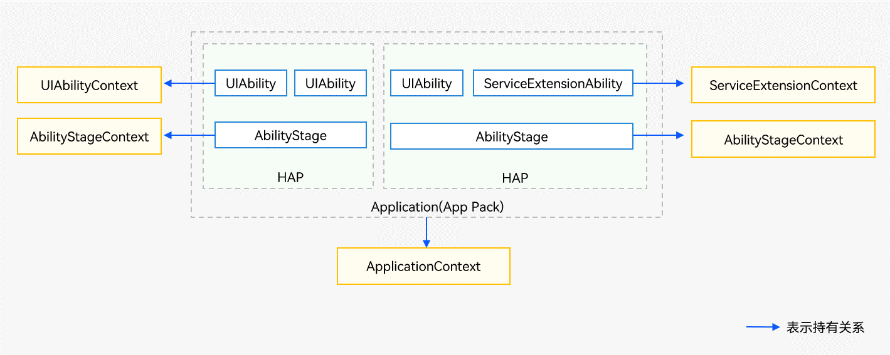

# 应用上下文Context


## 概述

[Context](../reference/apis-ability-kit/js-apis-inner-application-context.md)是应用中对象的上下文，其提供了应用的一些基础信息，例如[resourceManager](../reference/apis-localization-kit/js-apis-resource-manager.md)（资源管理）、[applicationInfo](../reference/apis-ability-kit/js-apis-bundleManager-applicationInfo.md)（当前应用信息）、[dir](../reference/apis-ability-kit/js-apis-inner-application-context.md#属性)（应用文件路径）、[area](../reference/apis-ability-kit/js-apis-app-ability-contextConstant.md#areamode)（文件分区）等，以及应用的一些基本方法，例如createBundleContext()、[getApplicationContext()](../reference/apis-ability-kit/js-apis-inner-application-context.md#contextgetapplicationcontext)等。[UIAbility](../reference/apis-ability-kit/js-apis-app-ability-uiAbility.md)组件和各种[ExtensionAbility](../reference/apis-ability-kit/js-apis-app-ability-extensionAbility.md)派生类组件都有各自不同的Context类。分别有基类Context、[ApplicationContext](../reference/apis-ability-kit/js-apis-inner-application-applicationContext.md)、[AbilityStageContext](../reference/apis-ability-kit/js-apis-inner-application-abilityStageContext.md)、[UIAbilityContext](../reference/apis-ability-kit/js-apis-inner-application-uiAbilityContext.md)、[ExtensionContext](../reference/apis-ability-kit/js-apis-inner-application-extensionContext.md)、ServiceExtensionContext等Context。

- 各类Context的继承关系  
  
  
- 各类Context的持有关系  
  
  
- 各类Context的获取方式
  - 获取[UIAbilityContext](../reference/apis-ability-kit/js-apis-inner-application-uiAbilityContext.md)。每个[UIAbility](../reference/apis-ability-kit/js-apis-app-ability-uiAbility.md)中都包含了一个Context属性，提供操作应用组件、获取应用组件的配置信息等能力。
    
    ```ts
    import { UIAbility, AbilityConstant, Want } from '@kit.AbilityKit';

    export default class EntryAbility extends UIAbility {
      onCreate(want: Want, launchParam: AbilityConstant.LaunchParam): void {
        let uiAbilityContext = this.context;
        //...
      }
    }
    ```
     
     > **说明：**
     >
     > 页面中获取UIAbility实例的上下文信息请参见[获取UIAbility的上下文信息](uiability-usage.md#获取uiability的上下文信息)。
  - 获取特定场景[ExtensionContext](../reference/apis-ability-kit/js-apis-inner-application-extensionContext.md)。以ServiceExtensionContext为例，表示后台服务的上下文环境，继承自ExtensionContext，提供后台服务相关的接口能力。
    
    ```ts
    import { ServiceExtensionAbility, Want } from '@kit.AbilityKit';

    export default class ServiceExtAbility extends ServiceExtensionAbility {
      onCreate(want: Want) {
        let serviceExtensionContext = this.context;
        //...
      }
    }
    ```
  - 获取[AbilityStageContext](../reference/apis-ability-kit/js-apis-inner-application-abilityStageContext.md)。Module级别的Context。和基类Context相比，额外提供[HapModuleInfo](../reference/apis-ability-kit/js-apis-inner-application-abilityStageContext.md#属性)、[Configuration](../reference/apis-ability-kit/js-apis-inner-application-abilityStageContext.md#属性)等信息。
    
    ```ts
    import { AbilityStage } from '@kit.AbilityKit';

    export default class MyAbilityStage extends AbilityStage {
      onCreate(): void {
        let abilityStageContext = this.context;
        //...
      }
    }
    ```
  - 获取[ApplicationContext](../reference/apis-ability-kit/js-apis-inner-application-applicationContext.md)。应用级别的Context。ApplicationContext在基类Context的基础上提供了订阅应用内应用组件的生命周期的变化、订阅系统内存变化和订阅应用内系统环境的变化的能力，在[UIAbility](../reference/apis-ability-kit/js-apis-app-ability-uiAbility.md)、[ExtensionAbility](../reference/apis-ability-kit/js-apis-app-ability-extensionAbility.md)、[AbilityStage](../reference/apis-ability-kit/js-apis-app-ability-abilityStage.md)中均可以获取。
    
    ```ts
    import { UIAbility, AbilityConstant, Want } from '@kit.AbilityKit';

    export default class EntryAbility extends UIAbility {
      onCreate(want: Want, launchParam: AbilityConstant.LaunchParam): void {
        let applicationContext = this.context.getApplicationContext();
        //...
      }
    }
    ```


## Context的典型使用场景


本章节通过如下典型场景来介绍Context的用法：

- [获取应用文件路径](#获取应用文件路径)
- [获取和修改加密分区](#获取和修改加密分区)
- [获取本应用中其他module的context](#获取本应用中其他module的context)
- [订阅进程内UIAbility生命周期变化](#订阅进程内uiability生命周期变化)


### 获取应用文件路径

[基类Context](../reference/apis-ability-kit/js-apis-inner-application-context.md)提供了获取应用文件路径的能力，[ApplicationContext](../reference/apis-ability-kit/js-apis-inner-application-applicationContext.md)、[AbilityStageContext](../reference/apis-ability-kit/js-apis-inner-application-abilityStageContext.md)、[UIAbilityContext](../reference/apis-ability-kit/js-apis-inner-application-uiAbilityContext.md)和[ExtensionContext](../reference/apis-ability-kit/js-apis-inner-application-extensionContext.md)均继承该能力。应用文件路径属于应用沙箱路径，具体请参见[应用沙箱目录](../file-management/app-sandbox-directory.md)。

上述各类Context获取的应用文件路径有所不同。

- 通过[ApplicationContext](../reference/apis-ability-kit/js-apis-inner-application-applicationContext.md)获取应用级别的应用文件路径，此路径是应用全局信息推荐的存放路径，这些文件会跟随应用的卸载而删除。

  | 属性 | 路径 |
  | -------- | -------- |
  | bundleCodeDir | <路径前缀>/el1/bundle |
  | cacheDir | <路径前缀>/<加密等级>/base/cache |
  | filesDir | <路径前缀>/<加密等级>/base/files |
  | preferencesDir | <路径前缀>/<加密等级>/base/preferences |
  | tempDir | <路径前缀>/<加密等级>/base/temp |
  | databaseDir | <路径前缀>/<加密等级>/database |
  | distributedFilesDir | <路径前缀>/el2/distributedFiles |
  | cloudFileDir<sup>12+</sup> | <路径前缀>/el2/cloud |

  示例代码如下所示。

  ```ts
  import { common } from '@kit.AbilityKit';
  import { hilog } from '@kit.PerformanceAnalysisKit';
  import { promptAction } from '@kit.ArkUI';

  const TAG: string = '[Page_Context]';
  const DOMAIN_NUMBER: number = 0xFF00;

  @Entry
  @Component
  struct Page_Context {
    private context = getContext(this) as common.UIAbilityContext;

    build() {
      Column() {
        //...
        List({ initialIndex: 0 }) {
          ListItem() {
            Row() {
              //...
            }
            .onClick(() => {
              let applicationContext = this.context.getApplicationContext();
              let cacheDir = applicationContext.cacheDir;
              let tempDir = applicationContext.tempDir;
              let filesDir = applicationContext.filesDir;
              let databaseDir = applicationContext.databaseDir;
              let bundleCodeDir = applicationContext.bundleCodeDir;
              let distributedFilesDir = applicationContext.distributedFilesDir;
              let preferencesDir = applicationContext.preferencesDir;
              let cloudFileDir = applicationContext.cloudFileDir;
              // 获取应用文件路径
              let filePath = tempDir + 'test.txt';
              hilog.info(DOMAIN_NUMBER, TAG, `filePath: ${filePath}`);
              if (filePath !== null) {
                promptAction.showToast({
                  message: filePath
                });
              }
            })
          }
          //...
        }
        //...
      }
      //...
    }
  }
  ```

- 通过[AbilityStageContext](../reference/apis-ability-kit/js-apis-inner-application-abilityStageContext.md)、[UIAbilityContext](../reference/apis-ability-kit/js-apis-inner-application-uiAbilityContext.md)、[ExtensionContext](../reference/apis-ability-kit/js-apis-inner-application-extensionContext.md)获取[HAP](../quick-start/hap-package.md)级别的应用文件路径。此路径是HAP相关信息推荐的存放路径，这些文件会跟随HAP的卸载而删除，但不会影响应用级别路径的文件，除非该应用的HAP已全部卸载。

  | 属性 | 路径 |
  | -------- | -------- |
  | bundleCodeDir | <路径前缀>/el1/bundle |
  | cacheDir | <路径前缀>/<加密等级>/base/**haps/\<module-name>**/cache |
  | filesDir | <路径前缀>/<加密等级>/base/**haps/\<module-name>**/files |
  | preferencesDir | <路径前缀>/<加密等级>/base/**haps/\<module-name>**/preferences |
  | tempDir | <路径前缀>/<加密等级>/base/**haps/\<module-name>**/temp |
  | databaseDir | <路径前缀>/<加密等级>/database/**\<module-name>** |
  | distributedFilesDir | <路径前缀>/el2/distributedFiles/**\<module-name>** |
  | cloudFileDir<sup>12+</sup> | <路径前缀>/el2/cloud/**\<module-name>** |

  示例代码如下所示。

  ```ts
  import { common } from '@kit.AbilityKit';
  import { hilog } from '@kit.PerformanceAnalysisKit';
  import { promptAction } from '@kit.ArkUI';

  const TAG: string = '[Page_Context]';
  const DOMAIN_NUMBER: number = 0xFF00;

  @Entry
  @Component
  struct Page_Context {
    private context = getContext(this) as common.UIAbilityContext;

    build() {
      Column() {
        //...
        List({ initialIndex: 0 }) {
          ListItem() {
            Row() {
              //...
            }
            .onClick(() => {
              let cacheDir = this.context.cacheDir;
              let tempDir = this.context.tempDir;
              let filesDir = this.context.filesDir;
              let databaseDir = this.context.databaseDir;
              let bundleCodeDir = this.context.bundleCodeDir;
              let distributedFilesDir = this.context.distributedFilesDir;
              let preferencesDir = this.context.preferencesDir;
              let cloudFileDir = applicationContext.cloudFileDir;
              // 获取应用文件路径
              let filePath = tempDir + 'test.txt';
              hilog.info(DOMAIN_NUMBER, TAG, `filePath: ${filePath}`);
              if (filePath !== null) {
                promptAction.showToast({
                  message: filePath
                });
              }
            })
          }
          //...
        }
        //...
      }
      //...
    }
  }
  ```


### 获取和修改加密分区

应用文件加密是一种保护数据安全的方法，可以使得文件在未经授权访问的情况下得到保护。在不同的场景下，应用需要不同程度的文件保护。

在实际应用中，开发者需要根据不同场景的需求选择合适的加密分区，从而保护应用数据的安全。通过合理使用不同级别的加密分区，可以有效提高应用数据的安全性。关于不同分区的权限说明，详见[ContextConstant](../reference/apis-ability-kit/js-apis-app-ability-contextConstant.md)的[AreaMode](../reference/apis-ability-kit/js-apis-app-ability-contextConstant.md#areamode)。

- EL1：对于私有文件，如闹铃、壁纸等，应用可以将这些文件放到设备级加密分区（EL1）中，以保证在用户输入密码前就可以被访问。
- EL2：对于更敏感的文件，如个人隐私信息等，应用可以将这些文件放到更高级别的加密分区（EL2）中，以保证更高的安全性。
- EL3：对于应用中的记录步数、文件下载、音乐播放，需要在锁屏时读写和创建新文件，放在（EL3）的加密分区比较合适。
- EL4：对于用户安全信息相关的文件，锁屏时不需要读写文件、也不能创建文件，放在（EL4）的加密分区更合适。
- EL5：对于用户隐私敏感数据文件，锁屏后默认不可读写，如果锁屏后需要读写文件，则锁屏前可以调用[Access](../reference/apis-ability-kit/js-apis-screenLockFileManager.md#screenlockfilemanageracquireaccess)接口申请继续读写文件，或者锁屏后也需要创建新文件且可读写，放在（EL5）的应用级加密分区更合适。

要实现获取和设置当前加密分区，可以通过读写[Context](../reference/apis-ability-kit/js-apis-inner-application-context.md)的`area`属性来实现。
```ts
import { UIAbility, contextConstant, AbilityConstant, Want } from '@kit.AbilityKit';

export default class EntryAbility extends UIAbility {
  onCreate(want: Want, launchParam: AbilityConstant.LaunchParam) {
    // 存储普通信息前，切换到EL1设备级加密
    this.context.area = contextConstant.AreaMode.EL1; // 切换area
    // 存储普通信息

    // 存储敏感信息前，切换到EL2用户级加密
    this.context.area = contextConstant.AreaMode.EL2; // 切换area
    // 存储敏感信息

    // 存储敏感信息前，切换到EL3用户级加密
    this.context.area = contextConstant.AreaMode.EL3; // 切换area
    // 存储敏感信息

    // 存储敏感信息前，切换到EL4用户级加密
    this.context.area = contextConstant.AreaMode.EL4; // 切换area
    // 存储敏感信息

    // 存储敏感信息前，切换到EL5应用级加密
    this.context.area = contextConstant.AreaMode.EL5; // 切换area
    // 存储敏感信息
  }
}
```
```ts
import { contextConstant, common } from '@kit.AbilityKit';
import { promptAction } from '@kit.ArkUI';

@Entry
@Component
struct Page_Context {
  private context = getContext(this) as common.UIAbilityContext;

  build() {
    Column() {
      //...
      List({ initialIndex: 0 }) {
        //...
        ListItem() {
          Row() {
            //...
          }
          .onClick(() => {
            // 存储普通信息前，切换到EL1设备级加密
            if (this.context.area === contextConstant.AreaMode.EL2) { // 获取area
              this.context.area = contextConstant.AreaMode.EL1; // 修改area
              promptAction.showToast({
                message: 'SwitchToEL1'
              });
            }
            // 存储普通信息
          })
        }
        //...
        ListItem() {
          Row() {
            //...
          }
          .onClick(() => {
            // 存储敏感信息前，切换到EL2用户级加密
            if (this.context.area === contextConstant.AreaMode.EL1) { // 获取area
              this.context.area = contextConstant.AreaMode.EL2; // 修改area
              promptAction.showToast({
                message: 'SwitchToEL2'
              });
            }
            // 存储敏感信息
          })
        }
        //...
      }
      //...
    }
    //...
  }
}
```


### 获取本应用中其他Module的Context

调用[createModuleContext(moduleName:string)](../reference/apis-ability-kit/js-apis-inner-application-context.md#contextcreatemodulecontext)方法，获取本应用中其他Module的Context。获取到其他Module的Context之后，即可获取到相应Module的资源信息。
  
  ```ts
  import { common } from '@kit.AbilityKit';
  import { promptAction } from '@kit.ArkUI';

  let storageEventCall = new LocalStorage();

  @Entry(storageEventCall)
  @Component
  struct Page_Context {
    private context = getContext(this) as common.UIAbilityContext;

    build() {
      Column() {
        //...
        List({ initialIndex: 0 }) {
          ListItem() {
            Row() {
              //...
            }
            .onClick(() => {
              let moduleName2: string = 'entry';
              let moduleContext: Context = this.context.createModuleContext(moduleName2);
              if (moduleContext !== null) {
                promptAction.showToast({
                  message: ('成功获取Context')
                });
              }
            })
          }
          //...
        }
        //...
      }
      //...
    }
  }
  ```


### 订阅进程内UIAbility生命周期变化

在应用内的DFX统计场景中，如需要统计对应页面停留时间和访问频率等信息，可以使用订阅进程内[UIAbility](../reference/apis-ability-kit/js-apis-app-ability-uiAbility.md)生命周期变化功能。

通过[ApplicationContext](../reference/apis-ability-kit/js-apis-inner-application-applicationContext.md)提供的能力，可以订阅进程内UIAbility生命周期变化。当进程内的UIAbility生命周期变化时，如创建、可见/不可见、获焦/失焦、销毁等，会触发相应的回调函数。每次注册回调函数时，都会返回一个监听生命周期的ID，此ID会自增+1。当超过监听上限数量2^63-1时，会返回-1。以[UIAbilityContext](../reference/apis-ability-kit/js-apis-inner-application-uiAbilityContext.md)中的使用为例进行说明。


```ts
import { AbilityConstant, AbilityLifecycleCallback, UIAbility, Want } from '@kit.AbilityKit';
import { hilog } from '@kit.PerformanceAnalysisKit';
import { window } from '@kit.ArkUI';
import  { BusinessError } from '@kit.BasicServicesKit';

const TAG: string = '[LifecycleAbility]';
const DOMAIN_NUMBER: number = 0xFF00;

export default class LifecycleAbility extends UIAbility {
  // 定义生命周期ID
  lifecycleId: number = -1;

  onCreate(want: Want, launchParam: AbilityConstant.LaunchParam): void {
    // 定义生命周期回调对象
    let abilityLifecycleCallback: AbilityLifecycleCallback = {
      // 当UIAbility创建时被调用
      onAbilityCreate(uiAbility) {
        hilog.info(DOMAIN_NUMBER, TAG, `onAbilityCreate uiAbility.launchWant: ${JSON.stringify(uiAbility.launchWant)}`);
      },
      // 当窗口创建时被调用
      onWindowStageCreate(uiAbility, windowStage: window.WindowStage) {
        hilog.info(DOMAIN_NUMBER, TAG, `onWindowStageCreate uiAbility.launchWant: ${JSON.stringify(uiAbility.launchWant)}`);
        hilog.info(DOMAIN_NUMBER, TAG, `onWindowStageCreate windowStage: ${JSON.stringify(windowStage)}`);
      },
      // 当窗口处于活动状态时被调用
      onWindowStageActive(uiAbility, windowStage: window.WindowStage) {
        hilog.info(DOMAIN_NUMBER, TAG, `onWindowStageActive uiAbility.launchWant: ${JSON.stringify(uiAbility.launchWant)}`);
        hilog.info(DOMAIN_NUMBER, TAG, `onWindowStageActive windowStage: ${JSON.stringify(windowStage)}`);
      },
      // 当窗口处于非活动状态时被调用
      onWindowStageInactive(uiAbility, windowStage: window.WindowStage) {
        hilog.info(DOMAIN_NUMBER, TAG, `onWindowStageInactive uiAbility.launchWant: ${JSON.stringify(uiAbility.launchWant)}`);
        hilog.info(DOMAIN_NUMBER, TAG, `onWindowStageInactive windowStage: ${JSON.stringify(windowStage)}`);
      },
      // 当窗口被销毁时被调用
      onWindowStageDestroy(uiAbility, windowStage: window.WindowStage) {
        hilog.info(DOMAIN_NUMBER, TAG, `onWindowStageDestroy uiAbility.launchWant: ${JSON.stringify(uiAbility.launchWant)}`);
        hilog.info(DOMAIN_NUMBER, TAG, `onWindowStageDestroy windowStage: ${JSON.stringify(windowStage)}`);
      },
      // 当UIAbility被销毁时被调用
      onAbilityDestroy(uiAbility) {
        hilog.info(DOMAIN_NUMBER, TAG, `onAbilityDestroy uiAbility.launchWant: ${JSON.stringify(uiAbility.launchWant)}`);
      },
      // 当UIAbility从后台转到前台时触发回调
      onAbilityForeground(uiAbility) {
        hilog.info(DOMAIN_NUMBER, TAG, `onAbilityForeground uiAbility.launchWant: ${JSON.stringify(uiAbility.launchWant)}`);
      },
      // 当UIAbility从前台转到后台时触发回调
      onAbilityBackground(uiAbility) {
        hilog.info(DOMAIN_NUMBER, TAG, `onAbilityBackground uiAbility.launchWant: ${JSON.stringify(uiAbility.launchWant)}`);
      },
      // 当UIAbility迁移时被调用
      onAbilityContinue(uiAbility) {
        hilog.info(DOMAIN_NUMBER, TAG, `onAbilityContinue uiAbility.launchWant: ${JSON.stringify(uiAbility.launchWant)}`);
      }
    };
    // 获取应用上下文
    let applicationContext = this.context.getApplicationContext();
    try {
      // 注册应用内生命周期回调
      this.lifecycleId = applicationContext.on('abilityLifecycle', abilityLifecycleCallback);
    } catch (err) {
      let code = (err as BusinessError).code;
      let message = (err as BusinessError).message;
      hilog.error(DOMAIN_NUMBER, TAG, `Failed to register applicationContext. Code is ${code}, message is ${message}`);
    }

    hilog.info(DOMAIN_NUMBER, TAG, `register callback number: ${this.lifecycleId}`);
  }
  //...
  onDestroy(): void {
    // 获取应用上下文
    let applicationContext = this.context.getApplicationContext();
    try {
      // 取消应用内生命周期回调
      applicationContext.off('abilityLifecycle', this.lifecycleId);
    } catch (err) {
      let code = (err as BusinessError).code;
      let message = (err as BusinessError).message;
      hilog.error(DOMAIN_NUMBER, TAG, `Failed to unregister applicationContext. Code is ${code}, message is ${message}`);
    }
  }
}
```
