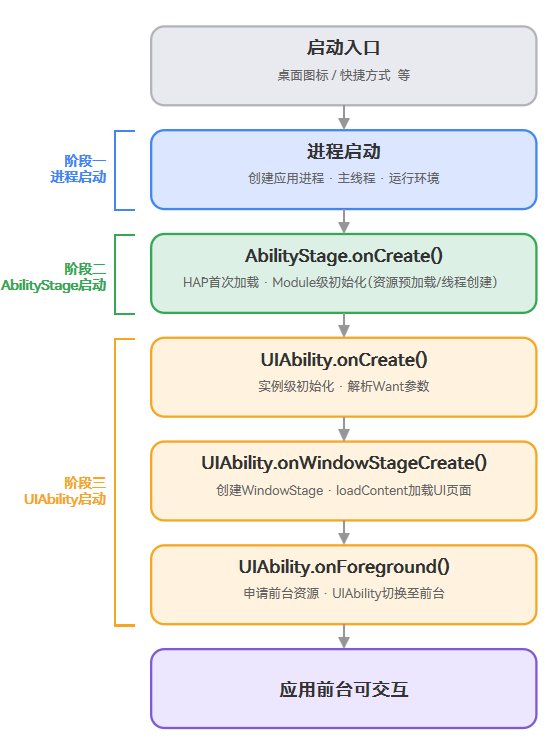

# 应用启动流程

<!--Kit: Ability Kit-->
<!--Subsystem: Ability-->
<!--Owner: @ccllee1-->
<!--Designer: @ccllee1-->
<!--Tester: @liangchengguang-->
<!--Adviser: @HelloCrease-->

## 概述

应用启动是指用户通过入口（如桌面图标、快捷方式等）触发系统拉起应用的过程。在应用模型中，一次典型的应用启动会依次经历**进程启动**、**AbilityStage启动**、**UIAbility启动**三个阶段，并在此过程中触发对应的生命周期回调。理解三者的关系与时序，有助于开发者在正确的时机完成初始化、资源申请与界面加载。

- **进程启动**：进程是系统进行资源分配的基本单位，详见[进程模型概述](process-model-overview.md)。当应用的首个进程创建时，意味着应用的启动。默认情况下，应用中（同一Bundle名称）的所有[UIAbility](../reference/apis-ability-kit/js-apis-app-ability-uiAbility.md)组件运行在同一个独立进程（主进程）中。如果目标进程尚未创建，系统会先创建应用进程，并在进程内创建主线程进入消息循环；若进程已存在（如热启动场景），则直接复用已有进程。

- **AbilityStage启动**：[AbilityStage](../reference/apis-ability-kit/js-apis-app-ability-abilityStage.md)是一个[Module](../quick-start/application-package-overview.md#应用的多module设计机制)级别的组件管理器，应用的[HAP](../quick-start/hap-package.md)在首次加载时会创建一个AbilityStage实例，每个HAP对应一个AbilityStage实例。在开始加载对应Module的第一个应用组件实例之前，系统会先创建AbilityStage，并在创建完成后执行其[onCreate()](../reference/apis-ability-kit/js-apis-app-ability-abilityStage.md#oncreate)生命周期回调，用于通知开发者可以对该Module进行初始化。

- **UIAbility启动**：[UIAbility](../reference/apis-ability-kit/js-apis-app-ability-uiAbility.md)组件是一种包含UI的应用组件。三方应用必须包含至少一个UIAbility组件，否则没有界面对用户展示。UIAbility实例创建后，系统会依次触发[onCreate()](../reference/apis-ability-kit/js-apis-app-ability-uiAbility.md#oncreate)、[onWindowStageCreate()](../reference/apis-ability-kit/js-apis-app-ability-uiAbility.md#onwindowstagecreate)、[onForeground()](../reference/apis-ability-kit/js-apis-app-ability-uiAbility.md#onforeground)生命周期回调，完成UI加载并展示在前台。

进程、AbilityStage与UIAbility生命周期的关系如下图所示。

| 阶段 | 触发时机 | 主要职责 |
| :--- | :--- | :--- |
| 进程启动 | 应用首个进程创建时 | 分配系统资源、创建主线程、加载应用运行环境 |
| AbilityStage启动 | HAP首次加载、创建第一个应用组件实例前 | Module级初始化，如资源预加载、线程创建、启动框架任务执行 |
| UIAbility启动 | 创建UIAbility实例并展示 | 实例级初始化、UI加载、前后台资源申请与释放 |

## 启动阶段回调的使用建议

### Module级别初始化（AbilityStage.onCreate）

如[概述](#概述)所述，系统会先创建AbilityStage并执行其[onCreate()](../reference/apis-ability-kit/js-apis-app-ability-abilityStage.md#oncreate)回调。该回调在每个HAP的生命周期中仅触发一次，适合放置Module级别的初始化逻辑。

**建议在此回调中：**

- 执行该Module的资源预加载，如全局配置读取、基础数据预热。
- 注册[EnvironmentCallback](../reference/apis-ability-kit/js-apis-app-ability-environmentCallback.md)监听系统环境变量（语言、深浅色等）变化。
- 若已开启[应用启动框架AppStartup](./app-startup.md)，自动模式下的启动任务会在AbilityStage构造过程中开始执行，开发者无需在此手动调用。

**不建议在此回调中：**

- 执行与特定UIAbility实例强相关的业务逻辑（应在UIAbility的[onCreate()](../reference/apis-ability-kit/js-apis-app-ability-uiAbility.md#oncreate)中完成）。
- 执行大量耗时同步操作阻塞主线程，建议将耗时任务异步化或交由子线程处理。

### 指定实例模式路由（AbilityStage.onAcceptWant）

当[UIAbility指定实例模式（specified）](uiability-launch-type.md#specified启动模式)启动时，系统会触发AbilityStage的[onAcceptWant()](../reference/apis-ability-kit/js-apis-app-ability-abilityStage.md#onacceptwant)回调，由开发者返回实例标识来决定复用已有UIAbility实例还是创建新实例。

**建议在此回调中：**

- 根据Want中的`bundleName`、`abilityName`、`parameters`等字段判断本次启动应匹配的实例标识。
- 返回稳定的字符串标识用于实例路由，例如基于文档ID、会话ID等业务维度生成。

**不建议在此回调中：**

- 执行与实例匹配无关的耗时业务逻辑。
- 返回空值或null忽略匹配，这会导致系统按默认行为创建新实例，失去specified模式的意义。

### UIAbility实例初始化（UIAbility.onCreate）

该回调在UIAbility实例的整个生命周期中仅触发一次，开发者可以在该回调中执行仅发生一次的启动逻辑。

**建议在此回调中：**

- 读取并解析启动参数[Want](../reference/apis-ability-kit/js-apis-app-ability-want.md)与[LaunchParam](../reference/apis-ability-kit/js-apis-app-ability-abilityConstant.md#launchparam)，根据启动原因（如入口图标、Deep Linking、应用间跳转）分流业务。
- 执行该UIAbility实例级别的一次性初始化，如全局状态初始化、权限预检查、监听注册。

**不建议在此回调中：**

- 加载并渲染UI界面，UI加载应在[onWindowStageCreate()](../reference/apis-ability-kit/js-apis-app-ability-uiAbility.md#onwindowstagecreate)中通过[loadContent()](../reference/apis-arkui/arkts-apis-window-Window.md#loadcontent9)完成。
- 申请仅在UI可见时才需要的资源（如定位、相机），这类资源应在[onForeground()](../reference/apis-ability-kit/js-apis-app-ability-uiAbility.md#onforeground)中申请、在[onBackground()](../reference/apis-ability-kit/js-apis-app-ability-uiAbility.md#onbackground)中释放。
- 执行耗时同步任务阻塞主线程，影响启动速度。

## 启动入口

应用的启动入口是指用户进入应用的途径（如桌面图标、快捷方式等）。不同入口在触发UIAbility启动时，系统传入的[Want](../reference/apis-ability-kit/js-apis-app-ability-want.md)参数（如`action`、`uri`、`parameters`）可能不同，开发者可在UIAbility的`onCreate()`或`onNewWant()`中据此区分来源并执行相应逻辑。

应用也可被其他应用通过[Want](./want-overview.md)或[应用链接](./app-uri-config.md)拉起，或被系统通过[意图框架](./insight-intent-overview.md)调度启动。这类跨应用启动场景的详细说明请参见[应用间跳转](./link-between-apps-overview.md)。

### 应用图标（桌面图标）

应用图标是应用最常见的启动入口，通常显示在系统桌面上。用户点击桌面图标后，系统会根据[module.json5配置文件](../quick-start/module-configuration-file.md)中声明的入口UIAbility（通常为entry类型HAP中`startWindowIcon`与`label`所对应的UIAbility）发起启动。

### 快捷方式

快捷方式是指长按应用图标弹出的快捷菜单项，允许用户直接跳转到应用的特定功能页面。开发者可以在[module.json5配置文件](../quick-start/module-configuration-file.md#shortcuts标签)的`shortcuts`标签中声明静态快捷方式，或通过[shortcutManager](../reference/apis-ability-kit/js-apis-shortcutManager.md)接口动态发布快捷方式。

- 用户点击快捷方式后，系统会以携带特定`parameters`或`uri`的Want启动对应UIAbility。
- 开发者可在UIAbility的`onCreate()`或`onNewWant()`中解析Want参数，直接加载目标功能页，减少用户操作层级。

<!--RP1--><!--RP1End-->
