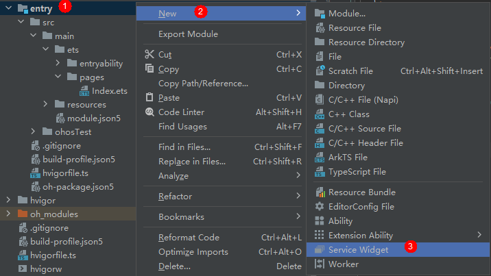
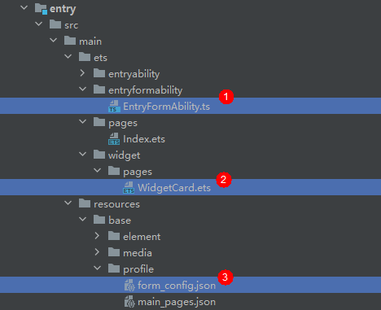

# 创建一个ArkTS卡片

在已有的应用工程中，创建ArkTS卡片，具体的操作方式如下。

1. 创建卡片。  
   
   
2. 根据实际业务场景，选择一个卡片模板。  
   
   
3. 在选择卡片的开发语言类型（Language）时，选择ArkTS选项，然后单击“Finish”，即可完成ArkTS卡片创建。  
   
   
   ArkTS卡片创建完成后，工程中会新增如下卡片相关文件：卡片生命周期管理文件（EntryFormAbility.ts）、卡片页面文件（WidgetCard.ets）和卡片配置文件（form_config.json）。  
   

