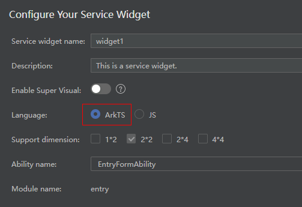

# 创建一个ArkTS卡片

开发者可以使用IDE创建ArkTS卡片，具体步骤请参见[DevEco Studio服务卡片开发指南](https://gitee.com/link?target=https%3A%2F%2Fdeveloper.harmonyos.com%2Fcn%2Fdocs%2Fdocumentation%2Fdoc-guides%2Fohos-development-service-widget-0000001263280425)。使用IDE生成的卡片模板包括三个部分：卡片页面（WidgetCard.ets）、卡片生命周期管理（FormExtensionAbility）和卡片配置文件（form_config.json）。

在选择卡片的开发语言类型（Language）时，需要选择ArkTS选项，如下图所示。

