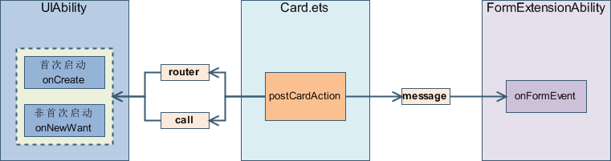

# 卡片事件能力说明

针对动态卡片，ArkTS卡片中提供了postCardAction()接口用于卡片内部和提供方应用间的交互，当前支持router、message和call三种类型的事件，仅在卡片中可以调用。
<br/>针对静态卡片，ArkTS卡片提供了[FormLink](../reference/arkui-ts/ts-container-formlink.md)用于卡片内部和提供方应用间的交互。

## 动态卡片事件能力说明

<br/>接口定义：postCardAction(component: Object, action: Object): void


接口参数说明：


| **参数名** | **参数类型** | **必填** | **参数描述** |
| -------- | -------- | -------- | -------- |
| component | Object | 是 | 当前自定义组件的实例，通常传入this。 |
| action | Object | 是 | action的具体描述，详情见下表。 |


action参数说明：


| **Key** | **Value** | **样例描述** |
| -------- | -------- | -------- |
| "action" | string | action的类型，支持三种预定义的类型：<br/>-&nbsp;"router"：跳转到提供方应用的指定UIAbility。<br/>-&nbsp;"message"：自定义消息，触发后会调用提供方FormExtensionAbility的[onFormEvent()](../reference/apis/js-apis-app-form-formExtensionAbility.md#onformevent)生命周期回调。<br/>-&nbsp;"call"：后台启动提供方应用。触发后会拉起提供方应用的指定UIAbility（仅支持[launchType](uiability-launch-type.md)为singleton的UIAbility，即启动模式为单实例的UIAbility），但不会调度到前台。提供方应用需要具备后台运行权限([ohos.permission.KEEP_BACKGROUND_RUNNING](../security/permission-list.md#ohospermissionkeep_background_running))。 |
| "bundleName" | string | "action"为"router"&nbsp;/&nbsp;"call"&nbsp;类型时跳转的包名，可选。 |
| "moduleName" | string | "action"为"router"&nbsp;/&nbsp;"call"&nbsp;类型时跳转的模块名，可选。 |
| "abilityName" | string | "action"为"router"&nbsp;/&nbsp;"call"&nbsp;类型时跳转的UIAbility名，必填。 |
| "params" | Object | 当前action携带的额外参数，内容使用JSON格式的键值对形式。必填。 |

> **说明：**
>
>"action"为"call"&nbsp;类型时，"params"需填入参数'method'，且类型需为string类型，用于触发UIAbility中对应的方法。

`postCardAction()`接口示例代码：

```ts
Button('跳转')
  .width('40%')
  .height('20%')
  .onClick(() => {
    postCardAction(this, {
      action: 'router',
      bundleName: 'com.example.myapplication',
      abilityName: 'EntryAbility',
      params: {
        message: 'testForRouter' // 自定义要发送的message
      }
    });
  })

Button('拉至后台')
  .width('40%')
  .height('20%')
  .onClick(() => {
    postCardAction(this, {
      action: 'call',
      bundleName: 'com.example.myapplication',
      abilityName: 'EntryAbility',
      params: {
        method: 'fun', // 自定义调用的方法名，必填
        message: 'testForCall' // 自定义要发送的message
      }
    });
  })
```

## 静态卡片事件能力说明
请参见[FormLink](../reference/arkui-ts/ts-container-formlink.md)
