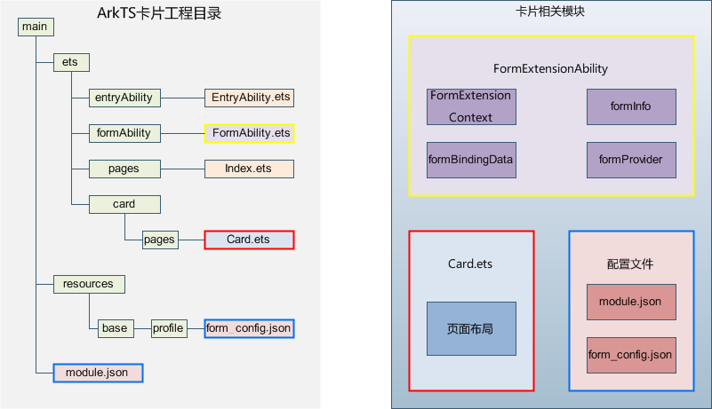

# ArkTS卡片相关模块

**图1** ArkTS卡片相关模块  

- [FormExtensionAbility](../reference/apis-form-kit/js-apis-app-form-formExtensionAbility.md)：卡片扩展模块，提供卡片创建、销毁、刷新等生命周期回调。

- [FormExtensionContext](../reference/apis-form-kit/js-apis-inner-application-formExtensionContext.md)：FormExtensionAbility的上下文环境，提供FormExtensionAbility具有的接口和能力。

- [formProvider](../reference/apis-form-kit/js-apis-app-form-formProvider.md)：提供卡片提供方相关的接口能力，可通过该模块提供接口实现更新卡片、设置卡片更新时间、获取卡片信息、请求发布卡片等。

- [formInfo](../reference/apis-form-kit/js-apis-app-form-formInfo.md)：提供了卡片信息和状态等相关类型和枚举。

- [formBindingData](../reference/apis-form-kit/js-apis-app-form-formBindingData.md)：提供卡片数据绑定的能力，包括FormBindingData对象的创建、相关信息的描述。

- [页面布局（WidgetCard.ets）](arkts-ui-widget-page-overview.md)：提供声明式范式的UI接口能力。
  - [ArkTS卡片特有能力](arkts-ui-widget-event-overview.md)：postCardAction用于卡片内部和提供方应用间的交互，仅在卡片中可以调用。
  - [ArkTS卡片能力列表](arkts-ui-widget-page-overview.md#arkts卡片支持的页面能力)：列举了能在ArkTS卡片中使用的API、组件、事件、属性和生命周期调度。

- [卡片配置](arkts-ui-widget-configuration.md)：包含FormExtensionAbility的配置和卡片的配置
  - 在[module.json5配置文件](../quick-start/module-configuration-file.md)中的extensionAbilities标签下，配置FormExtensionAbility相关信息。
  - 在resources/base/profile/目录下的[form_config.json配置文件](arkts-ui-widget-configuration.md)中，配置卡片（WidgetCard.ets）相关信息。
