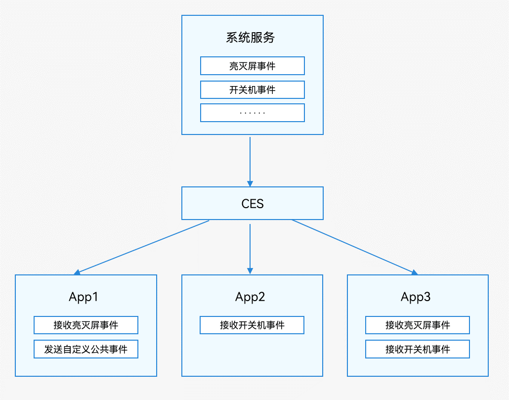

# 公共事件简介

OpenHarmony通过CES（Common Event Service，公共事件服务）为应用程序提供订阅、发布、退订公共事件的能力。

公共事件从系统角度可分为：系统公共事件和自定义公共事件。

- 系统公共事件：CES内部定义的公共事件，只有系统应用和系统服务才能发布，例如HAP安装，更新，卸载等公共事件。目前支持的系统公共事件详见[系统公共事件列表](../reference/apis/js-apis-commonEvent.md#support)。

- 自定义公共事件：应用自定义一些公共事件用来实现跨进程的事件通信能力。

公共事件按发送方式可分为：无序公共事件、有序公共事件和粘性公共事件。

- 无序公共事件：CES转发公共事件时，不考虑订阅者是否接收到，按订阅者订阅先后顺序转发。

- 有序公共事件：CES转发公共事件时，按订阅者订阅先后顺序，在接收到前一个订阅者回复后，再转发下一个订阅者。

- 粘性公共事件：能够让订阅者收到在订阅前已经发送的公共事件就是粘性公共事件。普通的公共事件只能在订阅后发送才能收到，而粘性公共事件的特殊性就是可以先发送后订阅。发送粘性事件必须是系统应用或系统服务，且需要申请`ohos.permission.COMMONEVENT_STICKY`权限，配置方式请参阅[访问控制授权申请指导](../security/accesstoken-guidelines.md#stage模型)。

每个应用都可以按需订阅公共事件，订阅成功，当公共事件发布时，系统会将其发送给对应的应用。这些公共事件可能来自系统、其他应用和应用自身。

  **图1** 公共事件示意图

