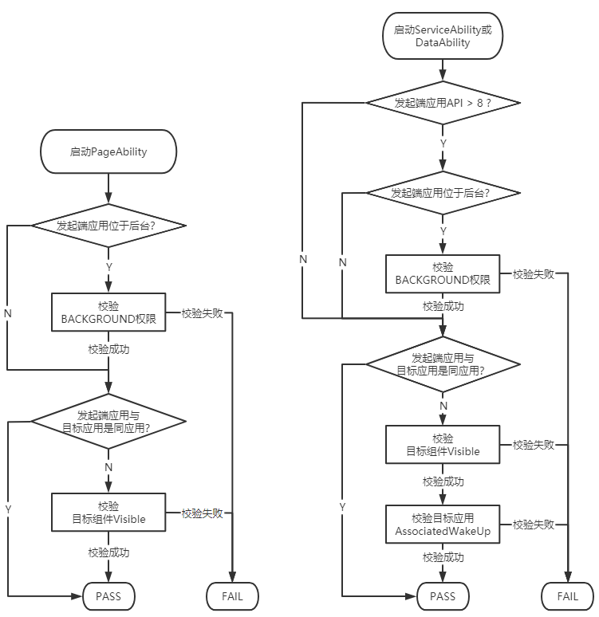

# 组件启动规则---FA模型


启动组件是指一切启动或连接应用组件的行为：


- 启动PageAbility或ServiceAbility，如使用startAbility()等相关接口。

- 连接ServiceAbility或DataAbility，如使用connectAbility()、acquireDataAbilityHelper()等相关接口。


在OpenHarmony中，为了保证用户具有更好的使用体验，对以下几种易影响用户体验与系统安全的行为做了限制：


- 后台应用任意弹框，如各种广告弹窗，影响用户使用。

- 后台应用相互唤醒，不合理的占用系统资源，导致系统功耗增加或系统卡顿。

- 前台应用任意跳转至其他应用，如随意跳转到其他应用的支付页面，存在安全风险。


鉴于此，OpenHarmony制订了一套组件启动规则，主要包括：


- 应用位于后台时，启动组件需鉴权。

- 跨应用启动visible为false的组件，需鉴权。

- 跨应用启动FA模型的ServiceAbility组件或DataAbility组件，对端应用需配置关联启动。


>  **说明：**
> 1. 组件启动管控自OpenHarmony v3.2 Release版本开始落地。
> 
> 2. 与原本的启动规则不同，新的组件启动规则较为严格，开发者需熟知启动规则，避免业务功能异常。


## 相关概念说明

为方便开发者理解管控规则，此处对所涉及的相关概念进行解释。

- **应用APL(Ability Privilege Level)**，表示应用的权限申请优先级的定义，不同APL等级的应用所能申请的权限不同，APL分为3个等级：
  - 操作系统核心能力APL="system_core" (APL = 3)
  - 系统基础服务APL="system_basic" (APL = 2)
  - 三方应用程序APL="normal" (APL = 1)
  - **注：三方应用默认都是APL="normal"**

- **BACKGROUND校验**
  - 对发起端应用进程的状态进行判断，若应用进程获焦或所属的PageAbility位于前台则判定为前台应用，否则为后台应用
  - 若发起端为后台应用，则需校验START_ABILITIES_FROM_BACKGROUND权限

- **VISIBLE校验**
  - 只针对跨应用启动的场景
  - 若目标组件visible配置为false，则需校验START_INVISIBLE_ABILITY权限

- **关联启动(AssociateWakeUp)**
  - 只有系统预置应用才允许配置AssociateWakeUp字段，其余应用AssociateWakeUp默认为**false**
  - 只针对跨应用场景
  - 只针对目标组件为**FA**模型的**ServiceAbility**与**DataAbility**生效
  - 目标应用的AssociateWakeUp为**ture**，其提供的ServiceAbility与DataAbility才允许被其他应用访问

- **相关权限**
  
  ```json
  {
    "name": "ohos.permission.START_ABILITIES_FROM_BACKGROUND",
    "grantMode": "system_grant",
    "availableLevel": "system_basic", // APL等级至少为system_basic才可申请
    "since": 9,
    "deprecated": "",
    "provisionEnable": true, // 支持ACL方式申请权限
    "distributedSceneEnable": false
  },
  {
    "name": "ohos.permission.START_INVISIBLE_ABILITY",
    "grantMode": "system_grant",
    "availableLevel": "system_core", // APL等级至少为system_core才可申请
    "since": 9,
    "deprecated": "",
    "provisionEnable": true, // 支持ACL方式申请权限
    "distributedSceneEnable": false
  }
  ```


## 组件启动管控

  FA模型的同设备与跨设备管控规则一致，可分为如下两种场景：

- 启动PageAbility。

- 启动ServiceAbility或DataAbility。


