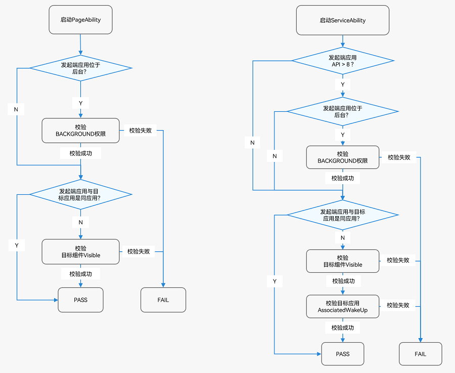

# 组件启动规则（FA模型）

启动组件是指一切启动或连接应用组件的行为：

- 启动PageAbility、ServiceAbility，如使用startAbility()等相关接口。

- 连接ServiceAbility、DataAbility，如使用connectAbility()、acquireDataAbilityHelper()等相关接口。

为了保证用户具有更好的使用体验，对以下几种易影响用户体验与系统安全的行为做了限制：

- 后台应用任意弹框，如各种广告弹窗，影响用户使用。

- 后台应用相互唤醒，不合理的占用系统资源，导致系统功耗增加或系统卡顿。

- 前台应用任意跳转至其他应用，如随意跳转到其他应用的支付页面，存在安全风险。

鉴于此，系统制订了一套组件启动规则，主要包括：

- **跨应用启动组件，需校验目标组件Visible**
  - 只针对跨应用场景。
  - 若目标组件visible字段配置为false，则需校验`ohos.permission.START_INVISIBLE_ABILITY`权限（该权限仅系统应用可申请）。
  - 组件visible配置参考[abilities对象的内部结构](../quick-start/module-structure.md#abilities对象的内部结构)的visible属性。

- **位于后台的应用，启动组件需校验BACKGROUND权限**
> **说明：**
> 基于API 8或更早版本SDK开发的应用在启动ServiceAbility组件或DataAbility组件时不受此限制的约束。

  - 应用前后台判断标准：若应用进程获焦或所属的UIAbility位于前台则判定为前台应用，否则为后台应用。
  - 需校验`ohos.permission.START_ABILITIES_FROM_BACKGROUND`权限（该权限仅系统应用可申请）。

- **跨应用启动FA模型的ServiceAbility组件或DataAbility组件，对端应用需配置关联启动**
  - 只针对跨应用场景。
  - 只针对目标组件为ServiceAbility与DataAbility生效。
  - 目标应用的AssociateWakeUp为**true**，其提供的ServiceAbility与DataAbility才允许被其他应用访问。
  - 只有系统预置应用才允许配置AssociateWakeUp字段，其余应用AssociateWakeUp默认为**false**。

> **说明：**
> 1. 组件启动管控自v3.2 Release版本开始落地。
> 
> 2. 与原本的启动规则不同，新的组件启动规则较为严格，开发者需熟知启动规则，避免业务功能异常。

启动组件的具体校验流程见下文。

## 同设备组件启动规则

  设备内启动组件，不同场景下的规则不同，可分为如下两种场景：

- 启动PageAbility。

- 启动ServiceAbility或DataAbility。

## 分布式跨设备组件启动规则

  跨设备启动组件，不同场景下的规则不同，可分为如下两种场景：

- 启动PageAbility。

- 启动ServiceAbility。

