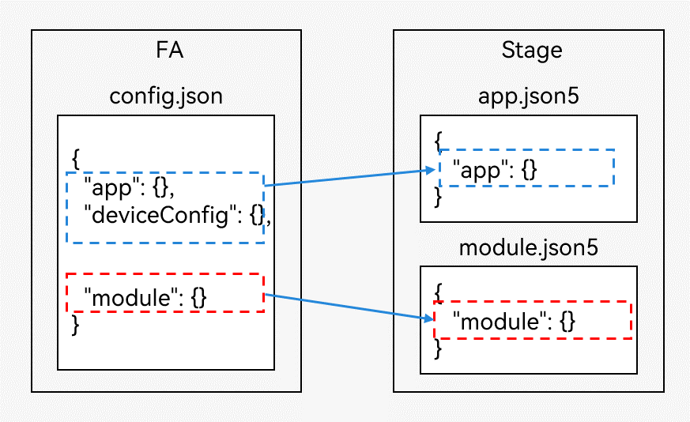

# 配置文件的差异

FA模型应用在[config.json文件](../quick-start/application-configuration-file-overview-fa.md)中描述应用的基本信息，一个应用工程中可以创建多个Module，每个Module中都有一份config.json文件。config.json由app、deviceConfig和module三部分组成，app标签用于配置应用级别的属性，如果一个应用有多个Module，需要由开发者保证各个config.json文件中app标签配置的一致性。

Stage模型应用在[app.json5](../quick-start/app-configuration-file.md)和[module.json](../quick-start/module-configuration-file.md)文件中描述应用的基本信息，和FA模型应用类似，一个Stage模型应用工程中同样可以创建多个Module，但是一个应用工程中仅存在一份app.json5，用于配置应用级别的属性，对每个Module都生效；每个Module中都有一份module.json5配置文件，用于配置Module级别的属性，仅对当前Module生效。

  **图1** 配置文件差异  

