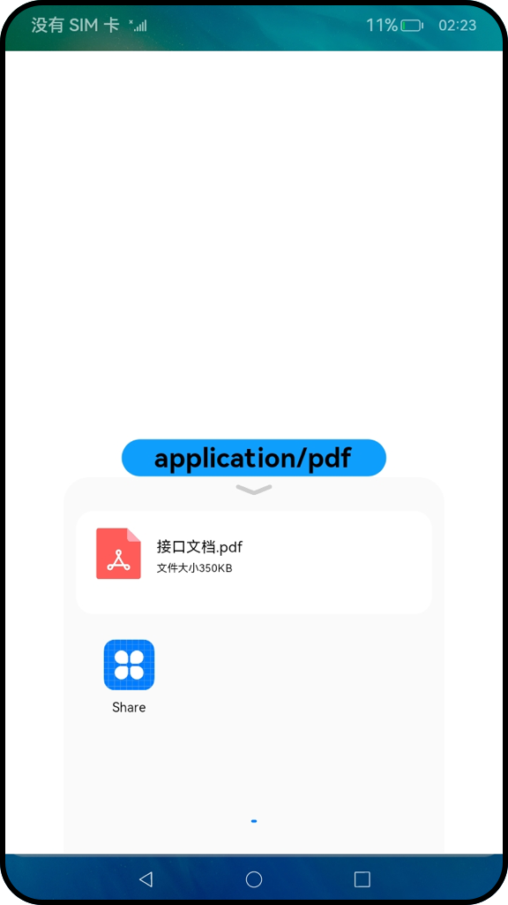

# 应用间使用Want分享数据


在应用使用场景中，用户经常需要将一个应用内的数据（如文字、图片等）分享至另一个应用内继续操作。下面以PDF文件分享为例，介绍应用间使用Want分享数据的方法。


## 前提条件

1. 数据分享涉及2个UIAbility组件（分享方和被分享方）和1个系统部件（应用选择框）。当分享方通过startAbility接口发起数据分享后，将拉起应用选择框。其将**隐式匹配并展示**所有支持接受分享数据类型的应用，由用户主动选取，并由系统拉起点击应用完成数据的分享。

2. 在本章节中，将继续以按钮形式来触发分享，实际开发场景中并不局限于此，此章节着重讲解分享时Want的配置。

3. 本章节涉及的action：
   - ACTION_SELECT （ohos.want.action.select）：指示显示应用程序选择框的操作。用于拉起应用选择框。
   - ACTION_SEND_DATA （ohos.want.action.sendData）：指示发送单个数据记录的操作。用于传递数据至分享方。


## 开发步骤

- 分享方
  1. Stage模型下经常会遇到需要分享文件的场景，在这种场景下我们需要使用[文件描述符（FD）](../reference/apis/js-apis-fileio.md#fileioopensync)来传递文件。此示例中，默认已获取分享文件的路径。
     
      ```ts
      import fileIO from '@ohos.fileio';
      
      // let path = ...
      // file open where path is a variable contains the file path.
      let fileFd = fileIO.openSync(path, 0o102, 0o666);
      ```
  2. 在前提条件中介绍了分享的流程。分享方需先拉起应用选择框，并将数据分享给应用选择框，并由应用选择框代理传递至被分享方，完成分享。因此分享方的Want需使用2层嵌套，在第1层中使用隐式Want并配合“ohos.want.action.select”action拉起应用选择框，并在自定义字段parameters内声明一个完整的want作为第2层，其中声明传递给被分享方的数据。
     
      ```ts
      import wantConstant from '@ohos.app.ability.wantConstant';
      
      // let path = ...
      // let fileFd = ...
      // let fileSize = ...
      let want = {
          // This action is used to implicitly match the application selctor.
          action: wantConstant.Action.ACTION_SELECT,
          // This is the custom parameter in the first layer of want
          // which is intended to add info to application selector.
          parameters: {
              // The MIME type of pdf
              "ability.picker.type": "application/pdf",
              "ability.picker.fileNames": [path],
              "ability.picker.fileSizes": [fileSize],
              // This a nested want which will be directly send to the user selected application.         
              "ability.want.params.INTENT": {
                  "action": "ohos.want.action.sendData",
                  "type": "application/pdf",
                  "parameters": {
                     "keyFd": {"type": "FD", "value": fileFd}
                  }
              }
          }
      }
      ```

      以上代码中使用Want自定义字段paramters，其中第一层paramters中的“ability.picker.\*”字段用于传递展示信息给应用选择器，具体字段表示为：

      - "ability.picker.type"：应用选择器根据该字段渲染相应的文件类型图标。
      - "ability.picker.fileNames"：应用选择器根据该字段展示文件名。
      - "ability.picker.fileSizes"：应用选择器根据该字段展示文件大小。以字节为单位。
      - "ability.picker.fileNames"与"ability.picker.fileSizes"为数组，其有一一对应关系。

      例如：当"ability.picker.type"为“application/pdf”，"ability.picker.fileNames"为“["接口文档.pdf"]”，"ability.picker.fileSizes"为“[350 \* 1024]”时，应用选择器将以下形式展示。  
      
      
      示例代码中“ability.want.params.INTENT”字段是一个嵌套Want，内部所含action、type等字段将由应用选择器进行隐式匹配，具体隐式匹配规则可参考[隐式Want匹配原理详解](explicit-implicit-want-mappings.md#隐式want匹配原理详解)。当用户选择具体应用后，“ability.want.params.INTENT”字段的嵌套Want将传递至所选应用。
  
- 被分享方：
  1. 上文中提到，应用选择器通过“ability.want.params.INTENT”字段进行隐式匹配。因此被分享方Ability配置文件内（stage模型下的module.json5）skills字段需配置如下。
     
      ```ts
      "skills": [
        {
          "entities": [
            // ...
          ],
          "actions": [
              "ohos.want.action.sendData"
              // ...
          ],
          "uris": [
            {
              "type": "application/pdf"
            },
            // ...
          ]
        },
      ]
      ```

      其中"actions"字段和“uris”内“type”字段分别与“ability.want.params.INTENT”内“action”，“type”字段匹配。

      注意：当前文件传递不支持uri方式传递，仅支持FD方式，但隐式匹配中，Want内的“type”字段需与被分享方配置文件skills内“uris”字段下的“type”字段匹配，因此skills内的“uris”字段建议只声明“type”字段，增加“host”，“port”等字段在上述示例中将匹配失败。因为应用选择框通过“ability.want.params.INTENT”发起隐式匹配，所以在“ability.want.params.INTENT”字段内增加uri字段，且与skills内的“uris”字段匹配时，仍可匹配成功且传递额外数据。
  2. 应用选择器拉起被分享方后，系统将调用其“onCreate”接口，并传入“ability.want.params.INTENT”至其入参want内。
     
      ```ts
      onCreate(want, launchParam) {
        // note when keyFd is undefined, app crash will happen.
        if (want["parameters"]["keyFd"] !== undefined) {
          // receive file descriptor
          let fd = want["parameters"]["keyFd"].value;
          // ...
        }
      }
      ```
