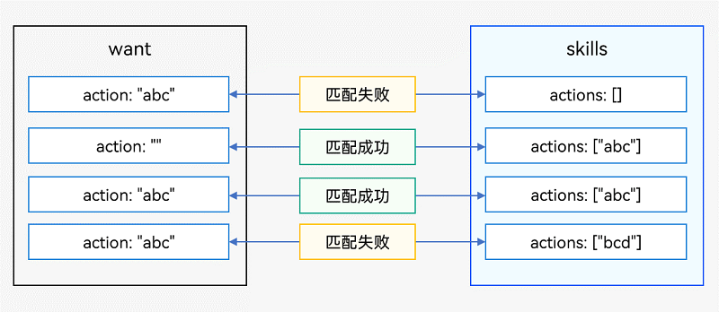
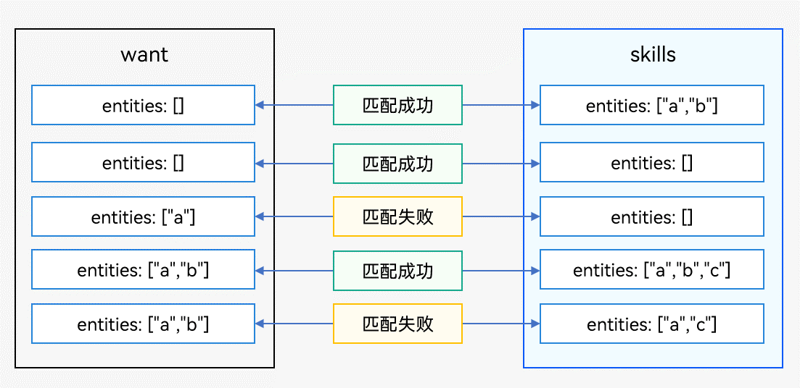
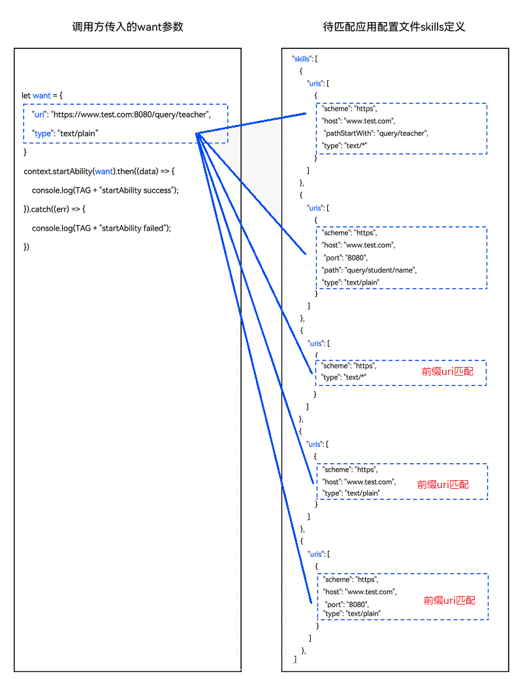
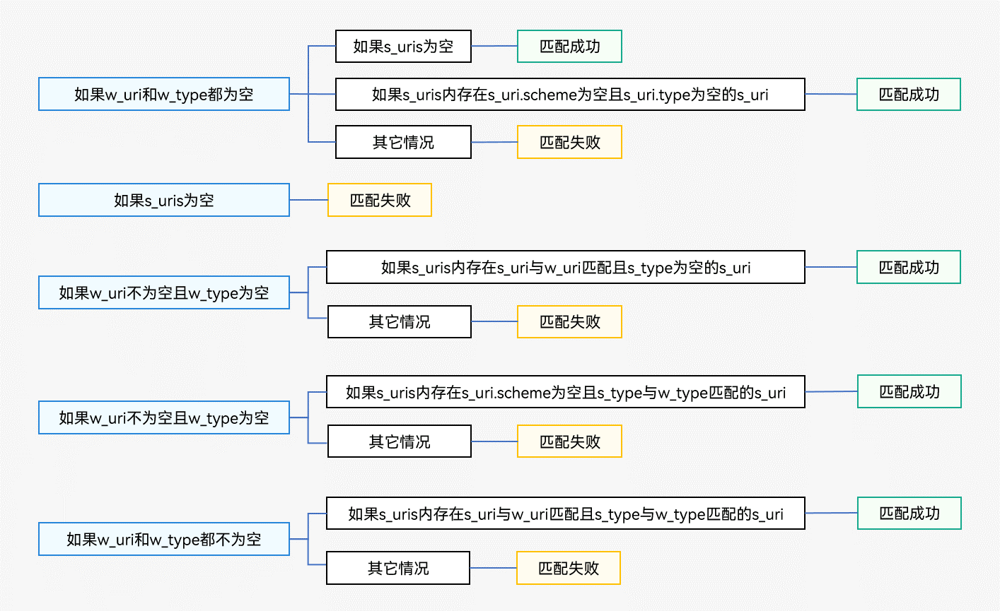

# 显式Want与隐式Want匹配规则

在启动目标应用组件时，会通过显式[Want](../reference/apis/js-apis-app-ability-want.md)或者隐式[Want](../reference/apis/js-apis-app-ability-want.md)进行目标应用组件的匹配，这里说的匹配规则就是调用方传入的[want](../reference/apis/js-apis-app-ability-want.md)参数中设置的参数如何与目标应用组件声明的配置文件进行匹配。

## 显式Want匹配原理

显式[Want](../reference/apis/js-apis-app-ability-want.md)匹配原理如下表所示。

| 名称 | 类型 | 匹配项 | 必选 | 规则 |
| -------- | -------- | -------- | -------- | -------- |
| deviceId | string | 是 | 否 | 留空将仅匹配本设备内的应用组件。 |
| bundleName | string | 是 | 是 | 如果指定abilityName，而不指定bundleName，则匹配失败。 |
| moduleName | string | 是 | 否 | 留空时当同一个应用内存在多个模块且模块间存在重名应用组件，将默认匹配第一个。 |
| abilityName | string | 是 | 是 | 该字段必须设置表示显式匹配。 |
| uri | string | 否 | 否 | 系统匹配时将忽略该参数，但仍可作为参数传递给目标应用组件。 |
| type | string | 否 | 否 | 系统匹配时将忽略该参数，但仍可作为参数传递给目标应用组件。 |
| action | string | 否 | 否 | 系统匹配时将忽略该参数，但仍可作为参数传递给目标应用组件。 |
| entities | Array&lt;string&gt; | 否 | 否 | 系统匹配时将忽略该参数，但仍可作为参数传递给目标应用组件。 |
| flags | number | 否 | 否 | 不参与匹配，直接传递给系统处理，一般用来设置运行态信息，例如URI数据授权等。 |
| parameters | {[key:&nbsp;string]:&nbsp;any} | 否 | 否 | 不参与匹配，应用自定义数据将直接传递给目标应用组件。 |

## 隐式Want匹配原理

隐式[Want](../reference/apis/js-apis-app-ability-want.md)匹配原理如下表所示。

| 名称        | 类型                           | 匹配项 | 必选 | 规则                                                         |
| ----------- | ------------------------------ | ------ | ---- | ------------------------------------------------------------ |
| deviceId    | string                         | 是     | 否   | 跨设备目前不支持隐式调用。                                   |
| abilityName | string                         | 否     | 否   | 该字段必须留空表示隐式匹配。                                 |
| bundleName  | string                         | 是     | 否   | -&nbsp;声明bundleName时，隐式搜索将仅限于对应应用包内。 -&nbsp;声明bundleName与moduleName时，隐式搜索将仅限于对应应用的对应Module内。 -&nbsp;单独声明moduleName时，该字段无效。 -&nbsp;同时声明bundleName与moduleName时，隐式搜索将仅限于对应应用包内的对应模块内。 这些字段将用来隐式匹配。 |
| moduleName  | string                         | 是     | 否   |                                                              |
| uri         | string                         | 是     | 否   |                                                              |
| type        | string                         | 是     | 否   |                                                              |
| action      | string                         | 是     | 否   |                                                              |
| entities    | Array&lt;string&gt;            | 是     | 否   |                                                              |
| flags       | number                         | 否     | 否   | 不参与匹配，直接传递给系统处理，一般用来设置运行态信息，例如URI数据授权等。 |
| parameters  | {[key:&nbsp;string]:&nbsp;any} | 否     | 否   | 不参与匹配，应用自定义数据将直接传递给目标应用组件。         |

从隐式Want的定义，可得知：

- 调用方传入的want参数，表明调用方需要执行的操作，并提供相关数据以及其他应用类型限制。

- 待匹配应用组件的skills配置，声明其具备的能力（[module.json5配置文件](../quick-start/module-configuration-file.md)中的[skills标签](../quick-start/module-configuration-file.md#skills标签)参数）。

系统将调用方传入的want参数（包含action、entities、uri和type属性）与已安装待匹配应用组件的skills配置（包含actions、entities、uris和type属性）依次进行匹配。当四个属性匹配均通过，则此应用才会被应用选择器展示给用户进行选择。

### want参数的action匹配规则

将调用方传入的want参数的action与待匹配应用组件的skills配置中的actions进行匹配。

- 调用方传入的want参数的action为空，待匹配Ability的skills配置中的actions为空，则action匹配失败。

- 调用方传入的want参数的action不为空，待匹配应用组件的skills配置中的actions为空，则action匹配失败。

- 调用方传入的want参数的action为空，待匹配应用组件的skills配置中的actions不为空，则action匹配成功。

- 调用方传入的want参数的action不为空，待匹配应用组件的skills配置中的actions不为空且包含调用方传入的want参数的action，则action匹配成功。

- 调用方传入的want参数的action不为空，待匹配应用组件的skills配置中的actions不为空且不包含调用方传入的want参数的action，则action匹配失败。

  **图1** want参数的action匹配规则  
  

### want参数的entities匹配规则

将调用方传入的want参数的entities与待匹配应用组件的skills配置中的entities进行匹配。

- 调用方传入的want参数的entities为空，待匹配应用组件的skills配置中的entities不为空，则entities匹配成功。

- 调用方传入的want参数的entities为空，待匹配应用组件的skills配置中的entities为空，则entities匹配成功。

- 调用方传入的want参数的entities不为空，待匹配应用组件的skills配置中的entities为空，则entities匹配失败。

- 调用方传入的want参数的entities不为空，待匹配应用组件的skills配置中的entities不为空且包含调用方传入的want参数的entities，则entities匹配成功。

- 调用方传入的want参数的entities不为空，待匹配应用组件的skills配置中的entities不为空且不完全包含调用方传入的want参数的entities，则entities匹配失败。

  **图2** want参数的entities匹配规则  
  

### want参数的uri和type匹配规则

调用方传入的want参数中设置uri和type参数发起启动应用组件的请求，系统会遍历当前系统已安装的组件列表，并逐个匹配待匹配应用组件的skills配置中的uris数组，如果待匹配应用组件的skills配置中的uris数组中只要有一个可以匹配调用方传入的want参数中设置的uri和type即为匹配成功。

实际应用中，uri和type共存在四种情况，下面将讲解四种情况的具体匹配规则：

- 调用方传入的want参数的uri和type都为空。
  1. 如果待匹配应用组件的skills配置中的uris数组为空，匹配成功。
  2. 如果待匹配应用组件的skills配置中的uris数组中存在uri的scheme和type都为空的元素，匹配成功。
  3. 除以上两种情况，其他情况均为匹配失败。

- 调用方传入的want参数的uri不为空，type为空。
  1. 如果待匹配应用组件的skills配置中的uris数组为空，匹配失败。
  2. 如果待匹配应用组件的skills配置中的uris数组存在一条数据[uri匹配](#uri匹配规则)成功且type为空，则匹配成功，否则匹配失败。

- 调用方传入的want参数的uri为空，type不为空。
  1. 如果待匹配应用组件的skills配置中的uris数组为空，匹配失败。
  2. 如果待匹配应用组件的skills配置中的uris数组存在一条数据uri的scheme为空且[type匹配](#type匹配规则)成功，则匹配成功，否则匹配失败。

- 调用方传入的want参数的uri和type都不为空，如下图所示。
  1. 如果待匹配应用组件的skills配置中的uris数组为空，匹配失败。
  2. 如果待匹配应用组件的skills配置中的uris数组存在一条数据[uri匹配](#uri匹配规则)和[type匹配](#type匹配规则)需要均匹配成功，则匹配成功，否则匹配失败。

最左uri匹配：当配置文件待匹配应用组件的skills配置中的uris数组中只配置scheme；或者只配置scheme和host；或者只配置scheme、host和port时。传入want参数的uri的最左边依次需要和scheme，或者scheme和host，或者scheme、host和port都匹配，才满足最左uri匹配。

**图3** want参数中uri和type皆不为空时的匹配规则   
  

为了简化描述：

- 称调用方传入的want参数中的uri参数为w_uri；待匹配应用组件的skills配置中uri为s_uri，其中每个元素为s_uri。
- 称调用方传入的want参数的type参数为w_type，待匹配应用组件的skills数组中uris的type数据为s_type。

**图4** want参数中uri和type的具体匹配规则  
  

### uri匹配规则

具体的匹配规则如下：

- 如果s_uri的scheme为空，当w_uri为空时匹配成功，否则匹配失败。

- 如果s_uri的host为空，当w_uri和s_uri的scheme相同时匹配成功，否则匹配失败。

- 如果s_uri的port为空，当w_uri和s_uri中的scheme和host相同时匹配成功，否则匹配失败。

- 如果s_uri的path、pathStartWith和pathRegex都为空，当w_uri和s_uri中的scheme，host和port相同时匹配成功，否则匹配失败。

- 如果s_uri的path不为空，当w_uri和s_uri**全路径表达式**相同时匹配成功，否则继续进行pathStartWith的匹配。

- 如果s_uri的pathStartWith不为空，当w_uri包含s_uri**前缀表达式**时匹配成功，否则继续进行pathRegex的匹配。

- 如果s_uri的pathRegex不为空，当w_uri满足s_uri**正则表达式**时匹配成功，否则匹配失败。

> **说明：**
>
> 待匹配应用组件的skills配置的uris中scheme、host、port、path、pathStartWith和pathRegex属性拼接，如果依次声明了path、pathStartWith和pathRegex属性时，uris将分别拼接为如下三种表达式：
>
> - **前缀uri表达式**：当配置文件只配置scheme，或者只配置scheme和host，或者只配置scheme，host和port时，参数传入以配置文件为前缀的Uri
>     * `scheme://`
>     * `scheme://host`
>     * `scheme://host:port`
> - **全路径表达式**：`scheme://host:port/path`
> - **前缀表达式**：`scheme://host:port/pathStartWith`
> - **正则表达式**：`scheme://host:port/pathRegex`

### type匹配规则

> **说明：**
>
> 本章节所述的type匹配规则的适用性需建立在want参数内type不为空的基础上。当want参数内type为空时请参见[want参数的uri和type匹配规则](#want参数的uri和type匹配规则)。

具体的匹配规则如下：

- 如果s_type为空，则匹配失败。

- 如果s_type或者w_type为通配符`*/*`，则匹配成功。

- 如果s_type最后一个字符为通配符`*`，如`prefixType/*`，则当w_type包含`prefixType/`时匹配成功，否则匹配失败。

- 如果w_type最后一个字符为通配符`*`，如`prefixType/*`，则当s_type包含`prefixType/`时匹配成功，否则匹配失败。
