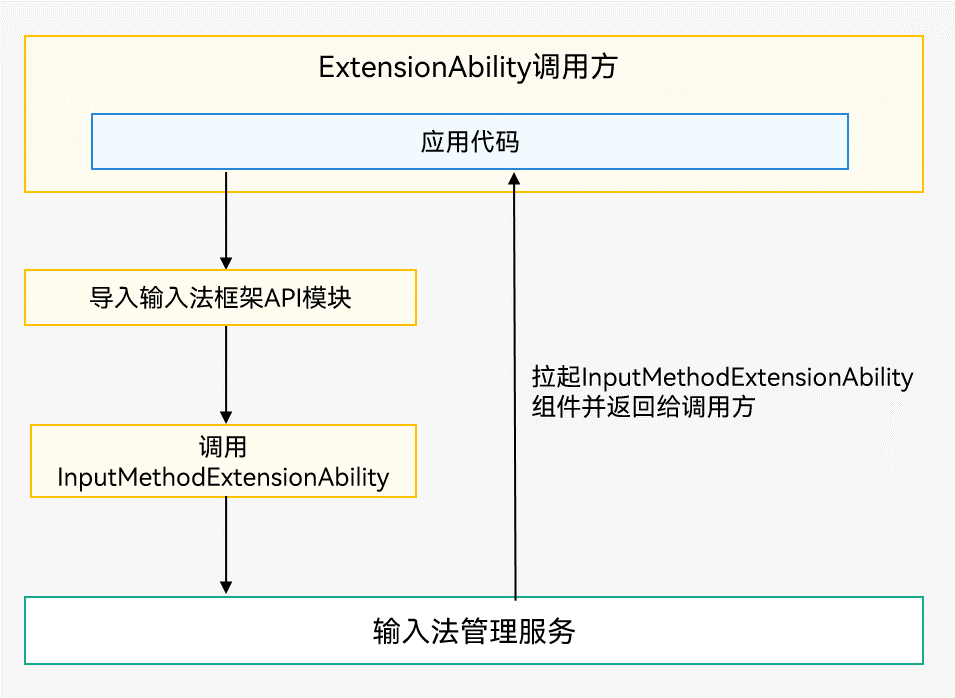
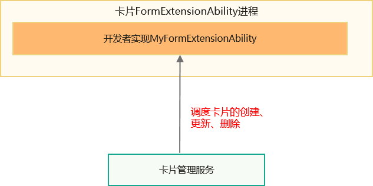

# ExtensionAbility组件

[ExtensionAbility](../reference/apis-ability-kit/js-apis-app-ability-extensionAbility.md)组件是基于特定场景（例如服务卡片、输入法等）提供的应用组件，以便满足更多的使用场景。

每一个具体场景对应一个[ExtensionAbilityType](../reference/apis-ability-kit/js-apis-bundleManager.md#extensionabilitytype)，开发者只能使用（包括实现和访问）系统已定义的类型。各类型的ExtensionAbility组件均由相应的系统服务统一管理，例如[InputMethodExtensionAbility](../reference/apis-ime-kit/js-apis-inputmethod-extension-ability.md)组件由输入法管理服务统一管理。

当前系统已定义的ExtensionAbility类型如下表所示。

> 说明：
> 
> - “是否允许三方应用实现”是指：对于一类ExtensionAbility，三方应用能否继承该ExtensionAbility父类实现自己的业务逻辑。
> - “是否允许三方应用访问”是指：有些ExtensionAbility会对外提供一些服务，这些ExtensionAbility可能允许三方访问，也可能不允许。
> - “是否有独立Extension沙箱”是指：已经开发Extension都是和主应用共沙箱运行，API12及其之后新增Extension默认独立沙箱运行，输入法Extension由于安全机制管控改为独立沙箱运行。
> - “启动Extension传递共享数据是否严格模式访问”是指：共享数据可通过配置应用的<!--Del-->[<!--DelEnd-->data-group-ids<!--Del-->](../security/app-provision-structure.md#bundle-info对象内部结构)<!--DelEnd-->和ExtensionAbility的[dataGroupIds](../quick-start/module-configuration-file.md#extensionabilities标签)实现。严格模式访问表示只读，非严格模式访问表示可以读写。

对于系统应用，不受下表约束，允许实现系统已定义的各类ExtensionAbility，也允许访问提供的各类对外服务。

| ExtensionAbility类型                 | 功能描述 | 是否允许三 方应用实现                  | 是否允许三 方应用访问                                                 | 是否有独立 Extension沙箱                  | 启动Extension 传递共享数据 是否严格模式访问                  |
| ------------------------ | -------- | ------------------------------------------------------------ | ------------------------------------------------------------ | ------------------------------------------------------------ | ------------------------------------------------------------ | 
 | [FormExtensionAbility](../reference/apis-form-kit/js-apis-app-form-formExtensionAbility.md)                 | FORM类型的ExtensionAbility组件，用于提供[服务卡片](../form/formkit-overview.md)的相关能力。      | 是 | 否 | 否 | 非严格模式访问共享数据，可以读写共享数据。 |
| [WorkSchedulerExtensionAbility](../reference/apis-backgroundtasks-kit/js-apis-WorkSchedulerExtensionAbility.md) | WORK_SCHEDULER类型的ExtensionAbility组件，用于提供[延迟任务](../task-management/work-scheduler.md)的相关能力。      | 是 | 不涉及 | 否 | 非严格模式访问共享数据，可以读写共享数据。 |
| [InputMethodExtensionAbility](../reference/apis-ime-kit/js-apis-inputmethod-extension-ability.md) | INPUT_METHOD类型的ExtensionAbility组件，用于实现[输入法应用](../inputmethod/ime-kit-intro.md)的开发。      | 是 | 是 | 是 | 开发者在输入法管理中启用完整体验模式，即开启非严格模式，可读写共享数据；不启用完整体验模式，默认为严格模式，只能读取共享数据。 |
| [BackupExtensionAbility](../reference/apis-core-file-kit/js-apis-application-backupExtensionAbility.md) | BACKUP类型的ExtensionAbility组件，用于提供[备份及恢复应用数据](../file-management/app-file-backup-overview.md)的能力。      | 是 | 不涉及 | 否 | 非严格模式访问共享数据，可以读写共享数据。 |
| [DriverExtensionAbility](../reference/apis-driverdevelopment-kit/js-apis-app-ability-driverExtensionAbility.md)            | DRIVER类型的ExtensionAbility组件，用于提供[驱动相关扩展框架](../device/driver/driverextensionability.md)。      | 是 | 是 | 否 | 非严格模式访问共享数据，可以读写共享数据。 |
| [EmbeddedUIExtensionAbility](../reference/apis-ability-kit/js-apis-app-ability-embeddedUIExtensionAbility.md) | EMBEDDED_UI类型的ExtensionAbility组件，用于提供[跨进程界面嵌入](embeddeduiextensionability.md)的能力。 | 是 | 是 | 否 | 非严格模式访问共享数据，可以读写共享数据。 |
| [ShareExtensionAbility](../reference/apis-ability-kit/js-apis-app-ability-shareExtensionAbility.md) | SHARE类型的ExtensionAbility组件，用于提供分享模板服务扩展的能力。 | 是 | 是 | 否 | 非严格模式访问共享数据，可以读写共享数据。 |
| [FenceExtension](../reference/apis-location-kit/js-apis-app-ability-FenceExtensionAbility.md) | FENCE类型的ExtensionAbility组件，用于提供[地理围栏](../device/location/fenceExtensionAbility.md)扩展的能力。 | 是 | 否 | 否 | 非严格模式访问共享数据，可以读写共享数据。 |

## 访问指定类型的ExtensionAbility组件

所有类型的[ExtensionAbility](../reference/apis-ability-kit/js-apis-app-ability-extensionAbility.md)组件均不能被应用直接启动，而是由相应的系统管理服务拉起，以确保其生命周期受系统管控，使用时拉起，使用完销毁。ExtensionAbility组件的调用方无需关心目标ExtensionAbility组件的生命周期。

  以[InputMethodExtensionAbility](../reference/apis-ime-kit/js-apis-inputmethod-extension-ability.md)组件为例进行说明，如下图所示，调用方应用发起对InputMethodExtensionAbility组件的调用，此时将先调用输入法管理服务，由输入法管理服务拉起InputMethodExtensionAbility组件，返回给调用方，同时开始管理其生命周期。

**图1** 使用InputMethodExtensionAbility组件

## 实现指定类型的ExtensionAbility组件

以实现卡片[FormExtensionAbility](../reference/apis-form-kit/js-apis-app-form-formExtensionAbility.md)为例进行说明。卡片框架提供了FormExtensionAbility基类，开发者通过派生此基类（如MyFormExtensionAbility），实现回调（如创建卡片的onCreate()回调、更新卡片的[onUpdateForm()](../reference/apis-form-kit/js-apis-app-form-formExtensionAbility.md#onupdateform)回调等）来实现具体卡片功能，具体见开发指导见[服务卡片](../form/formkit-overview.md)。

卡片FormExtensionAbility实现方不用关心使用方何时去请求添加、删除卡片，FormExtensionAbility实例及其所在的[ExtensionAbility](../reference/apis-ability-kit/js-apis-app-ability-extensionAbility.md)进程的整个生命周期，都是由卡片管理系统服务FormManagerService进行调度管理。

> **说明：**
> 同一应用内的所有同类型的ExtensionAbility运行在同一独立进程（除ServiceExtensionAbility、DataShareExtensionAbility外），跟UIAbility组件不在同一进程，Stage模型的进程模型请参见[进程模型](process-model-stage.md)。
