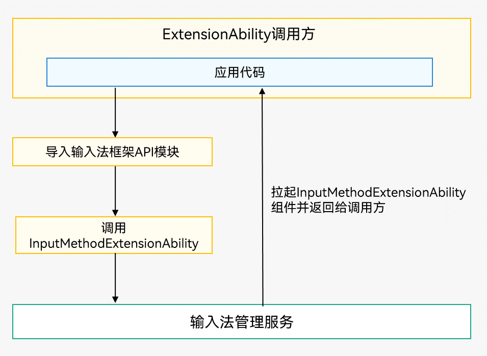
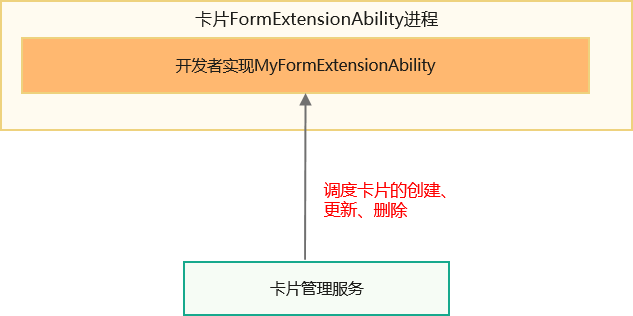

# ExtensionAbility组件
<!--Kit: Ability Kit-->
<!--Subsystem: Ability-->
<!--Owner: @xialiangwei-->
<!--Designer: @jsjzju-->
<!--Tester: @liangchengguang-->
<!--Adviser: @HelloCrease-->

[ExtensionAbility](../reference/apis-ability-kit/js-apis-app-ability-extensionAbility.md)组件是一种面向特定场景的应用组件。每一个具体场景对应一个不同类型的ExtensionAbility，例如用于卡片场景的[FormExtensionAbility](../reference/apis-form-kit/js-apis-app-form-formExtensionAbility.md)，用于输入法场景的[InputMethodExtensionAbility](../reference/apis-ime-kit/js-apis-inputmethod-extension-ability.md)，用于延时任务场景的[WorkSchedulerExtensionAbility](../reference/apis-backgroundtasks-kit/js-apis-WorkSchedulerExtensionAbility.md)等。开发者通过使用不同类型的ExtensionAbility组件，可以扩展和丰富应用功能，更好地与其他应用或系统开展交互。

不同类型ExtensionAbility组件均由系统定义，且通常由相应的系统服务统一管理（例如[InputMethodExtensionAbility](../reference/apis-ime-kit/js-apis-inputmethod-extension-ability.md)组件由输入法管理服务统一管理）。开发者不能直接继承ExtensionAbility组件，只能使用（包括实现或访问）已定义的[ExtensionAbilityType](../reference/apis-ability-kit/js-apis-bundleManager.md#extensionabilitytype)。

## ExtensionAbility类型说明

当前系统已定义的ExtensionAbility类型如下表所示。

> **说明：**
> 
> - “是否允许三方应用实现”是指：三方应用能否继承该类型ExtensionAbility实现自己的业务逻辑。
> - “是否有独立Extension沙箱”是指：该类型ExtensionAbility的沙箱是否与主应用沙箱相对独立、不可互相访问。

<!--Table: 20%; 50%; 15%; 15%-->
| ExtensionAbility类型                 | 功能描述 | 是否允许三方应用实现                  | 是否有独立Extension沙箱 |
|--------------------------------------|---------|-------------------------------------------|-----------------------|
| [FormExtensionAbility](../reference/apis-form-kit/js-apis-app-form-formExtensionAbility.md)  | 卡片扩展能力，用于提供[服务卡片](../form/formkit-overview.md)的相关能力。|  是 | 否 |
| [WorkSchedulerExtensionAbility](../reference/apis-backgroundtasks-kit/js-apis-WorkSchedulerExtensionAbility.md) | 延时任务扩展能力，用于提供[延迟任务](../task-management/work-scheduler.md)的相关能力。      | 是 | 否 |
| [InputMethodExtensionAbility](../reference/apis-ime-kit/js-apis-inputmethod-extension-ability.md) | 输入法扩展能力，用于实现[输入法应用](../inputmethod/ime-kit-intro.md)的开发。      | 是 | 是 |
| <!--Del-->[<!--DelEnd-->ServiceExtensionAbility<!--Del-->](../reference/apis-ability-kit/js-apis-app-ability-serviceExtensionAbility-sys.md)<!--DelEnd-->| 后台服务扩展能力，提供后台运行并对外提供相应能力。 三方应用可以连接该ExtensionAbility，并进行通信。 |否| 否 |
| [AccessibilityExtensionAbility](../reference/apis-accessibility-kit/js-apis-application-accessibilityExtensionAbility.md)|无障碍服务扩展能力，支持访问与操作前台界面。| 是| 否 |
| <!--Del-->[<!--DelEnd-->DataShareExtensionAbility<!--Del-->](../reference/apis-arkdata/js-apis-application-dataShareExtensionAbility-sys.md)<!--DelEnd-->| 数据共享扩展能力，用于对外提供数据读写服务。| 否| 否 |
|<!--DelRow-->[StaticSubscriberExtensionAbility](../reference/apis-basic-services-kit/js-apis-application-staticSubscriberExtensionAbility-sys.md)|静态广播扩展能力，用于处理静态事件，比如开机事件。三方应用无法访问。|否| 否 |
|<!--DelRow-->[WallpaperExtensionAbility](../reference/apis-basic-services-kit/js-apis-WallpaperExtensionAbility-sys.md)|壁纸扩展能力，用于实现桌面壁纸。三方应用无法访问。|否| 否 |
| [BackupExtensionAbility](../reference/apis-core-file-kit/js-apis-application-backupExtensionAbility.md) | 数据备份扩展能力，用于提供[备份及恢复应用数据](../file-management/app-file-backup-overview.md)的能力。      | 是 | 否 |
|<!--DelRow-->[WindowExtensionAbility](../reference/apis-arkui/js-apis-application-windowExtensionAbility-sys.md)|界面组合扩展能力，允许系统应用进行跨应用的界面拉起和嵌入。三方应用无法访问。| 否| 否 |
| [EnterpriseAdminExtensionAbility](../reference/apis-mdm-kit/js-apis-EnterpriseAdminExtensionAbility.md)|[企业设备管理扩展能力](../mdm/mdm-kit-admin.md)，提供企业管理时处理管理事件的能力， 比如设备上应用安装事件、锁屏密码输入错误次数过多事件等。|是| 否 |
| [PrintExtensionAbility](../reference/apis-basic-services-kit/js-apis-app-ability-PrintExtensionAbility.md)|文件[打印扩展能力](../basic-services/print/printExtensionAbilityGuide.md)，提供应用打印照片、文档等办公场景。|是| 否 |
| [ShareExtensionAbility](../reference/apis-ability-kit/js-apis-app-ability-shareExtensionAbility.md) | 分享扩展组件，用于提供分享模板服务扩展的能力。 | 是 | 否 |
| [DriverExtensionAbility](../reference/apis-driverdevelopment-kit/js-apis-app-ability-driverExtensionAbility.md)   | 驱动扩展能力，用于提供[驱动相关扩展框架](../device/driver/driverextensionability.md)。      | 是 | 否 |
| [ActionExtensionAbility](../reference/apis-ability-kit/js-apis-app-ability-actionExtensionAbility.md)| 自定义服务扩展能力，为开发者提供基于UIExtension的自定义操作业务模板。|是| 否 |
| <!--RP3-->[AdsServiceExtensionAbility](../reference/apis-ads-kit/js-apis-adsserviceextensionability.md)<!--RP3End-->| 广告服务扩展能力，对外提供后台自定义广告业务服务。|是| 否 |
| [EmbeddedUIExtensionAbility](../reference/apis-ability-kit/js-apis-app-ability-embeddedUIExtensionAbility.md) | 嵌入式UI扩展能力，提供[跨进程界面嵌入](embeddeduiextensionability.md)的能力。 | 是 | 否 |
| [FenceExtensionAbility](../reference/apis-location-kit/js-apis-app-ability-FenceExtensionAbility.md) | 地理围栏扩展能力，用于提供<!--RP1-->地理围栏<!--RP1End-->扩展的能力。 | 是 | 否 |
| [DistributedExtensionAbility](../reference/apis-distributedservice-kit/js-apis-distributedExtensionAbility.md)|分布式扩展能力，提供分布式创建、销毁、连接的生命周期回调。|是| 否 |
| [AppServiceExtensionAbility](../reference/apis-ability-kit/js-apis-app-ability-appServiceExtensionAbility.md) | 应用后台服务扩展能力，提供应用后台服务的创建、销毁、连接、断开等生命周期回调。 | 是 | 否 |
| [SelectionExtensionAbility](../reference/apis-basic-services-kit/js-apis-selectionInput-selectionExtensionAbility.md) | 划词扩展能力，提供系统应用后台服务的连接和断开等生命周期回调。| 是 | 否 |
| [FaultLogExtensionAbility](../reference/apis-performance-analysis-kit/js-apis-hiviewdfx-FaultLogExtensionAbility.md) | 提供故障延迟通知的能力。| 是 | 否 |
| [WebNativeMessagingExtensionAbility](../reference/apis-arkweb/arkts-apis-web-webNativeMessagingExtensionAbility.md) | Web插件对接能力。提供插件对接native应用能力。 | 是 | 否 |
| [NotificationSubscriberExtensionAbility](../reference/apis-notification-kit/js-apis-notificationSubscriberExtensionAbility.md) | 通知订阅拓展能力，用于发送通知数据到三方穿戴设备。 | 是 | 否 |
| [PartnerAgentExtensionAbility](../reference/apis-connectivity-kit/js-apis-fusionConnectivity-partnerAgentExtensionAbility.md) | 基于蓝牙通信技术，提供设备发现与设备下线的通知功能。 | 是 | 否 |
| [PhotoEditorExtensionAbility](../reference/apis-ability-kit/js-apis-app-ability-photoEditorExtensionAbility.md) | 照片编辑扩展能力，提供给应用实现图片编辑的功能。 | 是 | 否 |
|<!--DelRow-->[AutoFillExtensionAbility](../reference/apis-ability-kit/js-apis-app-ability-autoFillExtensionAbility-sys.md)| 自动填充扩展能力，提供自动填充和保存功能。 | 否 | 否 |
| [VpnExtensionAbility](../reference/apis-network-kit/js-apis-VpnExtensionAbility.md) | VPN扩展能力，提供三方VPN创建、销毁等生命周期回调。 | 是 | 否 |
| [FormEditExtensionAbility](../reference/apis-form-kit/js-apis-app-form-formEditExtensionAbility.md) | 卡片编辑扩展能力，提供卡片页面编辑能力，支持实现用户自定义卡片内容的功能，例如：编辑联系人卡片、修改卡片中展示的联系人、编辑天气卡片等。 | 是 | 否 |
| [LiveFormExtensionAbility](../reference/apis-form-kit/js-apis-app-form-LiveFormExtensionAbility.md) | 卡片动效扩展能力，提供卡片动效能力，例如卡片破框动效，丰富信息提醒、浅层交互功能，显著提升用户体验。 | 是 | 否 |
|<!--DelRow-->[UIServiceExtensionAbility](../reference/apis-ability-kit/js-apis-app-ability-uiServiceExtensionAbility-sys.md)| UI服务扩展能力，在PC/2in1上提供带前台窗口的服务。 | 否 | 否 |
<!--RP2--><!--RP2End-->

> **说明：**
> 
> 通常情况下，应用中（同一Bundle名称）所有同一类型的ExtensionAbility均运行在同一个独立进程。以下为例外场景：
>
> - ServiceExtensionAbility（仅系统应用涉及）、DataShareExtensionAbility（仅系统应用涉及）与所有UIAbility均运行在同一个独立进程（主进程）。
> - UIExtensionAbility以及继承该类型的ExtensionAbility可以通过module.json5配置文件中的[extensionProcessMode](../quick-start/module-configuration-file.md#extensionabilities标签)字段，配置进程运行模式。
> - AppServiceExtensionAbility可以通过module.json5配置文件中的[extensionProcessMode](../quick-start/module-configuration-file.md#extensionabilities标签)字段，配置进程运行模式。

## 访问指定类型的ExtensionAbility组件

所有类型的[ExtensionAbility](../reference/apis-ability-kit/js-apis-app-ability-extensionAbility.md)组件均不能被应用直接启动，而是由相应的系统管理服务拉起，以确保其生命周期受系统管控，使用时拉起，使用完销毁。ExtensionAbility组件的调用方无需关心目标ExtensionAbility组件的生命周期。

  以[InputMethodExtensionAbility](../reference/apis-ime-kit/js-apis-inputmethod-extension-ability.md)组件为例进行说明，如下图所示，调用方应用发起对InputMethodExtensionAbility组件的调用，此时将先调用输入法管理服务，由输入法管理服务拉起InputMethodExtensionAbility组件，返回给调用方，同时开始管理其生命周期。

**图1** 使用InputMethodExtensionAbility组件

## 实现指定类型的ExtensionAbility组件

以实现卡片[FormExtensionAbility](../reference/apis-form-kit/js-apis-app-form-formExtensionAbility.md)为例进行说明。卡片框架提供了FormExtensionAbility基类，开发者通过派生此基类（如MyFormExtensionAbility），实现回调（如创建卡片的onCreate()回调、更新卡片的[onUpdateForm()](../reference/apis-form-kit/js-apis-app-form-formExtensionAbility.md#formextensionabilityonupdateform)回调等）来实现具体卡片功能，具体开发指导见[服务卡片](../form/formkit-overview.md)。

卡片FormExtensionAbility实现方不用关心使用方何时去请求添加、删除卡片，FormExtensionAbility实例及其所在的[ExtensionAbility](../reference/apis-ability-kit/js-apis-app-ability-extensionAbility.md)进程的整个生命周期，都是由卡片管理系统服务FormManagerService进行调度管理。

