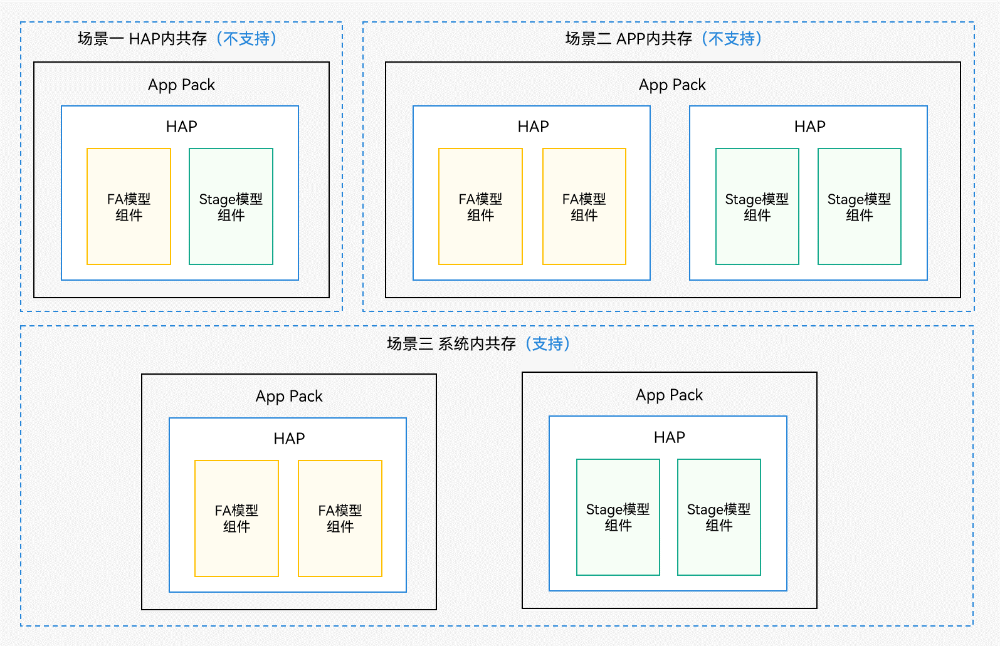

# FA模型与Stage模型应用组件互通综述

<!--Kit: Ability Kit-->
<!--Subsystem: Ability-->
<!--Owner: @wkljy-->
<!--Designer: @li-weifeng2024-->
<!--Tester: @lixueqing513-->
<!--Adviser: @huipeizi-->

API 8及以前的接口基于[FA模型](ability-terminology.md#fa模型)提供；从API 9开始，主推[Stage模型](ability-terminology.md#stage模型)。FA模型与Stage模型是两套不同的应用模型，他们拥有各自的组件。FA模型提供三种应用组件，分别是PageAbility、ServiceAbility和DataAbility。Stage模型提供了两种应用组件，分别是UIAbility和ExtensionAbility。

由于FA模型与Stage模型不能在应用内混合开发（见下图），当一个设备（系统）内包含两种模型应用时（下图中"场景三"），可能涉及两种模型应用组件间的互通，本文将介绍相关互通指导。

**图1** FA模型与Stage模型应用组件共存场景

FA模型与Stage模型应用组件互通场景及开发者关注点请参考下表。

  **表1** FA模型与Stage模型应用组件互通概览

| 互通场景 | 开发者关注点 | 
| -------- | -------- |
| [FA模型启动Stage模型UIAbility](start-uiability-from-fa.md) | 只需要把want中的bundleName和abilityName替换成Stage模型UIAbility的bundleName和abilityName。 | 
| [FA模型绑定Stage模型ServiceExtensionAbility](bind-serviceextensionability-from-fa.md) | 只需要把want中的bundleName和abilityName替换成Stage模型ServiceExtensionAbility的bundleName和abilityName。 | 
| [FA模型访问Stage模型DataShareExtensionAbility](access-datashareextensionability-from-fa.md) | 无需做代码修改，但需了解DataShareHelper和DataAbilityHelper对外接口的兼容情况。 | 
| [Stage模型启动FA模型PageAbility](start-pageability-from-stage.md) | 只需要把want中的bundleName和abilityName替换成FA模型PageAbility的bundleName和abilityName。 | 
| [Stage模型绑定FA模型ServiceAbility](bind-serviceability-from-stage.md) | 只需要把want中的bundleName和abilityName替换成FA模型ServiceAbility的bundleName和abilityName。 | 
| Stage模型访问FA模型DataAbility | 不支持此种访问。 | 
