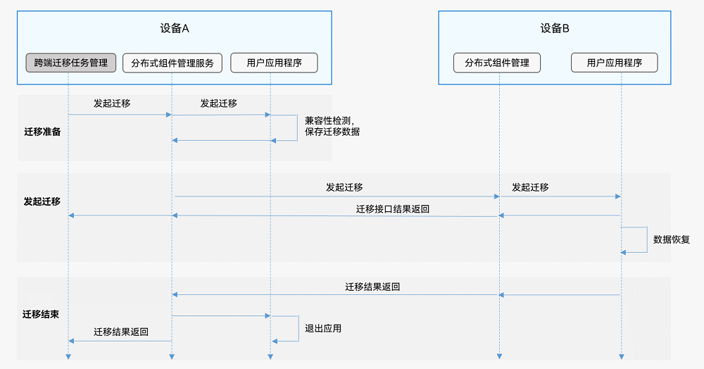
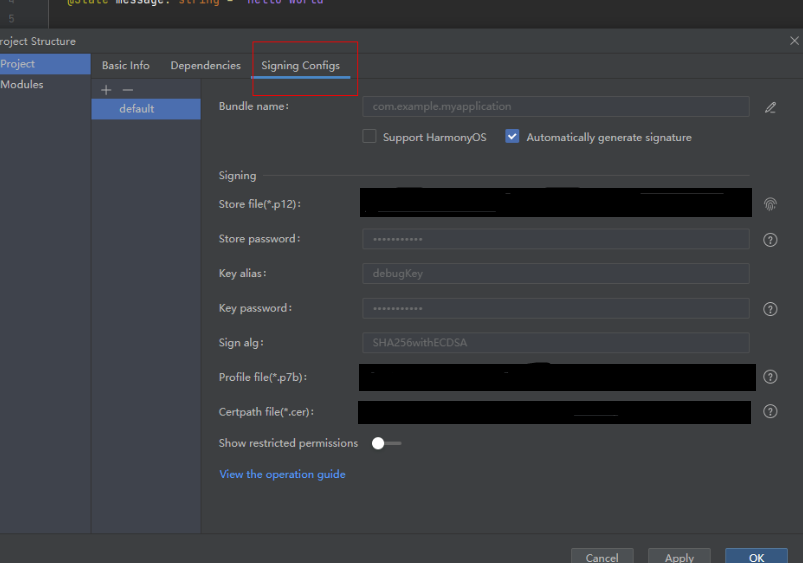
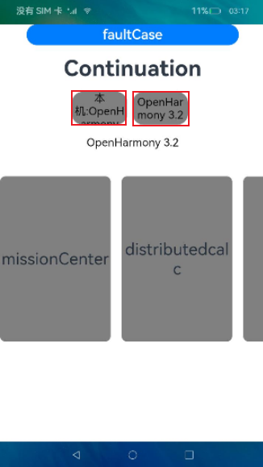
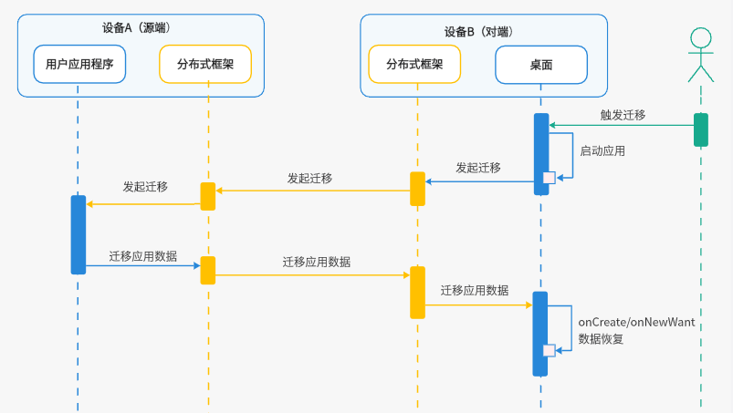
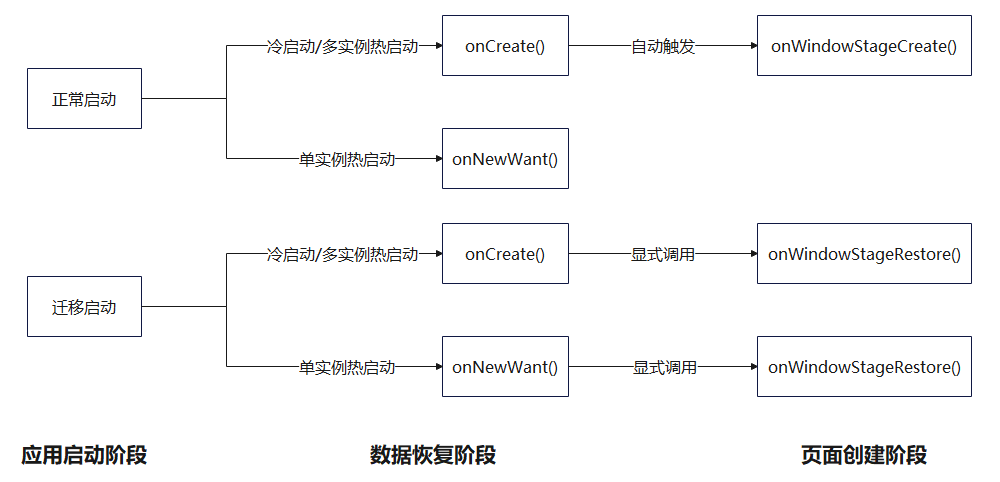
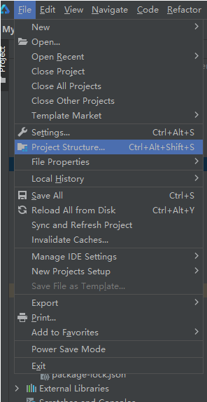

# 跨端迁移

## 概述

在用户使用设备的过程中，当使用情境发生变化时（例如从室内走到户外或者周围有更适合的设备等），之前使用的设备可能已经不适合继续当前的任务，此时，用户可以选择新的设备来继续当前的任务，原设备可按需决定是否退出任务，这个就是跨端迁移的场景。常见的跨端迁移场景实例：在平板上播放的视频，迁移到智慧屏继续播放，从而获得更佳的观看体验；平板上的视频应用退出。在应用开发层面，跨端迁移指在A端运行的[UIAbility](../reference/apis-ability-kit/js-apis-app-ability-uiAbility.md)迁移到B端上，完成迁移后，B端UIAbility继续任务，而A端UIAbility可按需决定是否退出。

主要功能包括：

- 支持用户自定义数据存储及恢复。

- 支持页面路由信息和页面控件状态数据的存储及恢复。

- 支持应用兼容性检测。

- 支持应用根据实际使用场景动态设置迁移状态（默认迁移状态为 **ACTIVE** 激活状态）。例如，编辑类应用在编辑文本的页面下才需要迁移，其他页面不需要迁移，则可以通过[setMissionContinueState](../reference/apis-ability-kit/js-apis-inner-application-uiAbilityContext.md#uiabilitycontextsetmissioncontinuestate10)进行控制。

- 支持应用动态选择是否进行页面栈恢复（默认进行页面栈信息恢复）。例如，应用希望自定义迁移到其他设备后显示的页面，则可以通过[SUPPORT_CONTINUE_PAGE_STACK_KEY](../reference/apis-ability-kit/js-apis-app-ability-wantConstant.md#params)进行控制。

- 支持应用动态选择迁移成功后是否退出迁移源端应用（默认迁移成功后退出迁移源端应用）。可以通过[SUPPORT_CONTINUE_SOURCE_EXIT_KEY](../reference/apis-ability-kit/js-apis-app-ability-wantConstant.md#params)进行控制。

  > **说明：**
  >
  > 开发者可以开发具有迁移能力的应用，迁移的触发由系统应用完成。

## 运作机制



1. 在源端，通过[UIAbility](../reference/apis-ability-kit/js-apis-app-ability-uiAbility.md)的[onContinue()](../reference/apis-ability-kit/js-apis-app-ability-uiAbility.md#uiabilityoncontinue)回调，开发者可以保存待迁移的业务数据。例如，在浏览器应用中完成跨端迁移，开发者需要使用onContinue()回调保存页面URL等业务内容。
2. 分布式框架提供了跨设备应用页面栈以及业务数据的保存和恢复机制，它负责将数据从源端发送到对端。
3. 在对端，同一UIAbility可以通过[onCreate()](../reference/apis-ability-kit/js-apis-app-ability-uiAbility.md#uiabilityoncreate)（冷启动）和[onNewWant()](../reference/apis-ability-kit/js-apis-app-ability-uiAbility.md#uiabilityonnewwant)（热启动）接口来恢复业务数据。

## 跨端迁移流程

以从对端的迁移入口发起迁移为例，跨端迁移流程如下图所示。



## 约束限制

- 跨端迁移要求在同一[UIAbility](../reference/apis-ability-kit/js-apis-app-ability-uiAbility.md)之间进行，也就是需要相同的`bundleName`、`abilityName`和签名信息。
- 为了获得最佳体验，使用`wantParam`传输的数据需要控制在100KB以下。

## 开发步骤

1. 在[module.json5配置文件](../quick-start/module-configuration-file.md)的abilities标签中配置跨端迁移标签`continuable`。

   ```json
   {
     "module": {
       // ...
       "abilities": [
         {
           // ...
           "continuable": true, // 配置UIAbility支持迁移
         }
       ]
     }
   }
   ```

   > **说明：**
   >
   > 根据需要配置应用启动模式类型，配置详情请参照[UIAbility组件启动模式](uiability-launch-type.md)。

2. 在源端UIAbility中实现onContinue()回调。

    当[UIAbility](../reference/apis-ability-kit/js-apis-app-ability-uiAbility.md)实例触发迁移时，[onContinue()](../reference/apis-ability-kit/js-apis-app-ability-uiAbility.md#uiabilityoncontinue)回调在源端被调用，开发者可以在该接口中通过同步或异步的方式来保存迁移数据，实现应用兼容性检测，决定是否支持此次迁移。

    - 保存迁移数据：开发者可以将要迁移的数据通过键值对的方式保存在`wantParam`参数中。
    - 应用兼容性检测：开发者可以在触发迁移时从`onContinue()`入参`wantParam.version`获取到迁移对端应用的版本号，与迁移源端应用版本号做兼容校验，建议应用在校验版本兼容性失败后，提示用户拒绝接续的原因。

    - 迁移决策：开发者可以通过`onContinue()`回调的返回值决定是否支持此次迁移，接口返回值详见[AbilityConstant.OnContinueResult](../reference/apis-ability-kit/js-apis-app-ability-abilityConstant.md#oncontinueresult)。

    &nbsp;
    `onContinue()`接口传入的`wantParam`参数中，有部分字段由系统预置，开发者可以使用这些字段用于业务处理。同时，应用在保存自己的`wantParam`参数时，也应注意不要使用同样的key值，避免被系统覆盖导致数据获取异常。详见下表：
    | 字段|含义|
    | ---- | ---- |
    | version | 对端应用的版本号 |
    | targetDevice | 对端设备的networkId |

    ```ts
    import { AbilityConstant, UIAbility } from '@kit.AbilityKit';
    import { hilog } from '@kit.PerformanceAnalysisKit';
    
    const TAG: string = '[MigrationAbility]';
    const DOMAIN_NUMBER: number = 0xFF00;
    
    export default class MigrationAbility extends UIAbility {
      // 在onContinue中准备迁移数据
      onContinue(wantParam: Record<string, Object>):AbilityConstant.OnContinueResult {
        let targetVersion = wantParam.version;
        let targetDevice = wantParam.targetDevice;
        hilog.info(DOMAIN_NUMBER, TAG, `onContinue version = ${targetVersion}, targetDevice: ${targetDevice}`);
    
        // 将要迁移的数据保存在wantParam的自定义字段（例如data）中
        const continueInput = '迁移的数据';
        wantParam['data'] = continueInput;
    
        return AbilityConstant.OnContinueResult.AGREE;
      }
    }
    ```

    若应用侧需要进行应用版本号兼容性校验，可参考以下示例：

    ```ts
    import { AbilityConstant, UIAbility } from '@kit.AbilityKit';
    import { hilog } from '@kit.PerformanceAnalysisKit';
    import { promptAction } from '@kit.ArkUI';
    
    const TAG: string = '[MigrationAbility]';
    const DOMAIN_NUMBER: number = 0xFF00;
    
    export default class MigrationAbility extends UIAbility {
      // 在onContinue中准备迁移数据
      onContinue(wantParam: Record<string, Object>):AbilityConstant.OnContinueResult {
        let targetVersion = wantParam.version;
        let targetDevice = wantParam.targetDevice;
        hilog.info(DOMAIN_NUMBER, TAG, `onContinue version = ${targetVersion}, targetDevice: ${targetDevice}`);
    
        // 应用可自行设置最低版本号
    	let versionThreshold: number = -1;
        // 兼容性校验
        if (targetVersion < versionThreshold) {
          // 建议在校验版本兼容性失败后，提示用户拒绝接续的原因
          promptAction.showToast({
              message: '应用版本号校验失败，请您升级应用版本',
              duration: 2000
          })
          // 在兼容性校验不通过时返回MISMATCH
          return AbilityConstant.OnContinueResult.MISMATCH;
        }
    
        // 将要迁移的数据保存在wantParam的自定义字段（例如data）中
        const continueInput = '迁移的数据';
        wantParam['data'] = continueInput;
    
        return AbilityConstant.OnContinueResult.AGREE;
      }
    }
    ```

3. 对端设备的UIAbility通过实现[onCreate()](../reference/apis-ability-kit/js-apis-app-ability-uiAbility.md#uiabilityoncreate)/[onNewWant()](../reference/apis-ability-kit/js-apis-app-ability-uiAbility.md#uiabilityonnewwant)接口，来恢复迁移数据和加载UI。

    不同的启动方式下会调用不同的接口，详见下图。

    

    > **说明：**
    > 1. 在应用迁移启动时，无论是冷启动还是热启动，都会在执行完onCreate()/onNewWant()后，触发[onWindowStageRestore()](../reference/apis-ability-kit/js-apis-app-ability-uiAbility.md#uiabilityonwindowstagerestore)生命周期函数，不执行[onWindowStageCreate()](../reference/apis-ability-kit/js-apis-app-ability-uiAbility.md#uiabilityonwindowstagecreate)生命周期函数。
    > 2. 开发者如果在`onWindowStageCreate()`中进行了一些应用启动时必要的初始化，那么迁移后需要在`onWindowStageRestore()`中执行同样的初始化操作，避免应用异常。

    - 通过在onCreate()/onNewWant()回调中检查`launchReason`(CONTINUATION)，可以判断此次启动是否由迁移触发。
    - 开发者可以从[want](../reference/apis-ability-kit/js-apis-app-ability-want.md)中获取之前保存的迁移数据。
    - 若开发者使用系统页面栈恢复功能，则需要在onCreate()/onNewWant()执行完成前，同步调用[restoreWindowStage()](../reference/apis-ability-kit/js-apis-inner-application-uiAbilityContext.md#uiabilitycontextrestorewindowstage)，来触发带有页面栈的页面恢复，详见[按需迁移页面栈](./hop-cross-device-migration.md#按需迁移页面栈)。

    ```ts
    import { AbilityConstant, UIAbility, Want } from '@kit.AbilityKit';
    import { hilog } from '@kit.PerformanceAnalysisKit';
    
    const TAG: string = '[MigrationAbility]';
    const DOMAIN_NUMBER: number = 0xFF00;
    
    export default class MigrationAbility extends UIAbility {
      storage : LocalStorage = new LocalStorage();
    
      onCreate(want: Want, launchParam: AbilityConstant.LaunchParam): void {
        hilog.info(DOMAIN_NUMBER, TAG, '%{public}s', 'Ability onCreate');
        if (launchParam.launchReason === AbilityConstant.LaunchReason.CONTINUATION) {
          // 将上述保存的数据从want.parameters中取出恢复
          let continueInput = '';
          if (want.parameters !== undefined) {
            continueInput = JSON.stringify(want.parameters.data);
            hilog.info(DOMAIN_NUMBER, TAG, `continue input ${JSON.stringify(continueInput)}`);
          }
          // 触发页面恢复
          this.context.restoreWindowStage(this.storage);
        }
      }
    
      onNewWant(want: Want, launchParam: AbilityConstant.LaunchParam): void {
        hilog.info(DOMAIN_NUMBER, TAG, 'onNewWant');
        if (launchParam.launchReason === AbilityConstant.LaunchReason.CONTINUATION) {
          // 将上述保存的数据从want.parameters中取出恢复
          let continueInput = '';
          if (want.parameters !== undefined) {
            continueInput = JSON.stringify(want.parameters.data);
            hilog.info(DOMAIN_NUMBER, TAG, `continue input ${JSON.stringify(continueInput)}`);
          }
          // 触发页面恢复
          this.context.restoreWindowStage(this.storage);
        }
      }
    }
    ```

## 可选配置迁移能力

### 动态配置迁移能力

从API version 10开始，提供了支持动态配置迁移能力的功能。即应用可以根据实际使用场景，在需要迁移时开启应用迁移能力；在业务不需要迁移时则可以关闭迁移能力。

开发者可以通过调用[setMissionContinueState()](../reference/apis-ability-kit/js-apis-inner-application-uiAbilityContext.md#uiabilitycontextsetmissioncontinuestate10)接口对迁移能力进行设置。默认状态下，应用的迁移能力为**ACTIVE**状态，即迁移能力开启，可以迁移。

**设置迁移能力的时机**

如果需要实现某些特殊场景，比如只在具体某个页面下支持迁移，或只在某个事件发生时才支持迁移，可以按照如下步骤进行配置

1. 在[UIAbility](../reference/apis-ability-kit/js-apis-app-ability-uiAbility.md)的[onCreate()](../reference/apis-ability-kit/js-apis-app-ability-uiAbility.md#uiabilityoncreate)生命周期回调中，关闭迁移能力。

    ```ts
    // MigrationAbility.ets
    import { AbilityConstant, UIAbility, Want } from '@kit.AbilityKit';
    import { hilog } from '@kit.PerformanceAnalysisKit';

    const TAG: string = '[MigrationAbility]';
    const DOMAIN_NUMBER: number = 0xFF00;

    export default class MigrationAbility extends UIAbility {
      onCreate(want: Want, launchParam: AbilityConstant.LaunchParam): void {
        // ...
        this.context.setMissionContinueState(AbilityConstant.ContinueState.INACTIVE, (result) => {
          hilog.info(DOMAIN_NUMBER, TAG, `setMissionContinueState INACTIVE result: ${JSON.stringify(result)}`);
        });
        // ...
      }
    }
    ```

 2. 如果需要在具体某个页面中打开迁移能力，可以在页面的[onPageShow()](../reference/apis-arkui/arkui-ts/ts-custom-component-lifecycle.md#onpageshow)函数中调用接口。

    ```ts
    // Page_MigrationAbilityFirst.ets
    import { AbilityConstant, common } from '@kit.AbilityKit';
    import { hilog } from '@kit.PerformanceAnalysisKit';

    const TAG: string = '[MigrationAbility]';
    const DOMAIN_NUMBER: number = 0xFF00;

    @Entry
    @Component
    struct Page_MigrationAbilityFirst {
      private context = getContext(this) as common.UIAbilityContext;
      build() {
        // ...
      }
      // ...
      onPageShow(){
        // 进入该页面时，将应用设置为可迁移状态
        this.context.setMissionContinueState(AbilityConstant.ContinueState.ACTIVE, (result) => {
          hilog.info(DOMAIN_NUMBER, TAG, '%{public}s', `setMissionContinueState ACTIVE result: ${JSON.stringify(result)}`);
        });
      }
    }
    ```

3. 如果想要在某个组件的触发事件打开迁移能力，可以在该事件中调用。以Button组件的[onClick()](../reference/apis-arkui/arkui-ts/ts-universal-events-click.md#onclick)事件为例：

    ```ts
    // Page_MigrationAbilityFirst.ets
    import { AbilityConstant, common } from '@kit.AbilityKit';
    import { hilog } from '@kit.PerformanceAnalysisKit';
    import { promptAction } from '@kit.ArkUI';
    
    const TAG: string = '[MigrationAbility]';
    const DOMAIN_NUMBER: number = 0xFF00;
    
    @Entry
    @Component
    struct Page_MigrationAbilityFirst {
      private context = getContext(this) as common.UIAbilityContext;
      build() {
        Column() {
          //...
          List({ initialIndex: 0 }) {
            ListItem() {
              Row() {
                //...
              }
              .onClick(() => {
                // 点击该按钮时，将应用设置为可迁移状态
                this.context.setMissionContinueState(AbilityConstant.ContinueState.ACTIVE, (result) => {
                  hilog.info(DOMAIN_NUMBER, TAG, '%{public}s', `setMissionContinueState ACTIVE result: ${JSON.stringify(result)}`);
                  promptAction.showToast({
                    message: 'Success'
                  });
                });
              })
            }
            //...
          }
          //...
        }
        //...
      }
    }
    ```

### 按需迁移页面栈


> **说明：**
>
> 1. 当前仅支持router路由的页面栈自动恢复，暂不支持navigation路由的页面栈自动恢复。
> 2. 若应用使用navigation路由，可以设置不进行默认页面栈迁移（配置[SUPPORT_CONTINUE_PAGE_STACK_KEY](../reference/apis-ability-kit/js-apis-app-ability-wantConstant.md#params)参数为`false`），并将需要迁移的页面（或页面栈）信息保存在want中传递，然后在目标端手动加载指定页面。

[UIAbility](../reference/apis-ability-kit/js-apis-app-ability-uiAbility.md)的迁移默认恢复页面栈。开发者需要在[onCreate()](../reference/apis-ability-kit/js-apis-app-ability-uiAbility.md#uiabilityoncreate)/[onNewWant()](../reference/apis-ability-kit/js-apis-app-ability-uiAbility.md#uiabilityonnewwant)执行完成前，调用[restoreWindowStage()](../reference/apis-ability-kit/js-apis-inner-application-uiAbilityContext.md#restore)，向系统传入当前的窗口上下文，用于页面栈的加载恢复。`restoreWindowStage()`接口必须在同步方法中执行。如果在异步回调中执行该接口，会导致在应用拉起时页面有概率加载失败。

以`onCreate()`为例：

```ts
import { AbilityConstant, UIAbility, Want } from '@kit.AbilityKit';

export default class MigrationAbility extends UIAbility {
  storage : LocalStorage = new LocalStorage();

  onCreate(want: Want, launchParam: AbilityConstant.LaunchParam): void {
      // ...
      // 同步执行结束前触发页面恢复
      this.context.restoreWindowStage(this.storage);
  }
}
```

如果应用不想通过系统自动恢复页面栈，可以通过配置[SUPPORT_CONTINUE_PAGE_STACK_KEY](../reference/apis-ability-kit/js-apis-app-ability-wantConstant.md#params)参数为`false`关闭该功能。开发者需要在[onWindowStageRestore()](../reference/apis-ability-kit/js-apis-app-ability-uiAbility.md#uiabilityonwindowstagerestore)中，指定迁移后进入的页面。不指定迁移后进入的页面，会导致迁移拉起后显示空白页面。

例如，`UIAbility`在对端恢复时不需要按照源端页面栈进行恢复，而是需要恢复到指定页面`Page_MigrationAbilityThird`。

```ts
// MigrationAbility.ets
import { AbilityConstant, UIAbility, wantConstant } from '@kit.AbilityKit';
import { hilog } from '@kit.PerformanceAnalysisKit';
import { window } from '@kit.ArkUI';

const TAG: string = '[MigrationAbility]';
const DOMAIN_NUMBER: number = 0xFF00;

export default class MigrationAbility extends UIAbility {
  onContinue(wantParam: Record<string, Object>): AbilityConstant.OnContinueResult {
    // ...
    // 配置不使用系统页面栈恢复
    wantParam[wantConstant.Params.SUPPORT_CONTINUE_PAGE_STACK_KEY] = false;
    return AbilityConstant.OnContinueResult.AGREE;
  }

  onWindowStageRestore(windowStage: window.WindowStage): void {
    // 不使用系统页面栈恢复时，需要在此处指定应用迁移后进入的页面
    windowStage.loadContent('pages/page_migrationability/Page_MigrationAbilityThird', (err, data) => {
      if (err.code) {
        hilog.error(DOMAIN_NUMBER, TAG, 'Failed to load the content. Cause: %{public}s', JSON.stringify(err) ?? '');
        return;
      }
    });
  }
}
```

### 按需退出

[UIAbility](../reference/apis-ability-kit/js-apis-app-ability-uiAbility.md)的迁移默认迁移结束后退出源端应用。如果应用希望迁移后源端应用继续运行，或需要进行其他操作（如，保存草稿、清理资源等）后再自行触发退出，不想在迁移后立即自动退出源端应用，可以通过配置[SUPPORT_CONTINUE_SOURCE_EXIT_KEY](../reference/apis-ability-kit/js-apis-app-ability-wantConstant.md#params)参数为`false`设置源端迁移后不退出。

示例：`UIAbility`设置迁移成功后，源端不需要退出迁移应用。

```ts
import { AbilityConstant, UIAbility, wantConstant } from '@kit.AbilityKit';
import { hilog } from '@kit.PerformanceAnalysisKit';

const TAG: string = '[MigrationAbility]';
const DOMAIN_NUMBER: number = 0xFF00;

export default class MigrationAbility extends UIAbility {
  // ...
  onContinue(wantParam: Record<string, Object>): AbilityConstant.OnContinueResult {
    hilog.info(DOMAIN_NUMBER, TAG, `onContinue version = ${wantParam.version}, targetDevice: ${wantParam.targetDevice}`);
    wantParam[wantConstant.Params.SUPPORT_CONTINUE_SOURCE_EXIT_KEY] = false;
    return AbilityConstant.OnContinueResult.AGREE;
  }
}
```

### 支持同应用中不同Ability跨端迁移
一般情况下，跨端迁移的双端是同Ability之间，但有些应用在不同设备类型下的同一个业务Ability名称不同（即异Ability），为了支持该场景下的两个Ability之间能够完成迁移，可以通过在[module.json5](../quick-start/module-configuration-file.md)文件的abilities标签中配置迁移类型continueType进行关联。
需要迁移的两个Ability的continueType字段取值必须保持一致，示例如下：
   > **说明：**
   >
   > continueType在本应用中要保证唯一，字符串以字母、数字和下划线组成，最大长度127个字节，不支持中文。
   > continueType标签类型为字符串数组，如果配置了多个字段，当前仅第一个字段会生效。

```json
   // 设备A
   {
     "module": {
       // ...
       "abilities": [
         {
           // ...
           "name": "Ability-deviceA",
           "continueType": ['continueType1'], // continueType标签配置
         }
       ]
     }
   }

   // 设备B
   {
     "module": {
       // ...
       "abilities": [
         {
           // ...
           "name": "Ability-deviceB",
           "continueType": ['continueType1'], // 与设备A相同的continueType标签
         }
       ]
     }
   }
```

### 支持快速拉起目标应用
默认情况下，发起迁移后不会立即拉起对端的目标应用，而是等待迁移数据从源端同步到对端后，才会拉起。为了发起迁移后能够立即拉起目标应用，做到及时响应，可以通过在continueType标签中添加“_ContinueQuickStart”后缀进行生效，这样待迁移数据从源端同步到对端后只恢复迁移数据即可，提升应用迁移体验。

   ```json
   {
     "module": {
       // ...
       "abilities": [
         {
           // ...
           "name": "EntryAbility"
           "continueType": ['EntryAbility_ContinueQuickStart'], // 如果已经配置了continueType标签，可以在该标签值后添加'_ContinueQuickStart'后缀；如果没有配置continueType标签，可以使用AbilityName + '_ContinueQuickStart'作为continueType标签实现快速拉起目标应用
         }
       ]
     }
   }
   ```
配置快速拉起功能后，用户触发迁移，等待迁移数据返回的过程中，并行拉起应用，减小用户等待迁移启动时间。同时需注意，应用在迁移的提前启动时，首次触发迁移会收到`launchReason`为提前拉起 (PREPARE_CONTINUATION)的[onCreate()](../reference/apis-ability-kit/js-apis-app-ability-uiAbility.md#uiabilityoncreate)/[onNewWant()](../reference/apis-ability-kit/js-apis-app-ability-uiAbility.md#uiabilityonnewwant)请求。应用可以通过此`launchReason`，解决跳转、时序等问题，也可以在迁移快速启动时，增加loading界面，以获得更好的体验。快速拉起流程如下图所示。



配置了快速拉起的应用，触发迁移时会收到两次启动请求，区别如下：

| 场景           | 生命周期函数                                | launchParam.launchReason                          |
| -------------- | ------------------------------------------- | ------------------------------------------------- |
| 第一次启动请求 | onCreate (冷启动)<br />或onNewWant (热启动) | AbilityConstant.LaunchReason.PREPARE_CONTINUATION |
| 第二次启动请求 | onNewWant                                   | AbilityConstant.LaunchReason.CONTINUATION         |

如果没有配置快速拉起，则触发迁移时会收到一次启动请求：

| 场景         | 生命周期函数                                | launchParam.launchReason                  |
| ------------ | ------------------------------------------- | ----------------------------------------- |
| 一次启动请求 | onCreate (冷启动)<br />或onNewWant (热启动) | AbilityConstant.LaunchReason.CONTINUATION |

配置快速拉起功能后，对应的[onCreate()](../reference/apis-ability-kit/js-apis-app-ability-uiAbility.md#uiabilityoncreate)/[onNewWant()](../reference/apis-ability-kit/js-apis-app-ability-uiAbility.md#uiabilityonnewwant)接口具体实现，示例代码如下：

```ts
import { AbilityConstant, UIAbility, Want } from '@kit.AbilityKit';
import { hilog } from '@kit.PerformanceAnalysisKit';

const TAG: string = '[MigrationAbility]';
const DOMAIN_NUMBER: number = 0xFF00;

export default class MigrationAbility extends UIAbility {
  storage : LocalStorage = new LocalStorage();

  onCreate(want: Want, launchParam: AbilityConstant.LaunchParam): void {
    hilog.info(DOMAIN_NUMBER, TAG, '%{public}s', 'Ability onCreate');

    // 1.已配置快速拉起功能，应用立即启动时触发应用生命周期回调
    if (launchParam.launchReason === AbilityConstant.LaunchReason.PREPARE_CONTINUATION) {
      //若应用迁移数据较大，可在此处添加加载页面(页面中显示loading等)
      //可处理应用自定义跳转、时序等问题
      // ...
    }
  }

  onNewWant(want: Want, launchParam: AbilityConstant.LaunchParam): void {
    hilog.info(DOMAIN_NUMBER, TAG, 'onNewWant');
      
    // 1.已配置快速拉起功能，应用立即启动时触发应用生命周期回调
    if (launchParam.launchReason === AbilityConstant.LaunchReason.PREPARE_CONTINUATION) {
      //若应用迁移数据较大，可在此处添加加载页面(页面中显示loading等)
      //可处理应用自定义跳转、时序等问题
      // ...
    }
      
    // 2.迁移数据恢复时触发应用生命周期回调
    if (launchParam.launchReason === AbilityConstant.LaunchReason.CONTINUATION) {
      // 将上述保存的数据从want.parameters中取出恢复
      let continueInput = '';
      if (want.parameters !== undefined) {
        continueInput = JSON.stringify(want.parameters.data);
        hilog.info(DOMAIN_NUMBER, TAG, `continue input ${JSON.stringify(continueInput)}`);
      }
      // 触发页面恢复
      this.context.restoreWindowStage(this.storage);
    }
  }
}
```

快速拉起目标应用时，应用的[onWindowStageCreate()](../reference/apis-ability-kit/js-apis-app-ability-uiAbility.md#uiabilityonwindowstagecreate)和[onWindowStageRestore()](../reference/apis-ability-kit/js-apis-app-ability-uiAbility.md#uiabilityonwindowstagerestore)回调会被依次触发。通常在onWindowStageCreate()中，开发者会调用[loadContent()](../reference/apis-arkui/js-apis-window.md#loadcontent9)加载页面，该接口会抛出一个异步任务加载首页，该异步任务与onWindowStageRestore()无同步关系。如果在onWindowStageRestore()中使用UI接口（如路由接口），其调用时机可能早于首页加载。为保证正常加载顺序，可以使用[setTimeout()](../reference/common/js-apis-timer.md#settimeout)抛出异步任务执行相关操作。详细见示例代码。

示例代码如下：

```ts
import { UIAbility } from '@kit.AbilityKit';
import { hilog } from '@kit.PerformanceAnalysisKit';
import { UIContext, window } from '@kit.ArkUI';

export default class EntryAbility extends UIAbility {
  private uiContext: UIContext | undefined = undefined;

  // ...

  onWindowStageCreate(windowStage: window.WindowStage): void {
    hilog.info(0x0000, 'testTag', '%{public}s', 'Ability onWindowStageCreate');

    windowStage.loadContent('pages/Index', (err) => {
      if (err.code) {
        hilog.error(0x0000, 'testTag', 'Failed to load the content. Cause: %{public}s', JSON.stringify(err) ?? '');
        return;
      }
      this.uiContext = windowStage.getMainWindowSync().getUIContext();
      hilog.info(0x0000, 'testTag', 'Succeeded in loading the content.');
    });
  }

  onWindowStageRestore(windowStage: window.WindowStage): void {
    setTimeout(() => {
      // 抛出异步任务执行路由，保证其执行位于首页加载之后。
      this.uiContext?.getRouter().pushUrl({
        url: 'pages/examplePage'
      });
    }, 0);
  }

  // ...
}
```

## 跨端迁移中的数据迁移

当前推荐两种不同的数据迁移方式，开发者可以根据实际使用需要进行选择。
  > **说明：**
  >
  > 部分ArkUI组件支持通过配置`restoreId`的方式，在迁移后将特定状态恢复到对端设备。详情请见[分布式迁移标识](../reference/apis-arkui/arkui-ts/ts-universal-attributes-restoreId.md)。
  >
  > 如果涉及分布式数据对象迁移时应注意：
  >
  > API 11及以前版本涉及分布式数据对象迁移前，需要执行如下操作。
  > 1. 申请`ohos.permission.DISTRIBUTED_DATASYNC`权限，配置方式请参见[声明权限](../security/AccessToken/declare-permissions.md)。
  >
  > 2. 在应用首次启动时弹窗向用户申请授权，使用方式请参见[向用户申请授权](../security/AccessToken/request-user-authorization.md)。

### 使用wantParam迁移数据

在需要迁移的数据较少（100KB以下）时，开发者可以选择在`wantParam`中增加字段进行数据迁移。示例如下：

```ts
import { AbilityConstant, UIAbility, Want } from '@kit.AbilityKit';
import { hilog } from '@kit.PerformanceAnalysisKit';

const TAG: string = '[MigrationAbility]';
const DOMAIN_NUMBER: number = 0xFF00;

export default class MigrationAbility extends UIAbility {
  storage: LocalStorage = new LocalStorage();

  // 源端保存
  onContinue(wantParam: Record<string, Object>): AbilityConstant.OnContinueResult {
    // 将要迁移的数据保存在wantParam的自定义字段（例如data）中
    const continueInput = '迁移的数据';
    wantParam['data'] = continueInput;
    return AbilityConstant.OnContinueResult.AGREE;
  }

  // 对端恢复
  onCreate(want: Want, launchParam: AbilityConstant.LaunchParam): void {
    if (launchParam.launchReason === AbilityConstant.LaunchReason.CONTINUATION) {
      // 将上述保存的数据取出恢复
      let continueInput = '';
      if (want.parameters !== undefined) {
        continueInput = JSON.stringify(want.parameters.data);
        hilog.info(DOMAIN_NUMBER, TAG, `continue input ${continueInput}`);
      }
      // 触发页面恢复
      this.context.restoreWindowStage(this.storage);
    }
  }

  onNewWant(want: Want, launchParam: AbilityConstant.LaunchParam): void {
    if (launchParam.launchReason === AbilityConstant.LaunchReason.CONTINUATION) {
      let continueInput = '';
      if (want.parameters !== undefined) {
        continueInput = JSON.stringify(want.parameters.data);
        hilog.info(DOMAIN_NUMBER, TAG, `continue input ${JSON.stringify(continueInput)}`);
      }
      // 触发页面恢复
      this.context.restoreWindowStage(this.storage);
    }
  }
}
```

### 使用分布式数据对象迁移数据

当需要迁移的数据较大（100KB以上）或需要迁移文件时，可以使用[分布式数据对象](../reference/apis-arkdata/js-apis-data-distributedobject.md)。原理与接口说明详见[分布式数据对象跨设备数据同步](../database/data-sync-of-distributed-data-object.md)。

  > **说明：**
  >
  > 自API 12起，由于直接使用[跨设备文件访问](../file-management/file-access-across-devices.md)实现文件的迁移难以获取文件同步完成的时间，为了保证更高的成功率，文件数据的迁移不建议继续通过该方式实现，推荐使用分布式数据对象携带资产的方式进行。开发者此前通过跨设备文件访问实现的文件迁移依然生效。

#### 基础数据的迁移

使用分布式数据对象，需要在源端[onContinue()](../reference/apis-ability-kit/js-apis-app-ability-uiAbility.md#uiabilityoncontinue)接口中进行数据保存，并在对端的[onCreate()](../reference/apis-ability-kit/js-apis-app-ability-uiAbility.md#uiabilityoncreate)/[onNewWant()](../reference/apis-ability-kit/js-apis-app-ability-uiAbility.md#uiabilityonnewwant)接口中进行数据恢复。

在源端，将需要迁移的数据保存到分布式数据对象[DataObject](../reference/apis-arkdata/js-apis-data-distributedobject.md#dataobject)中。

- 在onContinue()接口中使用[create()](../reference/apis-arkdata/js-apis-data-distributedobject.md#distributeddataobjectcreate9)接口创建分布式数据对象，将所要迁移的数据填充到分布式数据对象数据中。
- 调用[genSessionId()](../reference/apis-arkdata/js-apis-data-distributedobject.md#distributeddataobjectgensessionid)接口生成数据对象组网id，并使用该id调用[setSessionId()](../reference/apis-arkdata/js-apis-data-distributedobject.md#setsessionid9)加入组网，激活分布式数据对象。
- 使用[save()](../reference/apis-arkdata/js-apis-data-distributedobject.md#save9)接口将已激活的分布式数据对象持久化，确保源端退出后对端依然可以获取到数据。
- 将生成的`sessionId`通过`want`传递到对端，供对端激活同步使用。

> **注意**
>
> 1. 分布式数据对象需要先激活，再持久化，因此必须在`setSessionId()`后调用save()接口。
> 2. 对于源端迁移后需要退出的应用，为了防止数据未保存完成应用就退出，应采用`await`的方式等待save()接口执行完毕。从API 12 起，`onContinue()`接口提供了`async`版本供该场景使用。
> 3. 当前，`wantParams`中`sessionId`字段在迁移流程中被系统占用，建议开发者在`wantParams`中定义其他key值存储该id，避免数据异常。

示例代码如下：

```ts
// 导入模块
import { distributedDataObject } from '@kit.ArkData';
import { UIAbility, AbilityConstant } from '@kit.AbilityKit';
import { BusinessError } from '@kit.BasicServicesKit';
import { hilog } from '@kit.PerformanceAnalysisKit';

const TAG: string = '[MigrationAbility]';
const DOMAIN_NUMBER: number = 0xFF00;

// 业务数据定义
class ParentObject {
  mother: string
  father: string

  constructor(mother: string, father: string) {
    this.mother = mother
    this.father = father
  }
}

// 支持字符、数字、布尔值、对象的传递
class SourceObject {
  name: string | undefined
  age: number | undefined
  isVis: boolean | undefined
  parent: ParentObject | undefined

  constructor(name: string | undefined, age: number | undefined, isVis: boolean | undefined, parent: ParentObject | undefined) {
    this.name = name
    this.age = age
    this.isVis = isVis
    this.parent = parent
  }
}

export default class MigrationAbility extends UIAbility {
  d_object?: distributedDataObject.DataObject;

  async onContinue(wantParam: Record<string, Object>): Promise<AbilityConstant.OnContinueResult> {
    // ...
    let parentSource: ParentObject = new ParentObject('jack mom', 'jack Dad');
    let source: SourceObject = new SourceObject("jack", 18, false, parentSource);

    // 创建分布式数据对象
    this.d_object = distributedDataObject.create(this.context, source);

    // 生成数据对象组网id，激活分布式数据对象
    let dataSessionId: string = distributedDataObject.genSessionId();
    this.d_object.setSessionId(dataSessionId);

    // 将组网id存在want中传递到对端
    wantParam['dataSessionId'] = dataSessionId;

    // 数据对象持久化，确保迁移后即使应用退出，对端依然能够恢复数据对象
    // 从wantParam.targetDevice中获取到对端设备的networkId作为入参
    await this.d_object.save(wantParam.targetDevice as string).then((result:
      distributedDataObject.SaveSuccessResponse) => {
      hilog.info(DOMAIN_NUMBER, TAG, `Succeeded in saving. SessionId: ${result.sessionId}`,
        `version:${result.version}, deviceId:${result.deviceId}`);
    }).catch((err: BusinessError) => {
      hilog.error(DOMAIN_NUMBER, TAG, 'Failed to save. Error: ', JSON.stringify(err) ?? '');
    });

    return AbilityConstant.OnContinueResult.AGREE;
  }
}
```

对端在[onCreate()](../reference/apis-ability-kit/js-apis-app-ability-uiAbility.md#uiabilityoncreate)/[onNewWant()](../reference/apis-ability-kit/js-apis-app-ability-uiAbility.md#uiabilityonnewwant)中，通过加入与源端一致的分布式数据对象组网进行数据恢复。

- 创建空的分布式数据对象，用于接收恢复的数据。
- 从[want](../reference/apis-ability-kit/js-apis-app-ability-want.md)中读取分布式数据对象组网id。
- 注册[on()](../reference/apis-arkdata/js-apis-data-distributedobject.md#onstatus9)接口监听数据变更。在收到`status`为`restore`的事件的回调中，实现数据恢复完毕时需要进行的业务操作。
- 调用[setSessionId()](../reference/apis-arkdata/js-apis-data-distributedobject.md#setsessionid9)加入组网，激活分布式数据对象。

> **注意**
>
> 1. 对端加入组网的分布式数据对象不能为临时变量，因为on()接口的回调可能在onCreate()/onNewWant()执行结束后才执行，临时变量被释放可能导致空指针异常。可以使用类成员变量避免该问题。
> 2. 对端用于创建分布式数据对象的`Object`，其属性应在激活分布式数据对象前置为`undefined`，否则会导致新数据加入组网后覆盖源端数据，数据恢复失败。
> 3. 应当在激活分布式数据对象之前，调用on()接口进行注册监听，防止错过`restore`事件导致数据恢复失败。

示例代码如下：

```ts
import { AbilityConstant, UIAbility, Want } from '@kit.AbilityKit';
import { distributedDataObject } from '@kit.ArkData';
import { hilog } from '@kit.PerformanceAnalysisKit';

const TAG: string = '[MigrationAbility]';
const DOMAIN_NUMBER: number = 0xFF00;

// 示例数据对象定义与上同
export default class MigrationAbility extends UIAbility {
  d_object?: distributedDataObject.DataObject;

  onCreate(want: Want, launchParam: AbilityConstant.LaunchParam): void {
    if (launchParam.launchReason === AbilityConstant.LaunchReason.CONTINUATION) {
      // ...
      // 调用封装好的分布式数据对象处理函数
      this.handleDistributedData(want);
    }
  }

  onNewWant(want: Want, launchParam: AbilityConstant.LaunchParam): void {
    if (launchParam.launchReason === AbilityConstant.LaunchReason.CONTINUATION) {
      if (want.parameters !== undefined) {
        // ...
        // 调用封装好的分布式数据对象处理函数
        this.handleDistributedData(want);
      }
    }
  }

  handleDistributedData(want: Want) {
    // 创建空的分布式数据对象
    let remoteSource: SourceObject = new SourceObject(undefined, undefined, undefined, undefined);
    this.d_object = distributedDataObject.create(this.context, remoteSource);

    // 读取分布式数据对象组网id
    let dataSessionId = '';
    if (want.parameters !== undefined) {
      dataSessionId = want.parameters.dataSessionId as string;
    }

    // 添加数据变更监听
    this.d_object.on("status", (sessionId: string, networkId: string, status: 'online' | 'offline' | 'restored') => {
      hilog.info(DOMAIN_NUMBER, TAG, "status changed " + sessionId + " " + status + " " + networkId);
      if (status == 'restored') {
        if (this.d_object) {
          // 收到迁移恢复的状态时，可以从分布式数据对象中读取数据
          hilog.info(DOMAIN_NUMBER, TAG, "restored name:" + this.d_object['name']);
          hilog.info(DOMAIN_NUMBER, TAG, "restored parents:" + JSON.stringify(this.d_object['parent']));
        }
      }
    });

    // 激活分布式数据对象
    this.d_object.setSessionId(dataSessionId);
  }
}
```

#### 文件资产的迁移

对于图片、文档等文件类数据，需要先将其转换为[资产`commonType.Asset`](../reference/apis-arkdata/js-apis-data-commonType.md#asset)类型，再封装到分布式数据对象中进行迁移。迁移实现方式与普通的分布式数据对象类似，下例中仅针对区别部分进行说明。

在源端，将需要迁移的文件资产保存到分布式数据对象[DataObject](../reference/apis-arkdata/js-apis-data-distributedobject.md#dataobject)中。

- 将文件资产拷贝到[分布式文件目录](application-context-stage.md#获取应用文件路径)下，相关接口与用法详见[基础文件接口](../file-management/app-file-access.md)。
- 使用分布式文件目录下的文件创建`Asset`资产对象。
- 将`Asset`资产对象作为分布式数据对象的根属性保存。

随后，与普通数据对象的迁移的源端实现相同，可以使用该数据对象加入组网，并进行持久化保存。

示例如下：

```ts
// 导入模块
import { UIAbility, AbilityConstant } from '@kit.AbilityKit';
import { distributedDataObject, commonType } from '@kit.ArkData';
import { fileIo, fileUri } from '@kit.CoreFileKit';
import { hilog } from '@kit.PerformanceAnalysisKit';
import { BusinessError } from '@ohos.base';

const TAG: string = '[MigrationAbility]';
const DOMAIN_NUMBER: number = 0xFF00;

// 数据对象定义
class ParentObject {
  mother: string
  father: string

  constructor(mother: string, father: string) {
    this.mother = mother
    this.father = father
  }
}

class SourceObject {
  name: string | undefined
  age: number | undefined
  isVis: boolean | undefined
  parent: ParentObject | undefined
  attachment: commonType.Asset | undefined // 新增资产属性

  constructor(name: string | undefined, age: number | undefined, isVis: boolean | undefined,
              parent: ParentObject | undefined, attachment: commonType.Asset | undefined) {
    this.name = name
    this.age = age
    this.isVis = isVis
    this.parent = parent
    this.attachment = attachment;
  }
}

export default class MigrationAbility extends UIAbility {
  d_object?: distributedDataObject.DataObject;

  async onContinue(wantParam: Record<string, Object>): Promise<AbilityConstant.OnContinueResult> {
    // ...

    // 1. 将资产写入分布式文件目录下
    let distributedDir: string = this.context.distributedFilesDir; // 获取分布式文件目录路径
    let fileName: string = '/test.txt'; // 文件名
    let filePath: string = distributedDir + fileName; // 文件路径

    try {
      // 在分布式目录下创建文件
      let file = fileIo.openSync(filePath, fileIo.OpenMode.READ_WRITE | fileIo.OpenMode.CREATE);
      hilog.info(DOMAIN_NUMBER, TAG, 'Create file success.');
      // 向文件中写入内容（若资产为图片，可将图片转换为buffer后写入）
      fileIo.writeSync(file.fd, '[Sample] Insert file content here.');
      // 关闭文件
      fileIo.closeSync(file.fd);
    } catch (error) {
      let err: BusinessError = error as BusinessError;
      hilog.error(DOMAIN_NUMBER, TAG, `Failed to openSync / writeSync / closeSync. Code: ${err.code}, message: ${err.message}`);
    }

    // 2. 使用分布式文件目录下的文件创建资产对象
    let distributedUri: string = fileUri.getUriFromPath(filePath); // 获取分布式文件Uri

    // 获取文件参数
    let ctime: string = '';
    let mtime: string = '';
    let size: string = '';
    await fileIo.stat(filePath).then((stat: fileIo.Stat) => {
      ctime = stat.ctime.toString(); // 创建时间
      mtime = stat.mtime.toString(); // 修改时间
      size = stat.size.toString(); // 文件大小
    })

    // 创建资产对象
    let attachment: commonType.Asset = {
      name: fileName,
      uri: distributedUri,
      path: filePath,
      createTime: ctime,
      modifyTime: mtime,
      size: size,
    }

    // 3. 将资产对象作为分布式数据对象的根属性，创建分布式数据对象
    let parentSource: ParentObject = new ParentObject('jack mom', 'jack Dad');
    let source: SourceObject = new SourceObject("jack", 18, false, parentSource, attachment);
    this.d_object = distributedDataObject.create(this.context, source);

    // 生成组网id，激活分布式数据对象，save持久化保存
    // ...

    return AbilityConstant.OnContinueResult.AGREE;
  }
}
```

对端需要先创建一个各属性为空的`Asset`资产对象作为分布式数据对象的根属性。在接收到[on()](../reference/apis-arkdata/js-apis-data-distributedobject.md#onstatus9)接口`status`为`restored`的事件的回调时，表示包括资产在内的数据同步完成，可以像获取基本数据一样获取到源端的资产对象。

> **注意**
>
> 对端创建分布式数据对象时，`SourceObject`对象中的资产不能直接使用`undefined`初始化，需要创建一个所有属性初始值为空的Asset资产对象，使分布式对象可以识别出资产类型。

```ts
import { UIAbility, Want } from '@kit.AbilityKit';
import { distributedDataObject, commonType } from '@kit.ArkData';
import { hilog } from '@kit.PerformanceAnalysisKit';

const TAG: string = '[MigrationAbility]';
const DOMAIN_NUMBER: number = 0xFF00;

export default class MigrationAbility extends UIAbility {
  d_object?: distributedDataObject.DataObject;

  handleDistributedData(want: Want) {
    // ...
    // 创建一个各属性为空的资产对象
    let attachment: commonType.Asset = {
      name: '',
      uri: '',
      path: '',
      createTime: '',
      modifyTime: '',
      size: '',
    }

    // 使用该空资产对象创建分布式数据对象，其余基础属性可以直接使用undefined
    let source: SourceObject = new SourceObject(undefined, undefined, undefined, undefined, attachment);
    this.d_object = distributedDataObject.create(this.context, source);

    this.d_object.on("status", (sessionId: string, networkId: string, status: 'online' | 'offline' | 'restored') => {
      if (status == 'restored') {
        if (this.d_object) {
          // 收到监听的restored回调，表示分布式资产对象同步完成
          hilog.info(DOMAIN_NUMBER, TAG, "restored attachment:" + JSON.stringify(this.d_object['attachment']));
        }
      }
    });
    // ...
  }
}
```

若应用想要同步多个资产，可采用两种方式实现

1. 可将每个资产作为分布式数据对象的一个根属性实现，适用于要迁移的资产数量固定的场景。
2. 可以将资产数组传化为`Object`传递，适用于需要迁移的资产个数会动态变化的场景（如，用户选择了不定数量的图片）。当前不支持直接将资产数组作为根属性传递。

其中方式1的实现可以直接参照添加一个资产的方式添加更多资产。方式2的示例如下所示：

```ts
// 导入模块
import { distributedDataObject, commonType } from '@kit.ArkData';
import { UIAbility } from '@kit.AbilityKit';

// 数据对象定义
class SourceObject {
  name: string | undefined
  assets: Object | undefined // 分布式数据对象的中添加一个Object属性

  constructor(name: string | undefined, assets: Object | undefined) {
    this.name = name
    this.assets = assets;
  }
}

export default class MigrationAbility extends UIAbility {
  d_object?: distributedDataObject.DataObject;

  // 该函数用于将资产数组转为Record
  GetAssetsWapper(assets: commonType.Assets): Record<string, commonType.Asset> {
    let wrapper: Record<string, commonType.Asset> = {}
    let num: number = assets.length;
    for (let i: number = 0; i < num; i++) {
      wrapper[`asset${i}`] = assets[i];
    }
    return wrapper;
  }

  async onContinue(wantParam: Record<string, Object>): AbilityConstant.OnContinueResult {
    // ...

    // 创建了多个资产对象
    let attachment1: commonType.Asset = {
      // ...
    }

    let attachment2: commonType.Asset = {
      // ...
    }

    // 将资产对象插入资产数组
    let assets: commonType.Assets = [];
    assets.push(attachment1);
    assets.push(attachment2);

    // 将资产数组转为Record Object，并用于创建分布式数据对象
    let assetsWrapper: Object = this.GetAssetsWapper(assets);
    let source: SourceObject = new SourceObject("jack", assetsWrapper);
    this.d_object = distributedDataObject.create(this.context, source);

    // ...
  }
}
```

## 验证指导

为方便开发者验证已开发的可迁移应用，系统提供了一个全局任务中心demo应用`MissionCenter`作为迁移的入口。下面介绍通过安装全局任务中心来验证迁移的方式。

> **说明：**
>
> 本文中的截图仅为参考，具体的显示界面请以实际使用的DevEco Studio和SDK的版本为准。

1. 编译安装全局任务中心

    1. 为了正确编译安装全局任务中心，开发者需要替换Full-SDK，具体操作可参见[替换指南](../faqs/full-sdk-switch-guide.md)。

    2. 下载[MissionCenter_Demo](https://gitee.com/openharmony/ability_dmsfwk/tree/master/services/dtbschedmgr/test/missionCenterDemo/dmsDemo/entry/src/main)示例代码

    3. 编译工程文件

        1. 新建一个工程，找到对应的文件夹替换下载文件

            

        2. 自动签名，编译安装。
        ​DevEco的自动签名模板默认签名权限为`normal`级。而本应用所需`ohos.permission.MANAGE_MISSIONS`权限为`system_core`级别。自动生成的签名无法获得足够的权限，所以需要将权限升级为`system_core`级别，然后签名。
            1. 将Sdk目录下的`openharmony\api版本 (如：10)\toolchains\lib\UnsignedReleasedProfileTemplate.json`文件中的`"apl":"normal"`改为`"apl":"system_core"`。

            2. 点击 **file->Project Structure**。

                

            3. 点击 **Signing Configs**  点击 **OK**。

                

        3. 连接开发板运行生成demo。

2. 设备组网

    1. 打开A，B两设备的计算器。
    2. 点击右上角箭头选择B设备。
    3. 在B设备选择信任设备，弹出PIN码。
    4. 在A设备输入PIN码。
    5. 已组网成功，验证方法：在A设备输入数字，B设备同步出现则证明组网成功。

3. 发起迁移

    1. 在B设备打开多设备协同权限的应用，A设备打开全局任务中心demo，demo显示A设备名称和B设备名称。
    2. 点击B设备名称，列表显示B设备的应用卡片列表。
    3. 将要接续的应用卡片拖拽到A设备名称处，A设备应用被拉起。

## 常见问题

### Q1：迁移之后的应用，无法重新迁移回源端

由于迁移状态的设置是Ability级别的，对端拉起的应用可能执行过自己的迁移状态设置命令（例如，冷启动时对端在[onCreate()](../reference/apis-ability-kit/js-apis-app-ability-uiAbility.md#uiabilityoncreate)中设置了 **INACTIVE** ；热启动时对端已打开了不可迁移的页面，迁移状态为 **INACTIVE** 等情况）。为了保证迁移过后的应用依然具有可以迁移回源端的能力，应在 onCreate()/[onNewWant()](../reference/apis-ability-kit/js-apis-app-ability-uiAbility.md#uiabilityonnewwant)的迁移调用判断中，将迁移状态设置为 **ACTIVE** 。

```ts
// MigrationAbility.ets
import { AbilityConstant, UIAbility, Want } from '@kit.AbilityKit';
import { hilog } from '@kit.PerformanceAnalysisKit';

const TAG: string = '[MigrationAbility]';
const DOMAIN_NUMBER: number = 0xFF00;

export default class MigrationAbility extends UIAbility {
  // ...
  onCreate(want: Want, launchParam: AbilityConstant.LaunchParam): void {
    // ...
    if (launchParam.launchReason === AbilityConstant.LaunchReason.CONTINUATION) {
      // ...
      // 调用原因为迁移时，设置状态为可迁移，应对冷启动情况
      this.context.setMissionContinueState(AbilityConstant.ContinueState.ACTIVE, (result) => {
        hilog.info(DOMAIN_NUMBER, TAG, `setMissionContinueState ACTIVE result: ${JSON.stringify(result)}`);
      });
    }
    // ...
  }

  onNewWant(want: Want, launchParam: AbilityConstant.LaunchParam): void {
    // ...
    // 调用原因为迁移时，设置状态为可迁移，应对热启动情况
    if (launchParam.launchReason === AbilityConstant.LaunchReason.CONTINUATION) {
      this.context.setMissionContinueState(AbilityConstant.ContinueState.ACTIVE, (result) => {
        hilog.info(DOMAIN_NUMBER, TAG, `setMissionContinueState ACTIVE result: ${JSON.stringify(result)}`);
      });
    }
  }
  // ...
}
```

### Q2：在onWindowStageRestore()中调用loadContent()没有生效

如果应用没有配置关闭页面栈迁移能力，系统默认对应用的页面栈进行迁移与加载。这种情况下，如果开发者在生命周期函数[onWindowStageRestore()](../reference/apis-ability-kit/js-apis-app-ability-uiAbility.md#uiabilityonwindowstagerestore)中再次通过[loadContent()](../reference/apis-arkui/js-apis-window.md#loadcontent9)等方式触发指定页面加载，则这次加载不会生效，依然恢复页面栈中的页面。

## 相关实例

针对跨端迁移的开发，有以下相关实例可供参考：

[跨端迁移随手记（ArkTS）（Public SDK）（API12）](https://gitee.com/openharmony/applications_app_samples/tree/master/code/SuperFeature/DistributedAppDev/DistributedJotNote)
