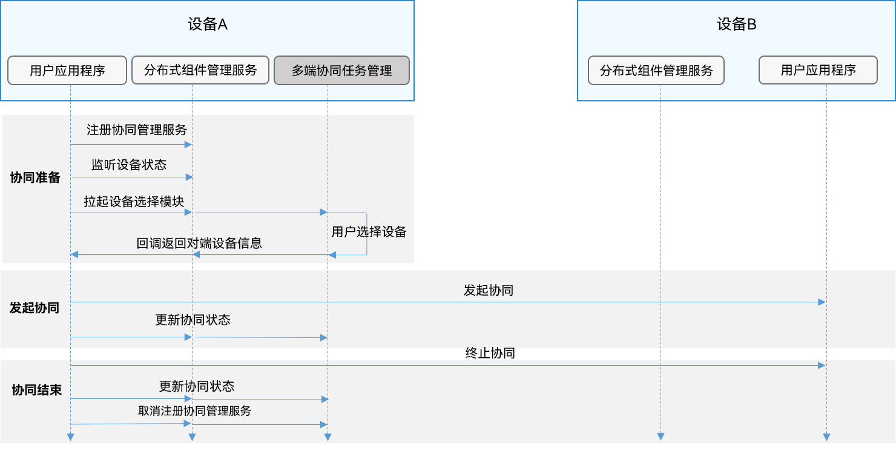

# 多端协同


## 功能描述

多端协同主要包括如下场景：

- [通过跨设备启动UIAbility和ServiceExtensionAbility组件实现多端协同（无返回数据）](#通过跨设备启动uiability和serviceextensionability组件实现多端协同无返回数据)

- [通过跨设备启动UIAbility组件实现多端协同（获取返回数据）](#通过跨设备启动uiability组件实现多端协同获取返回数据)

- [通过跨设备连接ServiceExtensionAbility组件实现多端协同](#通过跨设备连接serviceextensionability组件实现多端协同)

- [通过跨设备Call调用实现多端协同](#通过跨设备call调用实现多端协同)


## 多端协同流程

多端协同流程如下图所示。

  **图1** 多端协同流程图  



## 约束限制

- 由于“多端协同任务管理”能力尚未具备，开发者当前只能通过开发系统应用获取设备列表，不支持三方应用接入。

- 多端协同需遵循[分布式跨设备组件启动规则](component-startup-rules.md#分布式跨设备组件启动规则)。

- 为了获得最佳体验，使用[want](../reference/apis-ability-kit/js-apis-app-ability-want.md)传输的数据建议在100KB以下。


## 通过跨设备启动UIAbility和ServiceExtensionAbility组件实现多端协同（无返回数据）

在设备A上通过发起端应用提供的启动按钮，启动设备B上指定的[UIAbility](../reference/apis-ability-kit/js-apis-app-ability-uiAbility.md)与[ServiceExtensionAbility](../reference/apis-ability-kit/js-apis-app-ability-serviceExtensionAbility-sys.md)。


### 接口说明

  **表1** 跨设备启动API接口功能介绍

| **接口名** | **描述** |
| -------- | -------- |
| startAbility(want:&nbsp;Want,&nbsp;callback:&nbsp;AsyncCallback&lt;void&gt;):&nbsp;void; | 启动UIAbility和ServiceExtensionAbility（callback形式）。 |
| stopServiceExtensionAbility(want:&nbsp;Want,&nbsp;callback:&nbsp;AsyncCallback&lt;void&gt;):&nbsp;void; | 退出启动的ServiceExtensionAbility（callback形式）。 |
| stopServiceExtensionAbility(want:&nbsp;Want):&nbsp;Promise&lt;void&gt;; | 退出启动的ServiceExtensionAbility（Promise形式）。 |


### 开发步骤

1. 需要申请`ohos.permission.DISTRIBUTED_DATASYNC`权限，配置方式请参见[声明权限](../security/AccessToken/declare-permissions.md)。

2. 同时需要在应用首次启动时弹窗向用户申请授权，使用方式请参见[向用户申请授权](../security/AccessToken/request-user-authorization.md)。

3. 获取目标设备的设备ID。

    ```ts
    import { distributedDeviceManager } from '@kit.DistributedServiceKit';
    import { hilog } from '@kit.PerformanceAnalysisKit';

    const TAG: string = '[Page_CollaborateAbility]';
    const DOMAIN_NUMBER: number = 0xFF00;

    let dmClass: distributedDeviceManager.DeviceManager;

    function initDmClass(): void {
      // 其中createDeviceManager接口为系统API
      try {
        dmClass = distributedDeviceManager.createDeviceManager('com.samples.stagemodelabilitydevelop');
        hilog.info(DOMAIN_NUMBER, TAG, JSON.stringify(dmClass) ?? '');
      } catch (err) {
        hilog.error(DOMAIN_NUMBER, TAG, 'createDeviceManager err: ' + JSON.stringify(err));
      }
    }

    function getRemoteDeviceId(): string | undefined {
      if (typeof dmClass === 'object' && dmClass !== null) {
        let list = dmClass.getAvailableDeviceListSync();
        hilog.info(DOMAIN_NUMBER, TAG, JSON.stringify(dmClass), JSON.stringify(list));
        if (typeof (list) === 'undefined' || typeof (list.length) === 'undefined') {
          hilog.info(DOMAIN_NUMBER, TAG, 'getRemoteDeviceId err: list is null');
          return;
        }
        if (list.length === 0) {
          hilog.info(DOMAIN_NUMBER, TAG, `getRemoteDeviceId err: list is empty`);
          return;
        }
        return list[0].networkId;
      } else {
        hilog.info(DOMAIN_NUMBER, TAG, 'getRemoteDeviceId err: dmClass is null');
        return;
      }
    }
    ```

4. 设置目标组件参数，调用[startAbility()](../reference/apis-ability-kit/js-apis-inner-application-uiAbilityContext.md#uiabilitycontextstartability)接口，启动[UIAbility](../reference/apis-ability-kit/js-apis-app-ability-uiAbility.md)或[ServiceExtensionAbility](../reference/apis-ability-kit/js-apis-app-ability-serviceExtensionAbility-sys.md)。

    ```ts
    import { BusinessError } from '@kit.BasicServicesKit';
    import { hilog } from '@kit.PerformanceAnalysisKit';
    import { Want, common } from '@kit.AbilityKit';
    import { distributedDeviceManager } from '@kit.DistributedServiceKit';
    import { promptAction } from '@kit.ArkUI';

    const TAG: string = '[Page_CollaborateAbility]';
    const DOMAIN_NUMBER: number = 0xFF00;
    let dmClass: distributedDeviceManager.DeviceManager;

    function getRemoteDeviceId(): string | undefined {
      if (typeof dmClass === 'object' && dmClass !== null) {
        let list = dmClass.getAvailableDeviceListSync();
        hilog.info(DOMAIN_NUMBER, TAG, JSON.stringify(dmClass), JSON.stringify(list));
        if (typeof (list) === 'undefined' || typeof (list.length) === 'undefined') {
          hilog.info(DOMAIN_NUMBER, TAG, 'getRemoteDeviceId err: list is null');
          return;
        }
        if (list.length === 0) {
          hilog.info(DOMAIN_NUMBER, TAG, `getRemoteDeviceId err: list is empty`);
          return;
        }
        return list[0].networkId;
      } else {
        hilog.info(DOMAIN_NUMBER, TAG, 'getRemoteDeviceId err: dmClass is null');
        return;
      }
    };

    @Entry
    @Component
    struct Page_CollaborateAbility {
      private context = getContext(this) as common.UIAbilityContext;

      build() {
        Column() {
          //...
          List({ initialIndex: 0 }) {
            //...
            ListItem() {
              Row() {
                //...
              }
              .onClick(() => {
                let want: Want = {
                  deviceId: getRemoteDeviceId(),
                  bundleName: 'com.samples.stagemodelabilityinteraction',
                  abilityName: 'CollaborateAbility',
                  moduleName: 'entry' // moduleName非必选
                };
                // context为发起端UIAbility的AbilityContext
                this.context.startAbility(want).then(() => {
                  promptAction.showToast({
                    message: 'SuccessfulCollaboration'
                  });
                }).catch((err: BusinessError) => {
                  hilog.error(DOMAIN_NUMBER, TAG, `startAbility err: ` + JSON.stringify(err));
                });
              })
            }
            //...
          }
          //...
        }
        //...
      }
    }
    ```

5. 当设备A发起端应用不需要设备B上的[ServiceExtensionAbility](../reference/apis-ability-kit/js-apis-app-ability-serviceExtensionAbility-sys.md)时，可调用[stopServiceExtensionAbility](../reference/apis-ability-kit/js-apis-inner-application-uiAbilityContext-sys.md#uiabilitycontextstopserviceextensionability-1)接口退出。（该接口不支持[UIAbility](../reference/apis-ability-kit/js-apis-app-ability-uiAbility.md)的退出，UIAbility由用户手动通过任务管理退出）

    ```ts
    import { BusinessError } from '@kit.BasicServicesKit';
    import { hilog } from '@kit.PerformanceAnalysisKit';
    import { Want, common } from '@kit.AbilityKit';
    import { distributedDeviceManager } from '@kit.DistributedServiceKit';

    const TAG: string = '[Page_CollaborateAbility]';
    const DOMAIN_NUMBER: number = 0xFF00;
    let dmClass: distributedDeviceManager.DeviceManager;

    function getRemoteDeviceId(): string | undefined {
      if (typeof dmClass === 'object' && dmClass !== null) {
        let list = dmClass.getAvailableDeviceListSync();
        hilog.info(DOMAIN_NUMBER, TAG, JSON.stringify(dmClass), JSON.stringify(list));
        if (typeof (list) === 'undefined' || typeof (list.length) === 'undefined') {
          hilog.info(DOMAIN_NUMBER, TAG, 'getRemoteDeviceId err: list is null');
          return;
        }
        if (list.length === 0) {
          hilog.info(DOMAIN_NUMBER, TAG, `getRemoteDeviceId err: list is empty`);
          return;
        }
        return list[0].networkId;
      } else {
        hilog.info(DOMAIN_NUMBER, TAG, 'getRemoteDeviceId err: dmClass is null');
        return;
      }
    };

    @Entry
    @Component
    struct Page_CollaborateAbility {
      private context = getContext(this) as common.UIAbilityContext;

      build() {
        // ...
        Button('stopServiceExtensionAbility')
          .onClick(() => {
            let want: Want = {
              deviceId: getRemoteDeviceId(),
              bundleName: 'com.example.myapplication',
              abilityName: 'FuncAbility',
              moduleName: 'module1', // moduleName非必选
            }
            // 退出由startAbility接口启动的ServiceExtensionAbility
            this.context.stopServiceExtensionAbility(want).then(() => {
              hilog.info(DOMAIN_NUMBER, TAG, "stop service extension ability success")
            }).catch((err: BusinessError) => {
              hilog.error(DOMAIN_NUMBER, TAG, `stop service extension ability err is ` + JSON.stringify(err));
            })
          })
      }
    }
    ```

## 通过跨设备启动UIAbility组件实现多端协同（获取返回数据）

在设备A上通过应用提供的启动按钮，启动设备B上指定的[UIAbility](../reference/apis-ability-kit/js-apis-app-ability-uiAbility.md)，当设备B上的UIAbility退出后，会将返回值发回设备A上的发起端应用。


### 接口说明

  **表2** 跨设备启动，返回结果数据API接口功能描述

| 接口名 | 描述 |
| -------- | -------- |
| startAbilityForResult(want:&nbsp;Want,&nbsp;callback:&nbsp;AsyncCallback&lt;AbilityResult&gt;):&nbsp;void; | 启动UIAbility并在该Ability退出的时候返回执行结果（callback形式）。 |
| terminateSelfWithResult(parameter:&nbsp;AbilityResult,&nbsp;callback:&nbsp;AsyncCallback&lt;void&gt;):&nbsp;void; | 停止UIAbility，配合startAbilityForResult使用，返回给接口调用方AbilityResult信息（callback形式）。 |
| terminateSelfWithResult(parameter:&nbsp;AbilityResult):&nbsp;Promise&lt;void&gt;; | 停止UIAbility，配合startAbilityForResult使用，返回给接口调用方AbilityResult信息（promise形式）。 |


### 开发步骤

1. 需要申请`ohos.permission.DISTRIBUTED_DATASYNC`权限，配置方式请参见[声明权限](../security/AccessToken/declare-permissions.md)。

2. 同时需要在应用首次启动时弹窗向用户申请授权，使用方式请参见[向用户申请授权](../security/AccessToken/request-user-authorization.md)。

3. 在发起端设置目标组件参数，调用[startAbilityForResult()](../reference/apis-ability-kit/js-apis-inner-application-uiAbilityContext.md#uiabilitycontextstartabilityforresult)接口启动目标端UIAbility，异步回调中的data用于接收目标端UIAbility停止自身后返回给调用方UIAbility的信息。getRemoteDeviceId方法参照[通过跨设备启动uiability和serviceextensionability组件实现多端协同无返回数据](#通过跨设备启动uiability和serviceextensionability组件实现多端协同无返回数据)。

    ```ts
    import { BusinessError } from '@kit.BasicServicesKit';
    import { hilog } from '@kit.PerformanceAnalysisKit';
    import { Want, common } from '@kit.AbilityKit';
    import { distributedDeviceManager } from '@kit.DistributedServiceKit';
    import { promptAction } from '@kit.ArkUI';

    const DOMAIN_NUMBER: number = 0xFF00;
    const TAG: string = '[Page_CollaborateAbility]';
    let dmClass: distributedDeviceManager.DeviceManager;

    function getRemoteDeviceId(): string | undefined {
      if (typeof dmClass === 'object' && dmClass !== null) {
        let list = dmClass.getAvailableDeviceListSync();
        hilog.info(DOMAIN_NUMBER, TAG, JSON.stringify(dmClass), JSON.stringify(list));
        if (typeof (list) === 'undefined' || typeof (list.length) === 'undefined') {
          hilog.info(DOMAIN_NUMBER, TAG, 'getRemoteDeviceId err: list is null');
          return;
        }
        if (list.length === 0) {
          hilog.info(DOMAIN_NUMBER, TAG, `getRemoteDeviceId err: list is empty`);
          return;
        }
        return list[0].networkId;
      } else {
        hilog.info(DOMAIN_NUMBER, TAG, 'getRemoteDeviceId err: dmClass is null');
        return;
      }
    };

    @Entry
    @Component
    struct Page_CollaborateAbility {
      private context = getContext(this) as common.UIAbilityContext;

      build() {
        Column() {
          //...
          List({ initialIndex: 0 }) {
            //...
            ListItem() {
              Row() {
                //...
              }
              .onClick(() => {
                let want: Want = {
                  deviceId: getRemoteDeviceId(),
                  bundleName: 'com.samples.stagemodelabilityinteraction',
                  abilityName: 'ServiceExtAbility',
                  moduleName: 'entry' // moduleName非必选
                };
                // 退出由startAbility接口启动的ServiceExtensionAbility
                this.context.stopServiceExtensionAbility(want).then(() => {
                  hilog.info(DOMAIN_NUMBER, TAG, 'stop service extension ability success')
                  promptAction.showToast({
                    message: 'SuccessfullyStop'
                  });
                }).catch((err: BusinessError) => {
                  hilog.error(DOMAIN_NUMBER, TAG, `stop service extension ability err is ` + JSON.stringify(err));
                });
              })
            }
            //...
          }
          //...
        }
        //...
      }
    }
    ```

4. 在目标端[UIAbility](../reference/apis-ability-kit/js-apis-app-ability-uiAbility.md)任务完成后，调用[terminateSelfWithResult()](../reference/apis-ability-kit/js-apis-inner-application-uiAbilityContext.md#uiabilitycontextterminateselfwithresult)方法，将数据返回给发起端的UIAbility。

    ```ts
    import { common } from '@kit.AbilityKit';
    import { hilog } from '@kit.PerformanceAnalysisKit';
    import { BusinessError } from '@kit.BasicServicesKit';

    const TAG: string = '[Page_CollaborateAbility]';
    const DOMAIN_NUMBER: number = 0xFF00;

    @Entry
    @Component
    struct Page_CollaborateAbility {
      private context = getContext(this) as common.UIAbilityContext;

      build() {
        Column() {
          //...
          List({ initialIndex: 0 }) {
            //...
            ListItem() {
              Row() {
                //...
              }
              .onClick(() => {
                const RESULT_CODE: number = 1001;
                // context为目标端UIAbility的AbilityContext
                this.context.terminateSelfWithResult(
                  {
                    resultCode: RESULT_CODE,
                    want: {
                      bundleName: 'ohos.samples.stagemodelabilitydevelop',
                      abilityName: 'CollaborateAbility',
                      moduleName: 'entry',
                      parameters: {
                        info: '来自Page_CollaborateAbility页面'
                      }
                    }
                  },
                  (err: BusinessError) => {
                    hilog.info(DOMAIN_NUMBER, TAG, `terminateSelfWithResult err: ` + JSON.stringify(err));
                  });
              })
            }
            //...
          }
          //...
        }
        //...
      }
    }
    ```

5. 发起端[UIAbility](../reference/apis-ability-kit/js-apis-app-ability-uiAbility.md)接收到目标端UIAbility返回的信息，对其进行处理。

    ```ts
    import { BusinessError } from '@kit.BasicServicesKit';
    import { hilog } from '@kit.PerformanceAnalysisKit';
    import { Want, common } from '@kit.AbilityKit';
    import { distributedDeviceManager } from '@kit.DistributedServiceKit';
    import { promptAction } from '@kit.ArkUI';

    const TAG: string = '[Page_CollaborateAbility]';
    const DOMAIN_NUMBER: number = 0xFF00;
    let dmClass: distributedDeviceManager.DeviceManager;

    function getRemoteDeviceId(): string | undefined {
      if (typeof dmClass === 'object' && dmClass !== null) {
        let list = dmClass.getAvailableDeviceListSync();
        hilog.info(DOMAIN_NUMBER, TAG, JSON.stringify(dmClass), JSON.stringify(list));
        if (typeof (list) === 'undefined' || typeof (list.length) === 'undefined') {
          hilog.info(DOMAIN_NUMBER, TAG, 'getRemoteDeviceId err: list is null');
          return;
        }
        if (list.length === 0) {
          hilog.info(DOMAIN_NUMBER, TAG, `getRemoteDeviceId err: list is empty`);
          return;
        }
        return list[0].networkId;
      } else {
        hilog.info(DOMAIN_NUMBER, TAG, 'getRemoteDeviceId err: dmClass is null');
        return;
      }
    };

    @Entry
    @Component
    struct Page_CollaborateAbility {
      private context = getContext(this) as common.UIAbilityContext;

      build() {
        Column() {
          //...
          List({ initialIndex: 0 }) {
            //...
            ListItem() {
              Row() {
                //...
              }
              .onClick(() => {
                let want: Want = {
                  deviceId: getRemoteDeviceId(),
                  bundleName: 'com.samples.stagemodelabilityinteraction',
                  abilityName: 'CollaborateAbility',
                  moduleName: 'entry' // moduleName非必选
                };
                const RESULT_CODE: number = 1001;
                // context为调用方UIAbility的UIAbilityContext
                this.context.startAbilityForResult(want).then((data) => {
                  if (data?.resultCode === RESULT_CODE) {
                    // 解析目标端UIAbility返回的信息
                    let info = data.want?.parameters?.info;
                    hilog.info(DOMAIN_NUMBER, TAG, JSON.stringify(info) ?? '');
                    if (info !== null) {
                      promptAction.showToast({
                        message: JSON.stringify(info)
                      });
                    }
                  }
                }).catch((error: BusinessError) => {
                  hilog.error(DOMAIN_NUMBER, TAG, `startAbilityForResult err: ` + JSON.stringify(error));
                });
              })
            }
            //...
          }
          //...
        }
        //...
      }
    }
    ```


## 通过跨设备连接ServiceExtensionAbility组件实现多端协同

系统应用可以通过[connectServiceExtensionAbility()](../reference/apis-ability-kit/js-apis-inner-application-uiAbilityContext.md#uiabilitycontextconnectserviceextensionability)跨设备连接一个服务，实现跨设备远程调用。比如：分布式游戏场景，平板作为遥控器，智慧屏作为显示器。


### 接口说明

  **表3** 跨设备连接API接口功能介绍

| 接口名 | 描述 |
| -------- | -------- |
| connectServiceExtensionAbility(want:&nbsp;Want,&nbsp;options:&nbsp;ConnectOptions):&nbsp;number; | 连接ServiceExtensionAbility。 |
| disconnectServiceExtensionAbility(connection:&nbsp;number,&nbsp;callback:AsyncCallback&lt;void&gt;):&nbsp;void; | 断开连接（callback形式）。 |
| disconnectServiceExtensionAbility(connection:&nbsp;number):&nbsp;Promise&lt;void&gt;; | 断开连接（promise形式）。 |


### 开发步骤

1. 需要申请`ohos.permission.DISTRIBUTED_DATASYNC`权限，配置方式请参见[声明权限](../security/AccessToken/declare-permissions.md)。

2. 同时需要在应用首次启动时弹窗向用户申请授权，使用方式请参见[向用户申请授权](../security/AccessToken/request-user-authorization.md)。

3. 如果已有后台服务，请直接进入下一步；如果没有，则[实现一个后台服务（仅对系统应用开放）](serviceextensionability.md#实现一个后台服务仅对系统应用开放)。

4. 连接一个后台服务。
   - 实现IAbilityConnection接口。IAbilityConnection提供了以下方法供开发者实现：[onConnect()](../reference/apis-ability-kit/js-apis-inner-ability-connectOptions.md#onconnect)是用来处理连接Service成功的回调，[onDisconnect()](../reference/apis-ability-kit/js-apis-inner-ability-connectOptions.md#ondisconnect)是用来处理Service异常终止的回调，[onFailed()](../reference/apis-ability-kit/js-apis-inner-ability-connectOptions.md#onfailed)是用来处理连接Service失败的回调。
   - 设置目标组件参数，包括目标设备ID、Bundle名称、Ability名称。
   - 调用connectServiceExtensionAbility()发起连接。
   - 连接成功，收到目标设备返回的服务句柄。
   - 进行跨设备调用，获得目标端服务返回的结果。
     
    ```ts
    import { BusinessError } from '@kit.BasicServicesKit';
    import { hilog } from '@kit.PerformanceAnalysisKit';
    import { Want, common } from '@kit.AbilityKit';
    import { distributedDeviceManager } from '@kit.DistributedServiceKit';
    import { rpc } from '@kit.IPCKit';

    const TAG: string = '[Page_CollaborateAbility]';
    const DOMAIN_NUMBER: number = 0xFF00;
    const REQUEST_CODE = 1;
    let dmClass: distributedDeviceManager.DeviceManager;
    let connectionId: number;
    let options: common.ConnectOptions = {
      onConnect(elementName, remote): void {
        hilog.info(DOMAIN_NUMBER, TAG, 'onConnect callback');
        if (remote === null) {
          hilog.info(DOMAIN_NUMBER, TAG, `onConnect remote is null`);
          return;
        }
        let option = new rpc.MessageOption();
        let data = new rpc.MessageSequence();
        let reply = new rpc.MessageSequence();
        data.writeInt(99); // 开发者可发送data到目标端应用进行相应操作
        // @param code 表示客户端发送的服务请求代码。
        // @param data 表示客户端发送的{@link MessageSequence}对象。
        // @param reply 表示远程服务发送的响应消息对象。
        // @param options 指示操作是同步的还是异步的。
        //
        // @return 如果操作成功返回{@code true}； 否则返回 {@code false}。
        remote.sendMessageRequest(REQUEST_CODE, data, reply, option).then((ret: rpc.RequestResult) => {
          let errCode = reply.readInt(); // 在成功连接的情况下，会收到来自目标端返回的信息（100）
          let msg: number = 0;
          if (errCode === 0) {
            msg = reply.readInt();
          }
          // 成功连接后台服务
          hilog.info(DOMAIN_NUMBER, TAG, `sendRequest msg:${msg}`);
        }).catch((error: BusinessError) => {
          hilog.info(DOMAIN_NUMBER, TAG, `sendRequest failed, ${JSON.stringify(error)}`);
        });
      },
      onDisconnect(elementName): void {
        hilog.info(DOMAIN_NUMBER, TAG, 'onDisconnect callback');
      },
      onFailed(code): void {
        hilog.info(DOMAIN_NUMBER, TAG, 'onFailed callback');
      }
    };

    function getRemoteDeviceId(): string | undefined {
      if (typeof dmClass === 'object' && dmClass !== null) {
        let list = dmClass.getAvailableDeviceListSync();
        hilog.info(DOMAIN_NUMBER, TAG, JSON.stringify(dmClass), JSON.stringify(list));
        if (typeof (list) === 'undefined' || typeof (list.length) === 'undefined') {
          hilog.info(DOMAIN_NUMBER, TAG, 'getRemoteDeviceId err: list is null');
          return;
        }
        if (list.length === 0) {
          hilog.info(DOMAIN_NUMBER, TAG, `getRemoteDeviceId err: list is empty`);
          return;
        }
        return list[0].networkId;
      } else {
        hilog.info(DOMAIN_NUMBER, TAG, 'getRemoteDeviceId err: dmClass is null');
        return;
      }
    }

    @Entry
    @Component
    struct Page_CollaborateAbility {
      private context = getContext(this) as common.UIAbilityContext;

      build() {
        Column() {
          //...
          List({ initialIndex: 0 }) {
            //...
            ListItem() {
              Row() {
                //...
              }
              .onClick(() => {
                let want: Want = {
                  'deviceId': getRemoteDeviceId(),
                  'bundleName': 'com.samples.stagemodelabilityinteraction',
                  'abilityName': 'ServiceExtAbility'
                };
                // 建立连接后返回的Id需要保存下来，在解绑服务时需要作为参数传入
                connectionId = this.context.connectServiceExtensionAbility(want, options);
              })
            }
            //...
          }
          //...
        }
        //...
      }
    }
    ```

    getRemoteDeviceId方法参照[通过跨设备启动uiability和serviceextensionability组件实现多端协同无返回数据](#通过跨设备启动uiability和serviceextensionability组件实现多端协同无返回数据)。

5. 断开连接。调用[disconnectServiceExtensionAbility()](../reference/apis-ability-kit/js-apis-inner-application-uiAbilityContext.md#uiabilitycontextdisconnectserviceextensionability)断开与后台服务的连接。

    ```ts
    import { BusinessError } from '@kit.BasicServicesKit';
    import { hilog } from '@kit.PerformanceAnalysisKit';
    import { common } from '@kit.AbilityKit';
    import { promptAction } from '@kit.ArkUI';

    let connectionId: number;
    const TAG: string = '[Page_CollaborateAbility]';
    const DOMAIN_NUMBER: number = 0xFF00;

    @Entry
    @Component
    struct Page_CollaborateAbility {
      private context = getContext(this) as common.UIAbilityContext;

      build() {
        Column() {
          //...
          List({ initialIndex: 0 }) {
            //...
            ListItem() {
              Row() {
                //...
              }
              .onClick(() => {
                this.context.disconnectServiceExtensionAbility(connectionId).then(() => {
                  hilog.info(DOMAIN_NUMBER, TAG, 'disconnectServiceExtensionAbility success');
                  // 成功断连后台服务
                  promptAction.showToast({
                    message: 'SuccessfullyDisconnectBackendService'
                  })
                }).catch((error: BusinessError) => {
                  hilog.error(DOMAIN_NUMBER, TAG, 'disconnectServiceExtensionAbility failed');
                });
              })
            }
            //...
          }
          //...
        }
        //...
      }
    }
    ```


## 通过跨设备Call调用实现多端协同

跨设备Call调用的基本原理与设备内Call调用相同，请参见[通过Call调用实现UIAbility交互（仅对系统应用开放）](uiability-intra-device-interaction.md#通过call调用实现uiability交互仅对系统应用开放)。

下面介绍跨设备Call调用实现多端协同的方法。


### 接口说明

  **表4** Call API接口功能介绍

| 接口名 | 描述 |
| -------- | -------- |
| startAbilityByCall(want:&nbsp;Want):&nbsp;Promise&lt;Caller&gt;; | 启动指定UIAbility至前台或后台，同时获取其Caller通信接口，调用方可使用Caller与被启动的Ability进行通信。 |
| on(method:&nbsp;string,&nbsp;callback:&nbsp;CalleeCallBack):&nbsp;void | 通用组件Callee注册method对应的callback方法。 |
| off(method:&nbsp;string):&nbsp;void | 通用组件Callee解注册method的callback方法。 |
| call(method:&nbsp;string,&nbsp;data:&nbsp;rpc.Parcelable):&nbsp;Promise&lt;void&gt; | 向通用组件Callee发送约定序列化数据。 |
| callWithResult(method:&nbsp;string,&nbsp;data:&nbsp;rpc.Parcelable):&nbsp;Promise&lt;rpc.MessageSequence&gt; | 向通用组件Callee发送约定序列化数据,&nbsp;并将Callee返回的约定序列化数据带回。 |
| release():&nbsp;void | 释放通用组件的Caller通信接口。 |
| on(type:&nbsp;"release",&nbsp;callback:&nbsp;OnReleaseCallback):&nbsp;void | 注册通用组件通信断开监听通知。 |


### 开发步骤

1. 需要申请`ohos.permission.DISTRIBUTED_DATASYNC`权限，配置方式请参见[声明权限](../security/AccessToken/declare-permissions.md)。

2. 同时需要在应用首次启动时弹窗向用户申请授权，使用方式请参见[向用户申请授权](../security/AccessToken/request-user-authorization.md)。

3. 创建被调用端UIAbility。

     被调用端[UIAbility](../reference/apis-ability-kit/js-apis-app-ability-uiAbility.md)需要实现指定方法的数据接收回调函数、数据的序列化及反序列化方法。在需要接收数据期间，通过[on](../reference/apis-ability-kit/js-apis-app-ability-uiAbility.md#calleeon)接口注册监听，无需接收数据时通过[off](../reference/apis-ability-kit/js-apis-app-ability-uiAbility.md#calleeoff)接口解除监听。

    1. 配置UIAbility的启动模式。
        配置[module.json5](../quick-start/module-configuration-file.md)，将CalleeAbility配置为单实例"singleton"。

        | Json字段 | 字段说明 |
        | -------- | -------- |
        | “launchType” | Ability的启动模式，设置为"singleton"类型。 |

        UIAbility配置标签示例如下：

        ```json
        "abilities":[{
            "name": ".CalleeAbility",
            "srcEntry": "./ets/CalleeAbility/CalleeAbility.ets",
            "launchType": "singleton",
            "description": "$string:CalleeAbility_desc",
            "icon": "$media:icon",
            "label": "$string:CalleeAbility_label",
            "exported": true
        }]
        ```
    2. 导入UIAbility模块。

        ```ts
        import { UIAbility } from '@kit.AbilityKit';
        ```
    3. 定义约定的序列化数据。
        调用端及被调用端发送接收的数据格式需协商一致，如下示例约定数据由number和string组成。

         
        ```ts
        import { rpc } from '@kit.IPCKit';

        class MyParcelable {
          num: number = 0;
          str: string = '';

          constructor(num: number, string: string) {
            this.num = num;
            this.str = string;
          }

          mySequenceable(num: number, string: string): void {
            this.num = num;
            this.str = string;
          }

          marshalling(messageSequence: rpc.MessageSequence): boolean {
            messageSequence.writeInt(this.num);
            messageSequence.writeString(this.str);
            return true;
          };

          unmarshalling(messageSequence: rpc.MessageSequence): boolean {
            this.num = messageSequence.readInt();
            this.str = messageSequence.readString();
            return true;
          };
        }
        ```
    4. 实现[Callee.on](../reference/apis-ability-kit/js-apis-app-ability-uiAbility.md#calleeon)监听及[Callee.off](../reference/apis-ability-kit/js-apis-app-ability-uiAbility.md#calleeoff)解除监听。
          如下示例在Ability的[onCreate](../reference/apis-ability-kit/js-apis-app-ability-uiAbility.md#uiabilityoncreate)注册MSG_SEND_METHOD监听，在[onDestroy](../reference/apis-ability-kit/js-apis-app-ability-uiAbility.md#uiabilityondestroy)取消监听，收到序列化数据后作相应处理并返回。应用开发者根据实际业务需要做相应处理。
           
        ```ts
        import { AbilityConstant, UIAbility, Want, Caller } from '@kit.AbilityKit';
        import { hilog } from '@kit.PerformanceAnalysisKit';
        import { rpc } from '@kit.IPCKit';


        const TAG: string = '[CalleeAbility]';
        const MSG_SEND_METHOD: string = 'CallSendMsg';
        const DOMAIN_NUMBER: number = 0xFF00;

        class MyParcelable {
          num: number = 0;
          str: string = '';

          constructor(num: number, string: string) {
            this.num = num;
            this.str = string;
          };

          mySequenceable(num: number, string: string): void {
            this.num = num;
            this.str = string;
          };

          marshalling(messageSequence: rpc.MessageSequence): boolean {
            messageSequence.writeInt(this.num);
            messageSequence.writeString(this.str);
            return true;
          };

          unmarshalling(messageSequence: rpc.MessageSequence): boolean {
            this.num = messageSequence.readInt();
            this.str = messageSequence.readString();
            return true;
          };
        }

        function sendMsgCallback(data: rpc.MessageSequence): rpc.Parcelable {
          hilog.info(DOMAIN_NUMBER, TAG, '%{public}s', 'CalleeSortFunc called');

          // 获取Caller发送的序列化数据
          let receivedData: MyParcelable = new MyParcelable(0, '');
          data.readParcelable(receivedData);
          hilog.info(DOMAIN_NUMBER, TAG, '%{public}s', `receiveData[${receivedData.num}, ${receivedData.str}]`);
          let num: number = receivedData.num;

          // 作相应处理
          // 返回序列化数据result给Caller
          return new MyParcelable(num + 1, `send ${receivedData.str} succeed`) as rpc.Parcelable;
        };

        export default class CalleeAbility extends UIAbility {
          caller: Caller | undefined;

          onCreate(want: Want, launchParam: AbilityConstant.LaunchParam): void {
            try {
              this.callee.on(MSG_SEND_METHOD, sendMsgCallback);
            } catch (error) {
              hilog.error(DOMAIN_NUMBER, TAG, '%{public}s', `Failed to register. Error is ${error}`);
            }
          }

          //...
          releaseCall(): void {
            try {
              if (this.caller) {
                this.caller.release();
                this.caller = undefined;
              }
              hilog.info(DOMAIN_NUMBER, TAG, 'caller release succeed');
            } catch (error) {
              hilog.info(DOMAIN_NUMBER, TAG, `caller release failed with ${error}`);
            }
          }

          //...
          onDestroy(): void {
            try {
              this.callee.off(MSG_SEND_METHOD);
              hilog.info(DOMAIN_NUMBER, TAG, '%{public}s', 'Callee OnDestroy');
              this.releaseCall();
            } catch (error) {
              hilog.error(DOMAIN_NUMBER, TAG, '%{public}s', `Failed to register. Error is ${error}`);
            }
          }
        }
        ```
     
4. 获取Caller接口，访问被调用端UIAbility。
    1. 导入[UIAbility](../reference/apis-ability-kit/js-apis-app-ability-uiAbility.md)模块。
      
        ```ts
        import { UIAbility } from '@kit.AbilityKit';
        ```
    2. 获取Caller通信接口。
        Ability的context属性实现了[startAbilityByCall](../reference/apis-ability-kit/js-apis-inner-application-uiAbilityContext.md#uiabilitycontextstartabilitybycall)方法，用于获取指定通用组件的[Caller](../reference/apis-ability-kit/js-apis-app-ability-uiAbility.md#caller)通信接口。如下示例通过this.context获取Ability实例的context属性，使用startAbilityByCall拉起[Callee](../reference/apis-ability-kit/js-apis-app-ability-uiAbility.md#callee)被调用端并获取Caller通信接口，注册Caller的[onRelease](../reference/apis-ability-kit/js-apis-app-ability-uiAbility.md#calleronrelease)和[onRemoteStateChange](../reference/apis-ability-kit/js-apis-app-ability-uiAbility.md#calleronremotestatechange10)监听。应用开发者根据实际业务需要做相应处理。

        ```ts
        import { BusinessError } from '@kit.BasicServicesKit';
        import { Caller, common } from '@kit.AbilityKit';
        import { hilog } from '@kit.PerformanceAnalysisKit';
        import { distributedDeviceManager } from '@kit.DistributedServiceKit';
        import { promptAction } from '@kit.ArkUI';


        const TAG: string = '[Page_CollaborateAbility]';
        const DOMAIN_NUMBER: number = 0xFF00;
        let caller: Caller | undefined;
        let dmClass: distributedDeviceManager.DeviceManager;

        function getRemoteDeviceId(): string | undefined {
          if (typeof dmClass === 'object' && dmClass !== null) {
            let list = dmClass.getAvailableDeviceListSync();
            hilog.info(DOMAIN_NUMBER, TAG, JSON.stringify(dmClass), JSON.stringify(list));
            if (typeof (list) === 'undefined' || typeof (list.length) === 'undefined') {
              hilog.info(DOMAIN_NUMBER, TAG, 'getRemoteDeviceId err: list is null');
              return;
            }
            if (list.length === 0) {
              hilog.info(DOMAIN_NUMBER, TAG, `getRemoteDeviceId err: list is empty`);
              return;
            }
            return list[0].networkId;
          } else {
            hilog.info(DOMAIN_NUMBER, TAG, 'getRemoteDeviceId err: dmClass is null');
            return;
          }
        };

        @Entry
        @Component
        struct Page_CollaborateAbility {
          private context = getContext(this) as common.UIAbilityContext;

          build() {
            Column() {
              //...
              List({ initialIndex: 0 }) {
                //...
                ListItem() {
                  Row() {
                    //...
                  }
                  .onClick(() => {
                    let caller: Caller | undefined;
                    let context = this.context;

                    context.startAbilityByCall({
                      deviceId: getRemoteDeviceId(),
                      bundleName: 'com.samples.stagemodelabilityinteraction',
                      abilityName: 'CalleeAbility'
                    }).then((data) => {
                      if (data !== null) {
                        caller = data;
                        hilog.info(DOMAIN_NUMBER, TAG, 'get remote caller success');
                        // 注册caller的release监听
                        caller.onRelease((msg) => {
                          hilog.info(DOMAIN_NUMBER, TAG, `remote caller onRelease is called ${msg}`);
                        });
                        hilog.info(DOMAIN_NUMBER, TAG, 'remote caller register OnRelease succeed');
                        promptAction.showToast({
                          message: 'CallerSuccess'
                        });
                        // 注册caller的协同场景下跨设备组件状态变化监听通知
                        try {
                          caller.onRemoteStateChange((str) => {
                            hilog.info(DOMAIN_NUMBER, TAG, 'Remote state changed ' + str);
                          });
                        } catch (error) {
                          hilog.info(DOMAIN_NUMBER, TAG, `Caller.onRemoteStateChange catch error, error.code: ${JSON.stringify(error.code)}, error.message: ${JSON.stringify(error.message)}`);
                        }
                      }
                    }).catch((error: BusinessError) => {
                      hilog.error(DOMAIN_NUMBER, TAG, `get remote caller failed with ${error}`);
                    });
                  })
                }
                //...
              }
              //...
            }
            //...
          }
        }
        ```
       
        getRemoteDeviceId方法参照[通过跨设备启动uiability和serviceextensionability组件实现多端协同无返回数据](#通过跨设备启动uiability和serviceextensionability组件实现多端协同无返回数据)。
   
5. 向被调用端UIAbility发送约定序列化数据。
    1. 向被调用端发送Parcelable数据有两种方式，一种是不带返回值，一种是获取被调用端返回的数据，method以及序列化数据需要与被调用端协商一致。如下示例调用[Call](../reference/apis-ability-kit/js-apis-app-ability-uiAbility.md#callercall)接口，向[Callee](../reference/apis-ability-kit/js-apis-app-ability-uiAbility.md#callee)被调用端发送数据。
      
        ```ts
        import { UIAbility, Caller } from '@kit.AbilityKit';
        import { rpc } from '@kit.IPCKit';
        import { hilog } from '@kit.PerformanceAnalysisKit';

        const TAG: string = '[CalleeAbility]';
        const DOMAIN_NUMBER: number = 0xFF00;
        const MSG_SEND_METHOD: string = 'CallSendMsg';

        class MyParcelable {
          num: number = 0;
          str: string = '';

          constructor(num: number, string: string) {
            this.num = num;
            this.str = string;
          };

          mySequenceable(num: number, string: string): void {
            this.num = num;
            this.str = string;
          };

          marshalling(messageSequence: rpc.MessageSequence): boolean {
            messageSequence.writeInt(this.num);
            messageSequence.writeString(this.str);
            return true;
          };

          unmarshalling(messageSequence: rpc.MessageSequence): boolean {
            this.num = messageSequence.readInt();
            this.str = messageSequence.readString();
            return true;
          };
        }

        export default class EntryAbility extends UIAbility {
          // ...
          caller: Caller | undefined;

          async onButtonCall(): Promise<void> {
            try {
              let msg: MyParcelable = new MyParcelable(1, 'origin_Msg');
              if (this.caller) {
                await this.caller.call(MSG_SEND_METHOD, msg);
              }
            } catch (error) {
              hilog.info(DOMAIN_NUMBER, TAG, `caller call failed with ${error}`);
            }
          }
          // ...
        }
        ```
    2. 如下示例调用[CallWithResult](../reference/apis-ability-kit/js-apis-app-ability-uiAbility.md#callercallwithresult)接口，向Callee被调用端发送待处理的数据originMsg，并将’CallSendMsg’方法处理完毕的数据赋值给backMsg。
      
        ```ts
        import { UIAbility, Caller } from '@kit.AbilityKit';
        import { rpc } from '@kit.IPCKit';
        import { hilog } from '@kit.PerformanceAnalysisKit';

        const TAG: string = '[CalleeAbility]';
        const DOMAIN_NUMBER: number = 0xFF00;

        const MSG_SEND_METHOD: string = 'CallSendMsg';
        let originMsg: string = '';
        let backMsg: string = '';

        class MyParcelable {
          num: number = 0;
          str: string = '';

          constructor(num: number, string: string) {
            this.num = num;
            this.str = string;
          };

          mySequenceable(num: number, string: string): void {
            this.num = num;
            this.str = string;
          };

          marshalling(messageSequence: rpc.MessageSequence): boolean {
            messageSequence.writeInt(this.num);
            messageSequence.writeString(this.str);
            return true;
          };

          unmarshalling(messageSequence: rpc.MessageSequence): boolean {
            this.num = messageSequence.readInt();
            this.str = messageSequence.readString();
            return true;
          };
        }

        export default class EntryAbility extends UIAbility {
          // ...
          caller: Caller | undefined;

          async onButtonCallWithResult(originMsg: string, backMsg: string): Promise<void> {
            try {
              let msg: MyParcelable = new MyParcelable(1, originMsg);
              if (this.caller) {
                const data = await this.caller.callWithResult(MSG_SEND_METHOD, msg);
                hilog.info(DOMAIN_NUMBER, TAG, 'caller callWithResult succeed');
                let result: MyParcelable = new MyParcelable(0, '');
                data.readParcelable(result);
                backMsg = result.str;
                hilog.info(DOMAIN_NUMBER, TAG, `caller result is [${result.num}, ${result.str}]`);
              }
            } catch (error) {
              hilog.info(DOMAIN_NUMBER, TAG, `caller callWithResult failed with ${error}`);
            }
          }
          // ...
        }
        ```
   
6. 释放Caller通信接口。

    [Caller](../reference/apis-ability-kit/js-apis-app-ability-uiAbility.md#caller)不再使用后，应用开发者可以通过[release](../reference/apis-ability-kit/js-apis-app-ability-uiAbility.md#callerrelease)接口释放Caller。

      ```ts
      import { UIAbility, Caller } from '@kit.AbilityKit';
      import { hilog } from '@kit.PerformanceAnalysisKit';

      const TAG: string = '[CalleeAbility]';
      const DOMAIN_NUMBER: number = 0xFF00;

      export default class EntryAbility extends UIAbility {
        caller: Caller | undefined;

        releaseCall(): void {
          try {
            if (this.caller) {
              this.caller.release();
              this.caller = undefined;
            }
            hilog.info(DOMAIN_NUMBER, TAG, 'caller release succeed');
          } catch (error) {
            hilog.info(DOMAIN_NUMBER, TAG, `caller release failed with ${error}`);
          }
        }
      }
      ```
<!--no_check-->