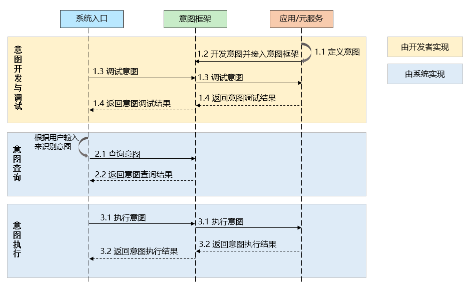

# 意图框架概述
## 场景介绍
开发者可以通过意图框架提供的意图开发功能，将应用功能以“意图”形式集成至系统入口。用户通过系统入口（如语音助手、智能推荐卡片）触发意图执行，即可便捷使用应用提供的功能。

例如，开发者将出行导航功能接入意图框架后，用户可通过自然语言指令（如“骑行导航到公司”）触发系统入口，系统解析指令并调用对应意图，实现出行导航的目的。

<!--RP1-->
<!--RP1End-->

## 基本概念
- 意图：系统功能调用的逻辑单元，通常由应用的核心功能封装而成。系统入口通过解析用户的自然语言输入来触发对应的业务处理流程。
- 意图参数：触发意图执行时，由系统入口传递给应用的数据。参数格式需遵循意图定义。
- 意图执行结果：意图执行完毕后，应用返回给系统入口的数据。
- 意图实体：意图执行过程中涉及的关键信息对象，可以承载意图参数和意图执行结果。

以“出行导航”意图为例，导航需要的参数，例如出行方式、出发地和目的地、途径点等信息均为意图参数，导航结果通过意图执行结果返回，意图参数和意图执行结果可以通过意图实体承载。

## 运行机制
意图框架的运作主要涉及开发者侧与系统入口侧的协作：
- 意图开发：开发者基于应用功能，通过配置文件或装饰器定义意图、意图参数、意图执行结果等。
- 意图调试：开发完成后，开发者利用意图框架提供的调试工具验证意图定义与意图执行的正确性。
- 意图查询：系统入口可以查询注册到意图框架的意图及其定义。
- 意图执行：系统入口根据用户请求匹配到相应意图后，触发该意图的执行，并将必要的参数传递给应用。应用执行对应功能并返回执行结果。

## 意图开发方式
意图框架提供两种开发方式，通过配置文件开发意图以及通过装饰器开发意图，说明如下：

| 意图开发方式 | 说明 | 使用场景 |
| --- | --- | --- |
| [通过配置文件开发意图](./insight-intent-config-development.md) | 开发者通过配置文件定义意图和意图参数，意图参数需要和系统入口协商一致。 | - 适用版本：API version 11及以上版本。 - 开发实现：意图的执行需要和Ability组件绑定，需要新增意图配置文件和意图执行文件。 |
| [通过装饰器开发意图](./insight-intent-decorator-development.md)（推荐） | 开发者通过代码定义意图和意图参数，支持接入标准意图或自定义意图。 | - 适用版本：API version 20及以上版本。 - 开发实现：支持将现有功能直接定义为意图，开发更加便捷。同时，也支持新增意图执行文件。 |
