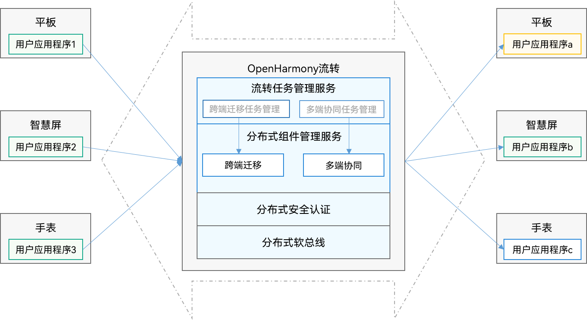

# 流转概述

## 场景介绍

随着全场景多设备的生活方式不断深入，用户拥有的设备越来越多，不同设备都能在适合的场景下提供良好的体验，例如手表可以提供及时的信息查看能力，电视可以带来沉浸的观影体验。但是，每个设备也有使用场景的局限，例如在电视上输入文本相对移动设备来说是非常糟糕的体验。当多个设备通过分布式操作系统能够相互感知、进而整合成一个超级终端时，设备与设备之间就可以取长补短、相互帮助，为用户提供更加自然流畅的分布式体验。

跨多设备的分布式操作可以统称为**流转**；根据使用场景的不同，流转又分为[跨端迁移](hop-cross-device-migration.md)和[多端协同](hop-multi-device-collaboration.md)两种具体场景。

## 基本概念

- **流转**
  
  泛指跨多设备的分布式操作。流转能力打破设备界限，多设备联动，使用户应用程序可分可合、可流转，实现如跨设备编辑邮件、多设备协同健身、多屏游戏等分布式业务。流转为开发者提供更广的使用场景和更新的产品视角，强化产品优势，实现体验升级。流转按照使用场景可分为**跨端迁移**和**多端协同**。
  
- **跨端迁移**

  在用户使用设备的过程中，当使用情境发生变化时（例如从室内走到户外或者周围有更合适的设备等），之前使用的设备可能已经不适合继续当前的任务，此时，用户可以选择新的设备来继续当前的任务，原设备可按需决定是否退出任务，这就是跨端迁移场景。常见的跨端迁移场景实例：在平板上播放的视频，迁移到智慧屏继续播放，从而获得更佳的观看体验；平板上的视频应用退出。在应用开发层面，跨端迁移指在A端运行的UIAbility迁移到B端上，完成迁移后， B端UIAbility继续任务，而A端UIAbility可按需决定是否退出。

- **多端协同**

  用户拥有的多个设备，可以作为一个整体，为用户提供比单设备更加高效、沉浸的体验，这就是多端协同场景。常见的多端协同场景实例：
  
  - 场景一：两台设备A和B打开备忘录同一篇笔记进行双端协同编辑，在设备A上可以使用本地图库中的图片资源插入编辑，设备B上进行文字内容编辑。
  - 场景二：设备A上正在和客户进行聊天，客户需要的资料在设备B上，可以通过聊天软件打开设备B上的文档应用选择到想要的资料回传到设备A上，然后通过聊天软件发送给客户。在应用开发层面，多端协同指多端上的不同UIAbility/ServiceExtensionAbility同时运行、或者交替运行实现完整的业务；或者多端上的相同UIAbility/ServiceExtensionAbility同时运行实现完整的业务。

## 流转架构

借助流转能力，可让用户应用程序更轻松、快捷地完成流转。流转架构有如下优势：

- 支持远程服务调用等能力，可轻松设计业务。

- 支持多个应用同时进行流转。

- 支持不同形态设备，如平板、智慧屏、手表等。

流转架构如下图所示。

  **图1** 流转架构图

   

- 跨端迁移任务管理：在迁移发起端，接受用户迁移的意图，提供迁移流转入口，迁移结果显示等能力。

- 多端协同任务管理：在协同发起端，接受用户应用程序注册，提供协同入口、状态显示、退出流转等管理能力。

- 分布式组件管理服务：提供远程服务启动、远程服务连接、远程迁移等能力，并通过不同能力组合，支撑用户应用程序完成跨端迁移或多端协同的业务体验。

- 分布式安全：提供E2E的加密通道，为用户应用程序提供安全的跨端传输机制，保证“正确的人，通过正确的设备，正确地使用数据”。

- 分布式软总线：使用基于平板、智能穿戴、智慧屏等分布式设备的统一通信基座，为设备之间的互联互通提供统一的分布式通信能力。
