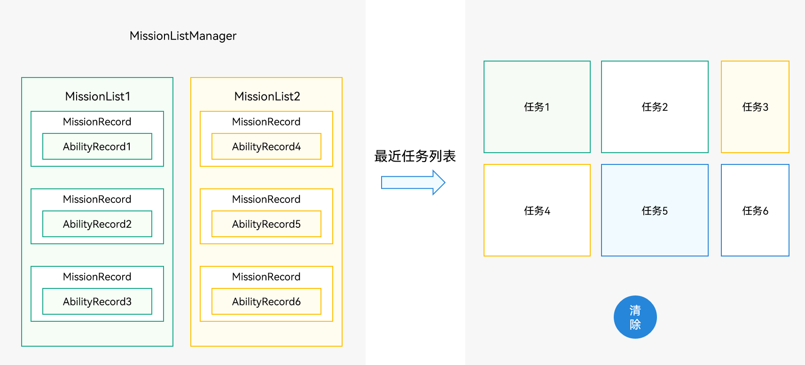

# 任务（Mission）管理场景介绍


任务（Mission）管理相关的基本概念如下：


- AbilityRecord：系统服务侧管理一个UIAbility实例的最小单元，对应一个应用侧的UIAbility组件实例。系统服务侧管理UIAbility实例数量上限为512个。

- MissionRecord：任务管理的最小单元。一个MissionRecord中仅有一个AbilityRecord，即一个UIAbility组件实例对应一个单独的任务。

- MissionList：一个从桌面开始启动的任务列表，记录了任务之间的启动关系，下一个任务由上一个任务启动，最底部的任务由桌面启动，这里称之为任务链。

- MissionListManager：系统任务管理模块，内部维护了当前所有的任务链，与最近任务列表保持一致。
  
  **图1** 任务管理示意图  
  


任务的管理由系统应用（如桌面应用）负责，三方应用无法管理任务。用户通过最近任务列表进行任务的相关交互。当创建任务后，用户可以对最近任务列表进行如下操作：


- 删除一个指定的任务。

- 加锁或解锁一个指定的任务（加锁后的任务在清理所有任务时不会被清理）。

- 清理最近任务列表中的所有任务。

- 将一个指定的任务切换到前台。


一个UIAbility实例对应一个单独的任务，因此应用调用[startAbility()](../reference/apis-ability-kit/js-apis-inner-application-uiAbilityContext.md#uiabilitycontextstartability)方法启动一个UIAbility时，就是创建了一个任务。

1. 桌面应用调用[missionManager](../reference/apis-ability-kit/js-apis-application-missionManager-sys.md)的接口管理任务，需要申请`ohos.permission.MANAGE_MISSIONS`权限，配置方式请参见[申请应用权限](../security/AccessToken/determine-application-mode.md#system_basic等级应用申请权限的方式)。

2. 利用missionManager进行任务管理（监听任务变化、获取任务信息、获取任务快照、清理任务、任务加锁/解锁等）。

    ```ts
    import { missionManager } from '@kit.AbilityKit';
    import { BusinessError } from '@kit.BasicServicesKit';
    import { image } from '@kit.ImageKit';
    import { promptAction } from '@kit.ArkUI';
    import { hilog } from '@kit.PerformanceAnalysisKit';

    const TAG: string = 'TaskManager';
    const DOMAIN_NUMBER: number = 0xFF00;
    ```
    ```ts
    private listenerId: number = 0;
    private missionId: number = 0;
    private listener: missionManager.MissionListener = {
      // 任务创建
      onMissionCreated: (mission: number) => {
        hilog.info(DOMAIN_NUMBER, TAG, '--------onMissionCreated-------');
      },
      // 任务销毁
      onMissionDestroyed: (mission: number) => {
        hilog.info(DOMAIN_NUMBER, TAG, '--------onMissionDestroyed-------');
      },
      // 任务快照变化
      onMissionSnapshotChanged: (mission: number) => {
        hilog.info(DOMAIN_NUMBER, TAG, '--------onMissionMovedToFront-------');
      },
      // 任务被移动到前台
      onMissionMovedToFront: (mission: number) => {
        hilog.info(DOMAIN_NUMBER, TAG, '--------onMissionClosed-------');
      },
      // 任务图标变化
      onMissionIconUpdated: (mission: number, icon: image.PixelMap) => {
        hilog.info(DOMAIN_NUMBER, TAG, '--------onMissionIconUpdated-------');
      },
      // 任务名称变化
      onMissionLabelUpdated: (mission: number) => {
        hilog.info(DOMAIN_NUMBER, TAG, '--------onMissionLabelUpdated-------');
      },
      // 任务实例被关闭
      onMissionClosed: (mission: number) => {
        hilog.info(DOMAIN_NUMBER, TAG, '--------onMissionClosed-------');
      }
    };
    ```
    ```ts
    // 1.注册任务变化通知
    this.listenerId = missionManager.on('mission', this.listener);
    promptAction.showToast({
      message: 'register_success_toast'
    });
    hilog.info(DOMAIN_NUMBER, TAG, `missionManager.on success, listenerId = ${this.listenerId}`);
    ```
    ```ts
    // 2.获取系统最近20个任务
    missionManager.getMissionInfos('', 20, (error: BusinessError, missions: Array<missionManager.MissionInfo>) => {
      if (error.code) {
        hilog.error(DOMAIN_NUMBER, TAG, `getMissionInfos is called, error code: ${error.code}, err msg: ${error.message}.`);
        return;
      }
      hilog.info(DOMAIN_NUMBER, TAG, `size = ${missions.length}.`);
      hilog.info(DOMAIN_NUMBER, TAG, `missions = ${JSON.stringify(missions)}.`);
      
      // 判断系统最近任务中是否包含etsclock
      for (let i = 0;i < missions.length; i++) {
        if (missions[i].want.bundleName === 'ohos.samples.etsclock') {
          promptAction.showToast({
            message: 'obtain_success_toast'
          });
          hilog.info(DOMAIN_NUMBER, TAG, `getMissionInfos.find etsclock, missionId  = ${missions[i].missionId}`);
          this.missionId = missions[i].missionId;
          return;
        }
      }
      promptAction.showToast({
        message: 'obtain_failed_toast'
      });
    });
    ```
    ```ts
    // 3.获取单个任务的详细信息()
    missionManager.getMissionInfo('', this.missionId).then((data: missionManager.MissionInfo) => {
      promptAction.showToast({
        message: JSON.stringify(data.want.bundleName)
      });
      hilog.info(DOMAIN_NUMBER, TAG, `getMissionInfo successfully. Data: ${JSON.stringify(data)}`);
    }).catch((error: BusinessError) => {
      hilog.info(DOMAIN_NUMBER, TAG, `getMissionInfo failed. Cause: ${error.message}`);
    });
    ```
    ```ts
    // 4.获取任务快照
    missionManager.getMissionSnapShot('', this.missionId, (error: BusinessError, snapshot: missionManager.MissionSnapshot) => {
      if (error === null) {
        promptAction.showToast({
          message: 'obtain_snapshot_success_toast'
        });
      }
      hilog.info(DOMAIN_NUMBER, TAG, `getMissionSnapShot is called, error code: ${error.code}, error msg: ${error.message}.`);
      hilog.info(DOMAIN_NUMBER, TAG, `bundleName = ${snapshot.ability.bundleName}.`);
    })
    ```
    ```ts
    // 5.获取低分辨任务快照
    missionManager.getLowResolutionMissionSnapShot('', this.missionId, (error: BusinessError, snapshot: missionManager.MissionSnapshot) => {
      if (error === null) {
        promptAction.showToast({
          message: 'obtain_low_snapshot_success_toast'
        });
      }
      hilog.info(DOMAIN_NUMBER, TAG, `getLowResolutionMissionSnapShot is called, error code: ${error.code}, error msg: ${error.message}.`);
      hilog.info(DOMAIN_NUMBER, TAG, `bundleName = ${snapshot.ability.bundleName}.`);
    })
    ```
    ```ts
    // 6-1 加锁任务
    missionManager.lockMission(this.missionId).then(() => {
      promptAction.showToast({
        message: 'lock_success_toast'
      });
      hilog.info(DOMAIN_NUMBER, TAG, 'lockMission is called ');
    });
    ```
    ```ts
    // 6-2 解锁任务
    missionManager.unlockMission(this.missionId).then(() => {
      promptAction.showToast({
        message: 'unlock_success_toast'
      });
      hilog.info(DOMAIN_NUMBER, TAG, 'unlockMission is called ');
    });
    ```
    ```ts
    // 7.把任务切到前台
    missionManager.moveMissionToFront(this.missionId).then(() => {
      hilog.info(DOMAIN_NUMBER, TAG, 'moveMissionToFront is called ');
    });
    ```
    ```ts
    // 8.删除单个任务
    missionManager.clearMission(this.missionId).then(() => {
      promptAction.showToast({
        message: 'delete_success_toast'
      });
      hilog.info(DOMAIN_NUMBER, TAG, 'clearMission is called ');
    });
    ```
    ```ts
    // 9.删除全部任务
    missionManager.clearAllMissions().catch((err: BusinessError) => {
      hilog.info(DOMAIN_NUMBER, TAG, `${err.code}`);
    });
    ```
    ```ts
    // 10.解注册任务变化通知
    missionManager.off('mission', this.listenerId, (error: BusinessError) => {
      if (error === null) {
        promptAction.showToast({
          message: 'unregister_success_toast'
        });
      }
      hilog.info(DOMAIN_NUMBER, TAG, 'unregisterMissionListener');
    })
    ```

## 相关实例

针对任务管理开发，有以下相关实例可供参考：

- [任务管理（ArkTS）（Full SDK）（API9）](https://gitee.com/openharmony/applications_app_samples/tree/master/code/SystemFeature/ApplicationModels/MissionManager)
