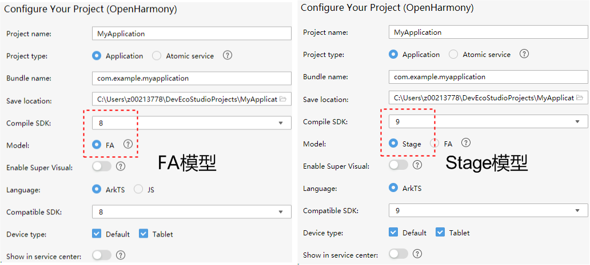
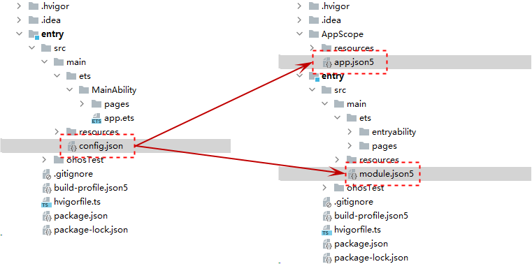
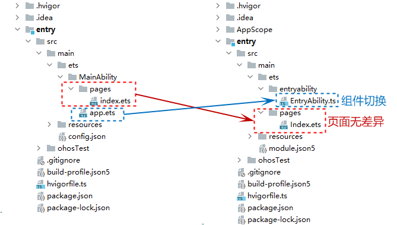
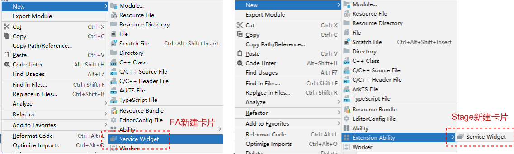
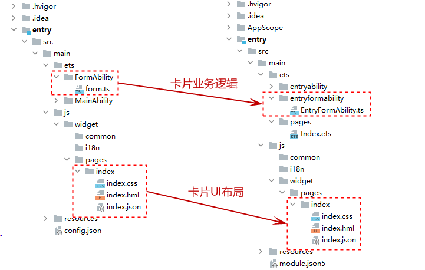

# 模型切换概述

<!--Kit: Ability Kit-->
<!--Subsystem: Ability-->
<!--Owner: @wkljy-->
<!--Designer: @li-weifeng2024-->
<!--Tester: @lixueqing513-->
<!--Adviser: @huipeizi-->

本文介绍如何将一个[FA模型](ability-terminology.md#fa模型)开发的声明式范式应用切换到[Stage模型](ability-terminology.md#stage模型)，您需要完成如下动作：

- 工程切换：新建一个Stage模型的应用工程。

  

- [配置文件切换](configuration-file-diff.md)：config.json切换为app.json5和module.json5。

  

- [组件切换](pageability-switch.md)：PageAbility/ServiceAbility/DataAbility切换为UIAbility和ExtensionAbility（图片仅展示了FA模型的PageAbility切换成Stage模型的UIAbility：下图左侧为FA模型，app.ets为FA模型的PageAbility组件；下图右侧为Stage模型，EntryAbility.ets为Stage模型的UIAbility组件）。

  
  
- [卡片切换](widget-switch.md)：将FA模型的FormAbility切换为Stage模型的FormExtensionAbility（下图中的**Service Widget**在FA中为FormAbility，在Stage中为FormExtensionAbility）。

  

  

- [API切换](api-switch-overview.md)：将FA模型应用中使用到的FAModelOnly接口切换为Stage模型下的推荐接口和写法。

  
