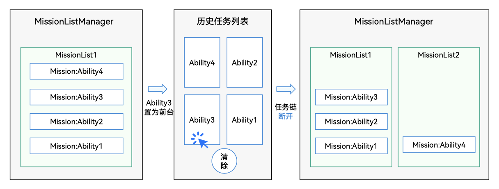
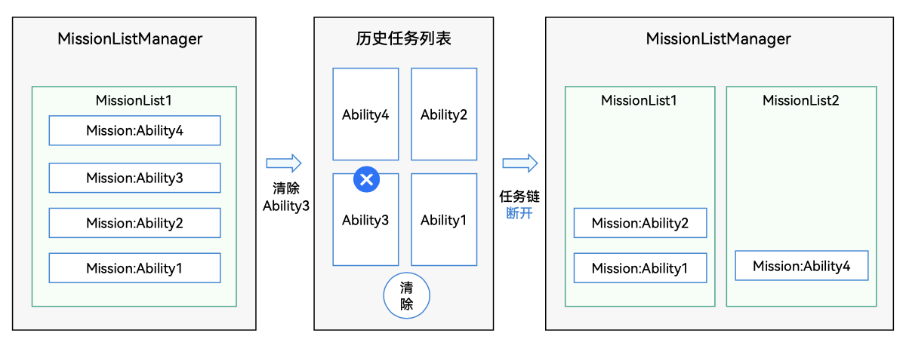
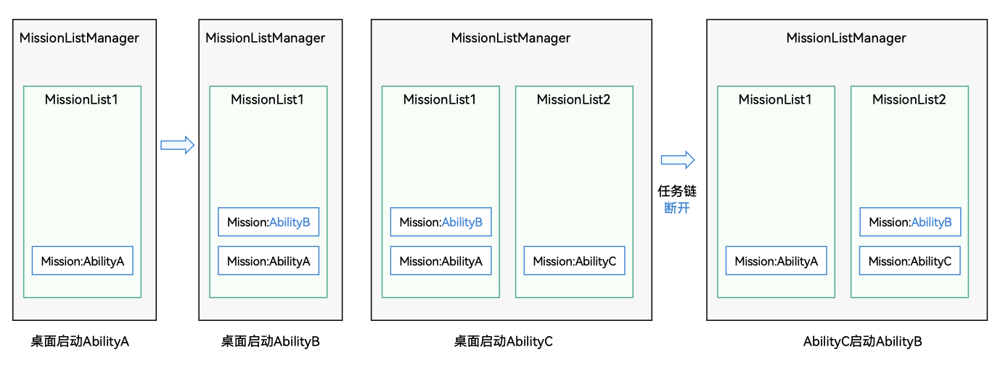

# 页面栈及任务链

<!--Kit: Ability Kit-->
<!--Subsystem: Ability-->
<!--Owner: @littlejerry1-->
<!--Designer: @ccllee1-->
<!--Tester: @lixueqing513-->
<!--Adviser: @huipeizi-->

## 页面栈

单个UIAbility组件可以实现多个页面，并在多个页面之间跳转，这种UIAbility组件内部的页面跳转关系称为“页面栈”，由ArkUI框架统一管理，如下图中的UIAbility1的Page1-&gt;Page2-&gt;Page3和UIAbility2的PageA-&gt;PageB-&gt;PageC。

**图1** 页面栈示意图  

- 页面栈的形成（下面2/3/5/6步骤为页面跳转，由ArkUI管理）
  1. 点击桌面图标（[startAbility](../reference/apis-ability-kit/js-apis-inner-application-uiAbilityContext.md#startability)）启动UIAbility1，UIAbility1的初始页面为Page1。

  2. 点击Page1页面按钮（[Navigator](../reference/apis-arkui/arkui-ts/ts-container-navigator.md)）跳转到Page2页面。

  3. 点击Page2页面按钮（[Navigator](../reference/apis-arkui/arkui-ts/ts-container-navigator.md)）跳转到Page3页面。

  4. 点击Page3页面按钮（[startAbility](../reference/apis-ability-kit/js-apis-inner-application-uiAbilityContext.md#startability)）跳转到UIAbility2，UIAbility2的初始页面为PageA。

  5. 点击PageA页面按钮（[Navigator](../reference/apis-arkui/arkui-ts/ts-container-navigator.md)）跳转到PageB页面。

  6. 点击PageB页面按钮（[Navigator](../reference/apis-arkui/arkui-ts/ts-container-navigator.md)）跳转到PageC页面。

- 页面栈的返回（下面1/2/4/5步骤为页面跳转，由ArkUI管理）
  1. 在UIAbility2的PageC页面点击**返回键**回到UIAbility2的PageB页面。

  2. 在UIAbility2的PageB页面点击**返回键**回到UIAbility2的PageA页面。

  3. 在UIAbility2的PageA页面点击**返回键**跳转到UIAbility1的Page3页面。

  4. 在UIAbility1的Page3页面点击**返回键**回到UIAbility1的Page2页面。

  5. 在UIAbility1的Page2页面点击**返回键**回到UIAbility1的Page1页面。

  6. 在UIAbility1的Page1页面点击**返回键**回到桌面。

## 任务链

上文介绍了页面栈的返回，如果Ability2页面栈一层层通过返回键返回到最底层，再次点击返回键时，会返回到Ability1。因为在MissionList中记录了任务（Mission）之间的启动关系，即如果Ability1通过startAbility启动Ability2，则会形成一个MissionList任务链：Ability1-&gt;Ability2，当Ability2页面栈返回到首页时，再次点击返回键，会返回到Ability1的页面。

MissionList任务链记录了任务之间的拉起关系，但是这个任务链可能会断开，有以下几种情况会导致任务链的断开：

- 进入任务列表，把任务链中间某个任务移动到前台。  
  

- 进入任务列表，把任务链中间某个任务清理掉。  
  

- 单实例UIAbility的任务，被不同的任务（包括Ability或桌面）反复拉起（AbilityB为单例）。  
  
