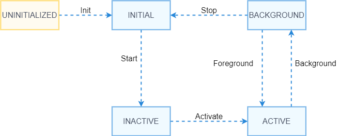
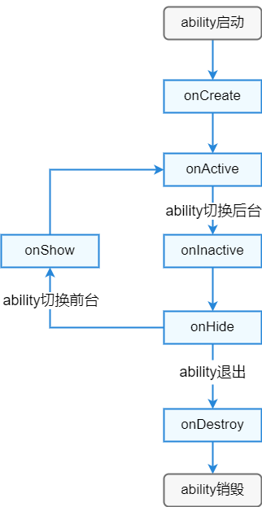

# PageAbility的生命周期

<!--Kit: Ability Kit-->
<!--Subsystem: Ability-->
<!--Owner: @lidongrui-->
<!--Designer: @ccllee1-->
<!--Tester: @liangchengguang-->
<!--Adviser: @HelloCrease-->

## 概述

PageAbility生命周期是PageAbility被调度到INACTIVE、ACTIVE、BACKGROUND等各个状态的统称。PageAbility生命周期流转及状态说明如图1、表1所示。

  **图1** PageAbility生命周期流转




  **表1** PageAbility生命周期状态说明

| 生命周期状态 | 生命周期状态说明 |
| -------- | -------- |
| UNINITIALIZED | 未初始化状态，为临时状态，PageAbility被创建后会由UNINITIALIZED状态进入INITIAL状态。 |
| INITIAL | 初始化状态，也表示停止状态，表示当前PageAbility未运行，PageAbility被启动后由INITIAL状态进入INACTIVE状态。 |
| INACTIVE | 失去焦点状态，表示当前窗口已显示但是无焦点状态。 |
| ACTIVE | 前台激活状态，表示当前窗口已显示，并获取焦点。 |
| BACKGROUND | 后台状态，表示当前PageAbility退到后台，PageAbility在被销毁后由BACKGROUND状态进入INITIAL状态，或者重新被激活后由BACKGROUND状态进入ACTIVE状态。 |


开发者可以在app.js/app.ets中实现生命周期相关回调函数，PageAbility生命周期相关回调函数见下表。


  **表2** PageAbility生命周期回调接口说明

| 接口名 | 接口描述 |
| -------- | -------- |
| onCreate() | Ability第一次启动时调用onCreate方法，开发者可以在该方法里做一些应用初始化工作。 |
| onDestroy() | 应用退出，销毁Ability对象前调用onDestroy方法，开发者可以在该方法里做一些回收资源、清空缓存等应用退出前的准备工作。 |
| onActive() | Ability切换到前台，并且已经获取焦点时调用onActive方法。 |
| onInactive() | Ability失去焦点时调用onInactive方法，Ability在进入后台状态时会先失去焦点，再进入后台。 |
| onShow() | Ability由后台不可见状态切换到前台可见状态调用onShow方法，此时用户在屏幕可以看到该Ability。 |
| onHide() | Ability由前台切换到后台不可见状态时调用onHide方法，此时用户在屏幕看不到该Ability。 |
| onSaveData() | 当系统需要回收页面内存或页面配置变更时调用，用于保存页面的临时状态数据。 |
| onRestoreData() | 当页面从回收状态恢复时调用，用于恢复之前保存的页面状态数据。 |


PageAbility生命周期回调与生命周期状态的关系如下图所示。

  **图2** PageAbility生命周期回调与生命周期状态的关系




> **说明：**
>
> 1. PageAbility的生命周期回调均为同步接口。
> 2. 目前app.js环境中仅支持onCreate和onDestroy回调，app.ets环境支持全量生命周期回调。


## 开发指导

下面通过一个完整的示例展示FA模型PageAbility生命周期的使用。

1. 在app.ets文件中实现Ability生命周期回调。

    <!--code_no_check-->
    ```ts
    // app.ets示例代码如下：
    import commonEvent from '@ohos.commonEvent';
    import { BusinessError } from '@kit.BasicServicesKit';

    const TAG = "Fa:MainAbility:";
    const listPush = "Fa_MainAbility_";

    class Test {
      onCreate() {
        console.info(TAG, `onCreate`);
      }

      onDestroy() {
        console.info(TAG, `onDestroy`);
        // 发送事件通知Ability已销毁
        commonEvent.publish("Fa_MainAbility_onDestroy", (err: BusinessError) => {
          console.info(TAG, listPush, `onDestroy`, `err: ${JSON.stringify(err)}`);
        });
      }

      onActive() {
        console.info(TAG, `onActive`);
      }

      onInactive() {
        console.info(TAG, `onInactive`);
      }

      onShow() {
        console.info(TAG, `onShow`);
      }

      onHide() {
        console.info(TAG, `onHide`);
      }

      onContinue(wantParam: Record<string, Object>) {
        console.info(TAG, `onContinue`);
        return true;
      }

      onNewWant(want: Record<string, Object>, launchParam: Record<string, number>) {
        console.info(TAG, `onNewWant`);
      }

      onSaveData(saveData: Object) {
        console.info(TAG, `onSaveData`);
        return true;
      }
      
      onRestoreData(restoreData: Object) {
        console.info(TAG, `onRestoreData`);
      }
    }

    export default new Test()
    ```

2. Index.ets页面提供一个"terminateSelf"按钮，点击后调用[featureAbility.terminateSelf](../reference/apis-ability-kit/js-apis-ability-featureAbility.md#featureabilityterminateself7-1)接口关闭Ability，从而触发`onDestroy`生命周期回调。

    <!--code_no_check-->
    ```ts
    // Index.ets示例代码如下：
    import ability_featureAbility from '@ohos.ability.featureAbility';
    import { BusinessError } from '@kit.BasicServicesKit';

    @Entry
    @Component
    struct Index {
      @State message: string = 'FA Model Lifecycle Demo';

      // 点击terminateSelf按钮关闭自己
      terminateSelf() {
        console.info(`Index: terminateSelf called`);
        ability_featureAbility.terminateSelf().then((data) => {
          console.info(`Index: terminateSelf success data = : ${JSON.stringify(data)}`);
        }).catch((err: BusinessError) => {
          console.info(`Index: terminateSelf err = ${JSON.stringify(err)}`);
        });
      }

      build() {
        Row() {
          Column() {
            Text(this.message)
              .fontSize(30)
              .fontWeight(FontWeight.Bold)
              .margin({ bottom: 20 })

            Text('点击下方按钮关闭Ability')
              .fontSize(18)
              .margin({ bottom: 20 })

            Button('terminateSelf')
              .fontSize(20)
              .width(200)
              .height(50)
              .onClick(() => {
                this.terminateSelf();
              })
          }
          .width('100%')
          .padding(20)
        }
        .height('100%')
      }
    }
    ```

3. 运行验证生命周期流程。

    | 回调函数 | 触发时机 | 典型使用场景 |
    | -------- | -------- | -------- |
    | onCreate | Ability第一次启动时 | 应用初始化、资源加载 |
    | onActive | Ability切换到前台且获取焦点 | 刷新UI、恢复动画 |
    | onInactive | Ability失去焦点 | 暂停动画、保存临时数据 |
    | onShow | Ability由后台切换到前台可见 | 显示UI、准备用户交互 |
    | onHide | Ability由前台切换到后台不可见 | 隐藏UI、释放显示资源 |
    | onDestroy | Ability被销毁前 | 回收资源、清空缓存 |
    | onSaveData | 系统需要回收页面时 | 保存页面状态、存储临时数据 |
    | onRestoreData | 页面从回收状态恢复时 | 恢复页面状态、重新加载数据 |

    通过运行上述示例，开发者可以观察到完整的生命周期回调流程：
    - 应用启动时依次调用：`onCreate` → `onActive`
    - 点击按钮调用`terminateSelf`后依次调用：`onInactive` → `onHide` → `onDestroy`
