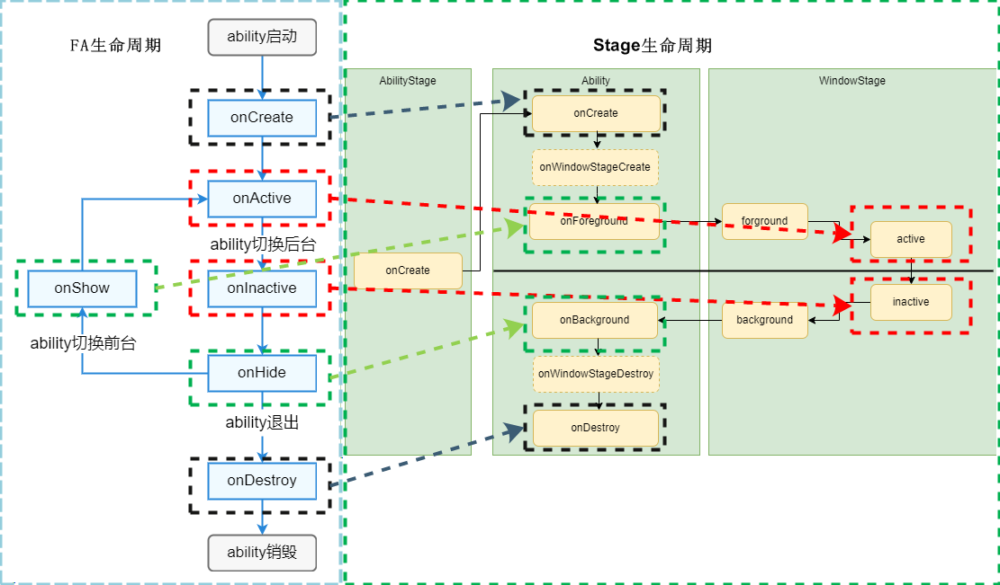

# PageAbility切换


FA模型中PageAbility对应Stage模型中的UIAbility，PageAbility切换为UIAbility的方法如下。


1. 在Stage应用中[创建UIAbility](uiability-usage.md)。

2. 将FA应用中PageAbility的代码迁移到新创建的UIAbility中。
   FA应用中PageAbility和Stage应用中的UIAbility生命周期基本一致，两者的生命周期详细对比见下表。

   | FA的PageAbility | Stage的UIAbility | 对应关系描述 |
   | -------- | -------- | -------- |
   | onCreate():&nbsp;void | onCreate(want:&nbsp;Want,&nbsp;launchParam:&nbsp;AbilityConstant.LaunchParam):&nbsp;void | 两者的意义和调用时机一致，Stage模型在回调中新增了参数，方便开发者在创建的时候获取启动相关的数据。 |
   | NA | onWindowStageCreate(windowStage:&nbsp;window.WindowStage):&nbsp;void | Stage模型新增，窗口创建时由系统回调。 |
   | onActive():&nbsp;void | on(eventType:&nbsp;'windowStageEvent',&nbsp;callback:&nbsp;Callback&lt;WindowStageEventType&gt;):&nbsp;void;<br/>WindowStageEventType.ACTIVE | 两者的意义和调用时机一致。Stage模型下移动到了窗口对象中。 |
   | onShow():&nbsp;void | onForeground():&nbsp;void | 两者的意义和调用时机一致，参数也一致。 |
   | onNewWant(want:&nbsp;Want):&nbsp;void | onNewWant(want:&nbsp;Want,&nbsp;launchParam:&nbsp;AbilityConstant.LaunchParam):&nbsp;void | 两者的意义和调用时机一致，Stage模型多了LaunchParam参数来告知应用启动原因。 |
   | onInactive():&nbsp;void | on(eventType:&nbsp;'windowStageEvent',&nbsp;callback:&nbsp;Callback&lt;WindowStageEventType&gt;):&nbsp;void;<br/>WindowStageEventType.INACTIVE | 两者的意义和调用时机一致。Stage模型下移动到了窗口对象中。 |
   | onHide():&nbsp;void | onBackground():&nbsp;void | 两者的意义和调用时机一致，参数也一致。 |
   | NA | onWindowStageDestroy():&nbsp;void | Stage模型新增，窗口销毁时由系统回调。 |
   | onDestroy():&nbsp;void | onDestroy():&nbsp;void | 两者的意义和调用时机一致，参数也一致。 |

   

3. 对迁移过来的代码进行调整，主要有以下两部分。

    1. 指定加载页面的方式不同。

        - 在FA模型中，通过在config.json中设置页面信息来配置需要加载的页面。
        - 在Stage模型中，则是通过在onWindowStageCreate回调中调用windowStage.loadContent实现对页面的加载。

        例如，开发者希望Ability启动后加载"pages/Index"页面，在FA模型中，开发者需要在config.json中加入如下代码：


        ```json
        "pages" : [
            "pages/Index"
        ]
        ```

        在Stage模型中，则在MainAbility中实现如下接口：


        ```ts
        import { UIAbility } from '@kit.AbilityKit';
        import { hilog } from '@kit.PerformanceAnalysisKit';
        import { window } from '@kit.ArkUI';

        export default class TestAbility extends UIAbility {
          // ...
          onWindowStageCreate(windowStage: window.WindowStage) {
            hilog.info(0x0000, 'testTag', '%{public}s', 'TestAbility onWindowStageCreate');
            windowStage.loadContent('testability/pages/Index', (err, data) => {
              if (err.code) {
                hilog.error(0x0000, 'testTag', 'Failed to load the content. Cause: %{public}s', JSON.stringify(err) ?? '');
                return;
              }
              hilog.info(0x0000, 'testTag', 'Succeeded in loading the content. Data: %{public}s',
                JSON.stringify(data) ?? '');
            });
          }
          // ...
        }
        ```

    2. 在resources/base/profile/main_pages.json中配置页面，以"pages/Index"为例:
        ```json
        {
          "src": [
            "pages/Index"
          ]
        }
        ```