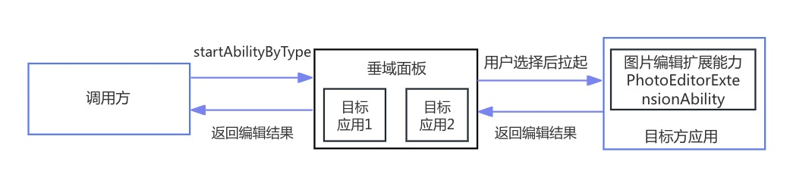

# 拉起图片编辑类应用（startAbilityByType）
## 使用场景
当应用自身不具备图片编辑能力、但存在图片编辑的场景时，可以通过startAbilityByType拉起图片编辑类应用扩展面板，由对应的应用完成图片编辑操作。图片编辑类应用可以通过PhotoEditorExtensionAbility实现图片编辑页面，并将该页面注册到图片编辑面板，从而将图片编辑能力开放给其他应用。

流程示意图如下：



例如：用户在图库App中选择编辑图片时，图库App可以通过startAbilityByType拉起图片编辑类应用扩展面板。用户可以从已实现PhotoEditorExtensionAbility应用中选择一款，并进行图片编辑。

## 接口说明

接口详情参见[PhotoEditorExtensionAbility](../reference/apis-ability-kit/js-apis-app-ability-photoEditorExtensionAbility.md)和[PhotoEditorExtensionContext](../reference/apis-ability-kit/js-apis-app-ability-photoEditorExtensionContext.md)。

| **接口名**  | **描述** |
| -------- | -------- |
| onStartContentEditing(uri: string, want:Want, session: UIExtensionContentSession):void       | 可以执行读取原始图片、加载页面等操作。|
| saveEditedContentWithImage(pixeMap: image.PixelMap, option: image.PackingOption): Promise\<AbilityResult\>  | 传入编辑过的图片的PixelMap对象并保存。   |

## 图片编辑类应用实现图片编辑页面

1. 在DevEco Studio工程中手动新建一个PhotoEditorExtensionAbility。
    1. 在工程Module对应的ets目录下，右键选择“New > Directory”，新建一个目录，如PhotoEditorExtensionAbility。
    2. 在PhotoEditorExtensionAbility目录中，右键选择“New > File”，新建一个.ets文件，如ExamplePhotoEditorAbility.ets。
2. 在ExamplePhotoEditorAbility.ets中重写onCreate、onForeground、onBackground、onDestroy和onStartContentEditing的生命周期回调。

    其中，需要在onStartContentEditing中加载入口页面文件pages/Index.ets，并将session、uri、实例对象等保存在LocalStorage中传递给页面。

    ```ts
    import { PhotoEditorExtensionAbility,UIExtensionContentSession,Want } from '@kit.AbilityKit';
    import { hilog } from '@kit.PerformanceAnalysisKit';

    const TAG = '[ExamplePhotoEditorAbility]';
    export default class ExamplePhotoEditorAbility extends PhotoEditorExtensionAbility {
      onCreate() {
        hilog.info(0x0000, TAG, 'onCreate');
      }

      // 获取图片，加载页面并将需要的参数传递给页面
      onStartContentEditing(uri: string, want: Want, session: UIExtensionContentSession): void {
        hilog.info(0x0000, TAG, `onStartContentEditing want: ${JSON.stringify(want)}, uri: ${uri}`);

        const storage: LocalStorage = new LocalStorage({
          "session": session,
          "uri": uri
        } as Record<string, Object>);

        session.loadContent('pages/Index', storage);
      }

      onForeground() {
        hilog.info(0x0000, TAG, 'onForeground');
      }

      onBackground() {
        hilog.info(0x0000, TAG, 'onBackground');
      }

      onDestroy() {
        hilog.info(0x0000, TAG, 'onDestroy');
      }
    }

    ```
3. 在page中实现图片编辑功能。

    图片编辑完成后调用saveEditedContentWithImage保存图片，并将回调结果通过terminateSelfWithResult返回给调用方。

    ```ts
    import { common } from '@kit.AbilityKit';
    import { UIExtensionContentSession, Want } from '@kit.AbilityKit';
    import { hilog } from '@kit.PerformanceAnalysisKit';
    import { fileIo } from '@kit.CoreFileKit';
    import { image } from '@kit.ImageKit';

    const TAG = '[ExamplePhotoEditorAbility]';

    @Entry
    @Component
    struct Index {
      @State message: string = 'editImg';
      @State originalImage: PixelMap | null = null;
      @State editedImage: PixelMap | null = null;
      private newWant ?: Want;
      private storage = this.getUIContext().getSharedLocalStorage();

      aboutToAppear(): void {
        let originalImageUri = this.storage?.get<string>("uri") ?? "";
        hilog.info(0x0000, TAG, `OriginalImageUri: ${originalImageUri}.`);

        this.readImageByUri(originalImageUri).then(imagePixMap => {
          this.originalImage = imagePixMap;
        })
      }

      // 根据uri读取图片内容
      async readImageByUri(uri: string): Promise < PixelMap | null > {
        hilog.info(0x0000, TAG, "uri: " + uri);
        let file: fileIo.File | undefined;
        try {
          file = await fileIo.open(uri, fileIo.OpenMode.READ_ONLY);
          hilog.info(0x0000, TAG, "Original image file id: " + file.fd);

          let imageSourceApi: image.ImageSource = image.createImageSource(file.fd);
          if(!imageSourceApi) {
            hilog.info(0x0000, TAG, "ImageSourceApi failed");
            return null;
          }
          let pixmap: image.PixelMap = await imageSourceApi.createPixelMap();
          if(!pixmap) {
            hilog.info(0x0000, TAG, "createPixelMap failed");
            return null;
          }
          this.originalImage = pixmap;
          return pixmap;
        } catch(e) {
          hilog.error(0x0000, TAG, `ReadImage failed:${e}`);
        } finally {
          fileIo.close(file);
        }
        return null;
      }

      build() {
        Row() {
          Column() {
            Text(this.message)
              .fontSize(50)
              .fontWeight(FontWeight.Bold)

            Button("RotateAndSaveImg").onClick(event => {
              hilog.info(0x0000, TAG, `Start to edit image and save.`);
              // 编辑图片功能实现
              this.originalImage?.rotate(90).then(() => {
                let packOpts: image.PackingOption = { format: "image/jpeg", quality: 98 };
                try {
                  // 调用saveEditedContentWithImage保存图片
                  (this.getUIContext().getHostContext() as common.PhotoEditorExtensionContext).saveEditedContentWithImage(this.originalImage as image.PixelMap,
                    packOpts).then(data => {
                    if (data.resultCode == 0) {
                      hilog.info(0x0000, TAG, `Save succeed.`);
                    }
                    hilog.info(0x0000, TAG,
                        `saveContentEditingWithImage result: ${JSON.stringify(data)}`);
                    this.newWant = data.want;
                    // data.want.uri存有编辑过图片的uri
                    this.readImageByUri(this.newWant?.uri ?? "").then(imagePixMap => {
                      this.editedImage = imagePixMap;
                    })
                  })
                } catch (e) {
                  hilog.error(0x0000, TAG, `saveContentEditingWithImage failed:${e}`);
                  return;
                }
              })
            }).margin({ top: 10 })

            Button("terminateSelfWithResult").onClick((event => {
              hilog.info(0x0000, TAG, `Finish the current editing.`);

              let session = this.storage?.get('session') as UIExtensionContentSession;
              // 关闭并回传修改结果给调用方
              session?.terminateSelfWithResult({ resultCode: 0, want: this.newWant });

            })).margin({ top: 10 })

            Image(this.originalImage).width("100%").height(200).margin({ top: 10 }).objectFit(ImageFit.Contain)

            Image(this.editedImage).width("100%").height(200).margin({ top: 10 }).objectFit(ImageFit.Contain)
          }
          .width('100%')
        }
        .height('100%')
        .backgroundColor(Color.Pink)
        .expandSafeArea([SafeAreaType.SYSTEM], [SafeAreaEdge.BOTTOM])
      }
    }

    ```
4. 在工程Module对应的module.json5配置文件中注册PhotoEditorExtensionAbility。

    type标签需要配置为"photoEditor"，srcEntry需要配置为PhotoEditorExtensionAbility组件所对应的代码路径。

    ```json
    {
      "module": {
        "extensionAbilities": [
          {
            "name": "ExamplePhotoEditorAbility",
            "icon": "$media:icon",
            "description": "ExamplePhotoEditorAbility",
            "type": "photoEditor",
            "exported": true,
            "srcEntry": "./ets/PhotoEditorExtensionAbility/ExamplePhotoEditorAbility.ets",
            "label": "$string:EntryAbility_label",
            "extensionProcessMode": "bundle"
          },
        ]
      }
    }
    ```
## 调用方拉起图片编辑类应用编辑图片
开发者可以在UIAbility或者UIExtensionAbility的页面中通过接口startAbilityByType拉起图片编辑类应用扩展面板，系统将自动查找并在面板上展示基于[PhotoEditorExtensionAbility](../reference/apis-ability-kit/js-apis-app-ability-photoEditorExtensionAbility.md)实现的图片编辑应用，由用户选择某个应用来完成图片编辑的功能，最终将编辑的结果返回给到调用方，具体步骤如下：
1. 导入模块。
    ```ts
    import { common, wantConstant } from '@kit.AbilityKit';
    import { fileUri, picker } from '@kit.CoreFileKit';
    ```
2. （可选）实现从图库中选取图片。
    ```ts
    async photoPickerGetUri(): Promise < string > {
      try {
        let PhotoSelectOptions = new picker.PhotoSelectOptions();
        PhotoSelectOptions.MIMEType = picker.PhotoViewMIMETypes.IMAGE_TYPE;
        PhotoSelectOptions.maxSelectNumber = 1;
        let photoPicker = new picker.PhotoViewPicker();
        let photoSelectResult: picker.PhotoSelectResult = await photoPicker.select(PhotoSelectOptions);
        return photoSelectResult.photoUris[0];
      } catch(error) {
        let err: BusinessError = error as BusinessError;
        hilog.error(0x0000, TAG, 'PhotoViewPicker failed with err: ' + JSON.stringify(err));
      }
      return "";
    }
    ```
3. 将图片拷贝到本地沙箱路径。
   ```ts
    let context = this.getUIContext().getHostContext() as common.UIAbilityContext;
    let file: fileIo.File | undefined;
    try {
      file = fileIo.openSync(uri, fileIo.OpenMode.READ_ONLY);
      hilog.info(0x0000, TAG, "file: " + file.fd);

      let timeStamp = Date.now();
      // 将用户图片拷贝到应用沙箱路径
      fileIo.copyFileSync(file.fd, context.filesDir + `/original-${timeStamp}.jpg`);

      this.filePath = context.filesDir + `/original-${timeStamp}.jpg`;
      this.originalImage = fileUri.getUriFromPath(this.filePath);
    } catch (e) {
      hilog.error(0x0000, TAG, `readImage failed:${e}`);
    } finally {
      fileIo.close(file);
    }
   ```
4. 在startAbilityByType回调函数中，通过want.uri获取编辑后的图片uri，并做对应的处理。
    ```ts
      let context = this.getUIContext().getHostContext() as common.UIAbilityContext;
      let abilityStartCallback: common.AbilityStartCallback = {
        onError: (code, name, message) => {
          const tip: string = `code:` + code + ` name:` + name + ` message:` + message;
          hilog.error(0x0000, TAG, "startAbilityByType:", tip);
        },
        onResult: (result) => {
          // 获取到回调结果中编辑后的图片uri并做对应的处理
          let uri = result.want?.uri ?? "";
          hilog.info(0x0000, TAG, "PhotoEditorCaller result: " + JSON.stringify(result));
          this.readImage(uri).then(imagePixMap => {
            this.editedImage = imagePixMap;
          });
        }
      }
    ```
5. 将图片转换为图片uri，并调用startAbilityByType拉起图片编辑应用面板。
   ```ts
    let uri = fileUri.getUriFromPath(this.filePath);
    context.startAbilityByType("photoEditor", {
      "ability.params.stream": [uri], // 原始图片的uri,只支持传入一个uri
      "ability.want.params.uriPermissionFlag": wantConstant.Flags.FLAG_AUTH_READ_URI_PERMISSION // 至少需要分享读权限给到图片编辑面板
    } as Record<string, Object>, abilityStartCallback, (err) => {
      let tip: string;
      if (err) {
        tip = `Start error: ${JSON.stringify(err)}`;
        hilog.error(0x0000, TAG, `startAbilityByType: fail, err: ${JSON.stringify(err)}`);
      } else {
        tip = `Start success`;
        hilog.info(0x0000, TAG, "startAbilityByType: ", `success`);
      }
    });
   ```

示例：  
```ts
import { common, wantConstant } from '@kit.AbilityKit';
import { fileUri, picker } from '@kit.CoreFileKit';
import { hilog } from '@kit.PerformanceAnalysisKit';
import { fileIo } from '@kit.CoreFileKit';
import { image } from '@kit.ImageKit';
import { BusinessError } from '@kit.BasicServicesKit';
import { JSON } from '@kit.ArkTS';
import { photoAccessHelper } from '@kit.MediaLibraryKit';

const TAG = 'PhotoEditorCaller';

@Entry
@Component
struct Index {
  @State message: string = 'selectImg';
  @State originalImage: ResourceStr = "";
  @State editedImage: PixelMap | null = null;
  private filePath: string = "";

  // 根据uri读取图片内容
  async readImage(uri: string): Promise < PixelMap | null > {
    hilog.info(0x0000, TAG, "image uri: " + uri);
    let file: fileIo.File | undefined;
    try {
      file = await fileIo.open(uri, fileIo.OpenMode.READ_ONLY);
      hilog.info(0x0000, TAG, "file: " + file.fd);

      let imageSourceApi: image.ImageSource = image.createImageSource(file.fd);
      if(!imageSourceApi) {
        hilog.info(0x0000, TAG, "imageSourceApi failed");
        return null;
      }
      let pixmap: image.PixelMap = await imageSourceApi.createPixelMap();
      if(!pixmap) {
        hilog.info(0x0000, TAG, "createPixelMap failed");
        return null;
      }
      this.editedImage = pixmap;
      return pixmap;
    } catch(e) {
      hilog.error(0x0000, TAG, `readImage failed:${e}`);
    } finally {
      fileIo.close(file);
    }
    return null;
  }

  // 图库中选取图片
  async photoPickerGetUri(): Promise<string> {
	try {
		let textInfo: photoAccessHelper.TextContextInfo = {
			text: 'photo'
		}
		let recommendOptions: photoAccessHelper.RecommendationOptions = {
			textContextInfo: textInfo
		}
		let options: photoAccessHelper.PhotoSelectOptions = {
			MIMEType: photoAccessHelper.PhotoViewMIMETypes.IMAGE_TYPE,
			maxSelectNumber: 1,
			recommendationOptions: recommendOptions
		}
		let photoPicker = new photoAccessHelper.PhotoViewPicker();
		let photoSelectResult: photoAccessHelper.PhotoSelectResult = await photoPicker.select(options);
		return photoSelectResult.photoUris[0];
	} catch (error) {
		let err: BusinessError = error as BusinessError;
		hilog.error(0x0000, TAG, 'PhotoViewPicker failed with err: ' + JSON.stringify(err));
	}
	return "";
  }

  build() {
    Row() {
      Column() {
        Text(this.message)
          .fontSize(50)
          .fontWeight(FontWeight.Bold)

        Button("selectImg").onClick(event => {
          // 图库中选取图片
          this.photoPickerGetUri().then(uri => {
            hilog.info(0x0000, TAG, "uri: " + uri);

            let context = this.getUIContext().getHostContext() as common.UIAbilityContext;
            let file: fileIo.File | undefined;
            try {
              file = fileIo.openSync(uri, fileIo.OpenMode.READ_ONLY);
              hilog.info(0x0000, TAG, "file: " + file.fd);

              let timeStamp = Date.now();
              // 将用户图片拷贝到应用沙箱路径
              fileIo.copyFileSync(file.fd, context.filesDir + `/original-${timeStamp}.jpg`);

              this.filePath = context.filesDir + `/original-${timeStamp}.jpg`;
              this.originalImage = fileUri.getUriFromPath(this.filePath);
            } catch (e) {
              hilog.info(0x0000, TAG, `readImage failed:${e}`);
            } finally {
              fileIo.close(file);
            }
          })

        }).width('200').margin({ top: 20 })

        Button("editImg").onClick(event => {
          let context = this.getUIContext().getHostContext() as common.UIAbilityContext;
          let abilityStartCallback: common.AbilityStartCallback = {
            onError: (code, name, message) => {
              const tip: string = `code:` + code + ` name:` + name + ` message:` + message;
              hilog.error(0x0000, TAG, "startAbilityByType:", tip);
            },
            onResult: (result) => {
              // 获取到回调结果中编辑后的图片uri并做对应的处理
              let uri = result.want?.uri ?? "";
              hilog.info(0x0000, TAG, "PhotoEditorCaller result: " + JSON.stringify(result));
              this.readImage(uri).then(imagePixMap => {
                this.editedImage = imagePixMap;
              });
            }
          }
          // 将图片转换为图片uri，并调用startAbilityByType拉起图片编辑应用面板
          let uri = fileUri.getUriFromPath(this.filePath);
          context.startAbilityByType("photoEditor", {
            "ability.params.stream": [uri], // 原始图片的uri,只支持传入一个uri
            "ability.want.params.uriPermissionFlag": wantConstant.Flags.FLAG_AUTH_READ_URI_PERMISSION // 至少需要分享读权限给到图片编辑面板
          } as Record<string, Object>, abilityStartCallback, (err) => {
            let tip: string;
            if (err) {
              tip = `Start error: ${JSON.stringify(err)}`;
              hilog.error(0x0000, TAG, `startAbilityByType: fail, err: ${JSON.stringify(err)}`);
            } else {
              tip = `Start success`;
              hilog.info(0x0000, TAG, "startAbilityByType: ", `success`);
            }
          });

        }).width('200').margin({ top: 20 })

        Image(this.originalImage).width("100%").height(200).margin({ top: 20 }).objectFit(ImageFit.Contain)

        Image(this.editedImage).width("100%").height(200).margin({ top: 20 }).objectFit(ImageFit.Contain)
      }
      .width('100%')
    }
    .height('100%')
    .backgroundColor(Color.Orange)
    .expandSafeArea([SafeAreaType.SYSTEM], [SafeAreaEdge.BOTTOM])
  }
}

```