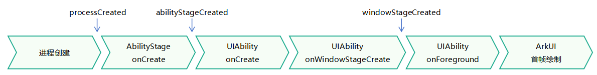

# 应用预加载

## 概述

从API version 20开始，提供应用预加载机制。该机制会根据用户的使用习惯，在系统资源充足时提前加载应用至特定阶段。当用户启动应用时，由于此前已完成了应用的部分加载，所需的启动时间会缩短，有助于提升用户体验和应用竞争力。

该机制尤其适用于因加载大量资源而启动耗时较长的应用，例如大型游戏应用和大型办公应用。

## 约束限制

- 当前仅支持2in1设备。

- 仅支持entry模块的AbilityStage和UIAbility预加载。无论预加载到哪种阶段，entry模块必须配置入口UIAbility，详见[开发步骤](#开发步骤)中步骤2。

- 应用配置预加载后，实际是否进行预加载以及具体的预加载时机，均由系统根据用户习惯等信息来综合决定。开发者无法对此进行干预。

## 运行机制

当系统资源充足时，系统将应用加载到特定阶段，提升启动速度。当前支持预加载到三种阶段。开发者可以根据应用冷启动各阶段耗时情况，选择其中的一种。

> **说明：** 
>
> 在应用预加载过程中不会显示任何界面，因此在预加载的任何阶段不应包含与界面显示、界面交互或依赖用户可见的相关操作，同时应确保用户正式启动应用后，所有功能正常运行且体验不受影响。

- processCreated：进程创建完成阶段。开发者配置此阶段后，预加载机制会创建空进程并初始化Application，但是不会触发任何生命周期回调。

- abilityStageCreated：[AbilityStage](../reference/apis-ability-kit/js-apis-app-ability-abilityStage.md)创建完成阶段。开发者配置此阶段后，预加载机制会创建空进程并初始化Application，随后触发entry模块[AbilityStage](../reference/apis-ability-kit/js-apis-app-ability-abilityStage.md)的[onCreate](../reference/apis-ability-kit/js-apis-app-ability-abilityStage.md#oncreate)回调。

- windowStageCreated：[WindowStage](../reference/apis-arkui/arkts-apis-window-WindowStage.md)创建完成阶段。开发者配置此阶段后，预加载机制会创建空进程并初始化Application，随后触发entry模块[AbilityStage](../reference/apis-ability-kit/js-apis-app-ability-abilityStage.md)的[onCreate](../reference/apis-ability-kit/js-apis-app-ability-abilityStage.md#oncreate)回调。接着会拉起entry模块的入口UIAbility，并触发其[onCreate](../reference/apis-ability-kit/js-apis-app-ability-uiAbility.md#oncreate)回调和[onWindowStageCreate](../reference/apis-ability-kit/js-apis-app-ability-uiAbility.md#onwindowstagecreate)回调。开发者可以在UIAbility的[onCreate](../reference/apis-ability-kit/js-apis-app-ability-uiAbility.md#oncreate)回调中，通过[launchParam.launchReason](../reference/apis-ability-kit/js-apis-app-ability-abilityConstant.md#launchreason)的枚举值获取启动原因。枚举值为PRELOAD表示当前UIAbility是由预加载机制启动的。



## 开发步骤

1. 声明应用支持预加载到的阶段。

    以windowStageCreated阶段为例，在[app.json5配置文件](../quick-start/app-configuration-file.md)中配置[appPreloadPhase](../quick-start/app-configuration-file.md#配置文件标签)标签。

    ```json
    {
      "app": {
        "bundleName": "com.demo.preloadtest",
        "vendor": "example",
        "versionCode": 1000000,
        "versionName": "1.0.0",
        "icon": "$media:layered_image",
        "label": "$string:app_name",
        "appPreloadPhase": "windowStageCreated"
      }
    }
    ```

2. 配置入口UIAbility（新建工程默认已自动配置）。

    以EntryAbility为例，在entry模块的[module.json5配置文件](../quick-start/module-configuration-file.md)中，设置mainElement为EntryAbility，且EntryAbility的skills标签下面的entities中添加"entity.system.home"、actions中添加"ohos.want.action.home"。

    ```json
    {
      "module": {
        "name": "entry",
        "type": "entry",
        "description": "$string:module_desc",
        "mainElement": "EntryAbility",
        "deviceTypes": [
          "2in1"
        ],
        "deliveryWithInstall": true,
        "installationFree": false,
        "pages": "$profile:main_pages",
        "abilities": [
          {
            "name": "EntryAbility",
            "srcEntry": "./ets/entryability/EntryAbility.ets",
            "description": "$string:EntryAbility_desc",
            "icon": "$media:layered_image",
            "label": "$string:EntryAbility_label",
            "startWindowIcon": "$media:startIcon",
            "startWindowBackground": "$color:start_window_background",
            "exported": true,
            "skills": [
              {
                "entities": [
                  "entity.system.home"
                ],
                "actions": [
                  "ohos.want.action.home"
                ]
              }
            ]
          }
        ]
      }
    }
    ```

3. （可选）获取UIAbility启动原因。

    仅当appPreloadPhase配置为windowStageCreated时，开发者可在UIAbility的[onCreate](../reference/apis-ability-kit/js-apis-app-ability-uiAbility.md#oncreate)生命周期回调中通过[launchParam.launchReason](../reference/apis-ability-kit/js-apis-app-ability-abilityConstant.md#launchreason)的枚举值获取启动原因。枚举值为PRELOAD表示当前UIAbility是由预加载机制启动的。

    ```ts
    import { AbilityConstant, UIAbility, Want } from '@kit.AbilityKit';

    export default class EntryAbility extends UIAbility {
      onCreate(want: Want, launchParam: AbilityConstant.LaunchParam): void {
        console.info(`EntryAbility onCreate, LaunchReason:${launchParam.launchReason}`);
        // 判断是否是预加载启动
        let isPreloadStart = launchParam.launchReason === AbilityConstant.LaunchReason.PRELOAD;
        // ...
      }
    }
    ```