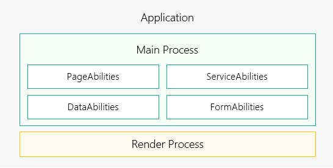

# 进程模型概述

系统的进程模型如下图所示：

- 应用中（同一包名）的所有PageAbility、ServiceAbility、DataAbility、FormAbility运行在同一个独立进程中，即图中绿色部分的“Main Process”。

- WebView拥有独立的渲染进程，即图中黄色部分的“Render Process”。

  **图1** 进程模型示意图  

基于当前的进程模型，针对应用间存在多个进程的情况，系统提供了如下进程间通信机制：

公共事件机制：多用于一对多的通信场景，公共事件发布者可能存在多个订阅者同时接收事件。

