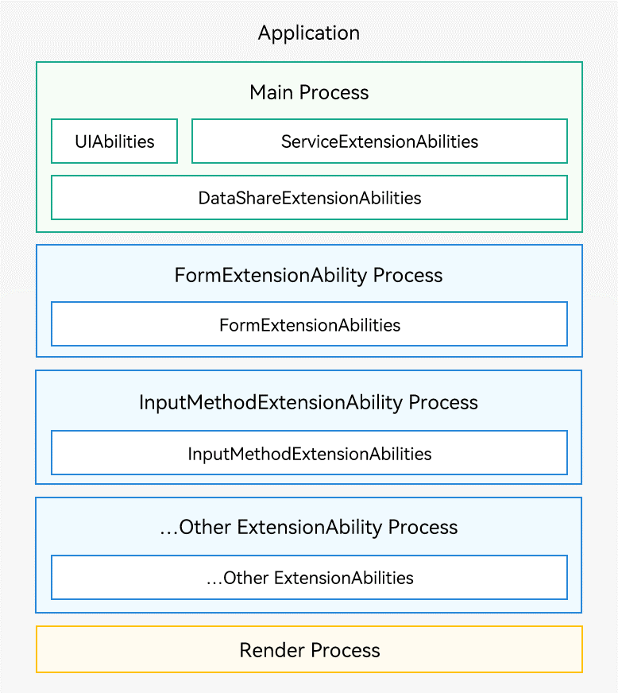

# 进程模型

系统的进程模型如下图所示。

- 应用中（同一Bundle名称）的所有UIAbility、ServiceExtensionAbility和DataShareExtensionAbility均是运行在同一个独立进程（主进程）中，如下图中绿色部分的“Main Process”。
- 应用中（同一Bundle名称）的所有同一类型ExtensionAbility（除ServiceExtensionAbility和DataShareExtensionAbility外）均是运行在一个独立进程中，如下图中蓝色部分的“FormExtensionAbility Process”、“InputMethodExtensionAbility Process”、其他ExtensionAbility Process。
- WebView拥有独立的渲染进程，如下图中黄色部分的“Render Process”。

**图1** 进程模型示意图  

> 说明：
>
> - 仅系统应用支持构建ServiceExtensionAbility和DataShareExtensionAbility。
> - 执行`hdc shell`命令，进入设备的shell命令行。在shell命令行中，执行`ps -ef`命令，可以查看所有正在运行的进程信息。

在上述模型基础上，对于系统应用可以通过申请多进程权限（如下图所示），为指定HAP配置一个自定义进程名，该HAP中的UIAbility、DataShareExtensionAbility、ServiceExtensionAbility就会运行在自定义进程中。不同的HAP可以通过配置不同的进程名运行在不同进程中。

**图2** 多进程示意图  

基于当前的进程模型，针对应用间和应用内存在多个进程的情况，系统提供了如下进程间通信机制：

[公共事件机制](../basic-services/common-event/common-event-overview.md)：多用于一对多的通信场景，公共事件发布者可能存在多个订阅者同时接收事件。

