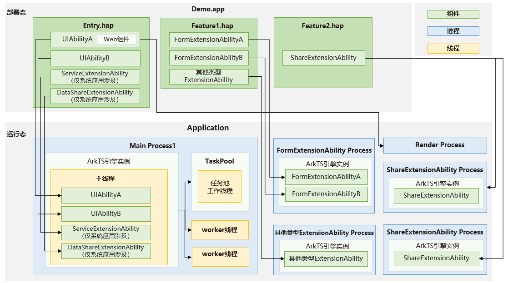
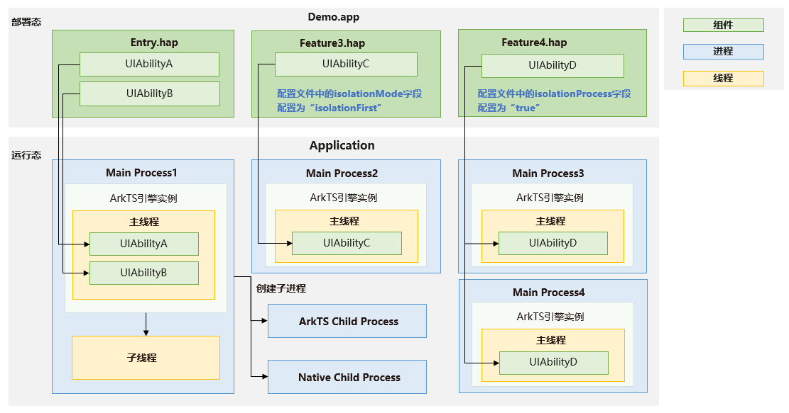
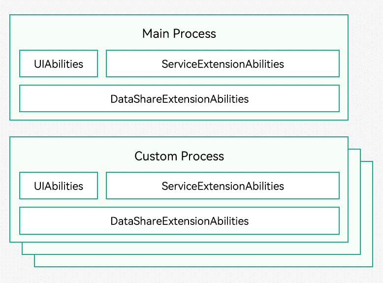

# 进程模型
<!--Kit: Ability Kit-->
<!--Subsystem: Ability-->
<!--Owner: @SKY2001-->
<!--Designer: @yzkp-->
<!--Tester: @lixueqing513-->
<!--Adviser: @huipeizi-->

## 概述
进程是系统进行资源分配的基本单位，是操作系统结构的基础。下面从一个应用的全局视角来看下系统的进程模型和线程模型。

## 进程模型

### 基本进程类型

开发者开发一个复杂功能的应用，包含多个[UIAbility](../reference/apis-ability-kit/js-apis-app-ability-uiAbility.md)组件和多个ExtensionAbility组件，ExtensionAbility如图1中的[FormExtensionAbility](../reference/apis-form-kit/js-apis-app-form-formExtensionAbility.md)和[ShareExtensionAbility](../reference/apis-ability-kit/js-apis-app-ability-shareExtensionAbility.md)。那么在应用运行态，可能存在的进程类型：

- **主进程**：默认情况下，应用中（同一Bundle名称）的所有UIAbility<!--Del-->、ServiceExtensionAbility和DataShareExtensionAbility<!--DelEnd-->均是运行在同一个独立进程（主进程）中，即图1中的“Main Process1”。
- **ExtensionAbility进程**：应用中（同一Bundle名称）的所有同一类型ExtensionAbility<!--Del-->（除ServiceExtensionAbility和DataShareExtensionAbility外）<!--DelEnd-->均是运行在一个独立进程中，如图1中“FormExtensionAbility Process”、“其他类型ExtensionAbility Process”（其他类型的ExtensionAbility组件）。

  特别地，对于继承自[UIExtensionAbility](../reference/apis-ability-kit/js-apis-app-ability-uiExtensionAbility.md)的ExtensionAbility，可以为每个实例配置独立进程。例如ShareExtensionAbility可以指定每个ShareExtensionAbility实例分别运行在一个独立进程，详见[UIExtensionAbility](../reference/apis-ability-kit/js-apis-app-ability-uiExtensionAbility.md)。

- **Render进程**：应用中的Web组件运行时，系统会为之分配一个Render进程，用于渲染。如图1中的“Render Process”。

**图1** 基本进程类型

>**说明:**
>
> - 进程名称的命名无固定规则，而且与进程类型也不存在直接关联，不能用于业务逻辑的判断。例如，开发者开发了一款应用com.example.myapplication，其中有一个输入法组件[InputMethodExtensionAbility](../reference/apis-ime-kit/js-apis-inputmethod-extension-ability.md)，输入法组件是运行在独立进程中的，通常情况下其进程名是为“com.example.myapplication:input”。但这并不是固定的，该进程名对应的进程不一定是输入法进程，输入法进程也不一定是该进程名。
> - 一个进程可以包含多个AbilityStage，一个AbilityStage可以包含多个Ability。进程的生命周期与Ability生命周期息息相关，当进程内的所有Ability都退出后，进程才会走销毁流程。换句话说，如果想退出进程，需要先退出进程内的所有Ability。

### 其他进程类型

在2in1和Tablet设备上，针对UIAbility，还支持如下特殊进程类型：
- **模块独立进程**：对于多HAP的应用，每个HAP的业务相对独立，如果开发者希望不同HAP的UIAbility运行在不同的进程，可以在[module.json5配置文件](../quick-start/module-configuration-file.md#配置文件标签)中将isolationMode字段配置为isolationOnly（只在独立进程中运行）或者isolationFirst（优先在独立进程中运行），那么该HAP下的所有UIAbility将运行在统一的独立的进程中。如图2中UIAbilityC运行在“Main Process2”， 而不是“Main Process1”。
- **动态指定进程**：当同一HAP中的UIAbility实例需要根据运行时状态（如每个进程最多支持5个实例）动态分配到不同进程时，开发者可以在module.json5配置文件中将该UIAbility的isolationProcess字段配置为true，如图2中的UIAbilityD。系统在启动UIAbilityD实例时，回调[主控进程](ability-terminology.md#masterprocess主控进程)的[onNewProcessRequest](../reference/apis-ability-kit/js-apis-app-ability-abilityStage.md#onnewprocessrequest11)，开发者在该回调中返回自定义的一个字符串，如果返回的字符串是开发者曾创建的，则复用该标识所在的进程，否则创建新的进程。如图2中的 “Main Processes3”和“Main Process4”则是UIAbilityD运行的多个进程。
- **子进程**： 如果开发者希望开启多进程做一些后台业务，可以调用[childProcessManager](../reference/apis-ability-kit/js-apis-app-ability-childProcessManager.md)中的接口创建子进程。子进程的生命周期跟随父进程，父进程消亡，子进程跟随消亡。如图2中的“ArkTS Child Process”和“Native Child Process”是主进程创建的子进程。子进程不支持再创建子进程。

**图2** 其他进程类型

<!--Del-->
在上述模型基础上，对于系统应而言，往往是提供不同的对外系统能力，每一个能力或多个能力需要运行在同一进程中，依赖更灵活的进程模型。系统应用可以通过申请allowAppMultiProcess多进程特权为指定HAP配置一个自定义进程名，该HAP中的UIAbility、DataShareExtensionAbility、ServiceExtensionAbility就会运行在自定义进程中（如下图3所示），具体申请方式请参考[应用特权配置指南](../../device-dev/subsystems/subsys-app-privilege-config-guide.md)。不同的HAP可以通过配置[module.json5配置文件](../quick-start/module-configuration-file.md#配置文件标签)中的process属性自定义进程名。

**图3** 多进程示意图

<!--DelEnd-->

## 线程模型

系统创建应用进程启动后，会默认创建一个主线程并进入消息循环。应用组件均运行在主线程上。
除了主线程外，应用如果有复杂的耗时逻辑需要处理，开发者可以创建[worker](../reference/apis-arkts/js-apis-worker.md)线程处理、或者提交任务到[taskpool](../reference/apis-arkts/js-apis-taskpool.md)。
