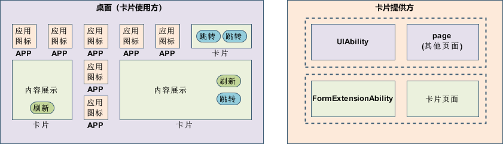
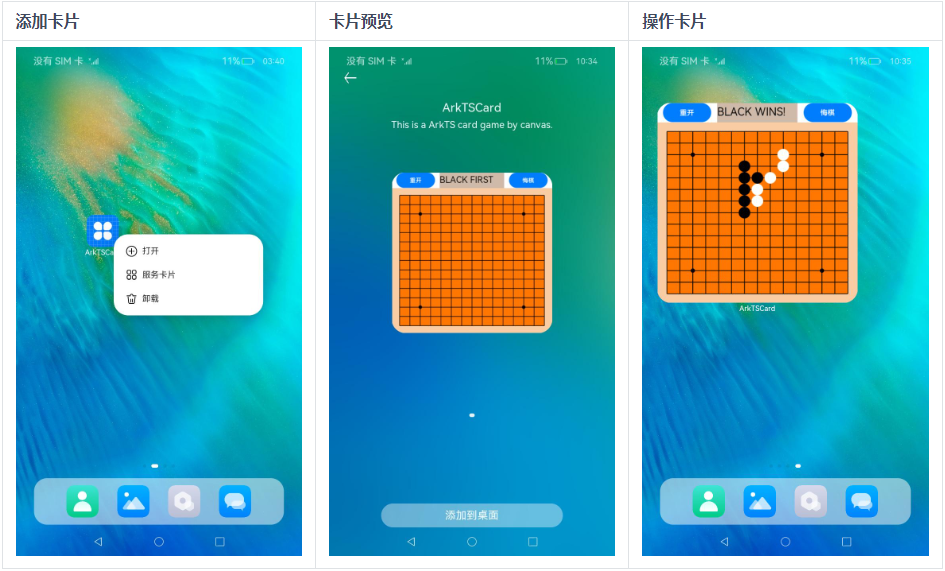

# 服务卡片概述

服务卡片（以下简称“卡片”）是一种界面展示形式，可以将应用的重要信息或操作前置到卡片，以达到服务直达、减少体验层级的目的。卡片常用于嵌入到其他应用（当前卡片使用方只支持系统应用，如桌面）中作为其界面显示的一部分，并支持拉起页面、发送消息等基础的交互功能。

## 服务卡片架构

**图1** 服务卡片架构  

卡片的基本概念：

- 卡片使用方：如上图中的桌面，显示卡片内容的宿主应用，控制卡片在宿主中展示的位置。

  - 应用图标：应用入口图标，点击后可拉起应用进程，图标内容不支持交互。
  - 卡片：具备不同规格大小的界面展示，卡片的内容可以进行交互，如实现按钮进行[界面的刷新](arkts-ui-widget-event-formextensionability.md)、[应用的跳转](arkts-ui-widget-event-router.md)等。

- 卡片提供方：包含卡片的应用，提供卡片的显示内容、控件布局以及控件点击处理逻辑。

  - FormExtensionAbility：卡片业务逻辑模块，提供卡片创建、销毁、刷新等生命周期回调。
  - 卡片页面：卡片UI模块，包含页面控件、布局、事件等显示和交互信息。

卡片的常见使用步骤如下。

**图2** 卡片常见使用步骤

1. 长按“桌面图标”，弹出操作菜单。

2. 点击“服务卡片”选项，进入卡片预览界面。

3. 点击“添加到桌面”按钮，即可在桌面上看到新添加的卡片。

## 服务卡片UI页面开发方式

在Stage模型下，服务卡片的UI页面支持通过[ArkTS](arkts-ui-widget-working-principles.md)和[JS](js-ui-widget-development.md)两种语言进行开发：

- 基于声明式范式ArkTS UI开发的卡片，简称ArkTS卡片。

- 基于类Web范式JS UI开发的卡片，简称JS卡片。

ArkTS卡片与JS卡片具备不同的实现原理及特征，在场景能力上的差异如下表所示。

| 类别 | JS卡片 | ArkTS卡片 |
| -------- | -------- | -------- |
| 开发范式 | 类Web范式 | 声明式范式 |
| 组件能力 | 支持 | 支持 |
| 布局能力 | 支持 | 支持 |
| 事件能力 | 支持 | 支持 |
| 自定义动效 | 不支持 | 支持 |
| 自定义绘制 | 不支持 | 支持 |
| 逻辑代码执行（不包含import能力） | 不支持 | 支持 |

推荐在开发需求需要动态能力的卡片时使用ArkTS卡片，因为它拥有更加丰富的能力和适应更多的场景，能够提高效率并实现动态化。但如果只需要静态展示卡片，可以考虑使用JS卡片。

## 相关实例

针对Stage模型卡片提供方的开发，有以下相关实例可供参考：

- [Stage模型卡片（ArkTS）（API9）](https://gitee.com/openharmony/applications_app_samples/tree/OpenHarmony-3.2-Release/code/SuperFeature/Widget/FormExtAbility)
