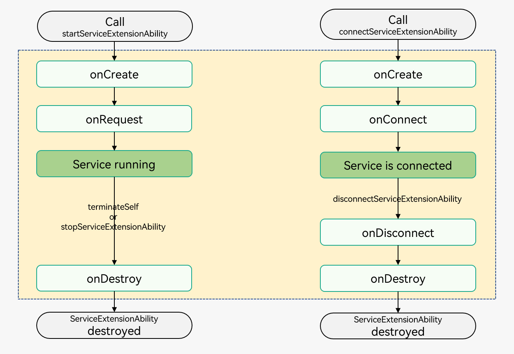

# ServiceExtensionAbility

## 概述

[ServiceExtensionAbility](../reference/apis-ability-kit/js-apis-app-ability-serviceExtensionAbility-sys.md)是SERVICE类型的[ExtensionAbility](../reference/apis-ability-kit/js-apis-app-ability-extensionAbility.md)组件，提供后台服务能力，其内部持有了一个[ServiceExtensionContext](../reference/apis-ability-kit/js-apis-inner-application-serviceExtensionContext-sys.md)，通过ServiceExtensionContext提供了丰富的接口供外部使用。

本文描述中称被启动的ServiceExtensionAbility为服务端，称启动ServiceExtensionAbility的组件为客户端。

ServiceExtensionAbility可以被其他组件启动或连接，并根据调用者的请求信息在后台处理相关事务。ServiceExtensionAbility支持以启动和连接两种形式运行，系统应用可以调用[startServiceExtensionAbility()](../reference/apis-ability-kit/js-apis-inner-application-uiAbilityContext-sys.md#uiabilitycontextstartserviceextensionability)方法启动后台服务，也可以调用[connectServiceExtensionAbility()](../reference/apis-ability-kit/js-apis-inner-application-uiAbilityContext.md#uiabilitycontextconnectserviceextensionability)方法连接后台服务，而三方应用只能调用connectServiceExtensionAbility()方法连接后台服务。启动和连接后台服务的差别：

- **启动**：AbilityA启动ServiceB，启动后AbilityA和ServiceB为弱关联，AbilityA退出后，ServiceB可以继续存在。

- **连接**：AbilityA连接ServiceB，连接后AbilityA和ServiceB为强关联，AbilityA退出后，ServiceB也一起退出。

此处有如下细节需要注意：

- 若Service只通过connect的方式被拉起，那么该Service的生命周期将受客户端控制，当客户端调用一次connectServiceExtensionAbility()方法，将建立一个连接，当客户端退出或者调用[disconnectServiceExtensionAbility()](../reference/apis-ability-kit/js-apis-inner-application-uiAbilityContext.md#uiabilitycontextdisconnectserviceextensionability)方法，该连接将断开。当所有连接都断开后，Service将自动退出。

- Service一旦通过start的方式被拉起，将不会自动退出，系统应用可以调用[stopServiceExtensionAbility()](../reference/apis-ability-kit/js-apis-inner-application-uiAbilityContext-sys.md#uiabilitycontextstopserviceextensionability)方法将Service退出。

- 只能在主线程线程中执行connect/disconnect操作，不要在Worker、TaskPool等子线程中执行connect/disconnect操作。

> **说明：**
>
> 1. 当前不支持三方应用实现ServiceExtensionAbility。如果三方开发者想要实现后台处理相关事务的功能，可以使用后台任务，具体请参见[后台任务](../task-management/background-task-overview.md)。
> 2. 三方应用的UIAbility组件可以通过Context连接系统提供的ServiceExtensionAbility。
> 3. 三方应用需要在前台获焦的情况下才能连接系统提供的ServiceExtensionAbility。

## 生命周期

[ServiceExtensionAbility](../reference/apis-ability-kit/js-apis-app-ability-serviceExtensionAbility-sys.md)提供了[onCreate()](../reference/apis-ability-kit/js-apis-app-ability-serviceExtensionAbility-sys.md#serviceextensionabilityoncreate)、[onRequest()](../reference/apis-ability-kit/js-apis-app-ability-serviceExtensionAbility-sys.md#serviceextensionabilityonrequest)、[onConnect()](../reference/apis-ability-kit/js-apis-app-ability-serviceExtensionAbility-sys.md#serviceextensionabilityonconnect)、[onDisconnect()](../reference/apis-ability-kit/js-apis-app-ability-serviceExtensionAbility-sys.md#serviceextensionabilityondisconnect)和[onDestroy()](../reference/apis-ability-kit/js-apis-app-ability-serviceExtensionAbility-sys.md#serviceextensionabilityondestroy)生命周期回调，根据需要重写对应的回调方法。下图展示了ServiceExtensionAbility的生命周期。

  **图1** ServiceExtensionAbility生命周期  


- **onCreate**
  服务被首次创建时触发该回调，开发者可以在此进行一些初始化的操作，例如注册公共事件监听等。

  > **说明：**
  > 如果服务已创建，再次启动该ServiceExtensionAbility不会触发onCreate()回调。

- **onRequest**
  当另一个组件调用[startServiceExtensionAbility()](../reference/apis-ability-kit/js-apis-inner-application-uiAbilityContext-sys.md#uiabilitycontextstartserviceextensionability)方法启动该服务组件时，触发该回调。执行此方法后，服务会启动并在后台运行。每调用一次startServiceExtensionAbility()方法均会触发该回调。

- **onConnect**
  当另一个组件调用[connectServiceExtensionAbility()](../reference/apis-ability-kit/js-apis-inner-application-uiAbilityContext.md#uiabilitycontextconnectserviceextensionability)方法与该服务连接时，触发该回调。开发者在此方法中，返回一个远端代理对象（[IRemoteObject](../reference/apis-ipc-kit/js-apis-rpc.md#iremoteobject)），客户端拿到这个对象后可以通过这个对象与服务端进行RPC通信，同时系统侧也会将该远端代理对象（IRemoteObject）储存。后续若有组件再调用connectServiceExtensionAbility()方法，系统侧会直接将所保存的远端代理对象（IRemoteObject）返回，而不再触发该回调。

- **onDisconnect**
  当最后一个连接断开时，将触发该回调。客户端死亡或者调用[disconnectServiceExtensionAbility()](../reference/apis-ability-kit/js-apis-inner-application-uiAbilityContext.md#uiabilitycontextdisconnectserviceextensionability)方法可以使连接断开。

- **onDestroy**
  当不再使用服务且准备将其销毁该实例时，触发该回调。开发者可以在该回调中清理资源，如注销监听等。

## 实现一个后台服务（仅对系统应用开放）

### 开发准备

只有系统应用才允许实现[ServiceExtensionAbility](../reference/apis-ability-kit/js-apis-app-ability-serviceExtensionAbility-sys.md)，因此开发者在开发之前需做如下准备：

- **替换Full SDK**：ServiceExtensionAbility相关接口都被标记为System-API，默认对开发者隐藏，因此需要手动从镜像站点获取Full SDK，并在DevEco Studio中替换，具体操作可参考[替换指南](../faqs/full-sdk-switch-guide.md)。

- **申请AllowAppUsePrivilegeExtension特权**：只有具有AllowAppUsePrivilegeExtension特权的应用才允许开发ServiceExtensionAbility，具体申请方式可参考[应用特权配置指南](../../device-dev/subsystems/subsys-app-privilege-config-guide.md)。

### 定义IDL接口

ServiceExtensionAbility作为后台服务，需要向外部提供可调用的接口，开发者可将接口定义在idl文件中，并使用[IDL工具](../IDL/idl-guidelines.md)生成对应的proxy、stub文件。此处定义一个名为IIdlServiceExt.idl的文件作为示例：

```cpp
interface OHOS.IIdlServiceExt {
  int ProcessData([in] int data);
  void InsertDataToMap([in] String key, [in] int val);
}
```

在DevEco Studio工程Module对应的ets目录下手动新建名为IdlServiceExt的目录，将[IDL工具](../IDL/idl-guidelines.md)生成的文件复制到该目录下，并创建一个名为idl_service_ext_impl.ts的文件，作为idl接口的实现：

```
├── ets
│ ├── IdlServiceExt
│ │   ├── i_idl_service_ext.ts      # 生成文件
│ │   ├── idl_service_ext_proxy.ts  # 生成文件
│ │   ├── idl_service_ext_stub.ts   # 生成文件
│ │   ├── idl_service_ext_impl.ts   # 开发者自定义文件，对idl接口的具体实现
│ └
└
```

idl_service_ext_impl.ts实现如下：

```ts
import IdlServiceExtStub from './idl_service_ext_stub';
import hilog from '@ohos.hilog';
import type { insertDataToMapCallback } from './i_idl_service_ext';
import type { processDataCallback } from './i_idl_service_ext';

const ERR_OK = 0;
const TAG: string = "[IdlServiceExtImpl]";
const DOMAIN_NUMBER: number = 0xFF00;

// 开发者需要在这个类型里对接口进行实现
export default class ServiceExtImpl extends IdlServiceExtStub {
  processData(data: number, callback: processDataCallback): void {
    // 开发者自行实现业务逻辑
    hilog.info(DOMAIN_NUMBER, TAG, `processData: ${data}`);
    callback(ERR_OK, data + 1); // 鉴权通过，执行正常业务逻辑
  }

  insertDataToMap(key: string, val: number, callback: insertDataToMapCallback): void {
    // 开发者自行实现业务逻辑
    hilog.info(DOMAIN_NUMBER, TAG, `insertDataToMap, key: ${key}  val: ${val}`);
    callback(ERR_OK);
  }
}
```

### 创建ServiceExtensionAbility

在DevEco Studio工程中手动新建一个ServiceExtensionAbility，具体步骤如下：

1. 在工程Module对应的ets目录下，右键选择“New &gt; Directory”，新建一个目录并命名为ServiceExtAbility。

2. 在ServiceExtAbility目录，右键选择“New &gt; ArkTS File”，新建一个文件并命名为ServiceExtAbility.ets。

    ```
    ├── ets
    │ ├── IdlServiceExt
    │ │   ├── i_idl_service_ext.ets      # 生成文件
    │ │   ├── idl_service_ext_proxy.ets  # 生成文件
    │ │   ├── idl_service_ext_stub.ets   # 生成文件
    │ │   ├── idl_service_ext_impl.ets   # 开发者自定义文件，对idl接口的具体实现
    │ ├── ServiceExtAbility
    │ │   ├── ServiceExtAbility.ets
    └
    ```

3. 在ServiceExtAbility.ets文件中，增加导入[ServiceExtensionAbility](../reference/apis-ability-kit/js-apis-app-ability-serviceExtensionAbility-sys.md)的依赖包，自定义类继承ServiceExtensionAbility并实现生命周期回调，在[onConnect](../reference/apis-ability-kit/js-apis-app-ability-serviceExtensionAbility-sys.md#serviceextensionabilityoncreate)生命周期回调里，需要将之前定义的ServiceExtImpl对象返回。

    ```ts
    import { ServiceExtensionAbility, Want } from '@kit.AbilityKit';
    import { rpc } from '@kit.IPCKit';
    import { hilog } from '@kit.PerformanceAnalysisKit';
    import ServiceExtImpl from '../IdlServiceExt/idl_service_ext_impl';
    
    const TAG: string = '[ServiceExtAbility]';
    const DOMAIN_NUMBER: number = 0xFF00;
    
    export default class ServiceExtAbility extends ServiceExtensionAbility {
      serviceExtImpl: ServiceExtImpl = new ServiceExtImpl('ExtImpl');
    
      onCreate(want: Want): void {
        let serviceExtensionContext = this.context;
        hilog.info(DOMAIN_NUMBER, TAG, `onCreate, want: ${want.abilityName}`);
      };
    
      onRequest(want: Want, startId: number): void {
        hilog.info(DOMAIN_NUMBER, TAG, `onRequest, want: ${want.abilityName}`);
      };
    
      onConnect(want: Want): rpc.RemoteObject {
        hilog.info(DOMAIN_NUMBER, TAG, `onConnect, want: ${want.abilityName}`);
        // 返回ServiceExtImpl对象，客户端获取后便可以与ServiceExtensionAbility进行通信
        return this.serviceExtImpl as rpc.RemoteObject;
      };
    
      onDisconnect(want: Want): void {
        hilog.info(DOMAIN_NUMBER, TAG, `onDisconnect, want: ${want.abilityName}`);
      };
    
      onDestroy(): void {
        hilog.info(DOMAIN_NUMBER, TAG, 'onDestroy');
      };
    };
    ```

4. 在工程Module对应的[module.json5配置文件](../quick-start/module-configuration-file.md)中注册ServiceExtensionAbility，type标签需要设置为“service”，srcEntry标签表示当前ExtensionAbility组件所对应的代码路径。

    ```json
    {
      "module": {
        // ...
        "extensionAbilities": [
          {
            "name": "ServiceExtAbility",
            "icon": "$media:icon",
            "description": "service",
            "type": "service",
            "exported": true,
            "srcEntry": "./ets/ServiceExtAbility/ServiceExtAbility.ets"
          }
        ]
      }
    }
    ```

## 启动一个后台服务（仅对系统应用开放）

系统应用通过[startServiceExtensionAbility()](../reference/apis-ability-kit/js-apis-inner-application-uiAbilityContext-sys.md#uiabilitycontextstartserviceextensionability)方法启动一个后台服务，服务的[onRequest()](../reference/apis-ability-kit/js-apis-app-ability-serviceExtensionAbility-sys.md#serviceextensionabilityonrequest)回调就会被调用，并在该回调方法中接收到调用者传递过来的want对象。后台服务启动后，其生命周期独立于客户端，即使客户端已经销毁，该后台服务仍可继续运行。因此，后台服务需要在其工作完成时通过调用[ServiceExtensionContext](../reference/apis-ability-kit/js-apis-inner-application-serviceExtensionContext-sys.md)的[terminateSelf()](../reference/apis-ability-kit/js-apis-inner-application-serviceExtensionContext-sys.md#serviceextensioncontextterminateself)来自行停止，或者由另一个组件调用[stopServiceExtensionAbility()](../reference/apis-ability-kit/js-apis-inner-application-uiAbilityContext-sys.md#uiabilitycontextstopserviceextensionability)来将其停止。

> **说明：**
> ServiceExtensionContext的startServiceExtensionAbility()、stopServiceExtensionAbility()和terminateSelf()为系统接口，三方应用不支持调用。

1. 在系统应用中启动一个新的[ServiceExtensionAbility](../reference/apis-ability-kit/js-apis-app-ability-serviceExtensionAbility-sys.md)。示例中的context的获取方式请参见[获取UIAbility的上下文信息](uiability-usage.md#获取uiability的上下文信息)。

    ```ts
    import { common, Want } from '@kit.AbilityKit';
    import { promptAction } from '@kit.ArkUI';
    import { hilog } from '@kit.PerformanceAnalysisKit';
    import { BusinessError } from '@kit.BasicServicesKit';

    const TAG: string = '[Page_ServiceExtensionAbility]';
    const DOMAIN_NUMBER: number = 0xFF00;
    
    @Entry
    @Component
    struct Page_ServiceExtensionAbility {
      build() {
        Column() {
          //...
          List({ initialIndex: 0 }) {
            ListItem() {
              Row() {
                //...
              }
              .onClick(() => {
                let context: common.UIAbilityContext = getContext(this) as common.UIAbilityContext; // UIAbilityContext
                let want: Want = {
                  deviceId: '',
                  bundleName: 'com.samples.stagemodelabilitydevelop',
                  abilityName: 'ServiceExtAbility'
                };
                context.startServiceExtensionAbility(want).then(() => {
                  hilog.info(DOMAIN_NUMBER, TAG, 'Succeeded in starting ServiceExtensionAbility.');
                  // 成功启动后台服务
                  promptAction.showToast({
                    message: 'SuccessfullyStartBackendService'
                  });
                }).catch((err: BusinessError) => {
                  hilog.error(DOMAIN_NUMBER, TAG, `Failed to start ServiceExtensionAbility. Code is ${err.code}, message is ${err.message}`);
                });
              })
            }
            //...
          }
          //...
        }
        //...
      }
    }
    ```

2. 在系统应用中停止一个已启动的[ServiceExtensionAbility](../reference/apis-ability-kit/js-apis-app-ability-serviceExtensionAbility-sys.md)。

    ```ts
    import { common, Want } from '@kit.AbilityKit';
    import { promptAction } from '@kit.ArkUI';
    import { hilog } from '@kit.PerformanceAnalysisKit';
    import { BusinessError } from '@kit.BasicServicesKit';
    
    const TAG: string = '[Page_ServiceExtensionAbility]';
    const DOMAIN_NUMBER: number = 0xFF00;
    
    @Entry
    @Component
    struct Page_ServiceExtensionAbility {
      build() {
        Column() {
          //...
          List({ initialIndex: 0 }) {
            ListItem() {
              Row() {
                //...
              }
              .onClick(() => {
                let context: common.UIAbilityContext = getContext(this) as common.UIAbilityContext; // UIAbilityContext
                let want: Want = {
                  deviceId: '',
                  bundleName: 'com.samples.stagemodelabilitydevelop',
                  abilityName: 'ServiceExtAbility'
                };
                context.stopServiceExtensionAbility(want).then(() => {
                  hilog.info(DOMAIN_NUMBER, TAG, 'Succeeded in stopping ServiceExtensionAbility.');
                  promptAction.showToast({
                    message: 'SuccessfullyStoppedAStartedBackendService'
                  });
                }).catch((err: BusinessError) => {
                  hilog.error(DOMAIN_NUMBER, TAG, `Failed to stop ServiceExtensionAbility. Code is ${err.code}, message is ${err.message}`);
                });
              })
            }
            //...
          }
          //...
        }
        //...
      }
    }
    ```

3. 已启动的[ServiceExtensionAbility](../reference/apis-ability-kit/js-apis-app-ability-serviceExtensionAbility-sys.md)停止自身。

    ```ts
    import { common } from '@kit.AbilityKit';
    import { promptAction } from '@kit.ArkUI';
    import { hilog } from '@kit.PerformanceAnalysisKit';
    import { BusinessError } from '@kit.BasicServicesKit';

    const TAG: string = '[Page_ServiceExtensionAbility]';
    const DOMAIN_NUMBER: number = 0xFF00;
    
    @Entry
    @Component
    struct Page_ServiceExtensionAbility {
      build() {
        Column() {
          //...
          List({ initialIndex: 0 }) {
            ListItem() {
              Row() {
                //...
              }
              .onClick(() => {
                let context: common.UIAbilityContext = getContext(this) as common.UIAbilityContext; // UIAbilityContext
                context.terminateSelf().then(() => {
                  hilog.info(DOMAIN_NUMBER, TAG, 'Succeeded in terminating self.');
                  // 成功停止当前后台服务
                  promptAction.showToast({
                    message: 'SuccessfullyStopStartedBackendService'
                  });
                }).catch((err: BusinessError) => {
                  hilog.error(DOMAIN_NUMBER, TAG, `Failed to terminate self. Code is ${err.code}, message is ${err.message}`);
                });
              })
            }
            //...
          }
          //...
        }
        //...
      }
    }
    ```

> **说明：**
> 后台服务可以在后台长期运行，为了避免资源浪费，需要对后台服务的生命周期进行管理。即一个后台服务完成了请求方的任务，需要及时销毁。销毁已启动的后台服务有两种方式：
>
> - 后台服务自身调用[terminateSelf()](../reference/apis-ability-kit/js-apis-inner-application-serviceExtensionContext-sys.md#serviceextensioncontextterminateself)方法来自行停止。
> - 由其他组件调用[stopServiceExtensionAbility()](../reference/apis-ability-kit/js-apis-inner-application-uiAbilityContext-sys.md#uiabilitycontextstopserviceextensionability)方法来停止。
> 调用terminateSelf()或stopServiceExtensionAbility()方法之后，系统将销毁后台服务。

## 连接一个后台服务

系统应用或者三方应用可以通过[connectServiceExtensionAbility()](../reference/apis-ability-kit/js-apis-inner-application-uiAbilityContext.md#uiabilitycontextconnectserviceextensionability)连接一个服务（在Want对象中指定启动的目标服务），服务的[onConnect()](../reference/apis-ability-kit/js-apis-app-ability-serviceExtensionAbility-sys.md#serviceextensionabilityonconnect)就会被调用，并在该回调方法中接收到调用者传递过来的[Want](../reference/apis-ability-kit/js-apis-app-ability-want.md)对象，从而建立长连接。

ServiceExtensionAbility服务组件在onConnect()中返回[IRemoteObject](../reference/apis-ipc-kit/js-apis-rpc.md#iremoteobject)对象，开发者通过该IRemoteObject定义通信接口，用于客户端与服务端进行RPC交互。多个客户端可以同时连接到同一个后台服务，客户端完成与服务的交互后，客户端需要通过调用[disconnectServiceExtensionAbility()](../reference/apis-ability-kit/js-apis-inner-application-uiAbilityContext.md#uiabilitycontextdisconnectserviceextensionability)来断开连接。如果所有连接到某个后台服务的客户端均已断开连接，则系统会销毁该服务。

- 使用[connectServiceExtensionAbility()](../reference/apis-ability-kit/js-apis-inner-application-uiAbilityContext.md#uiabilitycontextconnectserviceextensionability)建立与后台服务的连接。示例中的context的获取方式请参见[获取UIAbility的上下文信息](uiability-usage.md#获取uiability的上下文信息)。
  
  ```ts
  import { common, Want } from '@kit.AbilityKit';
  import { rpc } from '@kit.IPCKit';
  import { promptAction } from '@kit.ArkUI';
  import { hilog } from '@kit.PerformanceAnalysisKit';
  // 客户端需要将服务端对外提供的idl_service_ext_proxy.ts导入到本地工程中
  import IdlServiceExtProxy from '../IdlServiceExt/idl_service_ext_proxy';
  
  const TAG: string = '[Page_ServiceExtensionAbility]';
  const DOMAIN_NUMBER: number = 0xFF00;
  
  let connectionId: number;
  let want: Want = {
    deviceId: '',
    bundleName: 'com.samples.stagemodelabilitydevelop',
    abilityName: 'ServiceExtAbility'
  };
  
  let options: common.ConnectOptions = {
    onConnect(elementName, remote: rpc.IRemoteObject): void {
      hilog.info(DOMAIN_NUMBER, TAG, 'onConnect callback');
      if (remote === null) {
        hilog.info(DOMAIN_NUMBER, TAG, `onConnect remote is null`);
        return;
      }
      let serviceExtProxy: IdlServiceExtProxy = new IdlServiceExtProxy(remote);
      // 通过接口调用的方式进行通信，屏蔽了RPC通信的细节，简洁明了
      serviceExtProxy.processData(1, (errorCode: number, retVal: number) => {
        hilog.info(DOMAIN_NUMBER, TAG, `processData, errorCode: ${errorCode}, retVal: ${retVal}`);
      });
      serviceExtProxy.insertDataToMap('theKey', 1, (errorCode: number) => {
        hilog.info(DOMAIN_NUMBER, TAG, `insertDataToMap, errorCode: ${errorCode}`);
      })
    },
    onDisconnect(elementName): void {
      hilog.info(DOMAIN_NUMBER, TAG, 'onDisconnect callback');
    },
    onFailed(code: number): void {
      hilog.info(DOMAIN_NUMBER, TAG, 'onFailed callback', JSON.stringify(code));
    }
  };
  @Entry
  @Component
  struct Page_ServiceExtensionAbility {
    build() {
      Column() {
        //...
        List({ initialIndex: 0 }) {
          ListItem() {
            Row() {
              //...
            }
            .onClick(() => {
              let context: common.UIAbilityContext = getContext(this) as common.UIAbilityContext; // UIAbilityContext
              // 建立连接后返回的Id需要保存下来，在解绑服务时需要作为参数传入
              connectionId = context.connectServiceExtensionAbility(want, options);
              // 成功连接后台服务
              promptAction.showToast({
                message: 'SuccessfullyConnectBackendService'
              });
              // connectionId = context.connectAbility(want, options);
              hilog.info(DOMAIN_NUMBER, TAG, `connectionId is : ${connectionId}`);
            })
          }
          //...
        }
        //...
      }
      //...
    }
  }
  ```

- 使用[disconnectServiceExtensionAbility()](../reference/apis-ability-kit/js-apis-inner-application-uiAbilityContext.md#uiabilitycontextdisconnectserviceextensionability)断开与后台服务的连接。
  
  ```ts
  import { common } from '@kit.AbilityKit';
  import { promptAction } from '@kit.ArkUI';
  import { hilog } from '@kit.PerformanceAnalysisKit';
  import { BusinessError } from '@kit.BasicServicesKit';

  const TAG: string = '[Page_ServiceExtensionAbility]';
  const DOMAIN_NUMBER: number = 0xFF00;
  
  let connectionId: number;
  @Entry
  @Component
  struct Page_ServiceExtensionAbility {
    build() {
      Column() {
        //...
        List({ initialIndex: 0 }) {
          ListItem() {
            Row() {
              //...
            }
            .onClick(() => {
              let context: common.UIAbilityContext = getContext(this) as common.UIAbilityContext; // UIAbilityContext
              // connectionId为调用connectServiceExtensionAbility接口时的返回值，需开发者自行维护
              context.disconnectServiceExtensionAbility(connectionId).then(() => {
                hilog.info(DOMAIN_NUMBER, TAG, 'disconnectServiceExtensionAbility success');
                // 成功断连后台服务
                promptAction.showToast({
                  message: 'SuccessfullyDisconnectBackendService'
                });
              }).catch((error: BusinessError) => {
                hilog.error(DOMAIN_NUMBER, TAG, 'disconnectServiceExtensionAbility failed');
              });
            })
          }
          //...
        }
        //...
      }
      //...
    }
  }

  ```

## 客户端与服务端通信

客户端在[onConnect()](../reference/apis-ability-kit/js-apis-inner-ability-connectOptions.md#onconnect)中获取到[rpc.IRemoteObject](../reference/apis-ipc-kit/js-apis-rpc.md#iremoteobject)对象后便可与Service进行通信，有如下两种方式：

- 使用服务端提供的IDL接口进行通信（推荐）。

  ```ts
  // 客户端需要将服务端对外提供的idl_service_ext_proxy.ts导入到本地工程中
  import { common } from '@kit.AbilityKit';
  import { rpc } from '@kit.IPCKit';
  import { hilog } from '@kit.PerformanceAnalysisKit';
  import IdlServiceExtProxy from '../IdlServiceExt/idl_service_ext_proxy';
  
  const TAG: string = '[Page_ServiceExtensionAbility]';
  const DOMAIN_NUMBER: number = 0xFF00;
  
  let options: common.ConnectOptions = {
    onConnect(elementName, remote: rpc.IRemoteObject): void {
      hilog.info(DOMAIN_NUMBER, TAG, 'onConnect callback');
      if (remote === null) {
        hilog.info(DOMAIN_NUMBER, TAG, `onConnect remote is null`);
        return;
      }
      let serviceExtProxy: IdlServiceExtProxy = new IdlServiceExtProxy(remote);
      // 通过接口调用的方式进行通信，屏蔽了RPC通信的细节，简洁明了
      serviceExtProxy.processData(1, (errorCode: number, retVal: number) => {
        hilog.info(DOMAIN_NUMBER, TAG, `processData, errorCode: ${errorCode}, retVal: ${retVal}`);
      });
      serviceExtProxy.insertDataToMap('theKey', 1, (errorCode: number) => {
        hilog.info(DOMAIN_NUMBER, TAG, `insertDataToMap, errorCode: ${errorCode}`);
      })
    },
    onDisconnect(elementName): void {
      hilog.info(DOMAIN_NUMBER, TAG, 'onDisconnect callback');
    },
    onFailed(code: number): void {
      hilog.info(DOMAIN_NUMBER, TAG, 'onFailed callback', JSON.stringify(code));
    }
  };
  ```

- 直接使用[sendMessageRequest](../reference/apis-ipc-kit/js-apis-rpc.md#sendmessagerequest9)接口向服务端发送消息（不推荐）。

  ```ts
  import { common } from '@kit.AbilityKit';
  import { promptAction } from '@kit.ArkUI';
  import { rpc } from '@kit.IPCKit';
  import { hilog } from '@kit.PerformanceAnalysisKit';
  import { BusinessError } from '@kit.BasicServicesKit';

  const TAG: string = '[Page_CollaborateAbility]';
  const DOMAIN_NUMBER: number = 0xFF00;
  const REQUEST_CODE = 1;
  let options: common.ConnectOptions = {
    onConnect(elementName, remote): void {
      hilog.info(DOMAIN_NUMBER, TAG, 'onConnect callback');
      if (remote === null) {
        hilog.info(DOMAIN_NUMBER, TAG, `onConnect remote is null`);
        return;
      }
      let option = new rpc.MessageOption();
      let data = new rpc.MessageSequence();
      let reply = new rpc.MessageSequence();

      data.writeInt(99);
      // 开发者可发送data到目标端应用进行相应操作
      // @param code 表示客户端发送的服务请求代码。
      // @param data 表示客户端发送的{@link MessageSequence}对象。
      // @param reply 表示远程服务发送的响应消息对象。
      // @param options 指示操作是同步的还是异步的。
      // @return 如果操作成功返回{@code true}； 否则返回 {@code false}。

      remote.sendMessageRequest(REQUEST_CODE, data, reply, option).then((ret: rpc.RequestResult) => {
        let errCode = reply.readInt(); // 在成功连接的情况下，会收到来自目标端返回的信息（100）
        let msg: number = 0;
        if (errCode === 0) {
          msg = reply.readInt();
        }
        hilog.info(DOMAIN_NUMBER, TAG, `sendRequest msg:${msg}`);
        // 成功连接后台服务
        promptAction.showToast({
          message: `sendRequest msg:${msg}`
        });
      }).catch((error: BusinessError) => {
        hilog.info(DOMAIN_NUMBER, TAG, `sendRequest failed, ${JSON.stringify(error)}`);
      });
    },
    onDisconnect(elementName): void {
      hilog.info(DOMAIN_NUMBER, TAG, 'onDisconnect callback');
    },
    onFailed(code): void {
      hilog.info(DOMAIN_NUMBER, TAG, 'onFailed callback');
    }
  };
  //...
  ```

## 服务端对客户端身份校验

部分开发者需要使用ServiceExtension提供一些较为敏感的服务，因此需要对客户端身份进行校验，开发者可在IDL接口的stub端进行校验，IDL接口实现详见上文[定义IDL接口](#定义idl接口)，此处推荐两种校验方式：

- **通过callerUid识别客户端应用**

  通过调用[getCallingUid()](../reference/apis-ipc-kit/js-apis-rpc.md#getcallinguid)接口获取客户端的uid，再调用[getBundleNameByUid()](../reference/apis-ability-kit/js-apis-bundleManager-sys.md#bundlemanagergetbundlenamebyuid)接口获取uid对应的bundleName，从而识别客户端身份。此处需要注意的是[getBundleNameByUid()](../reference/apis-ability-kit/js-apis-bundleManager-sys.md#bundlemanagergetbundlenamebyuid)是一个异步接口，因此服务端无法将校验结果返回给客户端，这种校验方式适合客户端向服务端发起执行异步任务请求的场景，示例代码如下：

  ```ts
  import { bundleManager } from '@kit.AbilityKit';
  import { rpc } from '@kit.IPCKit';
  import { hilog } from '@kit.PerformanceAnalysisKit';
  import { BusinessError } from '@kit.BasicServicesKit';
  import IdlServiceExtStub from './idl_service_ext_stub';
  import type { InsertDataToMapCallback } from './i_idl_service_ext';
  import type { ProcessDataCallback } from './i_idl_service_ext';
  
  const ERR_OK = 0;
  const ERR_DENY = -1;
  const TAG: string = "[IdlServiceExtImpl]";
  const DOMAIN_NUMBER: number = 0xFF00;
  
  // 开发者需要在这个类型里对接口进行实现
  export default class ServiceExtImpl extends IdlServiceExtStub {
    processData(data: number, callback: ProcessDataCallback): void {
      // 开发者自行实现业务逻辑
      hilog.info(DOMAIN_NUMBER, TAG, `processData: ${data}`);
      let callerUid = rpc.IPCSkeleton.getCallingUid();
      bundleManager.getBundleNameByUid(callerUid).then((callerBundleName) => {
        hilog.info(DOMAIN_NUMBER, TAG, 'getBundleNameByUid: ' + callerBundleName);
        // 对客户端包名进行识别
        if (callerBundleName !== 'com.samples.stagemodelabilitydevelop') { // 识别不通过
          hilog.info(DOMAIN_NUMBER, TAG, 'The caller bundle is not in trustlist, reject');
          return;
        }
        // 识别通过，执行正常业务逻辑
      }).catch((err: BusinessError) => {
        hilog.info(DOMAIN_NUMBER, TAG, 'getBundleNameByUid failed: ' + err.message);
      });
      //...
    };
  
    insertDataToMap(key: string, val: number, callback: InsertDataToMapCallback): void {
      // 开发者自行实现业务逻辑
      hilog.info(DOMAIN_NUMBER, TAG, `insertDataToMap, key: ${key}  val: ${val}`);
      callback(ERR_OK);
    };
  };
  ```

- **通过callerTokenId对客户端进行鉴权**

  通过调用[getCallingTokenId()](../reference/apis-ipc-kit/js-apis-rpc.md#getcallingtokenid)接口获取客户端的tokenID，再调用[verifyAccessTokenSync()](../reference/apis-ability-kit/js-apis-abilityAccessCtrl.md#verifyaccesstokensync)接口判断客户端是否有某个具体权限，由于当前不支持自定义权限，因此只能校验当前[系统所定义的权限](../security/AccessToken/app-permissions.md)。示例代码如下：

  ```ts
  import { abilityAccessCtrl, bundleManager } from '@kit.AbilityKit';
  import { rpc } from '@kit.IPCKit';
  import { hilog } from '@kit.PerformanceAnalysisKit';
  import { BusinessError } from '@kit.BasicServicesKit';
  import IdlServiceExtStub from './idl_service_ext_stub';
  import type { InsertDataToMapCallback } from './i_idl_service_ext';
  import type { ProcessDataCallback } from './i_idl_service_ext';
  
  const ERR_OK = 0;
  const ERR_DENY = -1;
  const TAG: string = '[IdlServiceExtImpl]';
  const DOMAIN_NUMBER: number = 0xFF00;
  
  // 开发者需要在这个类型里对接口进行实现
  export default class ServiceExtImpl extends IdlServiceExtStub {
    processData(data: number, callback: ProcessDataCallback): void {
      // 开发者自行实现业务逻辑
      hilog.info(DOMAIN_NUMBER, TAG, `processData: ${data}`);
  
      let callerUid = rpc.IPCSkeleton.getCallingUid();
      bundleManager.getBundleNameByUid(callerUid).then((callerBundleName) => {
        hilog.info(DOMAIN_NUMBER, TAG, 'getBundleNameByUid: ' + callerBundleName);
        // 对客户端包名进行识别
        if (callerBundleName !== 'com.samples.stagemodelabilitydevelop') { // 识别不通过
          hilog.info(DOMAIN_NUMBER, TAG, 'The caller bundle is not in trustlist, reject');
          return;
        }
        // 识别通过，执行正常业务逻辑
      }).catch((err: BusinessError) => {
        hilog.info(DOMAIN_NUMBER, TAG, 'getBundleNameByUid failed: ' + err.message);
      });
  
      let callerTokenId = rpc.IPCSkeleton.getCallingTokenId();
      let accessManger = abilityAccessCtrl.createAtManager();
      // 所校验的具体权限由开发者自行选择，此处ohos.permission.GET_BUNDLE_INFO_PRIVILEGED只作为示例
      let grantStatus = accessManger.verifyAccessTokenSync(callerTokenId, 'ohos.permission.GET_BUNDLE_INFO_PRIVILEGED');
      if (grantStatus === abilityAccessCtrl.GrantStatus.PERMISSION_DENIED) {
        hilog.info(DOMAIN_NUMBER, TAG, 'PERMISSION_DENIED');
        callback(ERR_DENY, data); // 鉴权失败，返回错误
        return;
      }
      hilog.info(DOMAIN_NUMBER, TAG, 'verify access token success.');
      callback(ERR_OK, data + 1); // 鉴权通过，执行正常业务逻辑
    };
  
    insertDataToMap(key: string, val: number, callback: InsertDataToMapCallback): void {
      // 开发者自行实现业务逻辑
      hilog.info(DOMAIN_NUMBER, TAG, `insertDataToMap, key: ${key}  val: ${val}`);
      callback(ERR_OK);
    };
  };
  ```

## 相关实例

针对ServiceExtensionAbility开发，有以下相关实例可供参考：

- [Ability与ServiceExtensionAbility通信（ArkTS）（Full SDK）（API9）](https://gitee.com/openharmony/applications_app_samples/tree/master/code/SystemFeature/IDL/AbilityConnectServiceExtension)

- [Stage模型（ArkTS）（Full SDK）（API10）](https://gitee.com/openharmony/applications_app_samples/tree/master/code/SystemFeature/ApplicationModels/StageModel)
