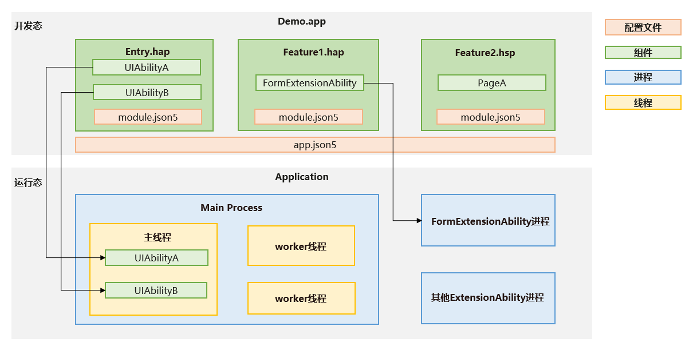

# Stage模型开发概述

<!--Kit: Ability Kit-->
<!--Subsystem: Ability-->
<!--Owner: @ccllee1; @Luobniz21-->
<!--Designer: @ccllee1-->
<!--Tester: @lixueqing513-->
<!--Adviser: @huipeizi-->

## 基本概念

下图展示了[Stage模型](ability-terminology.md#stage模型)中的基本概念。

**图1** Stage模型概念图

- [AbilityStage](abilitystage.md)

  每个Entry类型或者Feature类型的[HAP](../quick-start/hap-package.md)在运行期都有一个AbilityStage实例，当[HAP](../quick-start/hap-package.md)中的代码首次被加载到进程中的时候，系统会先创建AbilityStage实例。
  
- [UIAbility组件](uiability-overview.md)和[ExtensionAbility组件](extensionability-overview.md)
  
  Stage模型提供UIAbility和ExtensionAbility两种类型的组件，这两种组件都有具体的类承载，支持面向对象的开发方式。
  
  - UIAbility组件是一种包含UI的应用组件，主要用于和用户交互。例如，图库类应用可以在UIAbility组件中展示图片瀑布流，在用户选择某个图片后，在新的页面中展示图片的详细内容。同时用户可以通过返回键返回到瀑布流页面。UIAbility组件的生命周期只包含创建、销毁、前台、后台等状态，与显示相关的状态通过WindowStage的事件暴露给开发者。
  
  - ExtensionAbility组件是一种面向特定场景的应用组件。开发者并不直接从ExtensionAbility组件派生，而是需要使用ExtensionAbility组件的派生类。目前ExtensionAbility组件有用于卡片场景的FormExtensionAbility，用于输入法场景的InputMethodExtensionAbility，用于延时任务场景的WorkSchedulerExtensionAbility等多种派生类，这些派生类都是基于特定场景提供的。例如，用户在桌面创建应用的卡片，需要应用开发者从FormExtensionAbility派生，实现其中的回调函数，并在配置文件中配置该能力。ExtensionAbility组件的派生类实例由用户触发创建，并由系统管理生命周期。在Stage模型上，三方应用开发者不能开发自定义服务，而需要根据自身的业务场景通过ExtensionAbility组件的派生类来实现。

  一个HAP包中可以包含一个或多个UIAbility/ExtensionAbility组件，这些组件在运行时共用同一个AbilityStage实例。当[HAP](../quick-start/hap-package.md)中的代码（无论是UIAbility组件还是ExtensionAbility组件）首次被加载到进程中的时候，系统会先创建对应的AbilityStage实例。
- [WindowStage](../reference/apis-arkui/arkts-apis-window-WindowStage.md)

  每个UIAbility实例都会与一个WindowStage类实例绑定，该类起到了应用进程内窗口管理器的作用。它包含一个主窗口。也就是说UIAbility实例通过WindowStage持有了一个主窗口，该主窗口为ArkUI提供了绘制区域，可以加载不同的ArkUI页面。

- [Context](application-context-stage.md)

  在Stage模型上，Context及其派生类向开发者提供在运行期可以调用的各种资源和能力。UIAbility组件和各种ExtensionAbility组件的派生类都有各自不同的Context类，他们都继承自基类Context，但是各自又根据所属组件，提供不同的能力。

## 构成要素
在[应用模型](application-models.md)章节中介绍了应用模型的构成要素，主要包含应用组件、配置文件、进程模型、线程模型和任务管理模型。下面我们以Demo.app这个应用为例，从应用的开发阶段和运行阶段分别展开介绍，帮助开发者更好地理解Stage模型的构成要素。

该Demo应用主要实现了如下功能：
- 实现了两个独立的带界面的窗口（UIAbilityA、UIAbilityB），可以与用户交互。
- 实现了卡片功能，便于用户将应用的卡片添加到桌面上。

**图2** Stage模型构成要素

**开发阶段** ：需要通过Stage模型提供的应用组件（UIAbility组件和ExtensionAbility组件）开发应用功能，并在应用的配置文件（app.json5和module.json5）中注册应用的相关信息。

- 应用组件：本例中使用UIAbility组件开发带界面的与用户交互的模块，使用FormExtensionAbility组件开发卡片模块，实现卡片的添加、删除、更新功能。为了减少不同功能模块间的依赖和耦合，将UIAbility和FormExtensionAbility的实现分别放在不同的HAP包中，同时，将两者共同依赖的一些通用功能放在HSP包中。

- 配置文件：开发者可以在app.json5中配置应用的应用名、版本号、应用图标等，在module.json5中配置该HAP包下的组件清单、组件权限等信息。这些配置信息会在应用安装时注册到系统，便于系统和其他模块获取这个应用的详细信息，与应用进行交互。

**运行阶段**：当应用安装到设备运行时，系统通过一套应用进程和线程的管理机制，确保功能的有序运行。<!--Del-->此外，还提供了一套任务管理机制，用于管理任务的创建、销毁、前后台切换等。<!--DelEnd-->
 

- 进程模型：UIAbility组件默认运行在主进程中，FormExtensionAbility组件运行在独立进程中，UIAbility和FormExtensionAbility组件之间是进程隔离的。

- 线程模型：Stage模型提供了worker、taskpool等机制支撑应用多线程开发场景。应用如果有复杂的耗时逻辑需要处理，可以通过创建worker的方式开启worker线程，交由worker线程处理。

<!--Del-->
- 任务管理模型：UIAbility组件在运行时，系统会创建一个任务与之对应。例如，当图中的UIAbilityA运行时，从“最近任务”界面，可以看到Demo应用的这个任务。用户点击这个任务时，系统会把UIAbilityA切换到前台。
<!--DelEnd-->

## 开发流程

基于Stage模型开发应用时，在应用模型部分，涉及如下开发过程。

**表1** Stage模型开发流程

| 任务 | 简介 | 相关指导 |
| -------- | -------- | -------- |
| 应用组件开发 | 本章节介绍了如何使用Stage模型的UIAbility组件和ExtensionAbility组件开发应用。 | -&nbsp;[应用/组件级配置](application-component-configuration-stage.md) -&nbsp;[UIAbility组件](uiability-overview.md) -&nbsp;[ExtensionAbility组件](extensionability-overview.md) -&nbsp;[AbilityStage组件管理器](abilitystage.md) -&nbsp;[应用上下文Context](application-context-stage.md) -&nbsp;[组件启动规则](component-startup-rules.md) |
| 了解进程模型 | 本章节介绍了Stage模型的进程模型以及几种常用的进程间通信方式。 | [进程模型概述](process-model-stage.md)|
| 了解线程模型 | 本章节介绍了Stage模型的线程模型以及几种常用的线程间通信方式。 | [线程模型概述](thread-model-stage.md) |
| 应用配置文件 | 本章节介绍Stage模型中应用配置文件的开发要求。 | [Stage模型应用配置文件](config-file-stage.md) |

## 相关实例

针对Stage模型开发，有以下相关实例可供参考：

- [Stage模型（ArkTS）（Full SDK）(API10)](https://gitcode.com/openharmony/applications_app_samples/tree/master/code/SystemFeature/ApplicationModels/StageModel)