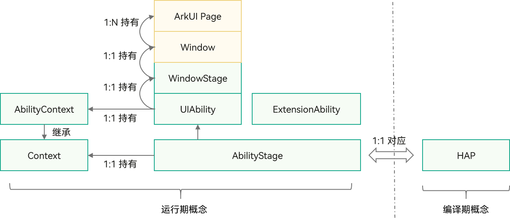
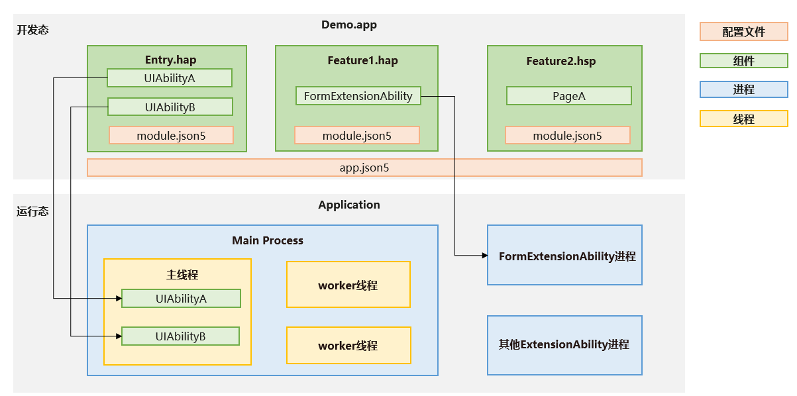

# 应用模型概述

<!--Kit: Ability Kit-->
<!--Subsystem: Ability-->
<!--Owner: @ccllee1; @Luobniz21-->
<!--Designer: @ccllee1-->
<!--Tester: @liangchengguang-->
<!--Adviser: @HelloCrease-->

## 应用模型简介
    
应用模型是系统为开发者提供的应用程序所需能力的抽象提炼，它提供了应用程序必备的组件和运行机制。有了应用模型，开发者可以基于一套统一的模型进行应用开发，使应用开发更简单、高效。

目前主推且会长期演进的应用模型是从API 9开始支持的Stage模型。该模型提供了AbilityStage组件管理器和WindowStage窗口管理器，分别作为应用组件与窗口的“舞台”，故得名"Stage模型"。

Stage模型支持多个应用组件共享同一个ArkTS引擎实例，以及应用组件间的状态共享与对象调用，可以降低内存开销、提升开发效率，适用于复杂应用的开发。

> **说明：**
> 
> - 随着应用模型的演进发展，从API 7开始支持的FA模型已经不再主推。当前FA模型主要用于Lite Wearable设备，相关指导详见[应用模型开发概述](fa-model-development-overview.md)。
> - 除非另有说明，文档中提及的"应用模型"均指"Stage 模型"。

## 基本概念

下图展示了[Stage模型](ability-terminology.md#stage模型)中的基本概念。

**图1** Stage模型概念图

- [AbilityStage](abilitystage.md)

  每个Entry类型或者Feature类型的[HAP](../quick-start/hap-package.md)在运行期都有一个AbilityStage实例，当[HAP](../quick-start/hap-package.md)中的代码首次被加载到进程中的时候，系统会先创建AbilityStage实例。
  
- [UIAbility组件](uiability-overview.md)和[ExtensionAbility组件](extensionability-overview.md)
  
  Stage模型提供UIAbility和ExtensionAbility两种类型的组件，这两种组件都有具体的类承载，支持面向对象的开发方式。
  
  - UIAbility组件是一种包含UI的应用组件，主要用于和用户交互。例如，图库类应用可以在UIAbility组件中展示图片瀑布流，在用户选择某个图片后，在新的页面中展示图片的详细内容。同时用户可以通过返回键返回到瀑布流页面。UIAbility组件的生命周期只包含创建、销毁、前台、后台等状态，与显示相关的状态通过WindowStage的事件暴露给开发者。
  
  - ExtensionAbility组件是一种面向特定场景的应用组件。开发者并不直接从ExtensionAbility组件派生，而是需要使用ExtensionAbility组件的派生类。目前ExtensionAbility组件有用于卡片场景的FormExtensionAbility，用于输入法场景的InputMethodExtensionAbility，用于延时任务场景的WorkSchedulerExtensionAbility等多种派生类，这些派生类都是基于特定场景提供的。例如，用户在桌面创建应用的卡片，需要开发者从FormExtensionAbility派生，实现其中的回调函数，并在配置文件中配置该能力。ExtensionAbility组件的派生类实例由用户触发创建，并由系统管理生命周期。在Stage模型上，三方应用开发者不能开发自定义服务，而需要根据自身的业务场景通过ExtensionAbility组件的派生类来实现。

  一个HAP包中可以包含一个或多个UIAbility/ExtensionAbility组件，这些组件在运行时共用同一个AbilityStage实例。当[HAP](../quick-start/hap-package.md)中的代码（无论是UIAbility组件还是ExtensionAbility组件）首次被加载到进程中的时候，系统会先创建对应的AbilityStage实例。
- [WindowStage](../reference/apis-arkui/arkts-apis-window-WindowStage.md)

  每个UIAbility实例都会与一个WindowStage类实例绑定，该类起到了应用进程内窗口管理器的作用。它包含一个主窗口。也就是说UIAbility实例通过WindowStage持有了一个主窗口，该主窗口为ArkUI提供了绘制区域，可以加载不同的ArkUI页面。

- [Context](application-context-stage.md)

  在Stage模型上，Context及其派生类向开发者提供在运行期可以调用的各种资源和能力。UIAbility组件和各种ExtensionAbility组件的派生类都有各自不同的Context类，它们都继承自基类Context，但是各自又根据所属组件，提供不同的能力。

- ArkUI页面

  ArkUI页面是基于ArkUI框架构建的用户界面组件，可以将不同UI组件组合在一起，实现复杂的页面效果。UIAbility组件可以通过ArkUI页面展示其功能，同时也可以通过ArkUI页面与用户进行交互。

- Application

  Application是应用在设备上的运行实例，作为一个完整的软件实体与用户交互。在Stage模型中，它由一个或多个HAP作为功能模块构成，这些HAP可以共享一个或多个HSP中的代码与资源。

- Bundle

  Bundle是应用在安装部署阶段的静态文件，包含了所有HAP、HSP及相关资源；当其被安装并启动后，便形成了在运行期的动态实例Application。

## 构成要素
应用模型的构成要素主要包含应用组件、进程模型、线程模型、任务管理模型以及应用配置文件。

### 应用组件
       
应用组件是应用的基本组成单位和运行入口。

在用户启动、使用和退出应用的过程中，应用组件会在不同的状态间切换，这些状态称为[应用组件的生命周期](uiability-lifecycle.md)。

应用组件提供生命周期回调函数，开发者通过这些回调可以感知应用状态的变化。

在开发应用时，开发者首先需要编写应用组件及其生命周期回调函数，并在应用配置文件中配置相关信息。操作系统在运行时通过配置文件创建应用组件实例，并调度其生命周期回调函数，从而执行开发者的代码。
    
### 应用进程模型
    
应用进程模型定义应用进程的创建和销毁方式，以及进程间的通信方式。
    
### 应用线程模型
    
应用线程模型定义应用进程内线程的创建和销毁方式、主线程和UI线程的创建方式、线程间的通信方式。
    
### 应用任务管理模型（仅对系统应用开放）
    
应用任务管理模型定义任务（Mission）的创建和销毁方式，以及任务与组件间的关系。

任务是用户使用一个应用组件实例的记录。每次用户启动一个新的应用组件实例，都会生成一个新的任务。

例如，用户启动一个视频应用，在"最近任务"界面可以看到视频应用这个任务。当用户点击这个任务时，系统会把该任务切换到前台。如果这个视频应用中的视频编辑功能也是通过应用组件编写的，在用户启动视频编辑功能时，会创建视频编辑的应用组件实例，在"最近任务"界面中将会展示视频应用、视频编辑两个任务。
    
### 应用配置文件
    
应用配置文件中包含应用配置信息、应用组件信息、权限信息、开发者自定义信息等，这些信息在编译构建、分发和运行阶段分别提供给编译工具、应用市场和操作系统使用。

### 应用构成要素示例

下面我们以Demo.app这个应用为例，从应用的开发阶段和运行阶段分别展开介绍，帮助开发者更好地理解Stage模型的构成要素。

该Demo应用主要实现了如下功能：
- 实现了两个独立的带界面的窗口（UIAbilityA、UIAbilityB），可以与用户交互。
- 实现了卡片功能，便于用户将应用的卡片添加到桌面上。

**图2** Stage模型构成要素

**开发阶段** ：需要通过Stage模型提供的应用组件（UIAbility组件和ExtensionAbility组件）开发应用功能，并在应用的配置文件（app.json5和module.json5）中注册应用的相关信息。

- 应用组件：本例中使用UIAbility组件开发带界面的与用户交互的模块，使用FormExtensionAbility组件开发卡片模块，实现卡片的添加、删除、更新功能。为了减少不同功能模块间的依赖和耦合，将UIAbility和FormExtensionAbility的实现分别放在不同的HAP包中，同时，将两者共同依赖的一些通用功能放在HSP包中。

- 配置文件：开发者可以在app.json5中配置应用的应用名、版本号、应用图标等，在module.json5中配置该HAP包下的组件清单、组件权限等信息。这些配置信息会在应用安装时注册到系统，便于系统和其他模块获取这个应用的详细信息，与应用进行交互。

**运行阶段**：当应用安装到设备运行时，系统通过一套应用进程和线程的管理机制，确保功能的有序运行。<!--Del-->此外，还提供了一套任务管理机制，用于管理任务的创建、销毁、前后台切换等。<!--DelEnd-->
 

- 进程模型：在本例中，UIAbility组件默认运行在主进程中，FormExtensionAbility组件运行在独立进程中，UIAbility和FormExtensionAbility组件之间是进程隔离的。更多详情可参考[进程模型](process-model-stage.md)。

- 线程模型：Stage模型提供了worker、taskpool等机制支撑应用多线程开发场景。应用如果有复杂的耗时逻辑需要处理，可以通过创建worker的方式开启worker线程，交由worker线程处理。

<!--Del-->
- 任务管理模型：UIAbility组件在运行时，系统会创建一个任务与之对应。例如，当图中的UIAbilityA运行时，从“最近任务”界面，可以看到Demo应用的这个任务。用户点击这个任务时，系统会把UIAbilityA切换到前台。
<!--DelEnd-->

## 相关实例

针对Stage模型开发，有以下相关实例可供参考：

- [Stage模型（ArkTS）（Full SDK）(API10)](https://gitcode.com/openharmony/applications_app_samples/tree/master/code/SystemFeature/ApplicationModels/StageModel)