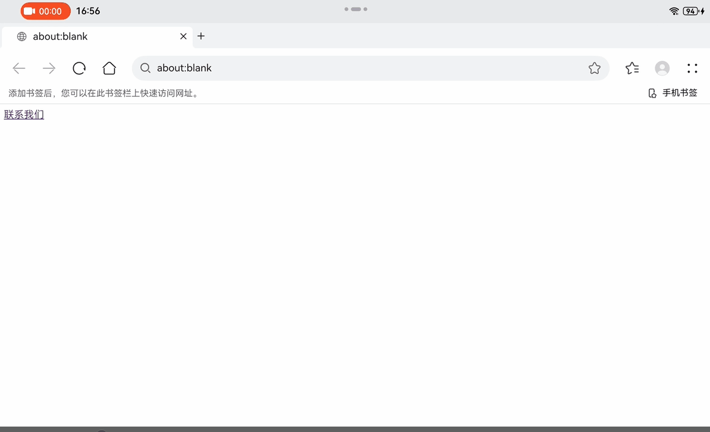

# 拉起邮件类应用（mailto方式）

## 使用场景

+ 场景一，网页拉起：
    + 用户在购物网站浏览产品页面时，看到“联系我们”按钮，点击后会拉起默认邮件客户端，收件人自动填写为客服邮箱，邮件主题设定为产品咨询。
    + 在招聘岗位页面，点击“申请职位”按钮，会拉起邮件客户端，收件人地址为招聘邮箱，邮件主题为“应聘某职位”，正文可以预先填入申请模板。
+ 场景二，应用拉起：
    + 移动应用中，用户点击“反馈”按钮时，应用调用系统功能，拉起默认邮件客户端，预先填写反馈邮箱、问题描述等信息。
    + 移动应用中，当用户点击“通过邮件分享”按钮时，应用会通过 `mailto` 调用邮件客户端，预填邮件主题和正文

## 接口说明

mailto标准协议格式

```
mailto:someone@example.com?key1=value1&key2=value2
```

+ `mailto:`：mailto scheme，必填
+ `someone@example.com`：收件人地址，选填，可以有多个，逗号分隔
+ `?`：邮件头声明开始符号，如果带邮件头参数，则必填
+ `key-value`：邮件头参数，详细参数见下表

| 邮件头| 含义| 数据类型 | 是否必填|
| --- | --- | --- | --- |
| subject | 邮件主题 | string | 否 |
| body | 邮件正文 | string | 否 |
| cc| 抄送人，多个用逗号分隔 | string | 否 |
| bcc| 密送人，多个用逗号分隔 | string | 否 |

## 调用方开发步骤

### 网页开发mailto

超链接满足mailto协议即可

```
<a href="mailto:support@onlineshop.com?subject=Product Inquiry&body=I am interested in...">联系我们</a>
```



### 应用开发mailto

保证mailto字符串传入uri参数即可，在应用中page页面可通过 getContext(this) 获取context，在ability中可通过this.context获取context。

```
@Entry
@Component
struct Index {

  build() {
    Column() {
      Button('反馈')
        .onClick(() => {
          let ctx = getContext(this) as common.UIAbilityContext;
          ctx.startAbility({
            action: 'ohos.want.action.sendToData',
            uri: 'mailto:feedback@example.com?subject=App Feedback&body=Please describe your feedback here...'
          })
        
        })
    }
  }
}
```


## 目标方开发步骤

1. 为了能够支持被其他应用通过mailto协议拉起，目标应用需要在[module.json5配置文件](../quick-start/module-configuration-file.md)中声明mailto。

```
{
  "module": {
    // ...
    "abilities": [
      {
        // ...
        "skills": [
          {
           "actions": [
              'ohos.want.action.sendToData'
            ],
            "uris": [
              {
                "scheme": "mailto",
                // linkFeature 用于适配垂类面板拉起
                "linkFeature": 'ComposeMail'
              }
            ]
          }
        ]
      }
    ]
  }
}
```

2. 目标应用在代码中取出uri参数进行解析

```
export default class EntryAbility extends UIAbility {
  onCreate(want: Want, launchParam: AbilityConstant.LaunchParam): void { 
    // 应用冷启动生命周期回调，其他业务处理...
    parseMailto(want);
  }

  onNewWant(want: Want, launchParam: AbilityConstant.LaunchParam): void {
    // 应用热启动生命周期回调，其他业务处理...
    parseMailto(want);
  }

  public parseMailto(want: Want) {
    const uri = want?.uri;
    if (!uri || uri.length <= 0) {
      return;
    }
    // 开始解析 mailto...
  }
}

```
