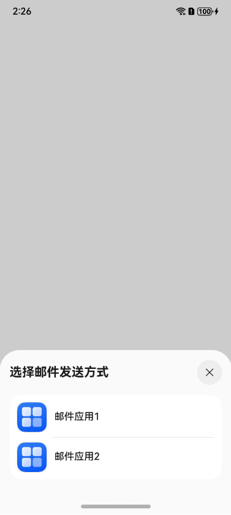

# 拉起邮件类应用（startAbilityByType）

本章节介绍如何拉起邮件类应用扩展面板。

## 邮件类应用扩展面板参数说明

startAbilityByType接口中type字段为mail，对应的wantParam参数：

| 参数名                                | 类型                                                         | 必填 | 说明                                                         |
| ------------------------------------- | ------------------------------------------------------------ | ---- | ------------------------------------------------------------ |
| email                                 | string[ ]                                                    | 否   | 收件人邮箱地址（支持多个且以逗号分隔）                       |
| cc                                    | string[ ]                                                    | 否   | 抄收人邮箱地址（支持多个且以逗号分隔）                       |
| bcc                                   | string[ ]                                                    | 否   | 密送人邮箱地址（支持多个且以逗号分隔）                       |
| subject                               | string                                                       | 否   | 邮件主题                                                     |
| body                                  | string                                                       | 否   | 邮件内容                                                     |
| ability.params.stream                 | string[ ]                                                    | 否   | 邮件附件（附件的uri地址列表）                                |
| ability.want.params.uriPermissionFlag | [wantConstant.Flags](../reference/apis-ability-kit/js-apis-app-ability-wantConstant.md#flags) | 否   | 给邮件附件赋予至少读权限。邮件附件参数存在时，该参数也必须要传 |
| sceneType                             | number                                                       | 否   | 意图取值 ：1：发邮件。默认为1。                              |

> **说明：**
>
> * 邮件类应用扩展面板中的类型为string的参数，都要经过encodeURI编码。
> 
> * 邮件类应用扩展面板中的类型为string[]的参数，数组中的元素都要经过encodeURI编码。

## 拉起方开发步骤
1. 导入ohos.app.ability.common模块。 
    ```ts
    import { common, wantConstant } from '@kit.AbilityKit';
    ```
2. 构造接口参数并调用startAbilityByType接口。

    ```ts
    let context = getContext(this) as common.UIAbilityContext;
    let wantParam: Record<string, Object> = {
      'sceneType': 1,
      'email': [encodeURI('xxx@example.com'),encodeURI('xxx@example.com')], // 收件人邮箱地址，多值以逗号分隔，对数组内容使用encodeURI()方法进行url编码
      'cc': [encodeURI('xxx@example.com'),encodeURI('xxx@example.com')], // 抄收人邮箱地址，多值以逗号分隔，对数组内容使用encodeURI()方法进行url编码
      'bcc': [encodeURI('xxx@example.com'),encodeURI('xxx@example.com')], // 密送人邮箱地址，多值以逗号分隔，对数组内容使用encodeURI()方法进行url编码
      'subject': encodeURI('邮件主题'), // 邮件主题，对内容使用encodeURI()方法进行url编码
      'body': encodeURI('邮件正文'), // 邮件正文，对内容使用encodeURI()方法进行url编码
      'ability.params.stream': [encodeURI('附件uri1'),encodeURI('附件uri2')], // 附件uri，多值以逗号分隔，对数组内容使用encodeURI()方法进行url编码
      'ability.want.params.uriPermissionFlag': wantConstant.Flags.FLAG_AUTH_READ_URI_PERMISSION
    };
    let abilityStartCallback: common.AbilityStartCallback = {
      onError: (code: number, name: string, message: string) => {
        console.log(`onError code ${code} name: ${name} message: ${message}`);
      },
      onResult: (result)=>{
        console.log(`onResult result: ${JSON.stringify(result)}`);
      }
    }
    
    context.startAbilityByType("mail", wantParam, abilityStartCallback, 
        (err) => {
            if (err) {
                console.error(`startAbilityByType fail, err: ${JSON.stringify(err)}`);
            } else {
                console.log(`success`);
            }
    });
    ```
    效果示例图：
    
    

## 目标方开发步骤

1. 在module.json5中新增[linkFeature](../quick-start/module-configuration-file.md#skills标签)属性并设置声明当前应用支持的特性功能，从而系统可以从设备已安装应用中找到当前支持该特性的应用，取值范围如下：

    | 取值           | 含义                      |
    | --------------| ------------------------- |
    | ComposeMail   | 声明应用支持撰写邮件功能		|

    ```json
    {
      "abilities": [
          {
          "skills": [
              {
              "uris": [
                  {
                  "scheme": "mailto", // 这里仅示意，应用需确保这里声明的的uri能被外部正常拉起
                  "host": "",
                  "path": "",
                  "linkFeature": "ComposeMail" // 声明应用支持撰写邮件功能
                  }
                ]
              }
          ]
          }
      ]
    }
    ```
    
2. 解析面板传过来的参数并做对应处理。

    ```ts
    UIAbility::onCreate(want: Want, launchParam: AbilityConstant.LaunchParam): void
    ```

    在参数**want.parameters**中会携带Caller方传入的参数（与调用方传入的有些差异），如下表所示：

    | 参数名  | 类型      | 必填 | 说明                                   |
    | ------- | --------- | ---- | -------------------------------------- |
    | email   | string[ ] | 否   | 收件人邮箱地址（支持多个且以逗号分隔） |
    | cc      | string[ ] | 否   | 抄收人邮箱地址（支持多个且以逗号分隔） |
    | bcc     | string[ ] | 否   | 密送人邮箱地址（支持多个且以逗号分隔） |
    | subject | string    | 否   | 邮件主题                               |
    | body    | string    | 否   | 邮件内容                               |
    | stream  | string[ ] | 否   | 邮件附件列表（附件的uri地址列表）      |
    
    > **说明：**
    > 
    > * 目标方接收的类型为string的参数，都要经过decodeURI解码。
    > 
    > * 目标方接收的类型为string[]的参数，数组中的元素都要经过decodeURI解码。

**完整示例：**

```ts
import { AbilityConstant, UIAbility, Want } from '@kit.AbilityKit';
import { hilog } from '@kit.PerformanceAnalysisKit';
import { window } from '@kit.ArkUI';

const TAG = 'MailTarget1.EntryAbility'

export default class EntryAbility extends UIAbility {
    windowStage: window.WindowStage | null = null;

    email: string[] | undefined;
    cc: string[] | undefined;
    bcc: string[] | undefined;
    subject: string | undefined;
    body: string | undefined;
    stream: string[] | undefined;
    
    onCreate(want: Want, launchParam: AbilityConstant.LaunchParam): void {
        hilog.info(0x0000, TAG, `onCreate, want=${JSON.stringify(want)}`);
        super.onCreate(want, launchParam);
        this.parseWant(want);
    }

    onNewWant(want: Want, launchParam: AbilityConstant.LaunchParam): void {
        hilog.info(0x0000, TAG, `onNewWant, want=${JSON.stringify(want)}`);
        super.onNewWant(want, launchParam);
        this.parseWant(want);
        if (!this.windowStage) {
            hilog.error(0x0000, TAG, 'windowStage is null');
            this.context.terminateSelf();
            return;
        }
        this.loadPage(this.windowStage);
    }

    private parseWant(want: Want): void {
        this.email = this.decodeStringArr(want.parameters?.email as string[]);
        this.cc = this.decodeStringArr(want.parameters?.cc as string[]);
        this.bcc = this.decodeStringArr(want.parameters?.bcc as string[]);
        this.subject = decodeURI(want.parameters?.subject as string);// 使用decodeURI()方法对邮件主题进行url解码，其他字段处理方法相同
        this.body = decodeURI(want.parameters?.body as string);// 使用decodeURI()方法对邮件内容进行url解码，其他字段处理方法相同
        this.stream = this.decodeStringArr(want.parameters?.stream as string[]);
    }

    // 使用decodeURI()方法对string数组内容进行解码
    private decodeStringArr(source: string[] | undefined): string[] {
        let target: string[] = [];
        source?.forEach(e => {
            target.push(decodeURI(e));
        })
        return target;
    }

    private loadPage(windowStage: window.WindowStage): void {
        const storage: LocalStorage = new LocalStorage({
            "email": this.email,
            "cc": this.cc,
            "bcc": this.bcc,
            "subject": this.subject,
            "body": this.body,
            "stream": this.stream
        } as Record<string, Object>);

        windowStage.loadContent('pages/ComposeMailPage', storage);

    }

    onDestroy(): void {
        hilog.info(0x0000, TAG, `onDestroy`);
    }

    onWindowStageCreate(windowStage: window.WindowStage): void {
        hilog.info(0x0000, TAG, `onWindowStageCreate`);
        this.windowStage = windowStage;
        this.loadPage(this.windowStage);
    }

    onWindowStageDestroy(): void {
        hilog.info(0x0000, TAG, `onWindowStageDestroy`);
    }

    onForeground(): void {
        hilog.info(0x0000, TAG, `onForeground`);
    }

    onBackground(): void {
        hilog.info(0x0000, TAG, `onBackground`);
    }
}
```