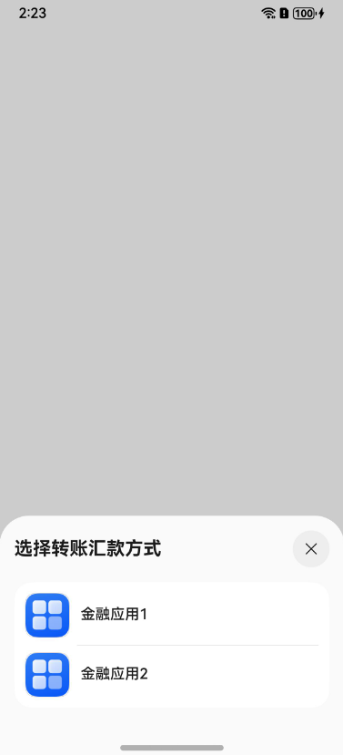

# 拉起金融类应用（startAbilityByType）

本章节介绍如何拉起金融类应用扩展面板。

## 金融类应用扩展面板参数说明

startAbilityByType接口中type字段为finance，对应的wantParam参数：

| 参数名            | 类型                                                         | 必填 | 说明 |
| -------------------- | ------------------------------------------------------------ | -------- | -------- |
| sceneType            | number                          | 否 | 意图场景，表明本次请求对应的操作意图。1：转账汇款 2：信用卡还款。默认为1 |
| bankCardNo      | string                                               | 否  | 银行卡卡号 |

## 拉起方开发步骤
1. 导入相关模块。 
    ```ts
    import { common } from '@kit.AbilityKit';
    ```
2. 构造接口参数并调用startAbilityByType接口。

    ```ts
    @Entry
    @Component
    struct Index {
        @State hideAbility: string = 'hideAbility'

        build() {
            Row() {
                Column() {
                    Text(this.hideAbility)
                        .fontSize(30)
                        .fontWeight(FontWeight.Bold)
                        .onClick(() => {
                            let context = this.getUIContext().getHostContext() as common.UIAbilityContext;
                            let wantParam: Record<string, Object> = {
                                'sceneType': 1,
                                "bankCardNo": '123456789'
                            };
                            let abilityStartCallback: common.AbilityStartCallback = {
                                onError: (code: number, name: string, message: string) => {
                                    console.log(`onError code ${code} name: ${name} message: ${message}`);
                                },
                                onResult: (result) => {
                                    console.log(`onResult result: ${JSON.stringify(result)}`);
                                }
                            }

                            context.startAbilityByType("finance", wantParam, abilityStartCallback,
                                (err) => {
                                    if (err) {
                                        console.error(`startAbilityByType fail, err: ${JSON.stringify(err)}`);
                                    } else {
                                        console.log(`success`);
                                    }
                                });
                        });
                }
                .width('100%')
            }
            .height('100%')
        }
    }
    ```
    效果示例图：
    
    

## 目标方开发步骤

1. 在module.json5中配置[uris](../quick-start/module-configuration-file.md#skills标签)，步骤如下：
   1. 设置linkFeature属性以声明当前应用支持的特性功能，从而系统可以从设备已安装应用中找到当前支持该特性的应用，取值范围如下：

        | 取值           | 含义                         |
        | -------------- | ---------------------------- |
        | Transfer     | 声明应用支持转账汇款功能 		|
        | CreditCardRepayment      | 声明应用支持信用卡还款功能		|
   2. 设置scheme、host、port、path/pathStartWith属性，与Want中URI相匹配，以便区分不同功能。

    ```json
    {
      "abilities": [
          {
          "skills": [
              {
              "uris": [
                  {
                  "scheme": "finance", // 这里仅示意，应用需确保这里声明的的uri能被外部正常拉起
                  "host": "transfer",
                  "path": "",
                  "linkFeature": "Transfer" // 声明应用支持转账汇款功能
                  },
                  {
                  "scheme": "finance", // 这里仅示意，应用需确保这里声明的的uri能被外部正常拉起
                  "host": "credit_card_repayment",
                  "path": "",
                  "linkFeature": "CreditCardRepayment" // 声明应用支持信用卡还款功能
                  }
              ]
              }
          ]
          }
      ]
    }
    ```
   
2. 解析面板传过来的参数并做对应处理。

    ```ts
    UIAbility.onCreate(want: Want, launchParam: AbilityConstant.LaunchParam): void
    ```

    在参数**want.uri**中会携带目标方配置的linkFeature对应的uri;

    在参数**want.parameters**中会携带Caller方传入的参数，如下表所示：

    | 参数名          | 类型                                                         | 必填 | 说明 |
    | -------------------- | ------------------------------------------------------------ | -------- | -------- |
    | bankCardNo  | string | 否  | 银行卡卡号 |

    应用可根据[linkFeature](../quick-start/module-configuration-file.md#skills标签)中定义的特性功能，比如转账汇款和信用卡还款，结合接收到的uri开发不同的样式页面。

**完整示例：**

```ts
import { AbilityConstant, UIAbility, Want } from '@kit.AbilityKit';
import { hilog } from '@kit.PerformanceAnalysisKit';
import { window } from '@kit.ArkUI';

const TAG = 'EntryAbility'

export default class EntryAbility extends UIAbility {
    windowStage: window.WindowStage | null = null;

    uri?: string;
    bankCardNo?: string;

    onCreate(want: Want, launchParam: AbilityConstant.LaunchParam): void {
        hilog.info(0x0000, TAG, `onCreate, want=${JSON.stringify(want)}`);
        super.onCreate(want, launchParam);
        this.parseWant(want);
    }

    onNewWant(want: Want, launchParam: AbilityConstant.LaunchParam): void {
        hilog.info(0x0000, TAG, `onNewWant, want=${JSON.stringify(want)}`);
        super.onNewWant(want, launchParam);
        this.parseWant(want);
        if (!this.windowStage) {
            hilog.error(0x0000, TAG, 'windowStage is null');
            this.context.terminateSelf();
            return;
        }
        this.loadPage(this.windowStage);
    }

    private parseWant(want: Want): void {
        this.uri = want.uri as string | undefined;
        this.bankCardNo = want.parameters?.bankCardNo as string | undefined;
    }

    private loadPage(windowStage: window.WindowStage): void {
        hilog.info(0x0000, TAG, `loadPage, uri=${this.uri}`);
        if (this.uri === 'finance://transfer') {
            // 构建转账场景参数
            const storage: LocalStorage = new LocalStorage({
                "bankCardNo": this.bankCardNo
            } as Record<string, Object>);
            // 拉起转账页面
            windowStage.loadContent('pages/TransferPage', storage)
        } else if (this.uri === 'finance://credit_card_repayment') {
            // 构建信用卡还款场景参数
            const storage: LocalStorage = new LocalStorage({
                "bankCardNo": this.bankCardNo
            } as Record<string, Object>);
            // 拉起信用卡还款页面
            windowStage.loadContent('pages/CreditCardRepaymentPage', storage)
        } else {
            // 默认拉起首页
            windowStage.loadContent('pages/Index', (err) => {
                if (err.code) {
                    hilog.error(0x0000, TAG, 'Failed to load the content. Cause: %{public}s',
                        JSON.stringify(err) ?? '');
                    return;
                }
                hilog.info(0x0000, TAG, 'Succeeded in loading the content.');
            });
        }
    }

    onDestroy(): void {
        hilog.info(0x0000, TAG, `onDestroy`);
    }

    onWindowStageCreate(windowStage: window.WindowStage): void {
        hilog.info(0x0000, TAG, `onWindowStageCreate`);
        this.windowStage = windowStage;
        this.loadPage(this.windowStage);
    }

    onWindowStageDestroy(): void {
        hilog.info(0x0000, TAG, '%{public}s', 'Ability onWindowStageDestroy');
    }

    onForeground(): void {
        hilog.info(0x0000, TAG, '%{public}s', 'Ability onForeground');
    }

    onBackground(): void {
        hilog.info(0x0000, TAG, '%{public}s', 'Ability onBackground');
    }
}
```