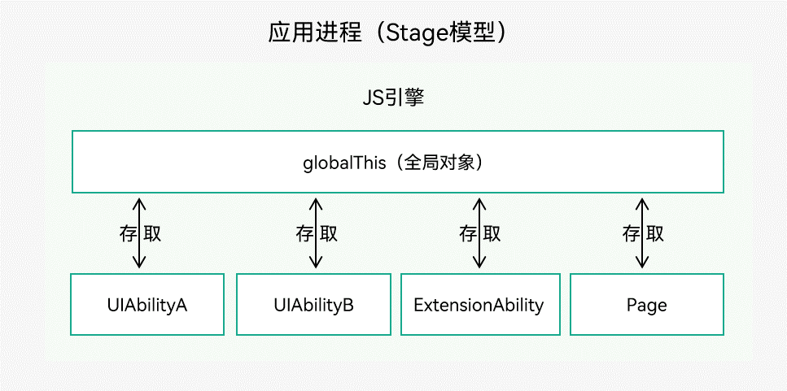
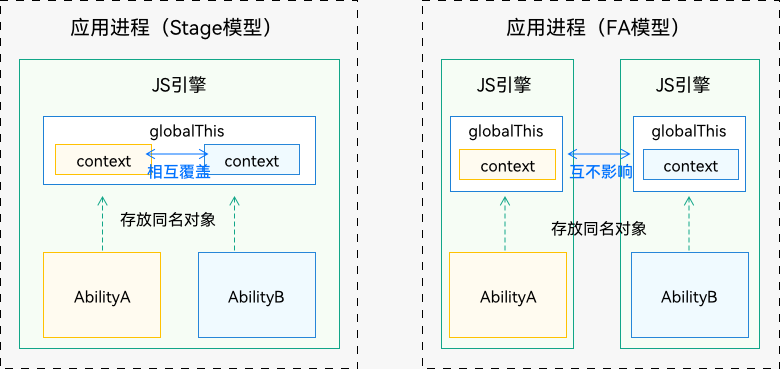

# UIAbility组件与UI的数据同步


基于OpenHarmony的应用模型，可以通过以下三种方式来实现UIAbility组件与UI之间的数据同步。

- EventHub：[基类Context](application-context-stage.md)提供了EventHub的能力，使用发布订阅模式来实现。事件需要先订阅后发布，订阅者收到消息后进行处理。

- globalThis：ArkTS引擎实例内部的一个全局对象，在ArkTS引擎实例内部都能访问。
- [页面级变量的状态管理](../quick-start/arkts-state-mgmt-application-level.md)。


## 使用EventHub进行数据通信

EventHub提供了UIAbility组件/ExtensionAbility组件级别的事件机制，以UIAbility组件/ExtensionAbility组件为中心提供了订阅、取消订阅和触发事件的数据通信能力。接口说明请参见[EventHub](../reference/apis/js-apis-inner-application-eventHub.md)。

在使用EventHub之前，首先需要获取EventHub对象。[基类Context](application-context-stage.md)提供了EventHub对象，本章节以使用EventHub实现UIAbility与UI之间的数据通信为例进行说明。

1. 在UIAbility中调用eventHub.on()方法注册一个自定义事件“event1”，eventHub.on()有如下两种调用方式，使用其中一种即可。

   ```ts
   import UIAbility from '@ohos.app.ability.UIAbility';

   const TAG: string = '[Example].[Entry].[EntryAbility]';

   export default class EntryAbility extends UIAbility {
       func1(...data) {
           // 触发事件，完成相应的业务操作
           console.info(TAG, '1. ' + JSON.stringify(data));
       }

       onCreate(want, launch) {
           // 获取eventHub
           let eventhub = this.context.eventHub;
           // 执行订阅操作
           eventhub.on('event1', this.func1);
           eventhub.on('event1', (...data) => {
               // 触发事件，完成相应的业务操作
               console.info(TAG, '2. ' + JSON.stringify(data));
           });
       }
   }
   ```

2. 在UI界面中通过eventHub.emit()方法触发该事件，在触发事件的同时，根据需要传入参数信息。

   ```ts
   import common from '@ohos.app.ability.common';

   @Entry
   @Component
   struct Index {
     private context = getContext(this) as common.UIAbilityContext;

     eventHubFunc() {
       // 不带参数触发自定义“event1”事件
       this.context.eventHub.emit('event1');
       // 带1个参数触发自定义“event1”事件
       this.context.eventHub.emit('event1', 1);
       // 带2个参数触发自定义“event1”事件
       this.context.eventHub.emit('event1', 2, 'test');
       // 开发者可以根据实际的业务场景设计事件传递的参数
     }

     // 页面展示
     build() {
       // ...
     }
   }
   ```

3. 在UIAbility的注册事件回调中可以得到对应的触发事件结果，运行日志结果如下所示。

   ```ts
   []

   [1]

   [2,'test']
   ```

4. 在自定义事件“event1”使用完成后，可以根据需要调用eventHub.off()方法取消该事件的订阅。

   ```ts
   // context为UIAbility实例的AbilityContext
   this.context.eventHub.off('event1');
   ```


## 使用globalThis进行数据同步


globalThis是ArkTS引擎实例内部的一个全局对象，引擎内部的UIAbility/ExtensionAbility/Page都可以使用，因此可以使用globalThis全局对象进行数据同步。

  **图1** 使用globalThis进行数据同步



如上图所示，下面从如下三个场景和一个注意点来介绍globalThis的使用：

- [UIAbility和Page之间使用globalThis](#uiability和page之间使用globalthis)
- [UIAbility和UIAbility之间使用globalThis](#uiability和uiability之间使用globalthis)
- [UIAbility和ExtensionAbility之间使用globalThis](#uiability和extensionability之间使用globalthis)
- [globalThis使用的注意事项](#globalthis使用的注意事项)

### UIAbility和Page之间使用globalThis

globalThis为[ArkTS引擎实例](thread-model-stage.md)下的全局对象，可以通过globalThis绑定属性/方法来进行UIAbility组件与UI的数据同步。例如在UIAbility组件中绑定want参数，即可在UIAbility对应的UI界面上使用want参数信息。

1. 调用startAbility()方法启动一个UIAbility实例时，被启动的UIAbility创建完成后会进入onCreate()生命周期回调，且在onCreate()生命周期回调中能够接受到传递过来的want参数，可以将want参数绑定到globalThis上。

   ```ts
   import UIAbility from '@ohos.app.ability.UIAbility'

   export default class EntryAbility extends UIAbility {
       onCreate(want, launch) {
           globalThis.entryAbilityWant = want;
           // ...
       }

       // ...
   }
   ```

2. 在UI界面中即可通过globalThis获取到want参数信息。

   ```ts
   let entryAbilityWant;
   
   @Entry
   @Component
   struct Index {
     aboutToAppear() {
       entryAbilityWant = globalThis.entryAbilityWant;
     }
   
     // 页面展示
     build() {
       // ...
     }
   }
   ```


### UIAbility和UIAbility之间使用globalThis

同一个应用中UIAbility和UIAbility之间的数据传递，可以通过将数据绑定到全局变量globalThis上进行同步，如在AbilityA中将数据保存在globalThis，然后跳转到AbilityB中取得该数据：

1. AbilityA中保存数据一个字符串数据并挂载到globalThis上。

   ```ts
   import UIAbility from '@ohos.app.ability.UIAbility'

   export default class AbilityA extends UIAbility {
       onCreate(want, launch) {
           globalThis.entryAbilityStr = 'AbilityA'; // AbilityA存放字符串“AbilityA”到globalThis
           // ...
       }
   }
   ```

2. AbilityB中获取对应的数据。

   ```ts
   import UIAbility from '@ohos.app.ability.UIAbility'
   
   export default class AbilityB extends UIAbility {
       onCreate(want, launch) {
           // AbilityB从globalThis读取name并输出
           console.info('name from entryAbilityStr: ' + globalThis.entryAbilityStr);
           // ...
       }
   }
   ```


### UIAbility和ExtensionAbility之间使用globalThis

同一个应用中UIAbility和ExtensionAbility之间的数据传递，也可以通过将数据绑定到全局变量globalThis上进行同步，如在AbilityA中保存数据，在ServiceExtensionAbility中获取数据。

1. AbilityA中保存数据一个字符串数据并挂载到globalThis上。

   ```ts
   import UIAbility from '@ohos.app.ability.UIAbility'

   export default class AbilityA extends UIAbility {
       onCreate(want, launch) {
           // AbilityA存放字符串“AbilityA”到globalThis
           globalThis.entryAbilityStr = 'AbilityA';
           // ...
       }
   }
   ```

2. ExtensionAbility中获取数据。

   ```ts
   import Extension from '@ohos.app.ability.ServiceExtensionAbility'
   
   export default class ServiceExtAbility extends Extension {
       onCreate(want) {
           // ServiceExtAbility从globalThis读取name并输出
           console.info('name from entryAbilityStr: ' + globalThis.entryAbilityStr);
           // ...
       }
   }
   ```


### globalThis使用的注意事项

  **图2** globalThis注意事项


- Stage模型下进程内的UIAbility组件共享ArkTS引擎实例，使用globalThis时需要避免存放相同名称的对象。例如AbilityA和AbilityB可以使用globalThis共享数据，在存放相同名称的对象时，先存放的对象会被后存放的对象覆盖。

- FA模型因为每个UIAbility组件之间引擎隔离，不会存在该问题。

- 对于绑定在globalThis上的对象，其生命周期与ArkTS虚拟机实例相同，建议在使用完成之后将其赋值为null，以减少对应用内存的占用。

Stage模型上同名对象覆盖导致问题的场景举例说明。

1. 在AbilityA文件中使用globalThis中存放了[UIAbilityContext](../reference/apis/js-apis-inner-application-uiAbilityContext.md)。

   ```ts
   import UIAbility from '@ohos.app.ability.UIAbility'

   export default class AbilityA extends UIAbility {
       onCreate(want, launch) {
           globalThis.context = this.context; // AbilityA存放context到globalThis
           // ...
       }
   }
   ```

2. 在AbilityA的页面中获取该[UIAbilityContext](../reference/apis/js-apis-inner-application-uiAbilityContext.md)并进行使用。使用完成后将AbilityA实例切换至后台。

   ```ts
   @Entry
   @Component
   struct Index {
     onPageShow() {
       let ctx = globalThis.context; // 页面中从globalThis中取出context并使用
       let permissions = ['com.example.permission']
       ctx.requestPermissionsFromUser(permissions,(result) => {
          // ...
       });
     }
     // 页面展示
     build() {
       // ...
     }
   }
   ```

3. 在AbilityB文件中使用globalThis中存放了[UIAbilityContext](../reference/apis/js-apis-inner-application-uiAbilityContext.md)，并且命名为相同的名称。

   ```ts
   import UIAbility from '@ohos.app.ability.UIAbility'

   export default class AbilityB extends UIAbility {
       onCreate(want, launch) {
           // AbilityB覆盖了AbilityA在globalThis中存放的context
           globalThis.context = this.context;
           // ...
       }
   }
   ```

4. 在AbilityB的页面中获取该[UIAbilityContext](../reference/apis/js-apis-inner-application-uiAbilityContext.md)并进行使用。此时获取到的globalThis.context已经表示为AbilityB中赋值的[UIAbilityContext](../reference/apis/js-apis-inner-application-uiAbilityContext.md)内容。

   ```ts
   @Entry
   @Component
   struct Index {
     onPageShow() {
       let ctx = globalThis.context; // Page中从globalThis中取出context并使用
       let permissions = ['com.example.permission']
       ctx.requestPermissionsFromUser(permissions,(result) => {
         console.info('requestPermissionsFromUser result:' + JSON.stringify(result));
       });
     }
     // 页面展示
     build() {
       // ...
     }
   }
   ```

5. 在AbilityB实例切换至后台，将AbilityA实例从后台切换回到前台。此时AbilityA的onCreate生命周期不会再次进入。

   ```ts
   import UIAbility from '@ohos.app.ability.UIAbility'

   export default class AbilityA extends UIAbility {
       onCreate(want, launch) { // AbilityA从后台进入前台，不会再走这个生命周期
           globalThis.context = this.context;
           // ...
       }
   }
   ```

6. 在AbilityA的页面再次回到前台时，其获取到的globalThis.context表示的为AbilityB的[UIAbilityContext](../reference/apis/js-apis-inner-application-uiAbilityContext.md)，而不是AbilityA的[UIAbilityContext](../reference/apis/js-apis-inner-application-uiAbilityContext.md)，在AbilityA的页面中使用则会出错。

   ```ts
   @Entry
   @Component
   struct Index {
     onPageShow() {
       let ctx = globalThis.context; // 这时候globalThis中的context是AbilityB的context
       let permissions=['com.example.permission'];
       ctx.requestPermissionsFromUser(permissions,(result) => { // 使用这个对象就会导致进程崩溃
          console.info('requestPermissionsFromUser result:' + JSON.stringify(result));
       });
     }
     // 页面展示
     build() {
       // ...
     }
   }
   ```
