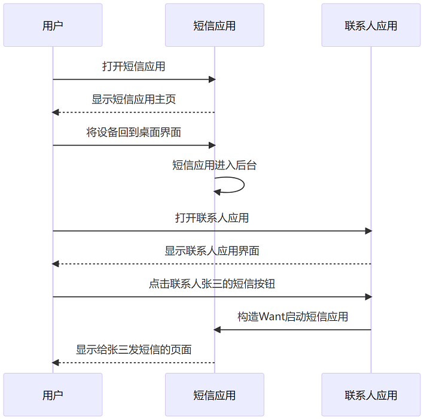
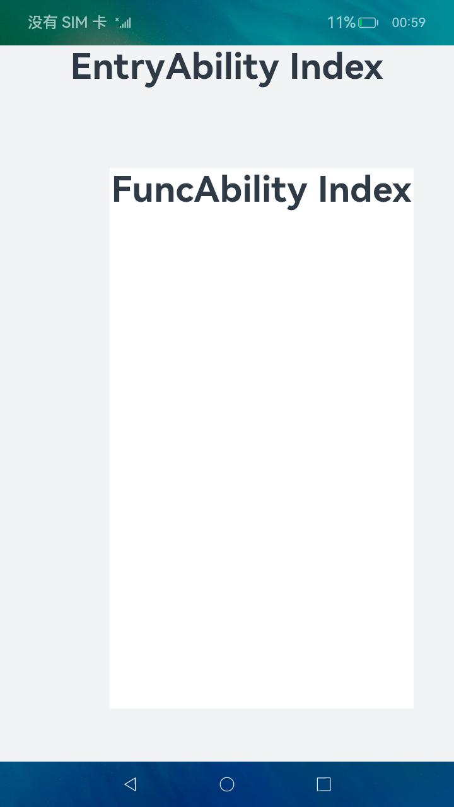
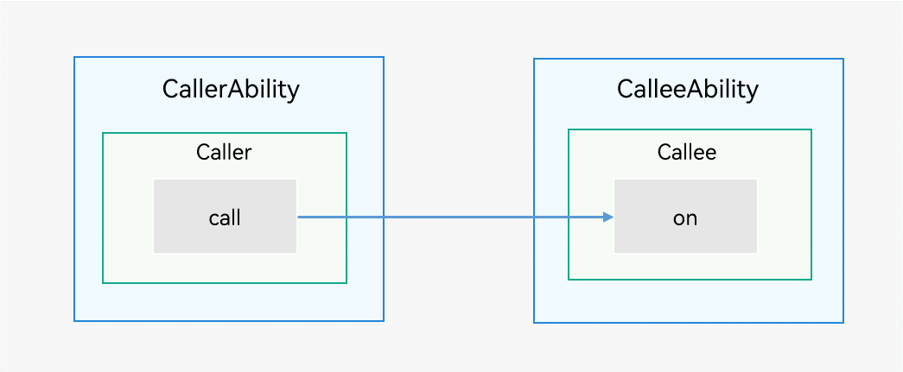

# 启动应用内的UIAbility组件


[UIAbility](../reference/apis-ability-kit/js-apis-app-ability-uiAbility.md)是系统调度的最小单元。在设备内的功能模块之间跳转时，会涉及到启动特定的UIAbility，包括应用内的其他UIAbility、或者其他应用的UIAbility（例如启动三方支付UIAbility）。


本文主要介绍启动应用内的UIAbility组件的方式。应用间的组件跳转详见[应用间跳转](link-between-apps-overview.md)。<!--Del-->对于跨设备的应用组件交互，请参见[应用组件跨设备交互（流转）](inter-device-interaction-hop-overview.md)。<!--DelEnd-->


- [启动应用内的UIAbility](#启动应用内的uiability)
- [启动应用内的UIAbility并获取返回结果](#启动应用内的uiability并获取返回结果)
- [启动UIAbility的指定页面](#启动uiability的指定页面)
<!--Del-->
- [启动UIAbility指定窗口模式（仅对系统应用开放）](#启动uiability指定窗口模式仅对系统应用开放)
- [通过Call调用实现UIAbility交互（仅对系统应用开放）](#通过call调用实现uiability交互仅对系统应用开放)
<!--DelEnd-->


## 启动应用内的UIAbility

当一个应用内包含多个[UIAbility](../reference/apis-ability-kit/js-apis-app-ability-uiAbility.md)时，存在应用内启动UIAbility的场景。例如在支付应用中从入口UIAbility启动收付款UIAbility。

假设应用中有两个UIAbility：EntryAbility和FuncAbility（可以在同一个Module中，也可以在不同的Module中），需要从EntryAbility的页面中启动FuncAbility。

1. 在EntryAbility中，通过调用[startAbility()](../reference/apis-ability-kit/js-apis-inner-application-uiAbilityContext.md#startability)方法启动UIAbility，[want](../reference/apis-ability-kit/js-apis-app-ability-want.md)为UIAbility实例启动的入口参数，其中bundleName为待启动应用的Bundle名称，abilityName为待启动的Ability名称，moduleName在待启动的UIAbility属于不同的Module时添加，parameters为自定义信息参数。示例中的context的获取方式请参见[获取UIAbility的上下文信息](uiability-usage.md#获取uiability的上下文信息)。

    ```ts
    import { common, Want } from '@kit.AbilityKit';
    import { hilog } from '@kit.PerformanceAnalysisKit';
    import { BusinessError } from '@kit.BasicServicesKit';

    const TAG: string = '[Page_UIAbilityComponentsInteractive]';
    const DOMAIN_NUMBER: number = 0xFF00;

    @Entry
    @Component
    struct Page_UIAbilityComponentsInteractive {
      private context = this.getUIContext().getHostContext() as common.UIAbilityContext;

      build() {
        Column() {
          //...
          List({ initialIndex: 0 }) {
            ListItem() {
              Row() {
                //...
              }
              .onClick(() => {
                // context为Ability对象的成员，在非Ability对象内部调用需要
                // 将Context对象传递过去
                let wantInfo: Want = {
                  deviceId: '', // deviceId为空表示本设备
                  bundleName: 'com.samples.stagemodelabilitydevelop',
                  moduleName: 'entry', // moduleName非必选
                  abilityName: 'FuncAbilityA',
                  parameters: {
                    // 自定义信息
                    info: '来自EntryAbility Page_UIAbilityComponentsInteractive页面'
                  },
                };
                // context为调用方UIAbility的UIAbilityContext
                this.context.startAbility(wantInfo).then(() => {
                  hilog.info(DOMAIN_NUMBER, TAG, 'startAbility success.');
                }).catch((error: BusinessError) => {
                  hilog.error(DOMAIN_NUMBER, TAG, 'startAbility failed.');
                });
              })
            }
            //...
          }
          //...
        }
        //...
      }
    }
    ```

2. 在FuncAbility的[onCreate()](../reference/apis-ability-kit/js-apis-app-ability-uiAbility.md#oncreate)或者[onNewWant()](../reference/apis-ability-kit/js-apis-app-ability-uiAbility.md#onnewwant)生命周期回调文件中接收EntryAbility传递过来的参数。

    ```ts
    import { AbilityConstant, UIAbility, Want } from '@kit.AbilityKit';

    export default class FuncAbilityA extends UIAbility {
      onCreate(want: Want, launchParam: AbilityConstant.LaunchParam): void {
        // 接收调用方UIAbility传过来的参数
        let funcAbilityWant = want;
        let info = funcAbilityWant?.parameters?.info;
      }
      //...
    }
    ```

    > **说明：**
    >
    > 在被拉起的FuncAbility中，可以通过获取传递过来的[want](../reference/apis-ability-kit/js-apis-app-ability-want.md)参数的`parameters`来获取拉起方[UIAbility](../reference/apis-ability-kit/js-apis-app-ability-uiAbility.md)的PID、Bundle Name等信息。

3. 在FuncAbility业务完成之后，如需要停止当前[UIAbility](../reference/apis-ability-kit/js-apis-app-ability-uiAbility.md)实例，在FuncAbility中通过调用[terminateSelf()](../reference/apis-ability-kit/js-apis-inner-application-uiAbilityContext.md#terminateself)方法实现。

    ```ts
    import { common } from '@kit.AbilityKit';
    import { hilog } from '@kit.PerformanceAnalysisKit';

    const TAG: string = '[Page_FromStageModel]';
    const DOMAIN_NUMBER: number = 0xFF00;

    @Entry
    @Component
    struct Page_FromStageModel {
      build() {
        Column() {
          //...
          Button('FuncAbilityB')
            .onClick(() => {
              let context = this.getUIContext().getHostContext() as common.UIAbilityContext; // UIAbilityContext
              // context为需要停止的UIAbility实例的AbilityContext
              context.terminateSelf((err) => {
                if (err.code) {
                  hilog.error(DOMAIN_NUMBER, TAG, `Failed to terminate self. Code is ${err.code}, message is ${err.message}`);
                  return;
                }
              });
            })
        }
        //...
      }
    }
    ```

    > **说明：**
    >
    > 调用terminateSelf()方法停止当前UIAbility实例时，默认会保留该实例的快照（Snapshot），即在最近任务列表中仍然能查看到该实例对应的任务。如不需要保留该实例的快照，可以在其对应UIAbility的[module.json5配置文件](../quick-start/module-configuration-file.md)中，将[abilities标签](../quick-start/module-configuration-file.md#abilities标签)的removeMissionAfterTerminate字段配置为true。

4. 如需要关闭应用所有的[UIAbility](../reference/apis-ability-kit/js-apis-app-ability-uiAbility.md)实例，可以调用[ApplicationContext](../reference/apis-ability-kit/js-apis-inner-application-applicationContext.md)的[killAllProcesses()](../reference/apis-ability-kit/js-apis-inner-application-applicationContext.md#applicationcontextkillallprocesses)方法实现关闭应用所有的进程。


## 启动应用内的UIAbility并获取返回结果

在一个EntryAbility启动另外一个FuncAbility时，希望在被启动的FuncAbility完成相关业务后，能将结果返回给调用方。例如在应用中将入口功能和账号登录功能分别设计为两个独立的[UIAbility](../reference/apis-ability-kit/js-apis-app-ability-uiAbility.md)，在账号登录UIAbility中完成登录操作后，需要将登录的结果返回给入口UIAbility。

1. 在EntryAbility中，调用[startAbilityForResult()](../reference/apis-ability-kit/js-apis-inner-application-uiAbilityContext.md#startabilityforresult-2)接口启动FuncAbility，异步回调中的data用于接收FuncAbility停止自身后返回给EntryAbility的信息。示例中的context的获取方式请参见[获取UIAbility的上下文信息](uiability-usage.md#获取uiability的上下文信息)。

    ```ts
    import { common, Want } from '@kit.AbilityKit';
    import { hilog } from '@kit.PerformanceAnalysisKit';
    import { BusinessError } from '@kit.BasicServicesKit';

    const TAG: string = '[Page_UIAbilityComponentsInteractive]';
    const DOMAIN_NUMBER: number = 0xFF00;

    @Entry
    @Component
    struct Page_UIAbilityComponentsInteractive {
      build() {
        Column() {
          //...
          List({ initialIndex: 0 }) {
            ListItem() {
              Row() {
                //...
              }
              .onClick(() => {
                let context = this.getUIContext().getHostContext() as common.UIAbilityContext; // UIAbilityContext
                const RESULT_CODE: number = 1001;
                let want: Want = {
                  deviceId: '', // deviceId为空表示本设备
                  bundleName: 'com.samples.stagemodelabilitydevelop',
                  moduleName: 'entry', // moduleName非必选
                  abilityName: 'FuncAbilityA',
                  parameters: {
                    // 自定义信息
                    info: '来自EntryAbility UIAbilityComponentsInteractive页面'
                  }
                };
                context.startAbilityForResult(want).then((data) => {
                  if (data?.resultCode === RESULT_CODE) {
                    // 解析被调用方UIAbility返回的信息
                    let info = data.want?.parameters?.info;
                    hilog.info(DOMAIN_NUMBER, TAG, JSON.stringify(info) ?? '');
                    if (info !== null) {
                      this.getUIContext().getPromptAction().showToast({
                        message: JSON.stringify(info)
                      });
                    }
                  }
                  hilog.info(DOMAIN_NUMBER, TAG, JSON.stringify(data.resultCode) ?? '');
                }).catch((err: BusinessError) => {
                  hilog.error(DOMAIN_NUMBER, TAG, `Failed to start ability for result. Code is ${err.code}, message is ${err.message}`);
                });
              })
            }
            //...
          }
          //...
        }
        //...
      }
    }
    ```

2. 在FuncAbility停止自身时，需要调用[terminateSelfWithResult()](../reference/apis-ability-kit/js-apis-inner-application-uiAbilityContext.md#terminateselfwithresult)方法，入参[abilityResult](../reference/apis-ability-kit/js-apis-inner-ability-abilityResult.md)为FuncAbility需要返回给EntryAbility的信息。

    ```ts
    import { common } from '@kit.AbilityKit';
    import { hilog } from '@kit.PerformanceAnalysisKit';

    const TAG: string = '[Page_FuncAbilityA]';
    const DOMAIN_NUMBER: number = 0xFF00;

    @Entry
    @Component
    struct Page_FuncAbilityA {
      build() {
        Column() {
          //...
          List({ initialIndex: 0 }) {
            ListItem() {
              Row() {
                //...
              }
              .onClick(() => {
                let context = this.getUIContext().getHostContext() as common.UIAbilityContext; // UIAbilityContext
                const RESULT_CODE: number = 1001;
                let abilityResult: common.AbilityResult = {
                  resultCode: RESULT_CODE,
                  want: {
                    bundleName: 'com.samples.stagemodelabilitydevelop',
                    moduleName: 'entry', // moduleName非必选
                    abilityName: 'FuncAbilityB',
                    parameters: {
                      info: '来自FuncAbility Index页面'
                    },
                  },
                };
                context.terminateSelfWithResult(abilityResult, (err) => {
                  if (err.code) {
                    hilog.error(DOMAIN_NUMBER, TAG, `Failed to terminate self with result. Code is ${err.code}, message is ${err.message}`);
                    return;
                  }
                });
              })
            }
            //...
          }
          //...
        }
        //...
      }
    }
    ```

3. FuncAbility停止自身后，EntryAbility通过[startAbilityForResult()](../reference/apis-ability-kit/js-apis-inner-application-uiAbilityContext.md#startabilityforresult-2)方法回调接收被FuncAbility返回的信息，RESULT_CODE需要与前面的数值保持一致。

    ```ts
    import { common, Want } from '@kit.AbilityKit';
    import { hilog } from '@kit.PerformanceAnalysisKit';
    import { BusinessError } from '@kit.BasicServicesKit';

    const TAG: string = '[Page_UIAbilityComponentsInteractive]';
    const DOMAIN_NUMBER: number = 0xFF00;

    @Entry
    @Component
    struct Page_UIAbilityComponentsInteractive {
      build() {
        Column() {
          //...
          List({ initialIndex: 0 }) {
            ListItem() {
              Row() {
                //...
              }
              .onClick(() => {
                let context = this.getUIContext().getHostContext() as common.UIAbilityContext; // UIAbilityContext
                const RESULT_CODE: number = 1001;

                let want: Want = {
                  deviceId: '', // deviceId为空表示本设备
                  bundleName: 'com.samples.stagemodelabilitydevelop',
                  moduleName: 'entry', // moduleName非必选
                  abilityName: 'FuncAbilityA',
                  parameters: {
                    // 自定义信息
                    info: '来自EntryAbility UIAbilityComponentsInteractive页面'
                  }
                };
                context.startAbilityForResult(want).then((data) => {
                  if (data?.resultCode === RESULT_CODE) {
                    // 解析被调用方UIAbility返回的信息
                    let info = data.want?.parameters?.info;
                    hilog.info(DOMAIN_NUMBER, TAG, JSON.stringify(info) ?? '');
                    if (info !== null) {
                      this.getUIContext().getPromptAction().showToast({
                        message: JSON.stringify(info)
                      });
                    }
                  }
                  hilog.info(DOMAIN_NUMBER, TAG, JSON.stringify(data.resultCode) ?? '');
                }).catch((err: BusinessError) => {
                  hilog.error(DOMAIN_NUMBER, TAG, `Failed to start ability for result. Code is ${err.code}, message is ${err.message}`);
                });
              })
            }
            //...
          }
          //...
        }
        //...
      }
    }
    ```


## 启动UIAbility的指定页面

### 概述

一个[UIAbility](../reference/apis-ability-kit/js-apis-app-ability-uiAbility.md)可以对应多个页面，在不同的场景下启动该UIAbility时需要展示不同的页面，例如从一个UIAbility的页面中跳转到另外一个UIAbility时，希望启动目标UIAbility的指定页面。

UIAbility的启动分为两种情况：UIAbility冷启动和UIAbility热启动。

- UIAbility冷启动：指的是UIAbility实例处于完全关闭状态下被启动，这需要完整地加载和初始化UIAbility实例的代码、资源等。
- UIAbility热启动：指的是UIAbility实例已经启动并在前台运行过，由于某些原因切换到后台，再次启动该UIAbility实例，这种情况下可以快速恢复UIAbility实例的状态。

本文主要讲解[目标UIAbility冷启动](#目标uiability冷启动)和[目标UIAbility热启动](#目标uiability热启动)两种启动指定页面的场景，以及在讲解启动指定页面之前会讲解到在调用方如何指定启动页面。


### 调用方UIAbility指定启动页面

调用方[UIAbility](../reference/apis-ability-kit/js-apis-app-ability-uiAbility.md)启动另外一个UIAbility时，通常需要跳转到指定的页面。例如FuncAbility包含两个页面（Index对应首页，Second对应功能A页面），此时需要在传入的[want](../reference/apis-ability-kit/js-apis-app-ability-want.md)参数中配置指定的页面路径信息，可以通过want中的parameters参数增加一个自定义参数传递页面跳转信息。示例中的context的获取方式请参见[获取UIAbility的上下文信息](uiability-usage.md#获取uiability的上下文信息)。


```ts
import { common, Want } from '@kit.AbilityKit';
import { hilog } from '@kit.PerformanceAnalysisKit';
import { BusinessError } from '@kit.BasicServicesKit';

const TAG: string = '[Page_UIAbilityComponentsInteractive]';
const DOMAIN_NUMBER: number = 0xFF00;

@Entry
@Component
struct Page_UIAbilityComponentsInteractive {
  build() {
    Column() {
      //...
      List({ initialIndex: 0 }) {
        ListItem() {
          Row() {
            //...
          }
          .onClick(() => {
            let context = this.getUIContext().getHostContext() as common.UIAbilityContext; // UIAbilityContext
            let want: Want = {
              deviceId: '', // deviceId为空表示本设备
              bundleName: 'com.samples.stagemodelabilityinteraction',
              moduleName: 'entry', // moduleName非必选
              abilityName: 'FuncAbility',
              parameters: { // 自定义参数传递页面信息
                router: 'funcA'
              }
            };
            // context为调用方UIAbility的UIAbilityContext
            context.startAbility(want).then(() => {
              hilog.info(DOMAIN_NUMBER, TAG, 'Succeeded in starting ability.');
            }).catch((err: BusinessError) => {
              hilog.error(DOMAIN_NUMBER, TAG, `Failed to start ability. Code is ${err.code}, message is ${err.message}`);
            });
          })
        }
        //...
      }
      //...
    }
    //...
  }
}
```


### 目标UIAbility冷启动

目标[UIAbility](../reference/apis-ability-kit/js-apis-app-ability-uiAbility.md)冷启动时，在目标UIAbility的[onCreate()](../reference/apis-ability-kit/js-apis-app-ability-uiAbility.md#oncreate)生命周期回调中，接收调用方传过来的参数。然后在目标UIAbility的[onWindowStageCreate()](../reference/apis-ability-kit/js-apis-app-ability-uiAbility.md#onwindowstagecreate)生命周期回调中，解析调用方传递过来的[want](../reference/apis-ability-kit/js-apis-app-ability-want.md)参数，获取到需要加载的页面信息url，传入[windowStage.loadContent()](../reference/apis-arkui/arkts-apis-window-Window.md#loadcontent9)方法。


```ts
import { AbilityConstant, Want, UIAbility } from '@kit.AbilityKit';
import { hilog } from '@kit.PerformanceAnalysisKit';
import { window, UIContext } from '@kit.ArkUI';

const DOMAIN_NUMBER: number = 0xFF00;
const TAG: string = '[EntryAbility]';

export default class EntryAbility extends UIAbility {
  funcAbilityWant: Want | undefined = undefined;
  uiContext: UIContext | undefined = undefined;

  onCreate(want: Want, launchParam: AbilityConstant.LaunchParam): void {
    // 接收调用方UIAbility传过来的参数
    this.funcAbilityWant = want;
  }

  onWindowStageCreate(windowStage: window.WindowStage): void {
    // Main window is created, set main page for this ability
    hilog.info(DOMAIN_NUMBER, TAG, '%{public}s', 'Ability onWindowStageCreate');
    // Main window is created, set main page for this ability
    let url = 'pages/Index';
    if (this.funcAbilityWant?.parameters?.router && this.funcAbilityWant.parameters.router === 'funcA') {
      url = 'pages/Page_ColdStartUp';
    }
    windowStage.loadContent(url, (err, data) => {
      // ...
    });
  }
}
```

### 目标UIAbility热启动

在应用开发中，会遇到目标[UIAbility](../reference/apis-ability-kit/js-apis-app-ability-uiAbility.md)实例之前已经启动过的场景，这时再次启动目标UIAbility时，不会重新走初始化逻辑，只会直接触发[onNewWant()](../reference/apis-ability-kit/js-apis-app-ability-uiAbility.md#onnewwant)生命周期方法。为了实现跳转到指定页面，需要在onNewWant()中解析参数进行处理。

例如短信应用和联系人应用配合使用的场景。

1. 用户先打开短信应用，短信应用的UIAbility实例启动，显示短信应用的主页。
2. 用户将设备回到桌面界面，短信应用进入后台运行状态。
3. 用户打开联系人应用，找到联系人张三。
4. 用户点击联系人张三的短信按钮，会重新启动短信应用的UIAbility实例。
5. 由于短信应用的UIAbility实例已经启动过了，此时会触发该UIAbility的onNewWant()回调，而不会再走[onCreate()](../reference/apis-ability-kit/js-apis-app-ability-uiAbility.md#oncreate)和[onWindowStageCreate()](../reference/apis-ability-kit/js-apis-app-ability-uiAbility.md#onwindowstagecreate)等初始化逻辑。

图1 目标UIAbility热启动  


开发步骤如下所示。

1. 冷启动短信应用的UIAbility实例时，在[onWindowStageCreate()](../reference/apis-ability-kit/js-apis-app-ability-uiAbility.md#onwindowstagecreate)生命周期回调中，通过调用[getUIContext()](../reference/apis-arkui/arkts-apis-window-Window.md#getuicontext10)接口获取UI上下文实例[UIContext](../reference/apis-arkui/js-apis-arkui-UIContext.md)对象。

    ```ts
    import { hilog } from '@kit.PerformanceAnalysisKit';
    import { Want, UIAbility } from '@kit.AbilityKit';
    import { window, UIContext } from '@kit.ArkUI';

    const DOMAIN_NUMBER: number = 0xFF00;
    const TAG: string = '[EntryAbility]';

    export default class EntryAbility extends UIAbility {
      funcAbilityWant: Want | undefined = undefined;
      uiContext: UIContext | undefined = undefined;

      // ...

      onWindowStageCreate(windowStage: window.WindowStage): void {
        // Main window is created, set main page for this ability
        hilog.info(DOMAIN_NUMBER, TAG, '%{public}s', 'Ability onWindowStageCreate');
        let url = 'pages/Index';
        if (this.funcAbilityWant?.parameters?.router && this.funcAbilityWant.parameters.router === 'funcA') {
          url = 'pages/Page_ColdStartUp';
        }

        windowStage.loadContent(url, (err, data) => {
          if (err.code) {
            return;
          }

          let windowClass: window.Window;
          windowStage.getMainWindow((err, data) => {
            if (err.code) {
              hilog.error(DOMAIN_NUMBER, TAG, `Failed to obtain the main window. Code is ${err.code}, message is ${err.message}`);
              return;
            }
            windowClass = data;
            this.uiContext = windowClass.getUIContext();
          });
          hilog.info(DOMAIN_NUMBER, TAG, 'Succeeded in loading the content. Data: %{public}s', JSON.stringify(data) ?? '');
        });
      }
    }
    ```

2. 在短信应用UIAbility的[onNewWant()](../reference/apis-ability-kit/js-apis-app-ability-uiAbility.md#onnewwant)回调中通过AppStorage设置全局变量nameForNavi的值，并进行指定页面的跳转。此时再次启动该短信应用的UIAbility实例时，即可跳转到该短信应用的UIAbility实例的指定页面。

    1. 导入相关模块，并在onNewWant()生命周期回调中设置全局变量nameForNavi的值。

        ```ts
        import { AbilityConstant, Want, UIAbility } from '@kit.AbilityKit';
        import { hilog } from '@kit.PerformanceAnalysisKit';

        const DOMAIN_NUMBER: number = 0xFF00;
        const TAG: string = '[EntryAbility]';

        export default class EntryAbility extends UIAbility {
          // ...
          onNewWant(want: Want, launchParam: AbilityConstant.   LaunchParam): void {
            hilog.info(DOMAIN_NUMBER, TAG, '%{public}s', 'onNewWant');
            AppStorage.setOrCreate<string>('nameForNavi', 'pageOne'); 
          }
        }
        ```

    2. 在Index页面显示时触发onPageShow回调，获取全局变量nameForNavi的值，并进行执行页面的跳转。

        ```ts
        // Index.ets
        @Entry
        @Component
        struct Index {
          @State message: string = 'Index';
          pathStack: NavPathStack = new NavPathStack();

          onPageShow(): void {
            let somePage = AppStorage.get<string>('nameForNavi')
            if (somePage) {
              this.pathStack.pushPath({ name: somePage }, false);
              AppStorage.delete('nameForNavi');
            }
          }

          build() {
            Navigation(this.pathStack) {
              Text(this.message)
                .id('Index')
                .fontSize($r('app.float.page_text_font_size'))
                .fontWeight(FontWeight.Bold)
                .alignRules({
                  center: { anchor: '__container__', align: VerticalAlign.Center },
                  middle: { anchor: '__container__', align: HorizontalAlign.Center }
                })
            }
            .mode(NavigationMode.Stack)
            .height('100%')
            .width('100%')
          }
        }
        ```

    3. 实现Navigation子页面。

        ```ts
        // PageOne.ets
        @Builder
        export function PageOneBuilder() {
          PageOne();
        }

        @Component
        export struct PageOne {
          @State message: string = 'PageOne';
          pathStack: NavPathStack = new NavPathStack();

          build() {
            NavDestination() {
              Text(this.message)
                .id('PageOne')
                .fontSize($r('app.float.page_text_font_size'))
                .fontWeight(FontWeight.Bold)
                .alignRules({
                  center: { anchor: '__container__', align: VerticalAlign.Center },
                  middle: { anchor: '__container__', align: HorizontalAlign.Center }
                })
            }
            .onReady((context: NavDestinationContext) => {
              this.pathStack = context.pathStack;
            })
            .height('100%')
            .width('100%')
          }
        }
        ```

    4. 在系统配置文件`route_map.json`中配置子页信息（参考[系统路由表](../ui/arkts-navigation-navigation.md#系统路由表)）。

        ```ts
        // route_map.json
        {
          "routerMap": [
            {
              "name": "pageOne",
              "pageSourceFile": "src/main/ets/pages/PageOne.ets",
              "buildFunction": "PageOneBuilder",
              "data": {
                "description": "this is pageOne"
              }
            }
          ]
        }
        ```

    5. 在[module.json5配置文件](../quick-start/module-configuration-file.md#modulejson5配置文件)中配置routerMap路由映射。

        ```ts
        // module.json5
        {
          "module":{
            // ...
            "routerMap": "$profile:route_map",
          }
        }
        ```

> **说明：**
>
> 当被调用方[UIAbility组件启动模式](uiability-launch-type.md)设置为multiton启动模式时，每次启动都会创建一个新的实例，那么onNewWant()回调就不会被用到。

<!--Del-->
## 启动UIAbility指定窗口模式（仅对系统应用开放）

当用户打开应用时，应用程序会以不同的窗口模式进行展示，即启动[UIAbility](../reference/apis-ability-kit/js-apis-app-ability-uiAbility.md)的窗口模式。应用程序可以启动为全屏模式，悬浮窗模式或分屏模式。

全屏模式是指应用程序启动后，占据整个屏幕，用户无法同时查看其他窗口或应用程序。全屏模式通常适用于那些要求用户专注于特定任务或界面的应用程序。

悬浮窗模式是指应用程序启动后，以浮动窗口的形式显示在屏幕上，用户可以轻松切换到其他窗口或应用程序。悬浮窗通常适用于需要用户同时处理多个任务的应用程序。

分屏模式允许用户在同一屏幕上同时运行两个应用程序，其中一个应用程序占据屏幕左侧/上侧的一部分，另一个应用程序占据右侧/下侧的一部分。分屏模式主要用于提高用户的多任务处理效率。

使用[startAbility()](../reference/apis-ability-kit/js-apis-inner-application-uiAbilityContext.md#startability)方法启动UIAbility时，可以通过在入参中增加[StartOptions](../reference/apis-ability-kit/js-apis-app-ability-startOptions.md)参数的windowMode属性来配置启动UIAbility的窗口模式。

> **说明：**
>
> 1. 如果在使用startAbility()方法启动UIAbility时，入参中未指定StartOptions参数的windowMode属性，那么UIAbility将以系统默认的窗口展示形态启动。
> 2. 为了确保启动的UIAbility展示形态能够被支持，需要在该UIAbility对应的[module.json5配置文件](../quick-start/module-configuration-file.md)中[abilities标签](../quick-start/module-configuration-file.md#abilities标签)的supportWindowMode字段确认启动的展示形态被支持。

以下是具体的操作步骤，以悬浮窗模式为例，假设需要从EntryAbility的页面中启动FuncAbility：

1. 在调用startAbility()方法时，增加StartOptions参数。
2. 在StartOptions参数中设置windowMode字段为WINDOW_MODE_FLOATING，表示启动的UIAbility将以悬浮窗的形式展示。
3. windowMode属性仅适用于系统应用，三方应用可以使用displayId属性。

示例中的context的获取方式请参见[获取UIAbility的上下文信息](uiability-usage.md#获取uiability的上下文信息)。

```ts
import { AbilityConstant, common, Want, StartOptions } from '@kit.AbilityKit';
import { hilog } from '@kit.PerformanceAnalysisKit';
import { BusinessError } from '@kit.BasicServicesKit';

const TAG: string = '[Page_UIAbilityComponentsInteractive]';
const DOMAIN_NUMBER: number = 0xFF00;

@Entry
@Component
struct Page_UIAbilityComponentsInteractive {
  build() {
    Column() {
      //...
      List({ initialIndex: 0 }) {
        ListItem() {
          Row() {
            //...
          }
          .onClick(() => {
            let context = this.getUIContext().getHostContext() as common.UIAbilityContext; // UIAbilityContext
            let want: Want = {
              deviceId: '', // deviceId为空表示本设备
              bundleName: 'com.samples.stagemodelabilitydevelop',
              moduleName: 'entry', // moduleName非必选
              abilityName: 'FuncAbilityB',
              parameters: {
                // 自定义信息
                info: '来自EntryAbility Index页面'
              }
            };
            let options: StartOptions = {
              windowMode: AbilityConstant.WindowMode.WINDOW_MODE_FLOATING
            };
            // context为调用方UIAbility的UIAbilityContext
            context.startAbility(want, options).then(() => {
              hilog.info(DOMAIN_NUMBER, TAG, 'Succeeded in starting ability.');
            }).catch((err: BusinessError) => {
              hilog.error(DOMAIN_NUMBER, TAG, `Failed to start ability. Code is ${err.code}, message is ${err.message}`);
            });
          })
        }
        //...
      }
      //...
    }
    //...
  }
}
```

效果示意如下图所示。




## 通过Call调用实现UIAbility交互（仅对系统应用开放）

Call调用是[UIAbility](../reference/apis-ability-kit/js-apis-app-ability-uiAbility.md)能力的扩展，它为UIAbility提供一种能够被外部调用并与外部进行通信的能力。Call调用支持前台与后台两种启动方式，使UIAbility既能被拉起到前台展示UI，也可以在后台被创建并运行。Call调用在调用方与被调用方间建立了IPC通信，因此应用开发者可通过Call调用实现不同UIAbility之间的数据共享。

Call调用的核心接口是[startAbilityByCall()](../reference/apis-ability-kit/js-apis-inner-application-uiAbilityContext.md#startabilitybycall)方法，与[startAbility()](../reference/apis-ability-kit/js-apis-inner-application-uiAbilityContext.md#startability)接口的不同之处在于：

- startAbilityByCall支持前台与后台两种启动方式，而startAbility()仅支持前台启动。

- 调用方可使用startAbilityByCall()所返回的[Caller](../reference/apis-ability-kit/js-apis-app-ability-uiAbility.md#caller)对象与被调用方进行通信，而startAbility()不具备通信能力。

Call调用的使用场景主要包括：

- 需要与被启动的UIAbility进行通信。

- 希望被启动的UIAbility在后台运行。


**表1** Call调用相关名词解释

| 名词 | 描述 |
| -------- | -------- |
| CallerAbility | 进行Call调用的UIAbility（调用方）。 |
| CalleeAbility | 被Call调用的UIAbility（被调用方）。 |
| Caller | 实际对象，由startAbilityByCall接口返回，CallerAbility可使用Caller与CalleeAbility进行通信。 |
| Callee | 实际对象，被CalleeAbility持有，可与Caller进行通信。 |

Call调用示意图如下所示。

**图1** Call调用示意图


- CallerAbility调用[startAbilityByCall()](../reference/apis-ability-kit/js-apis-inner-application-uiAbilityContext.md#startabilitybycall)接口获取[Caller](../reference/apis-ability-kit/js-apis-app-ability-uiAbility.md#caller)，并使用Caller对象的[call](../reference/apis-ability-kit/js-apis-app-ability-uiAbility.md#call)方法向CalleeAbility发送数据。

- CalleeAbility持有一个[Callee](../reference/apis-ability-kit/js-apis-app-ability-uiAbility.md#callee)对象，通过Callee的[on](../reference/apis-ability-kit/js-apis-app-ability-uiAbility.md#on)方法注册回调函数，当接收到Caller发送的数据时将会调用对应的回调函数。

> **说明：**
> 1. 当前仅支持系统应用使用Call调用。
>
> 2. CalleeAbility的启动模式需要为单实例。
>
> 3. Call调用既支持本地（设备内）Call调用，也支持跨设备Call调用，下面介绍设备内Call调用方法。跨设备Call调用方法请参见[跨设备Call调用](hop-multi-device-collaboration.md#通过跨设备call调用实现多端协同)。


### 接口说明

Call功能主要接口如下表所示。具体的API详见[接口文档](../reference/apis-ability-kit/js-apis-app-ability-uiAbility.md#caller)。

**表2** Call功能主要接口

| 接口名 | 描述 |
| -------- | -------- |
| startAbilityByCall(want:&nbsp;Want):&nbsp;Promise&lt;Caller&gt; | 启动指定UIAbility并获取其Caller通信接口，默认为后台启动，通过配置want可实现前台启动，详见[接口文档](../reference/apis-ability-kit/js-apis-inner-application-uiAbilityContext.md#startabilitybycall)。AbilityContext与ServiceExtensionContext均支持该接口。 |
| on(method:&nbsp;string,&nbsp;callback:&nbsp;CalleeCallBack):&nbsp;void | 通用组件Callee注册method对应的callback方法。 |
| off(method:&nbsp;string):&nbsp;void | 通用组件Callee解注册method的callback方法。 |
| call(method:&nbsp;string,&nbsp;data:&nbsp;rpc.Parcelable):&nbsp;Promise&lt;void&gt; | 向通用组件Callee发送约定序列化数据。 |
| callWithResult(method:&nbsp;string,&nbsp;data:&nbsp;rpc.Parcelable):&nbsp;Promise&lt;rpc.MessageSequence&gt; | 向通用组件Callee发送约定序列化数据，并将Callee返回的约定序列化数据带回。 |
| release():&nbsp;void | 释放通用组件的Caller通信接口。 |
| on(type:&nbsp;"release",&nbsp;callback:&nbsp;OnReleaseCallback):&nbsp;void | 注册通用组件通信断开监听通知。 |

设备内通过Call调用实现[UIAbility](../reference/apis-ability-kit/js-apis-app-ability-uiAbility.md)交互，涉及如下两部分开发：

- [创建Callee被调用端](#开发步骤创建callee被调用端)

- [访问Callee被调用端](#开发步骤访问callee被调用端)


### 开发步骤（创建Callee被调用端）

在[Callee](../reference/apis-ability-kit/js-apis-app-ability-uiAbility.md#callee)被调用端，需要实现指定方法的数据接收回调函数、数据的序列化及反序列化方法。在需要接收数据期间，通过[on](../reference/apis-ability-kit/js-apis-app-ability-uiAbility.md#on)接口注册监听，无需接收数据时通过[off](../reference/apis-ability-kit/js-apis-app-ability-uiAbility.md#off)接口解除监听。

1. 配置[UIAbility](../reference/apis-ability-kit/js-apis-app-ability-uiAbility.md)的启动模式。

   例如将CalleeAbility配置为单实例模式`singleton`，配置方式请参见[UIAbility组件启动模式](uiability-launch-type.md)。

2. 导入UIAbility模块。

   ```ts
   import { UIAbility } from '@kit.AbilityKit';
   ```

3. 定义约定的序列化数据。
   调用端及被调用端发送接收的数据格式需协商一致，如下示例约定数据由number和string组成。


    ```ts
    import { rpc } from '@kit.IPCKit';

    class MyParcelable {
      num: number = 0;
      str: string = '';

      constructor(num: number, string: string) {
        this.num = num;
        this.str = string;
      }

      mySequenceable(num: number, string: string): void {
        this.num = num;
        this.str = string;
      }

      marshalling(messageSequence: rpc.MessageSequence): boolean {
        messageSequence.writeInt(this.num);
        messageSequence.writeString(this.str);
        return true;
      }

      unmarshalling(messageSequence: rpc.MessageSequence): boolean {
        this.num = messageSequence.readInt();
        this.str = messageSequence.readString();
        return true;
      }
    }
    ```

4. 实现[Callee.on](../reference/apis-ability-kit/js-apis-app-ability-uiAbility.md#on)监听及[Callee.off](../reference/apis-ability-kit/js-apis-app-ability-uiAbility.md#off)解除监听。

   被调用端[Callee](../reference/apis-ability-kit/js-apis-app-ability-uiAbility.md#callee)的监听函数注册时机，取决于应用开发者。注册监听之前的数据不会被处理，取消监听之后的数据不会被处理。如下示例在[UIAbility](../reference/apis-ability-kit/js-apis-app-ability-uiAbility.md)的[onCreate](../reference/apis-ability-kit/js-apis-app-ability-uiAbility.md#oncreate)注册'MSG_SEND_METHOD'监听，在[onDestroy](../reference/apis-ability-kit/js-apis-app-ability-uiAbility.md#ondestroy)取消监听，收到序列化数据后作相应处理并返回，应用开发者根据实际需要做相应处理。具体示例代码如下：


    ```ts
    import { AbilityConstant, UIAbility, Want, Caller } from '@kit.AbilityKit';
    import { hilog } from '@kit.PerformanceAnalysisKit';
    import { rpc } from '@kit.IPCKit';

    const MSG_SEND_METHOD: string = 'CallSendMsg';
    const DOMAIN_NUMBER: number = 0xFF00;
    const TAG: string = '[CalleeAbility]';

    class MyParcelable {
      num: number = 0;
      str: string = '';

      constructor(num: number, string: string) {
        this.num = num;
        this.str = string;
      }

      mySequenceable(num: number, string: string): void {
        this.num = num;
        this.str = string;
      }

      marshalling(messageSequence: rpc.MessageSequence): boolean {
        messageSequence.writeInt(this.num);
        messageSequence.writeString(this.str);
        return true;
      }

      unmarshalling(messageSequence: rpc.MessageSequence): boolean {
        this.num = messageSequence.readInt();
        this.str = messageSequence.readString();
        return true;
      }
    }

    function sendMsgCallback(data: rpc.MessageSequence): rpc.Parcelable {
      hilog.info(DOMAIN_NUMBER, TAG, '%{public}s', 'CalleeSortFunc called');

      // 获取Caller发送的序列化数据
      let receivedData: MyParcelable = new MyParcelable(0, '');
      data.readParcelable(receivedData);
      hilog.info(DOMAIN_NUMBER, TAG, '%{public}s', `receiveData[${receivedData.num}, ${receivedData.str}]`);
      let num: number = receivedData.num;

      // 作相应处理
      // 返回序列化数据result给Caller
      return new MyParcelable(num + 1, `send ${receivedData.str} succeed`) as rpc.Parcelable;
    }

    export default class CalleeAbility extends UIAbility {
      caller: Caller | undefined;

      onCreate(want: Want, launchParam: AbilityConstant.LaunchParam): void {
        try {
          this.callee.on(MSG_SEND_METHOD, sendMsgCallback);
        } catch (error) {
          hilog.error(DOMAIN_NUMBER, TAG, '%{public}s', `Failed to register. Error is ${error}`);
        }
      }

      releaseCall(): void {
        try {
          if (this.caller) {
            this.caller.release();
            this.caller = undefined;
          }
          hilog.info(DOMAIN_NUMBER, TAG, '%{public}s', 'caller release succeed');
        } catch (error) {
          hilog.info(DOMAIN_NUMBER, TAG, '%{public}s', `caller release failed with ${error}`);
        }
      }

      onDestroy(): void {
        try {
          this.callee.off(MSG_SEND_METHOD);
          hilog.info(DOMAIN_NUMBER, TAG, '%{public}s', 'Callee OnDestroy');
          this.releaseCall();
        } catch (error) {
          hilog.error(DOMAIN_NUMBER, TAG, '%{public}s', `Failed to register. Error is ${error}`);
        }
      }
    }
    ```


### 开发步骤（访问Callee被调用端）

1. 导入[UIAbility](../reference/apis-ability-kit/js-apis-app-ability-uiAbility.md)模块。

    ```ts
    import { UIAbility } from '@kit.AbilityKit';
    ```

2. 获取[Caller](../reference/apis-ability-kit/js-apis-app-ability-uiAbility.md#caller)通信接口。

   [UIAbilityContext](../reference/apis-ability-kit/js-apis-inner-application-uiAbilityContext.md)属性实现了[startAbilityByCall](../reference/apis-ability-kit/js-apis-inner-application-uiAbilityContext.md#startabilitybycall)方法，用于获取指定通用组件的Caller通信接口。如下示例通过this.context获取UIAbility实例的context属性，使用startAbilityByCall拉起[Callee](../reference/apis-ability-kit/js-apis-app-ability-uiAbility.md#callee)被调用端并获取Caller通信接口，注册Caller的[onRelease](../reference/apis-ability-kit/js-apis-app-ability-uiAbility.md#onrelease)监听。应用开发者根据实际需要做相应处理。


    ```ts
    import { common, Want, Caller } from '@kit.AbilityKit';
    import { hilog } from '@kit.PerformanceAnalysisKit';
    import { BusinessError } from '@kit.BasicServicesKit';

    const TAG: string = '[Page_UIAbilityComponentsInteractive]';
    const DOMAIN_NUMBER: number = 0xFF00;

    @Entry
    @Component
    struct Page_UIAbilityComponentsInteractive {
      caller: Caller | undefined = undefined;

      // 注册caller的release监听
      private regOnRelease(caller: Caller): void {
        hilog.info(DOMAIN_NUMBER, TAG, `caller is ${caller}`);
        try {
          caller.on('release', (msg: string) => {
            hilog.info(DOMAIN_NUMBER, TAG, `caller onRelease is called ${msg}`);
          })
          hilog.info(DOMAIN_NUMBER, TAG, 'succeeded in registering on release.');
        } catch (err) {
          let code = (err as BusinessError).code;
          let message = (err as BusinessError).message;
          hilog.error(DOMAIN_NUMBER, TAG, `Failed to caller register on release. Code is ${code}, message is ${message}`);
        }
      };

      build() {
        Column() {
          // ...
          List({ initialIndex: 0 }) {
            // ...
            ListItem() {
              Row() {
                // ...
              }
              .onClick(() => {
                let context = this.getUIContext().getHostContext() as common.UIAbilityContext; // UIAbilityContext
                let want: Want = {
                  bundleName: 'com.samples.stagemodelabilityinteraction',
                  abilityName: 'CalleeAbility',
                  parameters: {
                    // 自定义信息
                    info: 'CallSendMsg'
                  }
                };
                context.startAbilityByCall(want).then((caller: Caller) => {
                  hilog.info(DOMAIN_NUMBER, TAG, `Succeeded in starting ability.Code is ${caller}`);
                  if (caller === undefined) {
                    hilog.info(DOMAIN_NUMBER, TAG, 'get caller failed');
                    return;
                  }
                  else {
                    hilog.info(DOMAIN_NUMBER, TAG, 'get caller success');
                    this.regOnRelease(caller);
                    this.getUIContext().getPromptAction().showToast({
                      message: 'CallerSuccess'
                    });
                    try {
                      caller.release();
                    } catch (releaseErr) {
                      console.log('Caller.release catch error, error.code: ' + JSON.stringify(releaseErr.code) +
                        ' error.message: ' + JSON.stringify(releaseErr.message));
                    }
                  }
                }).catch((err: BusinessError) => {
                  hilog.error(DOMAIN_NUMBER, TAG, `Failed to start ability. Code is ${err.code}, message is ${err.message}`);
                });
              })
            }
            // ...
          }
          // ...
        }
        // ...
      }
    }
    ```
<!--DelEnd-->

## 相关实例

针对UIAbility组件间交互开发，有以下相关实例可供参考：

- [UIAbility内和UIAbility间页面的跳转（ArkTS）（API9）](https://gitee.com/openharmony/codelabs/tree/master/Ability/StageAbility)
- [UIAbility内页面间的跳转（ArkTS）（API9）](https://gitee.com/openharmony/codelabs/tree/master/Ability/PagesRouter)