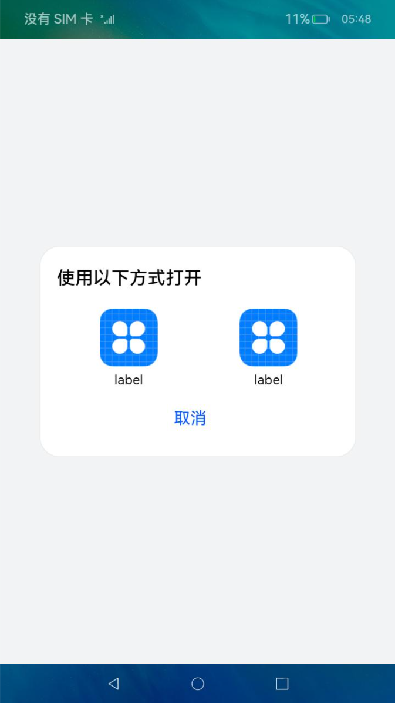

# UIAbility组件间交互（设备内）


UIAbility是系统调度的最小单元。在设备内的功能模块之间跳转时，会涉及到启动特定的UIAbility，该UIAbility可以是应用内的其他UIAbility，也可以是其他应用的UIAbility（例如启动三方支付UIAbility）。


本文将从如下场景分别介绍设备内UIAbility间的交互方式。对于跨设备的应用组件交互，请参见[应用组件跨设备交互（流转）](inter-device-interaction-hop-overview.md)。


- [启动应用内的UIAbility](#启动应用内的uiability)

- [启动应用内的UIAbility并获取返回结果](#启动应用内的uiability并获取返回结果)

- [启动其他应用的UIAbility](#启动其他应用的uiability)

- [启动其他应用的UIAbility并获取返回结果](#启动其他应用的uiability并获取返回结果)

- [启动UIAbility指定窗口模式（仅对系统应用开放）](#启动uiability指定窗口模式仅对系统应用开放)

- [启动UIAbility的指定页面](#启动uiability的指定页面)

- [通过Call调用实现UIAbility交互（仅对系统应用开放）](#通过call调用实现uiability交互仅对系统应用开放)


## 启动应用内的UIAbility

当一个应用内包含多个UIAbility时，存在应用内启动UIAbility的场景。例如在支付应用中从入口UIAbility启动收付款UIAbility。

假设应用中有两个UIAbility：EntryAbility和FuncAbility（可以在应用的一个Module中，也可以在的不同Module中），需要从EntryAbility的页面中启动FuncAbility。

1. 在EntryAbility中，通过调用[`startAbility()`](../reference/apis/js-apis-inner-application-uiAbilityContext.md#uiabilitycontextstartability)方法启动UIAbility，[want](../reference/apis/js-apis-app-ability-want.md)为UIAbility实例启动的入口参数，其中bundleName为待启动应用的Bundle名称，abilityName为待启动的Ability名称，moduleName在待启动的UIAbility属于不同的Module时添加，parameters为自定义信息参数。示例中的context的获取方式请参见[获取UIAbility的上下文信息](uiability-usage.md#获取uiability的上下文信息)。

   ```ts
   import common from '@ohos.app.ability.common';
   import Want from '@ohos.app.ability.Want';
   import { BusinessError } from '@ohos.base';

   let context: common.UIAbilityContext = this.context; // UIAbilityContext
   let want: Want = {
     deviceId: '', // deviceId为空表示本设备
     bundleName: 'com.example.myapplication',
     moduleName: 'func', // moduleName非必选
     abilityName: 'FuncAbility',
     parameters: { // 自定义信息
       info: '来自EntryAbility Index页面',
     },
   }
   // context为调用方UIAbility的UIAbilityContext
   context.startAbility(want).then(() => {
     console.info('Succeeded in starting ability.');
   }).catch((err: BusinessError) => {
     console.error(`Failed to start ability. Code is ${err.code}, message is ${err.message}`);
   })
   ```

2. 在FuncAbility的[`onCreate()`](../reference/apis/js-apis-app-ability-uiAbility.md#uiabilityoncreate)或者[`onNewWant()`](../reference/apis/js-apis-app-ability-uiAbility.md#uiabilityonnewwant)生命周期回调文件中接收EntryAbility传递过来的参数。

   ```ts
   import UIAbility from '@ohos.app.ability.UIAbility';
   import AbilityConstant from '@ohos.app.ability.AbilityConstant';
   import Want from '@ohos.app.ability.Want';

   export default class FuncAbility extends UIAbility {
     onCreate(want: Want, launchParam: AbilityConstant.LaunchParam) {
       // 接收调用方UIAbility传过来的参数
       let funcAbilityWant = want;
       let info = funcAbilityWant?.parameters?.info;
       // ...
     }
   }
   ```

   > **说明：**
   >
   > 在被拉起的FuncAbility中，可以通过获取传递过来的`want`参数的`parameters`来获取拉起方UIAbility的PID、Bundle Name等信息。

3. 在FuncAbility业务完成之后，如需要停止当前UIAbility实例，在FuncAbility中通过调用[`terminateSelf()`](../reference/apis/js-apis-inner-application-uiAbilityContext.md#uiabilitycontextterminateself)方法实现。

   ```ts
   import common from '@ohos.app.ability.common';

   let context: common.UIAbilityContext = this.context; // UIAbilityContext

   // context为需要停止的UIAbility实例的AbilityContext
   context.terminateSelf((err) => {
     if (err.code) {
       console.error(`Failed to terminate Self. Code is ${err.code}, message is ${err.message}`);
       return;
     }
   });
   ```

   > **说明：**
   >
   > 调用[`terminateSelf()`](../reference/apis/js-apis-inner-application-uiAbilityContext.md#uiabilitycontextterminateself)方法停止当前UIAbility实例时，默认会保留该实例的快照（Snapshot），即在最近任务列表中仍然能查看到该实例对应的任务。如不需要保留该实例的快照，可以在其对应UIAbility的[module.json5配置文件](../quick-start/module-configuration-file.md)中，将[abilities标签](../quick-start/module-configuration-file.md#abilities标签)的removeMissionAfterTerminate字段配置为true。

4. 如需要关闭应用所有的UIAbility实例，可以调用[ApplicationContext](../reference/apis/js-apis-inner-application-applicationContext.md)的[`killProcessBySelf()`](../reference/apis/js-apis-inner-application-applicationContext.md#applicationcontextkillallprocesses)方法实现关闭应用所有的进程。


## 启动应用内的UIAbility并获取返回结果

在一个EntryAbility启动另外一个FuncAbility时，希望在被启动的FuncAbility完成相关业务后，能将结果返回给调用方。例如在应用中将入口功能和帐号登录功能分别设计为两个独立的UIAbility，在帐号登录UIAbility中完成登录操作后，需要将登录的结果返回给入口UIAbility。

1. 在EntryAbility中，调用[`startAbilityForResult()`](../reference/apis/js-apis-inner-application-uiAbilityContext.md#uiabilitycontextterminateselfwithresult)接口启动FuncAbility，异步回调中的data用于接收FuncAbility停止自身后返回给EntryAbility的信息。示例中的context的获取方式请参见[获取UIAbility的上下文信息](uiability-usage.md#获取uiability的上下文信息)。

   ```ts
   import common from '@ohos.app.ability.common';
   import Want from '@ohos.app.ability.Want';
   import { BusinessError } from '@ohos.base';

   let context: common.UIAbilityContext = this.context; // UIAbilityContext
   let want: Want = {
     deviceId: '', // deviceId为空表示本设备
     bundleName: 'com.example.myapplication',
     moduleName: 'func', // moduleName非必选
     abilityName: 'FuncAbility',
     parameters: { // 自定义信息
       info: '来自EntryAbility Index页面',
     },
   }
   // context为调用方UIAbility的UIAbilityContext
   context.startAbilityForResult(want).then((data) => {
     // ...
   }).catch((err: BusinessError) => {
     console.error(`Failed to start ability for result. Code is ${err.code}, message is ${err.message}`);
   })
   ```

2. 在FuncAbility停止自身时，需要调用[`terminateSelfWithResult()`](../reference/apis/js-apis-inner-application-uiAbilityContext.md#uiabilitycontextterminateselfwithresult)方法，入参abilityResult为FuncAbility需要返回给EntryAbility的信息。

   ```ts
   import common from '@ohos.app.ability.common';
   import Want from '@ohos.app.ability.Want';

   let context: common.UIAbilityContext = this.context; // UIAbilityContext
   const RESULT_CODE: number = 1001;
   let abilityResult: common.AbilityResult = {
     resultCode: RESULT_CODE,
     want: {
       bundleName: 'com.example.myapplication',
       moduleName: 'func', // moduleName非必选
       abilityName: 'FuncAbility',
       parameters: {
         info: '来自FuncAbility Index页面',
       },
     },
   }
   // context为被调用方UIAbility的AbilityContext
   context.terminateSelfWithResult(abilityResult, (err) => {
     if (err.code) {
       console.error(`Failed to terminate self with result. Code is ${err.code}, message is ${err.message}`);
       return;
     }
   });
   ```

3. FuncAbility停止自身后，EntryAbility通过[`startAbilityForResult()`](../reference/apis/js-apis-inner-application-uiAbilityContext.md#uiabilitycontextterminateselfwithresult)方法回调接收被FuncAbility返回的信息，RESULT_CODE需要与前面的数值保持一致。

   ```ts
   import common from '@ohos.app.ability.common';
   import Want from '@ohos.app.ability.Want';
   import { BusinessError } from '@ohos.base';

   let context: common.UIAbilityContext = this.context; // UIAbilityContext
   const RESULT_CODE: number = 1001;

   let want: Want = {
     deviceId: '', // deviceId为空表示本设备
     bundleName: 'com.example.myapplication',
     moduleName: 'func', // moduleName非必选
     abilityName: 'FuncAbility',
   }

   // context为调用方UIAbility的UIAbilityContext
   context.startAbilityForResult(want).then((data) => {
     if (data?.resultCode === RESULT_CODE) {
       // 解析被调用方UIAbility返回的信息
       let info = data.want?.parameters?.info;
       // ...
     }
   }).catch((err: BusinessError) => {
     console.error(`Failed to start ability for result. Code is ${err.code}, message is ${err.message}`);
   })
   ```


## 启动其他应用的UIAbility

启动其他应用的UIAbility，通常用户只需要完成一个通用的操作（例如需要选择一个文档应用来查看某个文档的内容信息），推荐使用[隐式Want启动](want-overview.md#want的类型)。系统会根据调用方的want参数来识别和启动匹配到的应用UIAbility。

启动UIAbility有[显式Want启动和隐式Want启动](want-overview.md)两种方式。

- 显式Want启动：启动一个确定应用的UIAbility，在want参数中需要设置该应用bundleName和abilityName，当需要拉起某个明确的UIAbility时，通常使用显式Want启动方式。

- 隐式Want启动：根据匹配条件由用户选择启动哪一个UIAbility，即不明确指出要启动哪一个UIAbility（abilityName参数未设置），在调用[`startAbility()`](../reference/apis/js-apis-inner-application-uiAbilityContext.md#uiabilitycontextstartability)方法时，其入参want中指定了一系列的entities字段（表示目标UIAbility额外的类别信息，如浏览器、视频播放器）和actions字段（表示要执行的通用操作，如查看、分享、应用详情等）等参数信息，然后由系统去分析want，并帮助找到合适的UIAbility来启动。当需要拉起其他应用的UIAbility时，开发者通常不知道用户设备中应用的安装情况，也无法确定目标应用的bundleName和abilityName，通常使用隐式Want启动方式。

本文主要讲解如何通过隐式Want启动其他应用的UIAbility。

1. 将多个待匹配的文档应用安装到设备，在其对应UIAbility的[module.json5配置文件](../quick-start/module-configuration-file.md)中，配置skills标签的entities字段和actions字段。

   ```json
   {
     "module": {
       "abilities": [
         {
           ...
           "skills": [
             {
               "entities": [
                 ...
                 "entity.system.default"
               ],
               "actions": [
                 ...
                 "ohos.want.action.viewData"
               ]
             }
           ]
         }
       ]
     }
   }
   ```

2. 在调用方want参数中的entities和action需要被包含在待匹配UIAbility的skills配置的entities和actions中。系统匹配到符合entities和actions参数条件的UIAbility后，会弹出选择框展示匹配到的UIAbility实例列表供用户选择使用。示例中的context的获取方式请参见[获取UIAbility的上下文信息](uiability-usage.md#获取uiability的上下文信息)。

   ```ts
   import common from '@ohos.app.ability.common';
   import Want from '@ohos.app.ability.Want';
   import { BusinessError } from '@ohos.base';

   let context: common.UIAbilityContext = this.context; // UIAbilityContext
   let want: Want = {
     deviceId: '', // deviceId为空表示本设备
     // 如果希望隐式仅在特定的捆绑包中进行查询，请取消下面的注释。
     // bundleName: 'com.example.myapplication',
     action: 'ohos.want.action.viewData',
     // entities可以被省略
     entities: ['entity.system.default'],
   }

   // context为调用方UIAbility的UIAbilityContext
   context.startAbility(want).then(() => {
     console.info('Succeeded in starting ability.');
   }).catch((err: BusinessError) => {
     console.error(`Failed to start ability. Code is ${err.code}, message is ${err.message}`);
   })
   ```

   效果示意如下图所示，点击“打开PDF文档”时，会弹出选择框供用户选择。
   

3. 在文档应用使用完成之后，如需要停止当前UIAbility实例，通过调用[`terminateSelf()`](../reference/apis/js-apis-inner-application-uiAbilityContext.md#uiabilitycontextterminateself)方法实现。

   ```ts
   import common from '@ohos.app.ability.common';

   let context: common.UIAbilityContext = this.context; // UIAbilityContext

   // context为需要停止的UIAbility实例的AbilityContext
   context.terminateSelf((err) => {
     if (err.code) {
       console.error(`Failed to terminate self. Code is ${err.code}, message is ${err.message}`);
       return;
     }
   });
   ```


## 启动其他应用的UIAbility并获取返回结果

当使用隐式Want启动其他应用的UIAbility并希望获取返回结果时，调用方需要使用[`startAbilityForResult()`](../reference/apis/js-apis-inner-application-uiAbilityContext.md#uiabilitycontextterminateselfwithresult)方法启动目标UIAbility。例如主应用中需要启动三方支付并获取支付结果。

1. 在支付应用对应UIAbility的[module.json5配置文件](../quick-start/module-configuration-file.md)中，配置skills的entities字段和actions字段。

   ```json
   {
     "module": {
       "abilities": [
         {
           ...
           "skills": [
             {
               "entities": [
                 ...
                 "entity.system.default"
               ],
               "actions": [
                 ...
                 "ohos.want.action.editData"
               ]
             }
           ]
         }
       ]
     }
   }
   ```

2. 调用方使用[`startAbilityForResult()`](../reference/apis/js-apis-inner-application-uiAbilityContext.md#uiabilitycontextterminateselfwithresult)方法启动支付应用的UIAbility，在调用方want参数中的entities和action需要被包含在待匹配UIAbility的skills标签配置的entities和actions中。异步回调中的data用于后续接收支付UIAbility停止自身后返回给调用方的信息。系统匹配到符合entities和actions参数条件的UIAbility后，会弹出选择框展示匹配到的UIAbility实例列表供用户选择使用。

   ```ts
   import common from '@ohos.app.ability.common';
   import Want from '@ohos.app.ability.Want';
   import { BusinessError } from '@ohos.base';

   let context: common.UIAbilityContext = this.context; // UIAbilityContext
   let want:Want = {
     deviceId: '', // deviceId为空表示本设备
     // uncomment line below if wish to implicitly query only in the specific bundle.
     // bundleName: 'com.example.myapplication',
     action: 'ohos.want.action.editData',
     // entities can be omitted.
     entities: ['entity.system.default']
   }

   // context为调用方UIAbility的UIAbilityContext
   context.startAbilityForResult(want).then((data) => {
     // ...
   }).catch((err: BusinessError) => {
     console.error(`Failed to start ability for result. Code is ${err.code}, message is ${err.message}`);
   })
   ```

3. 在支付UIAbility完成支付之后，需要调用[`terminateSelfWithResult()`](../reference/apis/js-apis-inner-application-uiAbilityContext.md#uiabilitycontextterminateselfwithresult)方法实现停止自身，并将abilityResult参数信息返回给调用方。

   ```ts
   import common from '@ohos.app.ability.common';
   import Want from '@ohos.app.ability.Want';

   let context: common.UIAbilityContext = this.context; // UIAbilityContext
   const RESULT_CODE: number = 1001;
   let abilityResult: common.AbilityResult = {
     resultCode: RESULT_CODE,
     want: {
       bundleName: 'com.example.funcapplication',
       moduleName: 'entry', // moduleName非必选
       abilityName: 'EntryAbility',
       parameters: {
         payResult: 'OKay',
       },
     },
   }
   // context为被调用方UIAbility的AbilityContext
   context.terminateSelfWithResult(abilityResult, (err) => {
     if (err.code) {
       console.error(`Failed to terminate self with result. Code is ${err.code}, message is ${err.message}`);
       return;
     }
   });
   ```

4. 在调用方[`startAbilityForResult()`](../reference/apis/js-apis-inner-application-uiAbilityContext.md#uiabilitycontextterminateselfwithresult)方法回调中接收支付应用返回的信息，RESULT_CODE需要与前面[`terminateSelfWithResult()`](../reference/apis/js-apis-inner-application-uiAbilityContext.md#uiabilitycontextterminateselfwithresult)返回的数值保持一致。

   ```ts
   import common from '@ohos.app.ability.common';
   import Want from '@ohos.app.ability.Want';
   import { BusinessError } from '@ohos.base';

   let context: common.UIAbilityContext = this.context; // UIAbilityContext
   const RESULT_CODE: number = 1001;

   let want: Want = {
     // Want参数信息
   };

   // context为调用方UIAbility的UIAbilityContext
   context.startAbilityForResult(want).then((data) => {
     if (data?.resultCode === RESULT_CODE) {
       // 解析被调用方UIAbility返回的信息
       let payResult = data.want?.parameters?.payResult;
       // ...
     }
   }).catch((err: BusinessError) => {
     console.error(`Failed to start ability for result. Code is ${err.code}, message is ${err.message}`);
   })
   ```

## 启动UIAbility指定窗口模式（仅对系统应用开放）

当用户打开应用时，应用程序会以不同的窗口模式进行展示，即启动UIAbility的窗口模式。应用程序可以启动为全屏模式，悬浮窗模式或分屏模式。

全屏模式是指应用程序启动后，占据整个屏幕，用户无法同时查看其他窗口或应用程序。全屏模式通常适用于那些要求用户专注于特定任务或界面的应用程序。

悬浮窗模式是指应用程序启动后，以浮动窗口的形式显示在屏幕上，用户可以轻松切换到其他窗口或应用程序。悬浮窗通常适用于需要用户同时处理多个任务的应用程序。

分屏模式允许用户在同一屏幕上同时运行两个应用程序，其中一个应用程序占据屏幕左侧/上侧的一部分，另一个应用程序占据右侧/下侧的一部分。分屏模式主要用于提高用户的多任务处理效率。

使用[`startAbility()`](../reference/apis/js-apis-inner-application-uiAbilityContext.md#uiabilitycontextstartability)方法启动UIAbility时，可以通过在入参中增加[StartOptions](../reference/apis/js-apis-app-ability-startOptions.md)参数的windowMode属性来配置启动UIAbility的窗口模式。

> **说明：**
>
> 1. 如果在使用[`startAbility()`](../reference/apis/js-apis-inner-application-uiAbilityContext.md#uiabilitycontextstartability)方法启动UIAbility时，入参中未指定[StartOptions](../reference/apis/js-apis-app-ability-startOptions.md)参数的windowMode属性，那么UIAbility将以系统默认的窗口展示形态启动。
> 2. 为了确保启动的UIAbility展示形态能够被支持，需要在该UIAbility对应的[module.json5配置文件](../quick-start/module-configuration-file.md)中[abilities标签](../quick-start/module-configuration-file.md#abilities标签)的supportWindowMode字段确认启动的展示形态被支持。

以下是具体的操作步骤，以悬浮窗模式为例，假设需要从EntryAbility的页面中启动FuncAbility：

1. 在调用[`startAbility()`](../reference/apis/js-apis-inner-application-uiAbilityContext.md#uiabilitycontextstartability)方法时，增加[StartOptions](../reference/apis/js-apis-app-ability-startOptions.md)参数。
2. 在[StartOptions](../reference/apis/js-apis-app-ability-startOptions.md)参数中设置`windowMode`字段为`WINDOW_MODE_FLOATING`，表示启动的UIAbility将以悬浮窗的形式展示。

示例中的context的获取方式请参见[获取UIAbility的上下文信息](uiability-usage.md#获取uiability的上下文信息)。

```ts
import AbilityConstant from '@ohos.app.ability.AbilityConstant';
import common from '@ohos.app.ability.common';
import Want from '@ohos.app.ability.Want';
import StartOptions from '@ohos.app.ability.StartOptions';
import { BusinessError } from '@ohos.base';

let context: common.UIAbilityContext = this.context; // UIAbilityContext
let want: Want = {
  deviceId: '', // deviceId为空表示本设备
  bundleName: 'com.example.myapplication',
  moduleName: 'func', // moduleName非必选
  abilityName: 'FuncAbility',
  parameters: { // 自定义信息
    info: '来自EntryAbility Index页面',
  },
}
let options: StartOptions = {
  windowMode: AbilityConstant.WindowMode.WINDOW_MODE_FLOATING
};
// context为调用方UIAbility的UIAbilityContext
context.startAbility(want, options).then(() => {
  console.info('Succeeded in starting ability.');
}).catch((err: BusinessError) => {
  console.error(`Failed to start ability. Code is ${err.code}, message is ${err.message}`);
})
```

效果示意如下图所示。


## 启动UIAbility的指定页面

### 概述

一个UIAbility可以对应多个页面，在不同的场景下启动该UIAbility时需要展示不同的页面，例如从一个UIAbility的页面中跳转到另外一个UIAbility时，希望启动目标UIAbility的指定页面。

UIAbility的启动分为两种情况：UIAbility冷启动和UIAbility热启动。

- UIAbility冷启动：指的是UIAbility实例处于完全关闭状态下被启动，这需要完整地加载和初始化UIAbility实例的代码、资源等。
- UIAbility热启动：指的是UIAbility实例已经启动并在前台运行过，由于某些原因切换到后台，再次启动该UIAbility实例，这种情况下可以快速恢复UIAbility实例的状态。

本文主要讲解[目标UIAbility冷启动](#目标uiability冷启动)和[目标UIAbility热启动](#目标uiability热启动)两种启动指定页面的场景，以及在讲解启动指定页面之前会讲解到在调用方如何指定启动页面。


### 调用方UIAbility指定启动页面

调用方UIAbility启动另外一个UIAbility时，通常需要跳转到指定的页面。例如FuncAbility包含两个页面（Index对应首页，Second对应功能A页面），此时需要在传入的want参数中配置指定的页面路径信息，可以通过want中的parameters参数增加一个自定义参数传递页面跳转信息。示例中的context的获取方式请参见[获取UIAbility的上下文信息](uiability-usage.md#获取uiability的上下文信息)。


```ts
import common from '@ohos.app.ability.common';
import Want from '@ohos.app.ability.Want';
import { BusinessError } from '@ohos.base';

let context: common.UIAbilityContext = this.context; // UIAbilityContext
let want: Want = {
  deviceId: '', // deviceId为空表示本设备
  bundleName: 'com.example.funcapplication',
  moduleName: 'entry', // moduleName非必选
  abilityName: 'EntryAbility',
  parameters: { // 自定义参数传递页面信息
    router: 'funcA',
  },
}
// context为调用方UIAbility的UIAbilityContext
context.startAbility(want).then(() => {
  console.info('Succeeded in starting ability.');
}).catch((err: BusinessError) => {
  console.error(`Failed to start ability. Code is ${err.code}, message is ${err.message}`);
})
```


### 目标UIAbility冷启动

目标UIAbility冷启动时，在目标UIAbility的`onCreate()`生命周期回调中，接收调用方传过来的参数。然后在目标UIAbility的`onWindowStageCreate()`生命周期回调中，解析EntryAbility传递过来的want参数，获取到需要加载的页面信息url，传入`windowStage.loadContent()`方法。


```ts
import AbilityConstant from '@ohos.app.ability.AbilityConstant';
import UIAbility from '@ohos.app.ability.UIAbility';
import Want from '@ohos.app.ability.Want';
import window from '@ohos.window';

export default class FuncAbility extends UIAbility {
  funcAbilityWant: Want | undefined = undefined;

  onCreate(want: Want, launchParam: AbilityConstant.LaunchParam) {
    // 接收调用方UIAbility传过来的参数
    this.funcAbilityWant = want;
  }

  onWindowStageCreate(windowStage: window.WindowStage) {
    // Main window is created, set main page for this ability
    let url = 'pages/Index';
    if (this.funcAbilityWant?.parameters?.router && this.funcAbilityWant.parameters.router === 'funcA') {
      url = 'pages/Second';
    }
    windowStage.loadContent(url, (err, data) => {
      // ...
    });
  }
}
```

### 目标UIAbility热启动

在应用开发中，会遇到目标UIAbility实例之前已经启动过的场景，这时再次启动目标UIAbility时，不会重新走初始化逻辑，只会直接触发`onNewWant()`生命周期方法。为了实现跳转到指定页面，需要在`onNewWant()`中解析要参数进行处理。

例如短信应用和联系人应用配合使用的场景。

1. 用户先打开短信应用，短信应用的UIAbility实例启动，显示短信应用的主页。
2. 用户将设备回到桌面界面，短信应用进入后台运行状态。
3. 用户打开联系人应用，找到联系人张三。
4. 用户点击联系人张三的短信按钮，会重新启动短信应用的UIAbility实例。
5. 由于短信应用的UIAbility实例已经启动过了，此时会触发该UIAbility的`onNewWant()`回调，而不会再走`onCreate()`和`onWindowStageCreate()`等初始化逻辑。

图1 目标UIAbility热启动  


开发步骤如下所示。

1. 冷启动短信应用的UIAbility实例时，在`onWindowStageCreate()`生命周期回调中，通过调用[`getUIContext()`](../reference/apis/js-apis-window.md#getuicontext10)接口获取UI上下文实例[`UIContext`](../reference/apis/js-apis-arkui-UIContext.md)对象。

   ```ts
   import AbilityConstant from '@ohos.app.ability.AbilityConstant';
   import UIAbility from '@ohos.app.ability.UIAbility';
   import Want from '@ohos.app.ability.Want';
   import window from '@ohos.window';

   import { Router, UIContext } from '@ohos.arkui.UIContext';

   export default class EntryAbility extends UIAbility {
     funcAbilityWant: Want | undefined = undefined;
     uiContext: UIContext | undefined = undefined;

     // ...

     onWindowStageCreate(windowStage: window.WindowStage) {
       // Main window is created, set main page for this ability
       let url = 'pages/Index';
       if (this.funcAbilityWant?.parameters?.router && this.funcAbilityWant.parameters.router === 'funcA') {
         url = 'pages/Second';
       }

       windowStage.loadContent(url, (err, data) => {
         if (err.code) {
           return;
         }

         let windowClass: window.Window;
         windowStage.getMainWindow((err, data) => {
           if (err.code) {
             console.error(`Failed to obtain the main window. Code is ${err.code}, message is ${err.message}`);
             return;
           }
           windowClass = data;
           this.uiContext = windowClass.getUIContext();
         })
       });
     }
   }
   ```

2. 在短信应用UIAbility的`onNewWant()`回调中解析调用方传递过来的want参数，通过调用UIContext中的[`getRouter()`](../reference/apis/js-apis-arkui-UIContext.md#getrouter)方法获取[`Router`](../reference/apis/js-apis-arkui-UIContext.md#router)对象，并进行指定页面的跳转。此时再次启动该短信应用的UIAbility实例时，即可跳转到该短信应用的UIAbility实例的指定页面。

   ```ts
   import AbilityConstant from '@ohos.app.ability.AbilityConstant';
   import UIAbility from '@ohos.app.ability.UIAbility';
   import Want from '@ohos.app.ability.Want';
   import { Router, UIContext } from '@ohos.arkui.UIContext';
   import { BusinessError } from '@ohos.base';

   export default class EntryAbility extends UIAbility {
     funcAbilityWant: Want | undefined = undefined;
     uiContext: UIContext | undefined = undefined;

     onNewWant(want: Want, launchParam: AbilityConstant.LaunchParam) {
       if (want?.parameters?.router && want.parameters.router === 'funcA') {
         let funcAUrl = 'pages/Second';
         if (this.uiContext) {
           let router: Router = this.uiContext.getRouter();
           router.pushUrl({
             url: funcAUrl
           }).catch((err: BusinessError) => {
             console.error(`Failed to push url. Code is ${err.code}, message is ${err.message}`);
           })
         }
       }
     }

     // ...
   }
   ```

> **说明：**
>
> 当被调用方[UIAbility组件启动模式](uiability-launch-type.md)设置为multiton启动模式时，每次启动都会创建一个新的实例，那么[onNewWant()](../reference/apis/js-apis-app-ability-uiAbility.md#abilityonnewwant)回调就不会被用到。


## 通过Call调用实现UIAbility交互（仅对系统应用开放）

Call调用是UIAbility能力的扩展，它为UIAbility提供一种能够被外部调用并与外部进行通信的能力。Call调用支持前台与后台两种启动方式，使UIAbility既能被拉起到前台展示UI，也可以在后台被创建并运行。Call调用在调用方与被调用方间建立了IPC通信，因此应用开发者可通过Call调用实现不同UIAbility之间的数据共享。

Call调用的核心接口是`startAbilityByCall()`方法，与`startAbility()`接口的不同之处在于：

- startAbilityByCall支持前台与后台两种启动方式，而`startAbility()`仅支持前台启动。

- 调用方可使用`startAbilityByCall()`所返回的Caller对象与被调用方进行通信，而`startAbility()`不具备通信能力。

Call调用的使用场景主要包括：

- 需要与被启动的UIAbility进行通信。

- 希望被启动的UIAbility在后台运行。


**表1** Call调用相关名词解释

| 名词 | 描述 |
| -------- | -------- |
| CallerAbility | 进行Call调用的UIAbility（调用方）。 |
| CalleeAbility | 被Call调用的UIAbility（被调用方）。 |
| Caller | 实际对象，由startAbilityByCall接口返回，CallerAbility可使用Caller与CalleeAbility进行通信。 |
| Callee | 实际对象，被CalleeAbility持有，可与Caller进行通信。 |

Call调用示意图如下所示。

**图1** Call调用示意图


- CallerAbility调用startAbilityByCall接口获取Caller，并使用Caller对象的call方法向CalleeAbility发送数据。

- CalleeAbility持有一个Callee对象，通过Callee的on方法注册回调函数，当接收到Caller发送的数据时将会调用对应的回调函数。

> **说明：**
> 1. 当前仅支持系统应用使用Call调用。
>
> 2. CalleeAbility的启动模式需要为单实例。
>
> 3. Call调用既支持本地（设备内）Call调用，也支持跨设备Call调用，下面介绍设备内Call调用方法。跨设备Call调用方法请参见[跨设备Call调用](hop-multi-device-collaboration.md#通过跨设备call调用实现多端协同)。


### 接口说明

Call功能主要接口如下表所示。具体的API详见[接口文档](../reference/apis/js-apis-app-ability-uiAbility.md#caller)。

**表2** Call功能主要接口

| 接口名 | 描述 |
| -------- | -------- |
| startAbilityByCall(want:&nbsp;Want):&nbsp;Promise&lt;Caller&gt; | 启动指定UIAbility并获取其Caller通信接口，默认为后台启动，通过配置want可实现前台启动，详见[接口文档](../reference/apis/js-apis-inner-application-uiAbilityContext.md#abilitycontextstartabilitybycall)。AbilityContext与ServiceExtensionContext均支持该接口。 |
| on(method:&nbsp;string,&nbsp;callback:&nbsp;CalleeCallBack):&nbsp;void | 通用组件Callee注册method对应的callback方法。 |
| off(method:&nbsp;string):&nbsp;void | 通用组件Callee解注册method的callback方法。 |
| call(method:&nbsp;string,&nbsp;data:&nbsp;rpc.Parcelable):&nbsp;Promise&lt;void&gt; | 向通用组件Callee发送约定序列化数据。 |
| callWithResult(method:&nbsp;string,&nbsp;data:&nbsp;rpc.Parcelable):&nbsp;Promise&lt;rpc.MessageSequence&gt; | 向通用组件Callee发送约定序列化数据,&nbsp;并将Callee返回的约定序列化数据带回。 |
| release():&nbsp;void | 释放通用组件的Caller通信接口。 |
| on(type:&nbsp;"release",&nbsp;callback:&nbsp;OnReleaseCallback):&nbsp;void | 注册通用组件通信断开监听通知。 |

设备内通过Call调用实现UIAbility交互，涉及如下两部分开发：

- [创建Callee被调用端](#开发步骤创建callee被调用端)

- [访问Callee被调用端](#开发步骤访问callee被调用端)


### 开发步骤（创建Callee被调用端）

在Callee被调用端，需要实现指定方法的数据接收回调函数、数据的序列化及反序列化方法。在需要接收数据期间，通过on接口注册监听，无需接收数据时通过off接口解除监听。

1. 配置UIAbility的启动模式。

   例如将CalleeAbility配置为单实例模式`singleton`，配置方式请参见[UIAbility组件启动模式](uiability-launch-type.md)。

2. 导入UIAbility模块。

   ```ts
   import UIAbility from '@ohos.app.ability.UIAbility';
   ```

3. 定义约定的序列化数据。
   调用端及被调用端发送接收的数据格式需协商一致，如下示例约定数据由number和string组成。


   ```ts
   import rpc from '@ohos.rpc';

   export default class MyParcelable {
     num: number = 0;
     str: string = '';

     constructor(num: number, string: string) {
       this.num = num;
       this.str = string;
     }

     marshalling(messageSequence: rpc.MessageSequence) {
       messageSequence.writeInt(this.num);
       messageSequence.writeString(this.str);
       return true;
     }

     unmarshalling(messageSequence: rpc.MessageSequence) {
       this.num = messageSequence.readInt();
       this.str = messageSequence.readString();
       return true;
     }
   }
   ```

4. 实现Callee.on监听及Callee.off解除监听。

   被调用端Callee的监听函数注册时机，取决于应用开发者。注册监听之前的数据不会被处理，取消监听之后的数据不会被处理。如下示例在UIAbility的onCreate注册'MSG_SEND_METHOD'监听，在onDestroy取消监听，收到序列化数据后作相应处理并返回，应用开发者根据实际需要做相应处理。具体示例代码如下：


   ```ts
   import AbilityConstant from '@ohos.app.ability.AbilityConstant';
   import UIAbility from '@ohos.app.ability.UIAbility';
   import Want from '@ohos.app.ability.Want';
   import rpc from '@ohos.rpc';
   import { BusinessError } from '@ohos.base';
   import MyParcelable from './MyParcelable';

   const TAG: string = '[CalleeAbility]';
   const MSG_SEND_METHOD: string = 'CallSendMsg';

   function sendMsgCallback(data: rpc.MessageSequence) {
     console.info('CalleeSortFunc called');

     // 获取Caller发送的序列化数据
     let receivedData: MyParcelable = new MyParcelable(0, '');
     data.readParcelable(receivedData);
     console.info(`receiveData[${receivedData.num}, ${receivedData.str}]`);
     let num: number = receivedData.num;

     // 作相应处理
     // 返回序列化数据result给Caller
     return new MyParcelable(num + 1, `send ${receivedData.str} succeed`) as rpc.Parcelable;
   }

   export default class CalleeAbility extends UIAbility {
     onCreate(want: Want, launchParam: AbilityConstant.LaunchParam) {
       try {
         this.callee.on(MSG_SEND_METHOD, sendMsgCallback);
       } catch (err) {
         let code = (err as BusinessError).code;
         let message = (err as BusinessError).message;
         console.error(`Failed to register. Code is ${code}, message is ${message}`);
       }
     }

     onDestroy() {
       try {
         this.callee.off(MSG_SEND_METHOD);
       } catch (err) {
         let code = (err as BusinessError).code;
         let message = (err as BusinessError).message;
         console.error(`Failed to unregister. Code is ${code}, message is ${message}`);
       }
     }
   }
   ```


### 开发步骤（访问Callee被调用端）

1. 导入UIAbility模块。

   ```ts
   import UIAbility from '@ohos.app.ability.UIAbility';
   ```

2. 获取Caller通信接口。
   UIAbilityContext属性实现了startAbilityByCall方法，用于获取指定通用组件的Caller通信接口。如下示例通过this.context获取UIAbility实例的context属性，使用startAbilityByCall拉起Callee被调用端并获取Caller通信接口，注册Caller的onRelease监听。应用开发者根据实际需要做相应处理。


   ```ts
   import UIAbility from '@ohos.app.ability.UIAbility';
   import { Caller } from '@ohos.app.ability.UIAbility';
   import { BusinessError } from '@ohos.base';

   export default class CallerAbility extends UIAbility {
     caller: Caller | undefined = undefined;

     // 注册caller的release监听
     private regOnRelease(caller: Caller) {
       try {
         caller.on('release', (msg: string) => {
           console.info(`caller onRelease is called ${msg}`);
         })
         console.info('Succeeded in registering on release.');
       } catch (err) {
         let code = (err as BusinessError).code;
         let message = (err as BusinessError).message;
         console.error(`Failed to caller register on release. Code is ${code}, message is ${message}`);
       }
     }

     async onButtonGetCaller() {
       try {
         this.caller = await this.context.startAbilityByCall({
           bundleName: 'com.samples.CallApplication',
           abilityName: 'CalleeAbility'
         });
         if (this.caller === undefined) {
           console.info('get caller failed')
           return;
         }
         console.info('get caller success')
         this.regOnRelease(this.caller)
       } catch (err) {
         let code = (err as BusinessError).code;
         let message = (err as BusinessError).message;
         console.error(`Failed to get caller. Code is ${code}, message is ${message}`);
       }
     }
   }
   ```

## 相关实例

针对UIAbility组件间交互开发，有以下相关实例可供参考：

- [UIAbility内和UIAbility间页面的跳转（ArkTS）（API9）](https://gitee.com/openharmony/codelabs/tree/master/Ability/StageAbility)
- [UIAbility内页面间的跳转（ArkTS）（API9）](https://gitee.com/openharmony/codelabs/tree/master/Ability/PagesRouter)