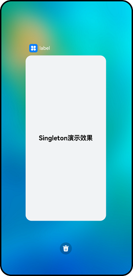
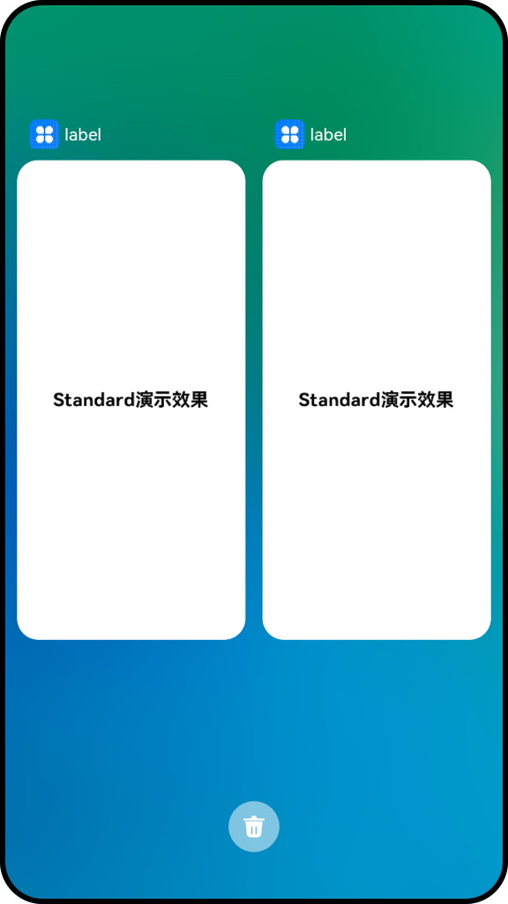
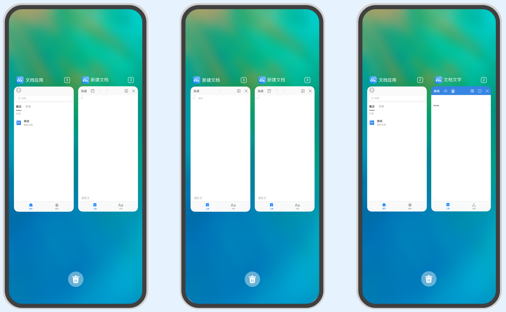

# UIAbility组件启动模式


UIAbility的启动模式是指UIAbility实例在启动时的不同呈现状态。针对不同的业务场景，系统提供了三种启动模式：


- [singleton（单实例模式）](#singleton启动模式)

- [standard（标准实例模式）](#standard启动模式)

- [specified（指定实例模式）](#specified启动模式)


## singleton启动模式

singleton启动模式为单实例模式，也是默认情况下的启动模式。

每次调用startAbility()方法时，如果应用进程中该类型的UIAbility实例已经存在，则复用系统中的UIAbility实例。系统中只存在唯一一个该UIAbility实例，即在最近任务列表中只存在一个该类型的UIAbility实例。

  **图1** 单实例模式演示效果  


> **说明：**
> 应用的UIAbility实例已创建，该UIAbility配置为单实例模式，再次调用startAbility()方法启动该UIAbility实例，此时只会进入该UIAbility的[onNewWant()](../reference/apis/js-apis-app-ability-uiAbility.md#abilityonnewwant)回调，不会进入其onCreate()和onWindowStageCreate()生命周期回调。

如果需要使用singleton启动模式，在[module.json5配置文件](../quick-start/module-configuration-file.md)中的"launchType"字段配置为"singleton"即可。


```json
{
  "module": {
    // ...
    "abilities": [
      {
        "launchType": "singleton",
        // ...
      }
    ]
  }
}
```


## standard启动模式

standard启动模式为标准实例模式，每次调用startAbility()方法时，都会在应用进程中创建一个新的该类型UIAbility实例。即在最近任务列表中可以看到有多个该类型的UIAbility实例。这种情况下可以将UIAbility配置为standard（标准实例模式）。

  **图2** 标准实例模式演示效果  


standard启动模式的开发使用，在[module.json5配置文件](../quick-start/module-configuration-file.md)中的"launchType"字段配置为"standard"即可。


```json
{
  "module": {
    // ...
    "abilities": [
      {
        "launchType": "standard",
        // ...
      }
    ]
  }
}
```


## specified启动模式

specified启动模式为指定实例模式，针对一些特殊场景使用（例如文档应用中每次新建文档希望都能新建一个文档实例，重复打开一个已保存的文档希望打开的都是同一个文档实例）。

在UIAbility实例创建之前，允许开发者为该实例创建一个唯一的字符串Key，创建的UIAbility实例绑定Key之后，后续每次调用startAbility()方法时，都会询问应用使用哪个Key对应的UIAbility实例来响应startAbility()请求。运行时由UIAbility内部业务决定是否创建多实例，如果匹配有该UIAbility实例的Key，则直接拉起与之绑定的UIAbility实例，否则创建一个新的UIAbility实例。

  **图3** 指定实例模式演示效果  


> **说明：**
> 应用的UIAbility实例已创建，该UIAbility配置为指定实例模式，再次调用startAbility()方法启动该UIAbility实例，且[AbilityStage](abilitystage.md)的[onAcceptWant()](../reference/apis/js-apis-app-ability-abilityStage.md#abilitystageonacceptwant)回调匹配到一个已创建的UIAbility实例。此时，再次启动该UIAbility时，只会进入该UIAbility的[onNewWant()](../reference/apis/js-apis-app-ability-uiAbility.md#abilityonnewwant)回调，不会进入其onCreate()和onWindowStageCreate()生命周期回调。

例如有两个UIAbility：EntryAbility和FuncAbility，FuncAbility配置为specified启动模式，需要从EntryAbility的页面中启动FuncAbility。

1. 在FuncAbility中，将[module.json5配置文件](../quick-start/module-configuration-file.md)的"launchType"字段配置为"specified"。
   
   ```json
   {
     "module": {
       // ...
       "abilities": [
         {
           "launchType": "specified",
           // ...
         }
       ]
     }
   }
   ```

2. 在EntryAbility中，调用startAbility()方法时，在want参数中，增加一个自定义参数来区别UIAbility实例，例如增加一个"instanceKey"自定义参数。
   
   ```ts
   // 在启动指定实例模式的UIAbility时，给每一个UIAbility实例配置一个独立的Key标识
   // 例如在文档使用场景中，可以用文档路径作为Key标识
   function getInstance() {
       // ...
   }
   
   let want = {
       deviceId: '', // deviceId为空表示本设备
       bundleName: 'com.example.myapplication',
       abilityName: 'FuncAbility',
       moduleName: 'module1', // moduleName非必选
       parameters: { // 自定义信息
           instanceKey: getInstance(),
       },
   }
   // context为调用方UIAbility的UIAbilityContext
   this.context.startAbility(want).then(() => {
       // ...
   }).catch((err) => {
       // ...
   })
   ```

3. 由于FuncAbility的启动模式配置为了指定实例启动模式，在FuncAbility启动之前，会先进入其对应的AbilityStage的[onAcceptWant()](../reference/apis/js-apis-app-ability-abilityStage.md#abilitystageonacceptwant)生命周期回调中，解析传入的want参数，获取"instanceKey"自定义参数。根据业务需要通过AbilityStage的[onAcceptWant()](../reference/apis/js-apis-app-ability-abilityStage.md#abilitystageonacceptwant)生命周期回调返回一个字符串Key标识。[如果返回的Key对应一个已启动的UIAbility](mission-management-launch-type.md#fig14520125175314)，则会将之前的UIAbility拉回前台并获焦，而不创建新的实例，否则创建新的实例并启动。
   
   ```ts
   import AbilityStage from '@ohos.app.ability.AbilityStage';
   
   export default class MyAbilityStage extends AbilityStage {
       onAcceptWant(want): string {
           // 在被调用方的AbilityStage中，针对启动模式为specified的UIAbility返回一个UIAbility实例对应的一个Key值
           // 当前示例指的是module1 Module的FuncAbility
           if (want.abilityName === 'FuncAbility') {
               // 返回的字符串Key标识为自定义拼接的字符串内容
               return `FuncAbilityInstance_${want.parameters.instanceKey}`;
           }
   
           return '';
       }
   }
   ```

   例如在文档应用中，可以对不同的文档实例内容绑定不同的Key值。当每次新建文档的时候，可以传入不同的新Key值（如可以将文件的路径作为一个Key标识），此时AbilityStage中启动UIAbility时都会创建一个新的UIAbility实例；当新建的文档保存之后，回到桌面，或者新打开一个已保存的文档，回到桌面，此时再次打开该已保存的文档，此时AbilityStage中再次启动该UIAbility时，打开的仍然是之前原来已保存的文档界面。

     以如下步骤所示进行举例说明。
   1. 打开文件A，对应启动一个新的UIAbility实例，例如启动“UIAbility实例1”。
   
   2. 在最近任务列表中关闭文件A的进程，此时UIAbility实例1被销毁，回到桌面，再次打开文件A，此时对应启动一个新的UIAbility实例，例如启动“UIAbility实例2”。
   
   3. 回到桌面，打开文件B，此时对应启动一个新的UIAbility实例，例如启动“UIAbility实例3”。
   
   4. 回到桌面，再次打开文件A，此时对应启动的还是之前的“UIAbility实例2”。
