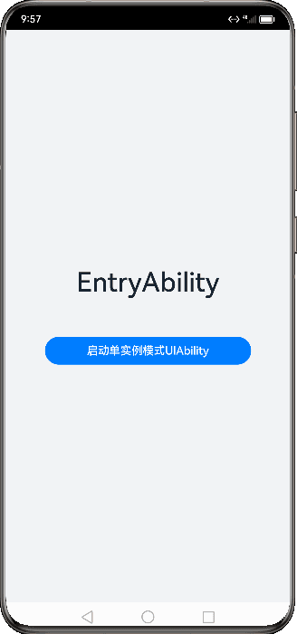
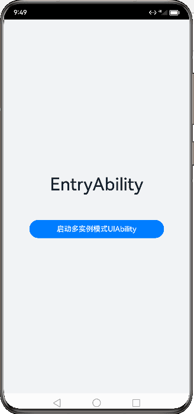
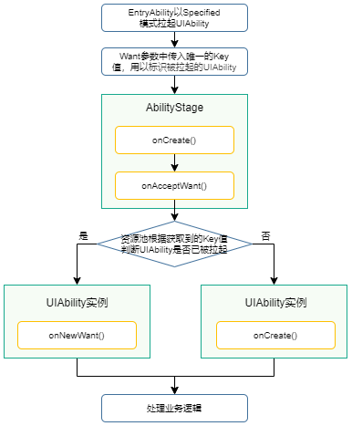
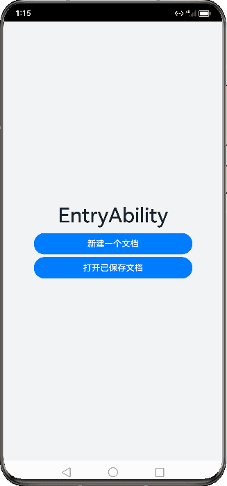

# UIAbility组件启动模式


[UIAbility](../reference/apis-ability-kit/js-apis-app-ability-uiAbility.md)的启动模式是指UIAbility实例在启动时的不同呈现状态。针对不同的业务场景，系统提供了三种启动模式：


- [singleton（单实例模式）](#singleton启动模式)

- [multiton（多实例模式）](#multiton启动模式)

- [specified（指定实例模式）](#specified启动模式)

> **说明：**
>
> `standard`是`multiton`的曾用名，效果与多实例模式一致。

## singleton启动模式

singleton启动模式为单实例模式，也是默认情况下的启动模式。

每次调用[startAbility()](../reference/apis-ability-kit/js-apis-inner-application-uiAbilityContext.md#uiabilitycontextstartability)方法时，如果应用进程中该类型的[UIAbility](../reference/apis-ability-kit/js-apis-app-ability-uiAbility.md)实例已经存在，则复用系统中的UIAbility实例。系统中只存在唯一一个该UIAbility实例，即在最近任务列表中只存在一个该类型的UIAbility实例。

**图1** 单实例模式演示效果  
  

> **说明**：
>
> 应用的UIAbility实例已创建，该UIAbility配置为单实例模式，再次调用[startAbility()](../reference/apis-ability-kit/js-apis-inner-application-uiAbilityContext.md#uiabilitycontextstartability)方法启动该UIAbility实例。由于启动的还是原来的UIAbility实例，并未重新创建一个新的UIAbility实例，此时只会进入该UIAbility的[onNewWant()](../reference/apis-ability-kit/js-apis-app-ability-uiAbility.md#uiabilityonnewwant)回调，不会进入其[onCreate()](../reference/apis-ability-kit/js-apis-app-ability-uiAbility.md#uiabilityoncreate)和[onWindowStageCreate()](../reference/apis-ability-kit/js-apis-app-ability-uiAbility.md#uiabilityonwindowstagecreate)生命周期回调。如果已经创建的实例仍在启动过程中，调用startAbility接口启动该实例，将收到错误码16000082。

如果需要使用singleton启动模式，在[module.json5配置文件](../quick-start/module-configuration-file.md)中的`launchType`字段配置为`singleton`即可。


```json
{
  "module": {
    // ...
    "abilities": [
      {
        "launchType": "singleton",
        // ...
      }
    ]
  }
}
```


## multiton启动模式

multiton启动模式为多实例模式，每次调用[startAbility()](../reference/apis-ability-kit/js-apis-inner-application-uiAbilityContext.md#uiabilitycontextstartability)方法时，都会在应用进程中创建一个新的该类型[UIAbility](../reference/apis-ability-kit/js-apis-app-ability-uiAbility.md)实例。即在最近任务列表中可以看到有多个该类型的UIAbility实例。这种情况下可以将UIAbility配置为multiton（多实例模式）。

**图2** 多实例模式演示效果  
  

multiton启动模式的开发使用，在[module.json5配置文件](../quick-start/module-configuration-file.md)中的`launchType`字段配置为`multiton`即可。


```json
{
  "module": {
    // ...
    "abilities": [
      {
        "launchType": "multiton",
        // ...
      }
    ]
  }
}
```


## specified启动模式

specified启动模式为指定实例模式，针对一些特殊场景使用（例如文档应用中每次新建文档希望都能新建一个文档实例，重复打开一个已保存的文档希望打开的都是同一个文档实例）。

**图3** 指定实例启动模式原理  
  

假设应用有两个[UIAbility](../reference/apis-ability-kit/js-apis-app-ability-uiAbility.md)实例，即EntryAbility和SpecifiedAbility。EntryAbility以specified模式启动SpecifiedAbility。基本原理如下：

  1. EntryAbility调用[startAbility()](../reference/apis-ability-kit/js-apis-inner-application-uiAbilityContext.md#uiabilitycontextstartability)方法，并在[Want](../reference/apis-ability-kit/js-apis-app-ability-want.md)的parameters字段中设置唯一的Key值，用于标识SpecifiedAbility。
  2. 系统在拉起SpecifiedAbility之前，会先进入对应的[AbilityStage](../reference/apis-ability-kit/js-apis-app-ability-abilityStage.md)的[onAcceptWant()](../reference/apis-ability-kit/js-apis-app-ability-abilityStage.md#abilitystageonacceptwant)生命周期回调，获取用于标识目标UIAbility的Key值。
  3. 系统会根据获取的Key值来匹配UIAbility。
      * 如果匹配到对应的UIAbility，则会启动该UIAbility实例，并进入[onNewWant()](../reference/apis-ability-kit/js-apis-app-ability-uiAbility.md#uiabilityonnewwant)生命周期回调。
      * 如果无法匹配对应的UIAbility，则会创建一个新的UIAbility实例，并进入该UIAbility实例的[onCreate()](../reference/apis-ability-kit/js-apis-app-ability-uiAbility.md#uiabilityoncreate)生命周期回调和[onWindowStageCreate()](../reference/apis-ability-kit/js-apis-app-ability-uiAbility.md#uiabilityonwindowstagecreate)生命周期回调。

**图4** 指定实例模式演示效果   
  

1. 在SpecifiedAbility中，需要将[module.json5配置文件](../quick-start/module-configuration-file.md)的`launchType`字段配置为`specified`。

   ```json
   {
     "module": {
       // ...
       "abilities": [
         {
           "launchType": "specified",
           // ...
         }
       ]
     }
   }
   ```

2. 在EntryAbility中，调用[startAbility()](../reference/apis-ability-kit/js-apis-inner-application-uiAbilityContext.md#uiabilitycontextstartability)方法时，可以在[want](../reference/apis-ability-kit/js-apis-app-ability-want.md)参数中传入了自定义参数`instanceKey`作为唯一标识符，以此来区分不同的UIAbility实例。示例中`instanceKey`的value值设置为字符串'KEY'。

   ```ts
    // 在启动指定实例模式的UIAbility时，给每一个UIAbility实例配置一个独立的Key标识
    // 例如在文档使用场景中，可以用文档路径作为Key标识
    import { common, Want } from '@kit.AbilityKit';
    import { hilog } from '@kit.PerformanceAnalysisKit';
    import { BusinessError } from '@kit.BasicServicesKit';

    const TAG: string = '[Page_StartModel]';
    const DOMAIN_NUMBER: number = 0xFF00;

    function getInstance(): string {
      return 'KEY';
    }

    @Entry
    @Component
    struct Page_StartModel {
      private KEY_NEW = 'KEY';

      build() {
        Row() {
          Column() {
            // ...
            Button()
              .onClick(() => {
                let context: common.UIAbilityContext = this.getUIContext().getHostContext() as common.UIAbilityContext;
                // context为调用方UIAbility的UIAbilityContext;
                let want: Want = {
                  deviceId: '', // deviceId为空表示本设备
                  bundleName: 'com.samples.stagemodelabilitydevelop',
                  abilityName: 'SpecifiedFirstAbility',
                  moduleName: 'entry', // moduleName非必选
                  parameters: {
                    // 自定义信息
                    instanceKey: this.KEY_NEW
                  }
                };
                context.startAbility(want).then(() => {
                  hilog.info(DOMAIN_NUMBER, TAG, 'Succeeded in starting SpecifiedAbility.');
                }).catch((err: BusinessError) => {
                  hilog.error(DOMAIN_NUMBER, TAG, `Failed to start SpecifiedAbility. Code is ${err.code}, message is ${err.message}`);
                })
                this.KEY_NEW = this.KEY_NEW + 'a';
              })
            // ...
            Button()
              .onClick(() => {
                let context: common.UIAbilityContext = this.getUIContext().getHostContext() as common.UIAbilityContext;
                // context为调用方UIAbility的UIAbilityContext;
                let want: Want = {
                  deviceId: '', // deviceId为空表示本设备
                  bundleName: 'com.samples.stagemodelabilitydevelop',
                  abilityName: 'SpecifiedSecondAbility',
                  moduleName: 'entry', // moduleName非必选
                  parameters: {
                    // 自定义信息
                    instanceKey: getInstance()
                  }
                };
                context.startAbility(want).then(() => {
                  hilog.info(DOMAIN_NUMBER, TAG, 'Succeeded in starting SpecifiedAbility.');
                }).catch((err: BusinessError) => {
                  hilog.error(DOMAIN_NUMBER, TAG, `Failed to start SpecifiedAbility. Code is ${err.code}, message is ${err.message}`);
                })
                this.KEY_NEW = this.KEY_NEW + 'a';
              })
            // ...
          }
          .width('100%')
        }
        .height('100%')
      }
    }
   ```
   
3. 开发者根据业务在SpecifiedAbility的[onAcceptWant()](../reference/apis-ability-kit/js-apis-app-ability-abilityStage.md#abilitystageonacceptwant)生命周期回调设置该UIAbility的标识。示例中标识设置为`SpecifiedAbilityInstance_KEY`。

   ```ts
    import { AbilityStage, Want } from '@kit.AbilityKit';

    export default class MyAbilityStage extends AbilityStage {
      onAcceptWant(want: Want): string {
        // 在被调用方的AbilityStage中，针对启动模式为specified的UIAbility返回一个UIAbility实例对应的一个Key值
        // 当前示例指的是module1 Module的SpecifiedAbility
        if (want.abilityName === 'SpecifiedFirstAbility' || want.abilityName === 'SpecifiedSecondAbility') {
          // 返回的字符串KEY标识为自定义拼接的字符串内容
          if (want.parameters) {
            return `SpecifiedAbilityInstance_${want.parameters.instanceKey}`;
          }
        }
        // ...
        return 'MyAbilityStage';
      }
    }
   ```

   > **说明：**
   >
   > 1. 当应用的UIAbility实例已经被创建，并且配置为指定实例模式时，如果再次调用[startAbility()](../reference/apis-ability-kit/js-apis-inner-application-uiAbilityContext.md#uiabilitycontextstartability)方法启动该UIAbility实例，且[AbilityStage](../reference/apis-ability-kit/js-apis-app-ability-abilityStage.md)的[onAcceptWant()](../reference/apis-ability-kit/js-apis-app-ability-abilityStage.md#abilitystageonacceptwant)回调匹配到一个已创建的UIAbility实例，则系统会启动原来的UIAbility实例，并且不会重新创建一个新的UIAbility实例。此时，该UIAbility实例的onNewWant()回调会被触发，而不会触发onCreate()和onWindowStageCreate()生命周期回调。
   > 2. DevEco Studio默认工程中未自动生成AbilityStage，AbilityStage文件的创建请参见[AbilityStage组件容器](abilitystage.md)。

   例如在文档应用中，可以为不同的文档实例内容绑定不同的Key值。每次新建文档时，可以传入一个新的Key值（例如可以将文件的路径作为一个Key标识），此时[AbilityStage](../reference/apis-ability-kit/js-apis-app-ability-abilityStage.md)中启动[UIAbility](../reference/apis-ability-kit/js-apis-app-ability-uiAbility.md)时都会创建一个新的UIAbility实例；当新建的文档保存之后，回到桌面，或者新打开一个已保存的文档，回到桌面，此时再次打开该已保存的文档，此时AbilityStage中再次启动该UIAbility时，打开的仍然是之前原来已保存的文档界面。

   以如下步骤所示进行举例说明。

   1. 打开`文件A`，对应启动一个新的UIAbility实例，例如启动`UIAbility实例1`。
   2. 在最近任务列表中关闭`文件A`的任务进程，此时`UIAbility实例1`被销毁，回到桌面，再次打开`文件A`，此时对应启动一个新的UIAbility实例，例如启动`UIAbility实例2`。
   3. 回到桌面，打开`文件B`，此时对应启动一个新的UIAbility实例，例如启动`UIAbility实例3`。
   4. 回到桌面，再次打开`文件A`，此时仍然启动之前的`UIAbility实例2`，因为系统会自动匹配UIAbility实例的Key值，如果存在与之匹配的Key，则会启动与之绑定的UIAbility实例。在此例中，之前启动的`UIAbility实例2`与`文件A`绑定的Key是相同的，因此系统会拉回`UIAbility实例2`并让其获焦，而不会创建新的实例。

## 相关实例

针对UIAbility组件启动模式，有以下相关实例可供参考：

- [Ability的启动模式（ArkTS）(API9)](https://gitee.com/openharmony/applications_app_samples/tree/master/code/BasicFeature/ApplicationModels/AbilityStartMode)
<!--RP1-->
<!--RP1End-->