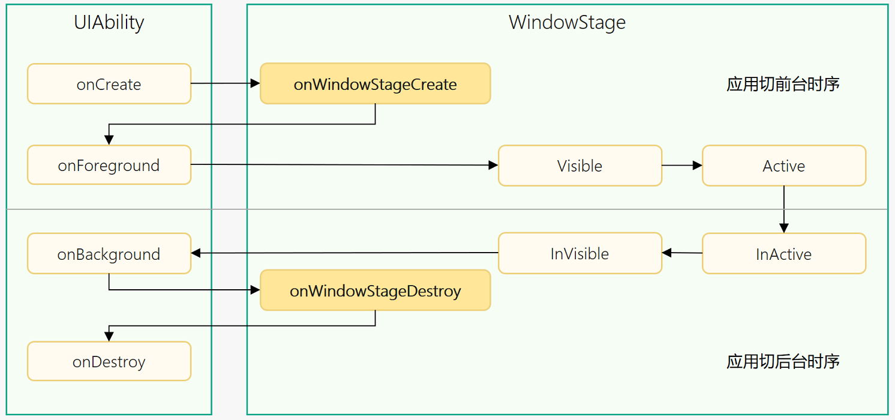

# UIAbility组件生命周期


## 概述

当用户打开、切换和返回到对应应用时，应用中的[UIAbility](../reference/apis-ability-kit/js-apis-app-ability-uiAbility.md)实例会在其生命周期的不同状态之间转换。UIAbility类提供了一系列回调，通过这些回调可以知道当前UIAbility实例的某个状态发生改变，会经过UIAbility实例的创建和销毁，或者UIAbility实例发生了前后台的状态切换。

UIAbility的生命周期包括Create、Foreground、Background、Destroy四个状态，如下图所示。

**图1** UIAbility生命周期状态  
  


## 生命周期状态说明


### Create状态

Create状态为在应用加载过程中，[UIAbility](../reference/apis-ability-kit/js-apis-app-ability-uiAbility.md)实例创建完成时触发，系统会调用[onCreate()](../reference/apis-ability-kit/js-apis-app-ability-uiAbility.md#uiabilityoncreate)回调。可以在该回调中进行页面初始化操作，例如变量定义资源加载等，用于后续的UI展示。


```ts
import { AbilityConstant, UIAbility, Want } from '@kit.AbilityKit';

export default class EntryAbility extends UIAbility {
  onCreate(want: Want, launchParam: AbilityConstant.LaunchParam): void {
    // 页面初始化
  }
  // ...
}
```

> **说明**：
>
> [Want](../reference/apis-ability-kit/js-apis-app-ability-want.md)是对象间信息传递的载体，可以用于应用组件间的信息传递。Want的详细介绍请参见[信息传递载体Want](want-overview.md)。

### WindowStageCreate和WindowStageDestroy状态

[UIAbility](../reference/apis-ability-kit/js-apis-app-ability-uiAbility.md)实例创建完成之后，在进入Foreground之前，系统会创建一个WindowStage。WindowStage创建完成后会进入[onWindowStageCreate()](../reference/apis-ability-kit/js-apis-app-ability-uiAbility.md#uiabilityonwindowstagecreate)回调，可以在该回调中设置UI加载、设置WindowStage的事件订阅。

**图2** WindowStageCreate和WindowStageDestroy状态  
  

在onWindowStageCreate()回调中通过[loadContent()](../reference/apis-arkui/js-apis-window.md#loadcontent9)方法设置应用要加载的页面，并根据需要调用[on('windowStageEvent')](../reference/apis-arkui/js-apis-window.md#onwindowstageevent9)方法订阅[WindowStage的事件](../reference/apis-arkui/js-apis-window.md#windowstageeventtype9)（获焦/失焦、可见/不可见）。

```ts
import { UIAbility } from '@kit.AbilityKit';
import { window } from '@kit.ArkUI';
import { hilog } from '@kit.PerformanceAnalysisKit';

const TAG: string = '[EntryAbility]';
const DOMAIN_NUMBER: number = 0xFF00;

export default class EntryAbility extends UIAbility {
  // ...
  onWindowStageCreate(windowStage: window.WindowStage): void {
    // 设置WindowStage的事件订阅（获焦/失焦、可见/不可见）
    try {
      windowStage.on('windowStageEvent', (data) => {
        let stageEventType: window.WindowStageEventType = data;
        switch (stageEventType) {
          case window.WindowStageEventType.SHOWN: // 切到前台
            hilog.info(DOMAIN_NUMBER, TAG, 'windowStage foreground.');
            break;
          case window.WindowStageEventType.ACTIVE: // 获焦状态
            hilog.info(DOMAIN_NUMBER, TAG, 'windowStage active.');
            break;
          case window.WindowStageEventType.INACTIVE: // 失焦状态
            hilog.info(DOMAIN_NUMBER, TAG, 'windowStage inactive.');
            break;
          case window.WindowStageEventType.HIDDEN: // 切到后台
            hilog.info(DOMAIN_NUMBER, TAG, 'windowStage background.');
            break;
          default:
            break;
        }
      });
    } catch (exception) {
      hilog.error(DOMAIN_NUMBER, TAG, 'Failed to enable the listener for window stage event changes. Cause:' + JSON.stringify(exception));
    }
    hilog.info(DOMAIN_NUMBER, TAG, '%{public}s', 'Ability onWindowStageCreate');
    // 设置UI加载
    windowStage.loadContent('pages/Index', (err, data) => {
      // ...
    });
  }
}
```

> **说明：**
>
> WindowStage的相关使用请参见[窗口开发指导](../windowmanager/application-window-stage.md)。

对应于[onWindowStageCreate()](../reference/apis-ability-kit/js-apis-app-ability-uiAbility.md#uiabilityonwindowstagecreate)回调。在[UIAbility](../reference/apis-ability-kit/js-apis-app-ability-uiAbility.md)实例销毁之前，则会先进入[onWindowStageDestroy()](../reference/apis-ability-kit/js-apis-app-ability-uiAbility.md#uiabilityonwindowstagedestroy)回调，可以在该回调中释放UI资源。

```ts
import { UIAbility } from '@kit.AbilityKit';
import { window } from '@kit.ArkUI';
import { hilog } from '@kit.PerformanceAnalysisKit';
import { BusinessError } from '@kit.BasicServicesKit';

const TAG: string = '[EntryAbility]';
const DOMAIN_NUMBER: number = 0xFF00;

export default class EntryAbility extends UIAbility {
  windowStage: window.WindowStage | undefined = undefined;

  // ...
  onWindowStageCreate(windowStage: window.WindowStage): void {
    this.windowStage = windowStage;
    // ...
  }

  onWindowStageDestroy() {
    // 释放UI资源
    // 例如在onWindowStageDestroy()中注销获焦/失焦等WindowStage事件
    try {
      if (this.windowStage) {
        this.windowStage.off('windowStageEvent');
      }
    } catch (err) {
      let code = (err as BusinessError).code;
      let message = (err as BusinessError).message;
      hilog.error(DOMAIN_NUMBER, TAG, `Failed to disable the listener for windowStageEvent. Code is ${code}, message is ${message}`);
    }
  }
}
```

### WindowStageWillDestroy状态
对应[onWindowStageWillDestroy()](../reference/apis-ability-kit/js-apis-app-ability-uiAbility.md#uiabilityonwindowstagewilldestroy12)回调，在WindowStage销毁前执行，此时WindowStage可以使用。

```ts
import { UIAbility } from '@kit.AbilityKit';
import { window } from '@kit.ArkUI';

export default class EntryAbility extends UIAbility {
  windowStage: window.WindowStage | undefined = undefined;
  // ...
  onWindowStageCreate(windowStage: window.WindowStage): void {
    this.windowStage = windowStage;
    // ...
  }
  onWindowStageWillDestroy(windowStage: window.WindowStage) {
    // 释放通过windowStage对象获取的资源
  }
  onWindowStageDestroy() {
    // 释放UI资源
  }
}
```

> **说明：**
>
> WindowStage的相关使用请参见[窗口开发指导](../windowmanager/application-window-stage.md)。


### Foreground和Background状态

Foreground和Background状态分别在[UIAbility](../reference/apis-ability-kit/js-apis-app-ability-uiAbility.md)实例切换至前台和切换至后台时触发，对应于[onForeground()](../reference/apis-ability-kit/js-apis-app-ability-uiAbility.md#uiabilityonforeground)回调和[onBackground()](../reference/apis-ability-kit/js-apis-app-ability-uiAbility.md#uiabilityonbackground)回调。

`onForeground()`回调，在UIAbility的UI可见之前，如UIAbility切换至前台时触发。可以在`onForeground()`回调中申请系统需要的资源，或者重新申请在`onBackground()`中释放的资源。

`onBackground()`回调，在UIAbility的UI完全不可见之后，如UIAbility切换至后台时候触发。可以在`onBackground()`回调中释放UI不可见时无用的资源，或者在此回调中执行较为耗时的操作，例如状态保存等。

例如应用在使用过程中需要使用用户定位时，假设应用已获得用户的定位权限授权。在UI显示之前，可以在`onForeground()`回调中开启定位功能，从而获取到当前的位置信息。

当应用切换到后台状态，可以在`onBackground()`回调中停止定位功能，以节省系统的资源消耗。


```ts
import { UIAbility } from '@kit.AbilityKit';

export default class EntryAbility extends UIAbility {
  // ...

  onForeground(): void {
    // 申请系统需要的资源，或者重新申请在onBackground()中释放的资源
  }

  onBackground(): void {
    // 释放UI不可见时无用的资源，或者在此回调中执行较为耗时的操作
    // 例如状态保存等
  }
}
```

当应用的UIAbility实例已创建，且UIAbility配置为[singleton](uiability-launch-type.md#singleton启动模式)启动模式时，再次调用[startAbility()](../reference/apis-ability-kit/js-apis-inner-application-uiAbilityContext.md#uiabilitycontextstartability)方法启动该UIAbility实例时，只会进入该UIAbility的[onNewWant()](../reference/apis-ability-kit/js-apis-app-ability-uiAbility.md#uiabilityonnewwant)回调，不会进入其[onCreate()](../reference/apis-ability-kit/js-apis-app-ability-uiAbility.md#uiabilityoncreate)和[onWindowStageCreate()](../reference/apis-ability-kit/js-apis-app-ability-uiAbility.md#uiabilityonwindowstagecreate)生命周期回调。应用可以在该回调中更新要加载的资源和数据等，用于后续的UI展示。

```ts
import { AbilityConstant, UIAbility, Want } from '@kit.AbilityKit';

export default class EntryAbility extends UIAbility {
  // ...

  onNewWant(want: Want, launchParam: AbilityConstant.LaunchParam) {
    // 更新资源、数据
  }
}
```

### Destroy状态

Destroy状态在[UIAbility](../reference/apis-ability-kit/js-apis-app-ability-uiAbility.md)实例销毁时触发。可以在onDestroy()回调中进行系统资源的释放、数据的保存等操作。

例如，调用[terminateSelf()](../reference/apis-ability-kit/js-apis-inner-application-uiAbilityContext.md#uiabilitycontextterminateself)方法停止当前UIAbility实例，执行onDestroy()回调，并完成UIAbility实例的销毁。
<!--RP1-->再比如，用户使用最近任务列表关闭该UIAbility实例，执行onDestroy()回调，并完成UIAbility实例的销毁。<!--RP1End-->

```ts
import { UIAbility } from '@kit.AbilityKit';

export default class EntryAbility extends UIAbility {
  // ...

  onDestroy() {
    // 系统资源的释放、数据的保存等
  }
}
```

## 相关实例

针对UIAbility生命周期，有以下相关实例可供参考：

- [UIAbility和自定义组件生命周期（ArkTS）（API9）](https://gitee.com/openharmony/codelabs/tree/master/Ability/UIAbilityLifeCycle)