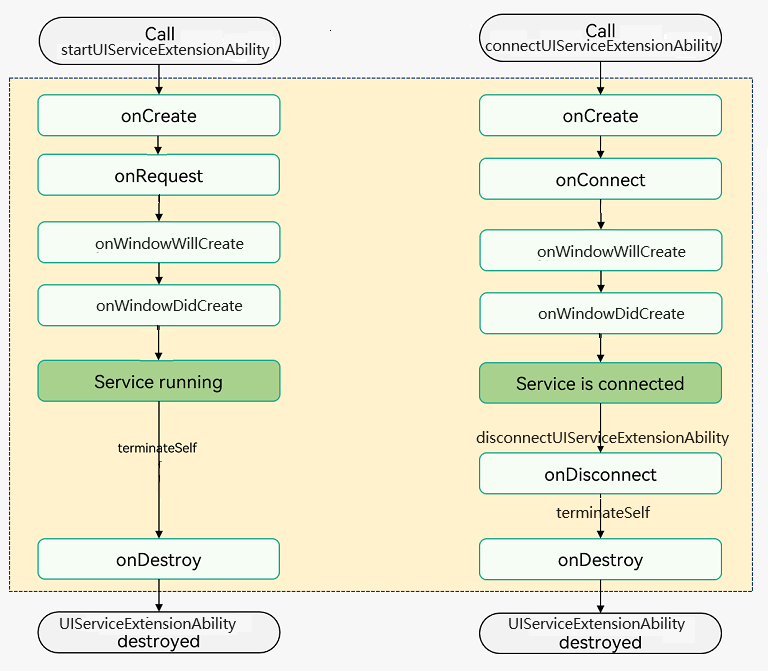

# UIServiceExtension（仅对系统应用开放）

## 概述

[UIServiceExtension](../reference/apis-ability-kit/js-apis-app-ability-uiServiceExtensionAbility-sys.md)是UIService类型的[ExtensionAbility](../reference/apis-ability-kit/js-apis-app-ability-extensionAbility.md)浮窗类组件，提供UI界面（例如预览界面）和后台服务能力。组件内部持有了一个[UIServiceExtensionContext](../reference/apis-ability-kit/js-apis-inner-application-uiserviceExtensionContext-sys.md)，通过[UIServiceExtensionContext](../reference/apis-ability-kit/js-apis-inner-application-uiserviceExtensionContext-sys.md)提供了丰富的接口供外部使用。

本文描述中称被启动的[UIServiceExtension](../reference/apis-ability-kit/js-apis-app-ability-uiServiceExtensionAbility-sys.md)为服务端，称启动[UIServiceExtension](../reference/apis-ability-kit/js-apis-app-ability-uiServiceExtensionAbility-sys.md)的组件为客户端。

应用可以通过启动和连接两种形式使用[UIServiceExtension](../reference/apis-ability-kit/js-apis-app-ability-uiServiceExtensionAbility-sys.md)。
- 通过[UIAbilityContext](../reference/apis-ability-kit/js-apis-inner-application-uiAbilityContext.md)、[UIExtensionContext](../reference/apis-ability-kit/js-apis-inner-application-uiExtensionContext.md)、[ServiceExtensionContext](../reference/apis-ability-kit/js-apis-inner-application-serviceExtensionContext-sys.md)调用[startUIServiceExtensionAbility()](../reference/apis-ability-kit/js-apis-inner-application-uiAbilityContext.md#startuiserviceextensionability14)方法启动[UIServiceExtension](../reference/apis-ability-kit/js-apis-app-ability-uiServiceExtensionAbility-sys.md)。
- 通过[UIAbilityContext](../reference/apis-ability-kit/js-apis-inner-application-uiAbilityContext.md)、[UIExtensionContext](../reference/apis-ability-kit/js-apis-inner-application-uiExtensionContext.md)调用[connectUIServiceExtensionAbility()](../reference/apis-ability-kit/js-apis-inner-application-uiAbilityContext.md#connectuiserviceextensionability14)方法连接[UIServiceExtension](../reference/apis-ability-kit/js-apis-app-ability-uiServiceExtensionAbility-sys.md)。

此处有如下细节需要注意：

- [UIServiceExtension](../reference/apis-ability-kit/js-apis-app-ability-uiServiceExtensionAbility-sys.md)可以通过[startUIServiceExtensionAbility](../reference/apis-ability-kit/js-apis-inner-application-uiAbilityContext.md#startuiserviceextensionability14)方式拉起或者可以通过[connectUIServiceExtensionAbility](../reference/apis-ability-kit/js-apis-inner-application-uiAbilityContext.md#connectuiserviceextensionability14)拉起，窗口只会创建一次。
- [UIServiceExtension](../reference/apis-ability-kit/js-apis-app-ability-uiServiceExtensionAbility-sys.md)窗口创建失败或销毁时，[UIServiceExtension](../reference/apis-ability-kit/js-apis-app-ability-uiServiceExtensionAbility-sys.md)会自动销毁。
- 只能在主线程线程中执行start/connect/disconnect操作，不要在Worker、TaskPool等子线程中执行start/connect/disconnect操作。
- 应用需要在前台获焦的情况下才能启动、连接系统提供的[UIServiceExtension](../reference/apis-ability-kit/js-apis-app-ability-uiServiceExtensionAbility-sys.md)。

## 生命周期

[UIServiceExtension](../reference/apis-ability-kit/js-apis-app-ability-uiServiceExtensionAbility-sys.md)提供了[onCreate()](../reference/apis-ability-kit/js-apis-app-ability-uiServiceExtensionAbility-sys.md#oncreate)、[onWindowWillCreate()](../reference/apis-ability-kit/js-apis-app-ability-uiServiceExtensionAbility-sys.md#onwindowwillcreate)、[onWindowDidCreate()](../reference/apis-ability-kit/js-apis-app-ability-uiServiceExtensionAbility-sys.md#onwindowdidcreate)、[onRequest()](../reference/apis-ability-kit/js-apis-app-ability-uiServiceExtensionAbility-sys.md#onrequest)、[onConnect()](../reference/apis-ability-kit/js-apis-app-ability-uiServiceExtensionAbility-sys.md#onconnect)、[onDisconnect()](../reference/apis-ability-kit/js-apis-app-ability-uiServiceExtensionAbility-sys.md#ondisconnect)、[onData()](../reference/apis-ability-kit/js-apis-app-ability-uiServiceExtensionAbility-sys.md#ondata)和[onDestroy()](../reference/apis-ability-kit/js-apis-app-ability-uiServiceExtensionAbility-sys.md#ondestroy)生命周期接口函数，根据需要重写对应的回调方法。下图展示了[UIServiceExtension](../reference/apis-ability-kit/js-apis-app-ability-uiServiceExtensionAbility-sys.md)的生命周期。

**图1** [UIServiceExtension](../reference/apis-ability-kit/js-apis-app-ability-uiServiceExtensionAbility-sys.md)生命周期




- **onCreate**
  
  [UIServiceExtension](../reference/apis-ability-kit/js-apis-app-ability-uiServiceExtensionAbility-sys.md)被首次创建时触发该回调，开发者可以在此进行一些初始化的操作，例如注册公共事件监听等。

  > **说明：**
  > 如果[UIServiceExtension](../reference/apis-ability-kit/js-apis-app-ability-uiServiceExtensionAbility-sys.md)已创建，再次启动该[UIServiceExtension](../reference/apis-ability-kit/js-apis-app-ability-uiServiceExtensionAbility-sys.md)不会触发onCreate()回调。

- **onRequest**
  
  当另一个组件调用[startUIServiceExtensionAbility()](../reference/apis-ability-kit/js-apis-inner-application-uiAbilityContext.md#startuiserviceextensionability14)方法启动该[UIServiceExtension](../reference/apis-ability-kit/js-apis-app-ability-uiServiceExtensionAbility-sys.md)时，触发该回调。执行此方法后，[UIServiceExtension](../reference/apis-ability-kit/js-apis-app-ability-uiServiceExtensionAbility-sys.md)会启动并前端运行。每调用一次[startUIServiceExtensionAbility()](../reference/apis-ability-kit/js-apis-inner-application-uiAbilityContext.md#startuiserviceextensionability14)方法均会触发该回调。

- **onWindowWillCreate**

  创建窗口之前回调，开发者传递窗口参数给系统。设置config.windowAttribute属性值为window.ExtensionWindowAttribute.SUB_WINDOW，此时创建的是子窗; 设置config.windowAttribute属性值为window.ExtensionWindowAttribute.SYSTEM_WINDOW，此时创建的是系统窗;
  目前[UIAbilityContext](../reference/apis-ability-kit/js-apis-inner-application-uiAbilityContext.md)和[UIExtensionContext](../reference/apis-ability-kit/js-apis-inner-application-uiExtensionContext.md)拉起[UIServiceExtension](../reference/apis-ability-kit/js-apis-app-ability-uiServiceExtensionAbility-sys.md)创建的窗口支持子窗和系统窗，其他context（[ServiceExtensionContext](../reference/apis-ability-kit/js-apis-inner-application-serviceExtensionContext-sys.md)）拉起[UIServiceExtension](../reference/apis-ability-kit/js-apis-app-ability-uiServiceExtensionAbility-sys.md)创建的窗口只支持系统窗。一个UIServiceExtension只能创建一个窗口。

- **onWindowDidCreate**

  创建窗口回调接口，开发者通过[Window](../reference/apis-arkui/js-apis-window-sys.md#window)对象操作窗口。通过[window.on('windowVisibilityChange')](../reference/apis-arkui/js-apis-window.md#onwindowvisibilitychange11)方法绑定窗口事件，处理各种窗口事件，如窗口显示、窗口隐藏、窗口销毁等。

- **onConnect**

  当另一个组件调用[connectUIServiceExtensionAbility()](../reference/apis-ability-kit/js-apis-inner-application-uiAbilityContext.md#connectuiserviceextensionability14)方法与该服务连接时，触发该回调。此方法中，接收一个调用方远端代理对象（[UIServiceHostProxy](../reference/apis-ability-kit/js-apis-inner-application-uiservicehostproxy-sys.md)），服务端拿到这个对象后可以通过这个对象与客户端进行通信。同一个客户端，want里面的(DeviceId, BundleName,ModuleName,AbilityName)以及callback对象相同情况下去连接，只会在第一次收到[onConnect()](../reference/apis-ability-kit/js-apis-app-ability-serviceExtensionAbility-sys.md#serviceextensionabilityonconnect)，其他情况每次连接都会收到[onConnect()](../reference/apis-ability-kit/js-apis-app-ability-serviceExtensionAbility-sys.md#serviceextensionabilityonconnect)。

- **onData**

  数据接收回调。接收调用方通过[UIServiceProxy](../reference/apis-ability-kit/js-apis-inner-application-uiserviceproxy.md)发送的数据。

- **onDisconnect**

  当连接断开时，将触发该回调。客户端死亡或者调用[disconnectServiceExtensionAbility()](../reference/apis-ability-kit/js-apis-inner-application-uiAbilityContext.md#disconnectuiserviceextensionability14)方法可以使连接断开。

- **onDestroy**
  
  当不再使用服务且准备将其销毁该实例时，触发该回调。开发者可以在该回调中清理资源，如注销监听等。

## 实现一种UIService类型Extension基类

### 开发准备

只有系统应用才允许实现[UIServiceExtension](../reference/apis-ability-kit/js-apis-app-ability-uiServiceExtensionAbility-sys.md)，因此开发者在开发之前需做如下准备：

- **替换Full SDK**：[UIServiceExtension](../reference/apis-ability-kit/js-apis-app-ability-uiServiceExtensionAbility-sys.md)相关接口都被标记为System-API，默认对开发者隐藏，因此需要手动从镜像站点获取Full SDK，并在DevEco Studio中替换，具体操作可参考[替换指南](../faqs/full-sdk-switch-guide.md)。

- **申请AllowAppUsePrivilegeExtension特权**：只有具有AllowAppUsePrivilegeExtension特权的应用才允许开发[UIServiceExtension](../reference/apis-ability-kit/js-apis-app-ability-uiServiceExtensionAbility-sys.md)，具体申请方式可参考[应用特权配置指南](../../device-dev/subsystems/subsys-app-privilege-config-guide.md)。


### 创建UIServiceExtension

在DevEco Studio工程中手动新建一个[UIServiceExtension](../reference/apis-ability-kit/js-apis-app-ability-uiServiceExtensionAbility-sys.md)，具体步骤如下：

1. 在工程Module对应的ets目录下，右键选择“New &gt; Directory”，新建一个目录并命名为[UIServiceExtension](../reference/apis-ability-kit/js-apis-app-ability-uiServiceExtensionAbility-sys.md)。

2. 在UIServiceExt目录，右键选择“New &gt; ArkTS File”，新建一个文件并命名为UIServiceExt.ets。

    ```
    ├── ets
    │ ├── UIServiceExt
    │ │   ├── UIServiceExt.ets
    ```
    
3. UIServiceExt.ets文件中，增加导入[UIServiceExtensionAbility](../reference/apis-ability-kit/js-apis-app-ability-uiServiceExtensionAbility-sys.md)的依赖包，自定义类继承[UIServiceExtensionAbility](../reference/apis-ability-kit/js-apis-app-ability-uiServiceExtensionAbility-sys.md)并实现生命周期回调。

    ```ts
    import { common, UIServiceExtensionAbility, Want } from '@kit.AbilityKit';
    import { hilog } from '@kit.PerformanceAnalysisKit';
    import { window } from '@kit.ArkUI';
    
    export default class UIServiceExtAbility extends UIServiceExtensionAbility {
      // 创建UIServiceExtensionAbility
      onCreate(want: Want) {
        hilog.info(0x0000, 'testTag', '%{public}s', 'Ability onCreate');
      }
      // 请求处理
      onRequest(want: Want, startId: number) {
        hilog.info(0x0000, 'testTag', '%{public}s', 'Ability onRequest');
      }
      // 连接
      onConnect(want: Want, proxy: common.UIServiceHostProxy) {
        hilog.info(0x0000, 'testTag', '%{public}s', 'Ability onConnect');
      }
      // 断开连接
      onDisconnect(want: Want, proxy: common.UIServiceHostProxy) {
        hilog.info(0x0000, 'testTag', '%{public}s', 'Ability onDisconnect');
      }
      // 窗口即将创建
      onWindowWillCreate(config: window.ExtensionWindowConfig): void {
        hilog.info(0x0000, TestTag, '%{public}s', 'Ability onWindowWillCreate');
        let rect: window.Rect = {
          left: 100, top: 100, width: 500, height: 500
        };
        config.windowRect = rect;
        // 创建子窗
        config.windowName = 'sub_window'
        config.windowAttribute = window.ExtensionWindowAttribute.SUB_WINDOW;
        config.windowRect = rect;
        config.subWindowOptions = {
          title: 'sub_window_title',
          decorEnabled: true,
          // 是否模态窗口
          isModal: false
        }
        hilog.info(0x0000, TestTag, '%{public}s', 'Ability onWindowWillCreate end');
      }
      // 窗口创建完成
      onWindowDidCreate(window: window.Window) {
        hilog.info(0x0000, 'testTag', '%{public}s', 'Ability onWindowDidCreate');
        window.setUIContent('uiservice/page/WindowPage')
        window.showWindow()
      }
      // 接收数据
      onData(proxy: common.UIServiceHostProxy, data: Record<string, Object>) {
        hilog.info(0x0000, 'testTag', '%{public}s', 'Ability onData');
      }
      // 销毁
      onDestroy() {
        hilog.info(0x0000, 'testTag', '%{public}s', 'Ability onDestroy');
      }
    }
    ```

4. 在工程Module对应的[module.json5配置文件](../quick-start/module-configuration-file.md)中注册UIServiceExtensionAbility，type标签需要设置为“uiService”，srcEntry标签表示当前ExtensionAbility组件所对应的代码路径。

    ```json
    {
      "module": {
        // ...
        "extensionAbilities": [
          {
            "name": "UIServiceExtAbility",
            "icon": "$media:icon",
            "description": "uiService",
            "type": "uiService",
            "exported": true,
            "srcEntry": "./ets/UIServiceExtAbility/UIServiceExtAbility.ets"
          }
        ]
      }
    }
    ```

### 启动UIServiceExtension

应用通过[startUIServiceExtensionAbility()](../reference/apis-ability-kit/js-apis-inner-application-uiAbilityContext.md#startuiserviceextensionability14)方法启动一个[UIServiceExtension](../reference/apis-ability-kit/js-apis-app-ability-uiServiceExtensionAbility-sys.md)，组件的[onRequest()](../reference/apis-ability-kit/js-apis-app-ability-uiServiceExtensionAbility-sys.md#onrequest)回调就会被调用，并在该回调方法中接收到调用者传递过来的want对象。[UIServiceExtension](../reference/apis-ability-kit/js-apis-app-ability-uiServiceExtensionAbility-sys.md)启动后，其生命周期独立于客户端，即使客户端已经销毁，该后台服务仍可继续运行，窗口创建失败或销毁后该服务会被销毁。因此，后台服务需要在其工作完成时通过调用[UIServiceExtensionContext](../reference/apis-ability-kit/js-apis-inner-application-uiserviceExtensionContext-sys.md)的[terminateSelf()](../reference/apis-ability-kit/js-apis-inner-application-uiserviceExtensionContext-sys.md#uiserviceextensioncontextterminateself)来自行停止。

  在应用中启动一个新的[UIServiceExtensionAbility](../reference/apis-ability-kit/js-apis-app-ability-uiServiceExtensionAbility-sys.md)。示例中的context的获取方式请参见[获取UIAbility的上下文信息](uiability-usage.md#获取uiability的上下文信息)。


```ts
import { common, Want } from '@kit.AbilityKit';
import { BusinessError } from '@kit.BasicServicesKit';

@Entry
@Component
struct Index {
  build() {
    Column() {
      Row() {
        // 创建启动按钮
        Button('start ability')
          .enabled(true)
          .onClick(() => {
            let context = this.getUIContext().getHostContext() as common.UIAbilityContext;
            let startWant: Want = {
              bundleName: 'com.acts.uiserviceextensionability',
              abilityName: 'UiServiceExtAbility',
            };
            try {
              // 启动UIServiceExtensionAbility
              context.startUIServiceExtensionAbility(startWant).then(() => {
                console.log('startUIServiceExtensionAbility success');
              }).catch((error: BusinessError) => {
                console.log('startUIServiceExtensionAbility error', JSON.stringify(error));
              })
            } catch (err) {
              console.log('startUIServiceExtensionAbility failed', JSON.stringify(err));
            }
          })
      }
    }
  }
}
```

### 连接UIServiceExtension

应用可以通过[connectUIServiceExtensionAbility()](../reference/apis-ability-kit/js-apis-inner-application-uiAbilityContext.md#connectuiserviceextensionability14)连接一个服务（在[Want](../reference/apis-ability-kit/js-apis-app-ability-want.md)对象中指定启动的目标服务），服务的[onConnect()](../reference/apis-ability-kit/js-apis-app-ability-serviceExtensionAbility-sys.md#serviceextensionabilityonconnect)就会被调用，并在该回调方法中接收到调用者传递过来的[Want](../reference/apis-ability-kit/js-apis-app-ability-want.md)对象，从而建立连接。

客户端调用[connectUIServiceExtensionAbility()](../reference/apis-ability-kit/js-apis-inner-application-uiAbilityContext.md#connectuiserviceextensionability14)连接服务端时，会接收并保存服务端返回的[UIServiceProxy](../reference/apis-ability-kit/js-apis-inner-application-uiserviceproxy.md)对象，该proxy对象可以用于向服务端发送数据。客户端需要通过保存的[UIServiceProxy](../reference/apis-ability-kit/js-apis-inner-application-uiserviceproxy.md)对象来调用[disconnectServiceExtensionAbility()](../reference/apis-ability-kit/js-apis-inner-application-uiAbilityContext.md#disconnectuiserviceextensionability14)断开与服务端的连接。

- 使用[connectUIServiceExtensionAbility()](../reference/apis-ability-kit/js-apis-inner-application-uiAbilityContext.md#connectuiserviceextensionability14)建立与[UIServiceExtension](../reference/apis-ability-kit/js-apis-app-ability-uiServiceExtensionAbility-sys.md)的连接。示例中的context的获取方式请参见[获取UIAbility的上下文信息](uiability-usage.md#获取uiability的上下文信息)。
    ```ts
    import { common, Want } from '@kit.AbilityKit';
    import { BusinessError } from '@kit.BasicServicesKit';

    @Entry
    @Component
    struct Page_UIServiceExtensionAbility {
      @State uiServiceProxy: common.UIServiceProxy | null = null;

      build() {
        Column() {
          //...
          Row() {
            //...
          }.onClick(() => {
            const context = this.getUIContext().getHostContext() as common.UIAbilityContext;
            const want: Want = {
              deviceId: '',
              bundleName: 'com.example.myapplication',
              abilityName: ''
            };
            // 定义回调
            const callback: common.UIServiceExtensionConnectCallback = {
              onData: (data: Record<string, Object>): void => {
                console.log('onData:', JSON.stringify(data));
              },
              onDisconnect: (): void => {
                console.log('onDisconnect');
              }
            };
            // 连接UIServiceExtensionAbility
            context.connectUIServiceExtensionAbility(want, callback).then((uiServiceProxy: common.UIServiceProxy) => {
              this.uiServiceProxy = uiServiceProxy;
              console.log('connectUIServiceExtensionAbility success');
            }).catch((error: BusinessError) => {
              console.log('connectUIServiceExtensionAbility failed', JSON.stringify(error));
            })
          })
        }
      }
    }
    ```

- 使用[disconnectUIServiceExtensionAbility()](../reference/apis-ability-kit/js-apis-inner-application-uiAbilityContext.md#disconnectuiserviceextensionability14)断开与[UIServiceExtension](../reference/apis-ability-kit/js-apis-app-ability-uiServiceExtensionAbility-sys.md)的连接。
    ```ts
    import { common } from '@kit.AbilityKit';
    import { BusinessError } from '@kit.BasicServicesKit';

    @Entry
    @Component
    struct Page_UIServiceExtensionAbility {
      @State uiServiceProxy: common.UIServiceProxy | null = null;

      build() {
        Column() {
          //...
          Row() {
            //...
          }.onClick(() => {
            const context = this.getUIContext().getHostContext() as common.UIAbilityContext;
            // this.uiServiceProxy是连接时保存的proxy对象
            context.disconnectUIServiceExtensionAbility(this.uiServiceProxy).then(() => {
              console.log('disconnectUIServiceExtensionAbility success');
            }).catch((error: BusinessError) => {
              console.log('disconnectUIServiceExtensionAbility failed', JSON.stringify(error));
            })
          })
        }
      }
    }
    ```


## 客户端与服务端双向通信

[UIServiceExtension](../reference/apis-ability-kit/js-apis-app-ability-uiServiceExtensionAbility-sys.md)启动时，有如下操作：

1. 客户端通过调用[connectUIServiceExtensionAbility()](../reference/apis-ability-kit/js-apis-inner-application-uiExtensionContext.md#connectuiserviceextensionability14), 返回[UIServiceProxy](../reference/apis-ability-kit/js-apis-inner-application-uiserviceproxy.md)对象。使用该proxy对象往[UIServiceExtension](../reference/apis-ability-kit/js-apis-app-ability-uiServiceExtensionAbility-sys.md)服务端发送数据。
2. [UIServiceExtension](../reference/apis-ability-kit/js-apis-app-ability-uiServiceExtensionAbility-sys.md)通过[onConnect()](../reference/apis-ability-kit/js-apis-app-ability-uiServiceExtensionAbility-sys.md#onconnect)回调，获得[UIServiceHostProxy](../reference/apis-ability-kit/js-apis-inner-application-uiservicehostproxy-sys.md)对象。通过这个proxy往客户端发送数据。


### 客户端与服务端通信
- 客户端收发数据

  客户端通过[connectUIServiceExtensionAbility()](../reference/apis-ability-kit/js-apis-inner-application-uiExtensionContext.md#connectuiserviceextensionability14)连接服务端，获得[UIServiceProxy](../reference/apis-ability-kit/js-apis-inner-application-uiserviceproxy.md)对象。通过它的[sendData()](../reference/apis-ability-kit/js-apis-inner-application-uiserviceproxy.md#uiserviceproxysenddata)方法发送数据给服务端。服务端通过[onData()](../reference/apis-ability-kit/js-apis-app-ability-uiServiceExtensionAbility-sys.md#ondata)回调接收数据。
    ```ts
    import { common, Want} from '@kit.AbilityKit';
    import { BusinessError } from '@kit.BasicServicesKit';

    @Entry
    @Component
    struct Index {
      comProxy: common.UIServiceProxy | null = null;
      connectCallback : common.UIServiceExtensionConnectCallback = {
        onData:(data: Record<string, Object>) => {
          console.log("received data", JSON.stringify(data));
        },
        onDisconnect:() => {
          console.log("onDisconnect");
        }
      }

      build() {
        Column() {
          Row() {
            // 创建连接按钮
            Button("connect ability")
              .enabled(true)
              .onClick(() => {
                let context = this.getUIContext().getHostContext() as common.UIAbilityContext;
                let startWant:Want = {
                  bundleName: 'com.acts.uiserviceextensionability',
                  abilityName: 'UiServiceExtAbility',
                };
                try {
                  // 连接UIServiceExtensionAbility
                  context.connectUIServiceExtensionAbility(startWant, this.connectCallback).then((proxy: common.UIServiceProxy) => {
                    this.comProxy = proxy;
                    let formData: Record<string, string> = {
                      'test': 'test'
                    };
                    try {
                      this.comProxy.sendData(formData);
                    } catch (err) {
                      console.log('sendData failed', JSON.stringify(err));
                    };
                  }).catch((err: BusinessError) => {
                    console.log("connectUIServiceExtensionAbility failed", JSON.stringify(err));
                  });
                } catch(err) {
                  console.log("connectUIServiceExtensionAbility failed", JSON.stringify(err));
                }
              })
          }
        }
      }
    }
    ```

- 服务端收发数据

  服务端通过[onData()](../reference/apis-ability-kit/js-apis-app-ability-uiServiceExtensionAbility-sys.md#ondata)接收客户端传递的数据，使用保存的客户端连接服务端时传递过来的[UIServiceHostProxy](../reference/apis-ability-kit/js-apis-inner-application-uiservicehostproxy-sys.md)对象，调用[sendData()](../reference/apis-ability-kit/js-apis-inner-application-uiservicehostproxy-sys.md#uiservicehostproxysenddata)将服务端数据发送给客户端。
    ```ts
    import { common, Want, UIServiceExtensionAbility} from '@kit.AbilityKit';
    import { window } from '@kit.ArkUI';
    
    export default class MyServiceExtAbility extends UIServiceExtensionAbility {
      comProxy : common.UIServiceHostProxy | null = null;
      // 创建
      onCreate(want: Want) {        
        console.log('UIServiceExtensionAbility onCreate');
      }
      
      // 请求处理
      onRequest(want: Want, startId: number) {
        console.log('UIServiceExtensionAbility onRequest');
      }
      
      // 连接
      onConnect(want: Want, proxy: common.UIServiceHostProxy) {
        console.log('UIServiceExtensionAbility onConnect');
        this.comProxy = proxy;
      }
      
      // 断开连接
      onDisconnect(want: Want, proxy: common.UIServiceHostProxy) {
        console.log('UIServiceExtensionAbility onDisconnect');
        this.comProxy = null;
      }
      
      // 接收数据
      onData(proxy: common.UIServiceHostProxy, data: Record<string, Object>) {
        console.log('UIServiceExtensionAbility onData');
        try {
          let formData: Record<string, string> = {
            'Data' : 'reply message'
          };
          proxy.sendData(formData);
        } catch (err) {
          console.log('sendData failed',JSON.stringify(err));
        };
    
      }
    
      onWindowWillCreate(extensionWindowConfig: window.ExtensionWindowConfig) {
        console.log('UIServiceExtensionAbility onWindowWillCreate');
      }
      
      onWindowDidCreate(window: window.Window) {
        console.log('UIServiceExtensionAbility onWindowDidCreate');
      }

      onDestroy() {
        console.log('UIServiceExtensionAbility onDestroy');
      }
    }
    ```