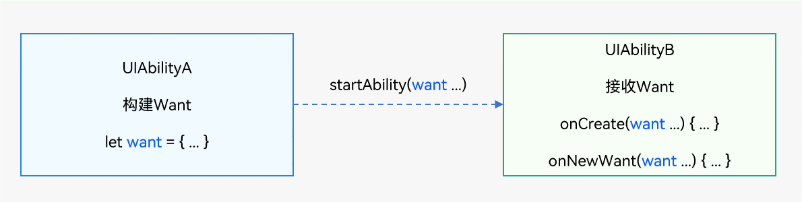

# Want概述


## Want的定义与用途

[Want](../reference/apis/js-apis-app-ability-want.md)是对象间信息传递的载体，可以用于应用组件间的信息传递。其使用场景之一是作为startAbility()的参数，包含了指定的启动目标以及启动时需携带的相关数据，如bundleName和abilityName字段分别指明目标Ability所在应用的包名以及对应包内的Ability名称。当UIAbilityA启动UIAbilityB并需要传入一些数据给UIAbilityB时，Want可以作为一个载体将数据传给UIAbilityB。

  **图1** Want用法示意  



## Want的类型

- **显式Want**：在启动Ability时指定了abilityName和bundleName的Want称为显式Want。
    当有明确处理请求的对象时，通过提供目标Ability所在应用的包名信息（bundleName），并在Want内指定abilityName便可启动目标Ability。显式Want通常用于在当前应用开发中启动某个已知的Ability。参数说明参见[Want参数说明](want-overview.md#Want参数说明)。
    
  ```ts
  let wantInfo = {
      deviceId: '', // deviceId为空表示本设备
      bundleName: 'com.example.myapplication',
      abilityName: 'FuncAbility',
  }
  ```

- **隐式Want**：在启动UIAbility时未指定abilityName的Want称为隐式Want。
  当请求处理的对象不明确时，希望在当前应用中使用其他应用提供的某个能力（通过[skills标签](../quick-start/module-configuration-file.md#skills标签)定义），而不关心提供该能力的具体应用，可以使用隐式Want。例如使用隐式Want描述需要打开一个链接的请求，而不关心通过具体哪个应用打开，系统将匹配声明支持该请求的所有应用。

  
  ```ts
  let wantInfo = {
      // uncomment line below if wish to implicitly query only in the specific bundle.
      // bundleName: 'com.example.myapplication',
      action: 'ohos.want.action.search',
      // entities can be omitted
      entities: [ 'entity.system.browsable' ],
      uri: 'https://www.test.com:8080/query/student',
      type: 'text/plain',
  };
  ```

  > **说明：**
  > - 根据系统中待匹配Ability的匹配情况不同，使用隐式Want启动Ability时会出现以下三种情况。
  >   - 未匹配到满足条件的Ability：启动失败。
  >   - 匹配到一个满足条件的Ability：直接启动该Ability。
  >   - 匹配到多个满足条件的Ability（UIAbility）：弹出选择框让用户选择。
  > 
  > - 调用方传入的want参数中不带有abilityName和bundleName，则不允许通过隐式Want启动所有应用的ServiceExtensionAbility。
  > 
  > - 调用方传入的want参数中带有bundleName，则允许使用startServiceExtensionAbility()方法隐式Want启动ServiceExtensionAbility，默认返回优先级最高的ServiceExtensionAbility，如果优先级相同，返回第一个。

## Want参数说明

| 名称 | 读写属性 | 类型 | 必填 | 描述 |
| -------- | -------- | -------- | -------- | -------- |
| deviceId | 只读 | string | 否 | 表示目标Ability所在设备ID。如果未设置该字段，则表明本设备。 |
| bundleName | 只读 | string | 否 | 表示目标Ability所在应用名称。 |
| moduleName | 只读 | string | 否 | 表示目标Ability所属的模块名称。 |
| abilityName | 只读 | string | 否 | 表示目标Ability名称。如果未设置该字段，则该Want为隐式。如果在Want中同时指定了bundleName，moduleName和abilityName，则Want可以直接匹配到指定的Ability。 |
| uri | 只读 | string | 否 | 表示携带的数据，一般配合type使用，指明待处理的数据类型。如果在Want中指定了uri，则Want将匹配指定的Uri信息，包括scheme,&nbsp;schemeSpecificPart,&nbsp;authority和path信息。 |
| type | 只读 | string | 否 | 表示携带数据类型，使用[MIME类型](https://www.iana.org/assignments/media-types/media-types.xhtml?utm_source=ld246.com%E3%80%82)规范。例如："text/plain"、"image/\*"等。 |
| [action](../reference/apis/js-apis-ability-wantConstant.md) | 只读 | string | 否 | 表示要执行的通用操作（如：查看、分享、应用详情）。在隐式Want中，您可定义该字段，配合uri或parameters来表示对数据要执行的操作。如打开，查看该uri数据。例如，当uri为一段网址，action为ohos.want.action.viewData则表示匹配可查看该网址的Ability。 |
| [entities](../reference/apis/js-apis-ability-wantConstant.md) | 只读 | Array&lt;string&gt; | 否 | 表示目标Ability额外的类别信息（如：浏览器，视频播放器），在隐式Want中是对action的补充。在隐式Want中，您可定义该字段，来过滤匹配UIAbility类别，如必须是浏览器。例如，在action字段的举例中，可存在多个应用声明了支持查看网址的操作，其中有应用为普通社交应用，有的为浏览器应用，您可通过entity.system.browsable过滤掉非浏览器的其他应用。 |
| [flags](../reference/apis/js-apis-ability-wantConstant.md#wantconstantflags) | 只读 | number | 否 | 表示处理Want的方式。例如通过wantConstant.Flags.FLAG_ABILITY_CONTINUATION表示是否以设备间迁移方式启动Ability。 |
| parameters | 只读 | {[key:&nbsp;string]:&nbsp;any} | 否 | 此参数用于传递自定义数据，通过用户自定义的键值对进行数据填充，具体支持的数据类型如[Want&nbsp;API](../reference/apis/js-apis-app-ability-want.md)所示。 |
