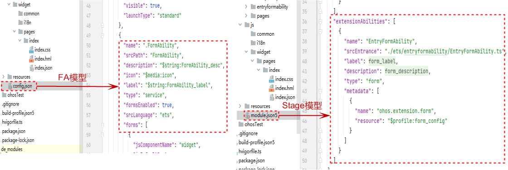
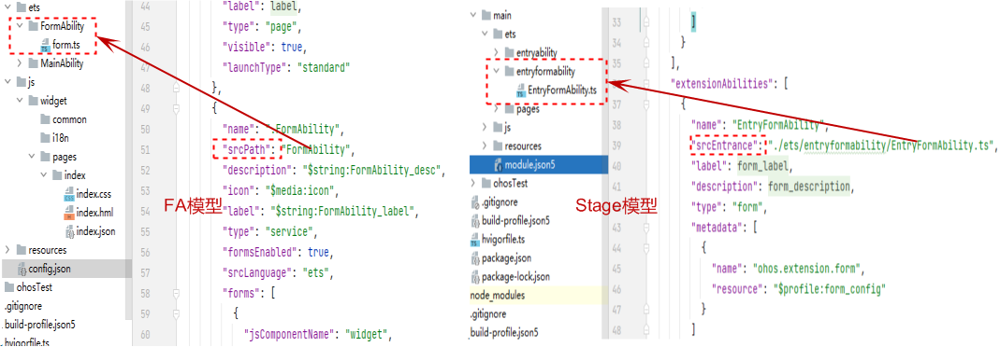
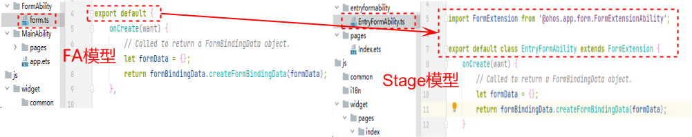

# 卡片切换

**卡片切换**主要包含如下三部分：

- 卡片页面布局：FA模型卡片和Stage模型卡片的布局都采用类web范式开发可以直接复用。
- 卡片配置文件：FA模型的卡片配置在config.json中，Stage卡片配置在module.json5和form_config.json中（如下图1和图2）。
- 卡片业务逻辑：FA模型和Stage模型在卡片入口文件以及生命周期存在细微的差异（如下图3和图4）。

| 配置项           | FA模型                                      | Stage模型                                                    |
| ---------------- | ------------------------------------------- | ------------------------------------------------------------ |
| 配置项位置       | formAbility和forms配置都在config.json文件里 | 一级目录module.json5配置文件中配置extensionAbilities（针对formExtensionAbility的配置），二级目录form_config.json文件中配置forms（针对formExtensionAbility里包含的forms的详细配置） |
| 卡片代码路径     | srcPath，不带文件名                         | srcEntry，带文件名                                           |
| 语言             | srcLanguage支持配置为js或ets                | 无此配置项，只支持ets                                        |
| 是否使能卡片     | formsEnabled                                | 无，type配置项配置为form即使能                               |
| ability类型      | type：service                               | type：form                                                   |
| 二级目录配置标签 | 无                                          | metadata：包含name、value、resource。其中resource用于指向卡片二级目录form_config.json文件的位置 |

入口配置差异示意图1：

卡片信息配置差异示意图2：

| 入口及生命周期 | FA模型 | Stage模型 |
| -------- | -------- | -------- |
| 入口文件 | srcPath指向的目录下的form.ts | srcEntry指向的文件 |
| 生命周期 | export&nbsp;default | import&nbsp;FormExtension&nbsp;from&nbsp;'\@ohos.app.form.FormExtensionAbility'; export&nbsp;default&nbsp;class&nbsp;FormAbility&nbsp;extends&nbsp;FormExtension |

入口文件差异示意图3：

生命周期差异示意图4（ 生命周期回调均一致，不需要调整）：

