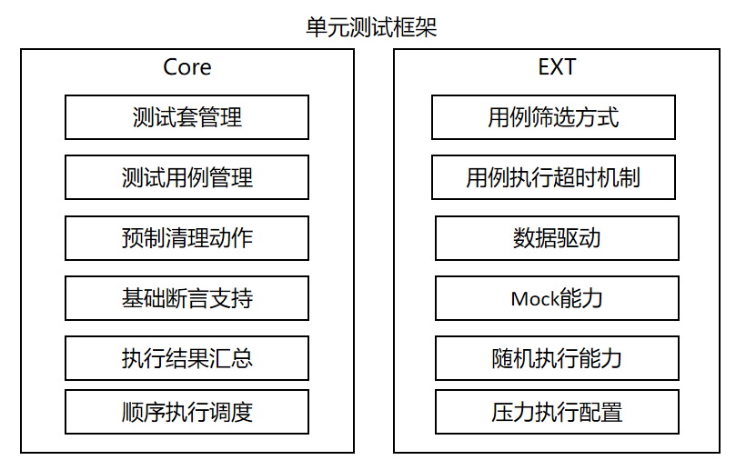
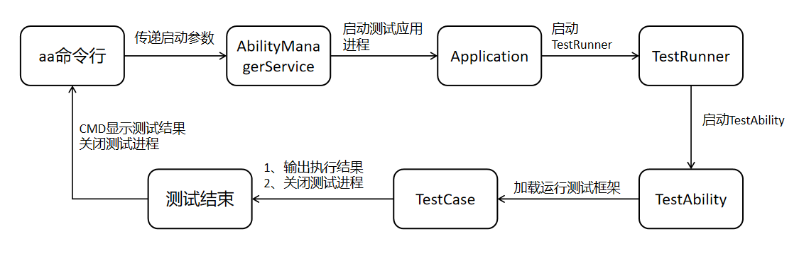
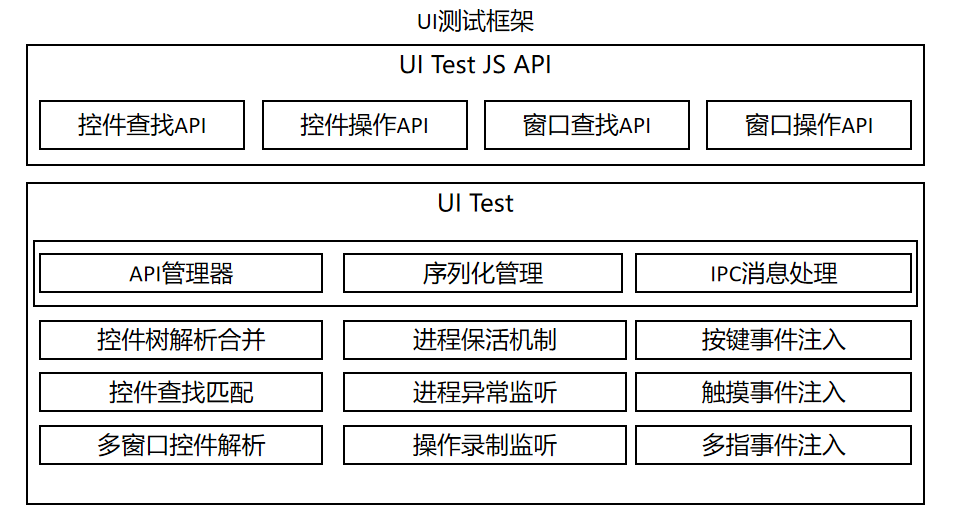
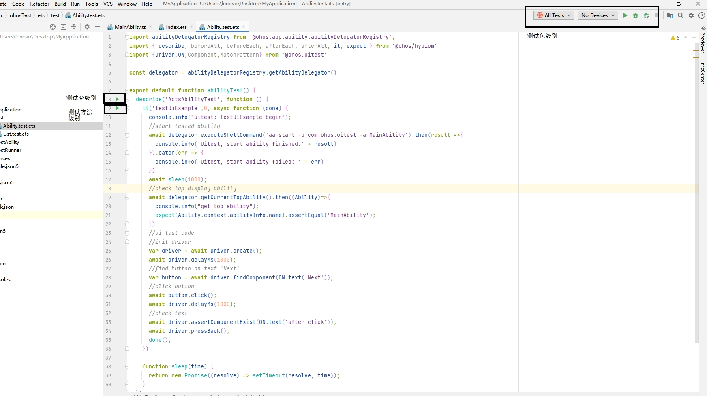
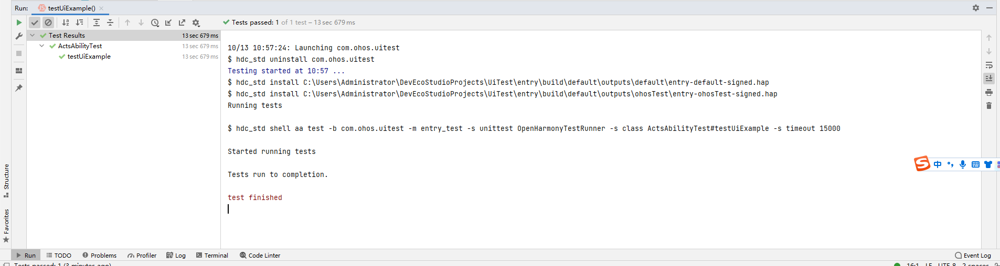

# 自动化测试框架使用指导 


## 概述

自动化测试框架arkxtest，作为工具集的重要组成部分，支持JS/TS语言的单元测试框架（JsUnit）及UI测试框架（UiTest）。<br>JsUnit提供单元测试用例执行能力，提供用例编写基础接口，生成对应报告，用于测试系统或应用接口。<br>UiTest通过简洁易用的API提供查找和操作界面控件能力，支持用户开发基于界面操作的自动化测试脚本。<br>本指南介绍了测试框架的主要功能、实现原理、环境准备，以及测试脚本编写和执行方法。同时，以shell命令方式，对外提供了获取截屏、控件树、录制用户操作、便捷注入UI模拟操作等能力，助力开发者更灵活方便测试和验证。

## 实现原理

测试框架分为单元测试框架和UI测试框架。<br>单元测试框架是测试框架的基础底座，提供了最基本的用例识别、调度、执行及结果汇总的能力。<br>UI测试框架主要对外提供了UiTest API供开发人员在对应测试场景调用，而其脚本的运行基础仍是单元测试框架。

### 单元测试框架

  图1.单元测试框架主要功能

  

  图2.脚本基础流程运行图

  

### UI测试框架

  图3.UI测试框架主要功能

  

## 基于ArkTS编写和执行测试

### 搭建环境

DevEco Studio可参考其官网介绍进行[下载](https://developer.harmonyos.com/cn/develop/deveco-studio)，并进行相关的配置动作。

### 新建和编写测试脚本

#### 新建测试脚本

<!--RP2-->
在DevEco Studio中新建应用开发工程，其中ohos目录即为测试脚本所在的目录。

在工程目录下打开待测试模块下的ets文件，将光标置于代码中任意位置，单击**右键 > Show Context Actions** **> Create Ohos Test**或快捷键**Alt+enter** **> Create Ohos Test**创建测试类，更多指导请参考DevEco Studio中[指导](https://developer.harmonyos.com/cn/docs/documentation/doc-guides-V3/harmonyos_jnit_jsunit-0000001092459608-V3?catalogVersion=V3#section13366184061415)。

<!--RP2End-->

#### 编写单元测试脚本

本章节主要描述单元测试框架支持能力，以及能力的使用方法，具体请参考[单元测试框架功能特性](https://gitee.com/openharmony/testfwk_arkxtest/blob/master/README_zh.md#%E5%8D%95%E5%85%83%E6%B5%8B%E8%AF%95%E6%A1%86%E6%9E%B6%E5%8A%9F%E8%83%BD%E7%89%B9%E6%80%A7)。

在单元测试框架，测试脚本需要包含如下基本元素：

1. 依赖导包，以便使用依赖的测试接口。

2. 测试代码编写，主要编写测试代码的相关逻辑，如接口调用等。

3. 断言接口调用，设置测试代码中的检查点，如无检查点，则不可认为一个完整的测试脚本。

如下示例代码实现的场景是：启动测试页面，检查设备当前显示的页面是否为预期页面。

```ts
import { describe, it, expect } from '@ohos/hypium';
import { abilityDelegatorRegistry } from '@kit.TestKit';
import { UIAbility, Want } from '@kit.AbilityKit';

const delegator = abilityDelegatorRegistry.getAbilityDelegator();
function sleep(time: number) {
  return new Promise<void>((resolve: Function) => setTimeout(resolve, time));
}
export default function abilityTest() {
  describe('ActsAbilityTest', () =>{
    it('testUiExample',0, async (done: Function) => {
      console.info("uitest: TestUiExample begin");
      await sleep(1000);
      const bundleName = abilityDelegatorRegistry.getArguments().bundleName;
      //start tested ability
      const want: Want = {
        bundleName: bundleName,
        abilityName: 'EntryAbility'
      }
      await delegator.startAbility(want);
      await sleep(1000);
      //check top display ability
      const ability: UIAbility = await delegator.getCurrentTopAbility();
      console.info("get top ability");
      expect(ability.context.abilityInfo.name).assertEqual('EntryAbility');
      done();
    })
  })
}
```

#### 编写UI测试脚本

本章节主要介绍UI测试框架支持能力，以及对应能力API的使用方法。<br>UI测试基于单元测试，UI测试脚本在单元测试脚本上增加了对UiTest接口，<!--RP1-->具体请参考[API文档](../reference/apis-test-kit/js-apis-uitest.md)<!--RP1End-->。<br>如下的示例代码是在上面的单元测试脚本基础上增量编写，实现的场景是：在启动的应用页面上进行点击操作，然后检测当前页面变化是否为预期变化。

1. 编写Index.ets页面代码，作为被测示例demo。

  ```ts
  @Entry
  @Component
  struct Index {
    @State message: string = 'Hello World';

    build() {
      Row() {
        Column() {
          Text(this.message)
            .fontSize(50)
            .fontWeight(FontWeight.Bold)
          Text("Next")
            .fontSize(50)
            .margin({top:20})
            .fontWeight(FontWeight.Bold)
          Text("after click")
            .fontSize(50)
            .margin({top:20})
            .fontWeight(FontWeight.Bold)
        }
        .width('100%')
      }
      .height('100%')
    }
  }
  ```

2. 在ohosTest > ets > test文件夹下.test.ets文件中编写具体测试代码。

  ```ts
  import { describe, it, expect } from '@ohos/hypium';
  // 导入测试依赖kit
  import { abilityDelegatorRegistry, Driver, ON } from '@kit.TestKit';
  import { UIAbility, Want } from '@kit.AbilityKit';

  const delegator: abilityDelegatorRegistry.AbilityDelegator = abilityDelegatorRegistry.getAbilityDelegator();
  function sleep(time: number) {
    return new Promise<void>((resolve: Function) => setTimeout(resolve, time));
  }
  export default function abilityTest() {
    describe('ActsAbilityTest', () => {
       it('testUiExample',0, async (done: Function) => {
          console.info("uitest: TestUiExample begin");
          await sleep(1000);
          const bundleName = abilityDelegatorRegistry.getArguments().bundleName;
          //start tested ability
          const want: Want = {
             bundleName: bundleName,
             abilityName: 'EntryAbility'
          }
          await delegator.startAbility(want);
          await sleep(1000);
          //check top display ability
          const ability: UIAbility = await delegator.getCurrentTopAbility();
          console.info("get top ability");
          expect(ability.context.abilityInfo.name).assertEqual('EntryAbility');
          //ui test code
          //init driver
          const driver = Driver.create();
          await driver.delayMs(1000);
          //find button on text 'Next'
          const button = await driver.findComponent(ON.text('Next'));
          //click button
          await button.click();
          await driver.delayMs(1000);
          //check text
          await driver.assertComponentExist(ON.text('after click'));
          await driver.pressBack();
          done();
       })
    })
  }
  ```

### 执行测试脚本

#### 在DevEco Studio执行

脚本执行需要连接硬件设备。通过点击按钮执行，当前支持以下执行方式：

1. 测试包级别执行，即执行测试包内的全部用例。

2. 测试套级别执行，即执行describe方法中定义的全部测试用例。

3. 测试方法级别执行，即执行指定it方法也就是单条测试用例。



**查看测试结果**

测试执行完毕后可直接在DevEco Studio中查看测试结果，如下图示例所示。



**查看测试用例覆盖率**

执行完测试用例后可以查看测试用例覆盖率，具体操作请参考[代码测试](https://developer.huawei.com/consumer/cn/doc/harmonyos-guides-V5/ide-code-test-V5)下各章节内的覆盖率统计模式。

#### 在CMD执行

脚本执行需要连接硬件设备，将应用测试包安装到测试设备上，在cmd窗口中执行aa命令，完成对用例测试。

> **说明：**
>
> 使用cmd的方式，需要配置好hdc相关的环境变量。

**aa test命令执行配置参数**

| 执行参数全写  | 执行参数缩写 | 执行参数含义                           | 执行参数示例                       |
| ------------- | ------------ | -------------------------------------- | ---------------------------------- |
| --bundleName  | -b           | 应用Bundle名称。                       | - b com.test.example               |
| --packageName | -p           | 应用模块名，适用于FA模型应用。           | - p com.test.example.entry         |
| --moduleName  | -m           | 应用模块名，适用于STAGE模型应用。        | -m entry                           |
| NA            | -s           | 特定参数，以<key, value>键值对方式传入。 | - s unittest /ets/testrunner/OpenHarmonyTestRunner |

框架当前支持多种用例执行方式，通过上表中的-s参数后的配置键值对参数传入触发，如下表所示。

| 配置参数名     | 配置参数含义                                                 | 配置参数取值                                               | 配置参数示例                              |
| ------------ | -----------------------------------------------------------------------------    | ------------------------------------------------------------ | ----------------------------------------- |
| unittest     | 用例执行所使用OpenHarmonyTestRunner对象。  | OpenHarmonyTestRunner或用户自定义runner名称                  | - s unittest OpenHarmonyTestRunner        |
| class        | 指定要执行的测试套或测试用例。                                  | {describeName}#{itName}，{describeName}                      | -s class attributeTest#testAttributeIt    |
| notClass     | 指定不需要执行的测试套或测试用例。                               | {describeName}#{itName}，{describeName}                      | -s notClass attributeTest#testAttributeIt |
| itName       | 指定要执行的测试用例。                                         | {itName}                                                     | -s itName testAttributeIt                 |
| timeout      | 测试用例执行的超时时间。                                        | 正整数（单位ms），如不设置默认为 5000                        | -s timeout 15000                          |
| breakOnError | 遇错即停模式，当执行用例断言失败或者发生错误时，退出测试执行流程。 | true，false（默认值）                                          | -s breakOnError true                      |
| random | 测试用例随机顺序执行。                  | true，false（默认值）                                           | -s random true                      |
| testType     | 指定要执行用例的用例类型。                     | function，performance，power，reliability，security，global，compatibility，user，standard，safety，resilience | -s testType function                      |
| level        | 指定要执行用例的用例级别。                     | 0, 1, 2, 3, 4                                              | -s level 0                                |
| size         | 指定要执行用例的用例规模。                     | small，medium，large                                        | -s size small        
| stress       | 指定要执行用例的执行次数。                     |  正整数                                         | -s stress 1000                            |

**在cmd窗口执行test命令**

> **说明：**
>
>参数配置和命令均是基于Stage模型。


示例代码1：执行所有测试用例。

```shell  
 hdc shell aa test -b xxx -m xxx -s unittest OpenHarmonyTestRunner
```

示例代码2：执行指定的describe测试套用例，指定多个需用逗号隔开。

```shell  
  hdc shell aa test -b xxx -m xxx -s unittest OpenHarmonyTestRunner -s class s1,s2
```

示例代码3：执行指定测试套中指定的用例，指定多个需用逗号隔开。

```shell  
  hdc shell aa test -b xxx -m xxx -s unittest OpenHarmonyTestRunner -s class testStop#stop_1,testStop1#stop_0
```

示例代码4：执行指定除配置以外的所有的用例，设置不执行多个测试套需用逗号隔开。

```shell  
  hdc shell aa test -b xxx -m xxx -s unittest OpenHarmonyTestRunner -s notClass testStop
```

示例代码5：执行指定it名称的所有用例，指定多个需用逗号隔开。

```shell  
  hdc shell aa test -b xxx -m xxx -s unittest OpenHarmonyTestRunner -s itName stop_0
```

示例代码6：用例执行超时时长配置。

```shell  
  hdc shell aa test -b xxx -m xxx -s unittest OpenHarmonyTestRunner -s timeout 15000
```

示例代码7：用例以breakOnError模式执行用例。

```shell  
  hdc shell aa test -b xxx -m xxx -s unittest OpenHarmonyTestRunner -s breakOnError true
```

示例代码8：执行测试类型匹配的测试用例。

```shell  
  hdc shell aa test -b xxx -m xxx -s unittest OpenHarmonyTestRunner -s testType function
```

示例代码9：执行测试级别匹配的测试用例。

```shell  
  hdc shell aa test -b xxx -m xxx -s unittest OpenHarmonyTestRunner -s level 0
```

示例代码10：执行测试规模匹配的测试用例。

```shell  
  hdc shell aa test -b xxx -m xxx -s unittest OpenHarmonyTestRunner -s size small
```

示例代码11：执行测试用例指定次数。

```shell  
  hdc shell aa test -b xxx -m xxx -s unittest OpenHarmonyTestRunner -s stress 1000
```

**查看测试结果**

- cmd模式执行过程，会打印如下相关日志信息。

 ```
  OHOS_REPORT_STATUS: class=testStop
  OHOS_REPORT_STATUS: current=1
  OHOS_REPORT_STATUS: id=JS
  OHOS_REPORT_STATUS: numtests=447
  OHOS_REPORT_STATUS: stream=
  OHOS_REPORT_STATUS: test=stop_0
  OHOS_REPORT_STATUS_CODE: 1

  OHOS_REPORT_STATUS: class=testStop
  OHOS_REPORT_STATUS: current=1
  OHOS_REPORT_STATUS: id=JS
  OHOS_REPORT_STATUS: numtests=447
  OHOS_REPORT_STATUS: stream=
  OHOS_REPORT_STATUS: test=stop_0
  OHOS_REPORT_STATUS_CODE: 0
  OHOS_REPORT_STATUS: consuming=4
 ```

| 日志输出字段               | 日志输出字段含义       |
| -------           | -------------------------|
| OHOS_REPORT_SUM    | 当前测试套用例总数。 |
| OHOS_REPORT_STATUS: class | 当前执行用例测试套名称。|
| OHOS_REPORT_STATUS: id | 用例执行语言，默认JS。  |
| OHOS_REPORT_STATUS: numtests | 测试包中测试用例总数 。|
| OHOS_REPORT_STATUS: stream | 当前用例发生错误时，记录错误信息。 |
| OHOS_REPORT_STATUS: test| 当前用例执行的it name。 |
| OHOS_REPORT_STATUS_CODE | 当前用例执行结果状态。0表示通过，1表示错误，2表示失败。|
| OHOS_REPORT_STATUS: consuming | 当前用例执行消耗的时长（ms）。 |

- cmd执行完成后,会打印如下相关日志信息。

 ```
  OHOS_REPORT_RESULT: stream=Tests run: 447, Failure: 0, Error: 1, Pass: 201, Ignore: 245
  OHOS_REPORT_CODE: 0

  OHOS_REPORT_RESULT: breakOnError model, Stopping whole test suite if one specific test case failed or error
  OHOS_REPORT_STATUS: taskconsuming=16029

 ```

| 日志输出字段               | 日志输出字段含义           |
| ------------------| -------------------------|
| run    | 当前测试包用例总数。 |
| Failure | 当前测试失败用例个数。 |
| Error | 当前执行用例发生错误用例个数。  |
| Pass | 当前执行用例通过用例个数。|
| Ignore | 当前未执行用例个数。 |
| taskconsuming| 执行当前测试用例总耗时（ms）。 |

> **说明：**
>
> 当处于breakOnError模式，用例发生错误时，注意查看Ignore以及中断说明。

## 基于shell命令测试

在开发过程中，若需要快速进行截屏、录屏、注入UI模拟操作、获取控件树等操作，可以使用shell命令，更方便完成相应测试。

> **说明：**
>
> 使用cmd的方式，需要配置好hdc相关的环境变量。

**命令列表**
| 命令            | 配置参数   |描述                              |
|---------------|---------------------------------|---------------------------------|
| help          | help|  显示uitest工具能够支持的命令信息。            |
| screenCap       |[-p] | 截屏。非必填。<br>指定存储路径和文件名，只支持存放在/data/local/tmp/下。<br>默认存储路径：/data/local/tmp，文件名：时间戳 + .png。 |
| dumpLayout      |[-p] \<-i \| -a>|支持在daemon运行时执行获取控件树。<br> **-p** ：指定存储路径和文件名，只支持存放在/data/local/tmp/下。默认存储路径：/data/local/tmp，文件名：时间戳 + .json。<br> **-i** ：不过滤不可见控件，也不做窗口合并。<br> **-a** ：保存 BackgroundColor、 Content、FontColor、FontSize、extraAttrs 属性数据。<br> **默认** ：不保存上述属性数据。<br> **-a和-i** 不可同时使用。 |
| uiRecord        | uiRecord \<record \| read>|录制Ui操作。  <br> **record** ：开始录制，将当前界面操作记录到/data/local/tmp/record.csv，结束录制操作使用Ctrl+C结束录制。  <br> **read** ：读取并且打印录制数据。<br>各参数代表的含义请参考[用户录制操作](#用户录制操作)。|
| uiInput       | \<help \| click \| doubleClick \| longClick \| fling \| swipe \| drag \| dircFling \| inputText \| keyEvent>| 注入UI模拟操作。<br>各参数代表的含义请参考[注入ui模拟操作](#注入ui模拟操作)。                       |
| --version | --version|获取当前工具版本信息。                     |
| start-daemon|start-daemon| 拉起uitest测试进程。 |

### 截图使用示例

```bash
# 存储路径：/data/local/tmp，文件名：时间戳 + .png。
hdc shell uitest screenCap
# 指定存储路径和文件名，存放在/data/local/tmp/下。
hdc shell uitest screenCap -p /data/local/tmp/1.png
```

### 获取控件树使用示例

```bash
hdc shell uitest dumpLayout -p /data/local/tmp/1.json
```

### 用户录制操作
>**说明**
>
> 录制过程中，需等待当前操作的识别结果在命令行输出后，再进行下一步操作。

```bash
# 将当前界面操作记录到/data/local/tmp/record.csv，结束录制操作使用Ctrl+C结束录制。
hdc shell uitest uiRecord record
# 读取并打印录制数据。
hdc shell uitest uiRecord read
```

以下举例为：record数据中包含的字段及字段含义，仅供参考。

 ```
 {
	 "ABILITY": "com.ohos.launcher.MainAbility", // 前台应用界面
	 "BUNDLE": "com.ohos.launcher", // 操作应用
	 "CENTER_X": "", // 预留字段,暂未使用
	 "CENTER_Y": "", // 预留字段,暂未使用
	 "EVENT_TYPE": "pointer", //  
	 "LENGTH": "0", // 总体步长
	 "OP_TYPE": "click", //事件类型，当前支持点击、双击、长按、拖拽、滑动、抛滑动作录制
	 "VELO": "0.000000", // 离手速度
	 "direction.X": "0.000000",// 总体移动X方向
	 "direction.Y": "0.000000", // 总体移动Y方向
	 "duration": 33885000.0, // 手势操作持续时间
	 "fingerList": [{
		 "LENGTH": "0", // 总体步长
		 "MAX_VEL": "40000", // 最大速度
		 "VELO": "0.000000", // 离手速度
		 "W1_BOUNDS": "{"bottom":361,"left":37,"right":118,"top":280}", // 起点控件bounds
		 "W1_HIER": "ROOT,3,0,0,0,0,0,0,0,0,5,0,0,0,0,0,0,0", // 起点控件hierarchy
		 "W1_ID": "", // 起点控件id
		 "W1_Text": "", // 起点控件text
		 "W1_Type": "Image", // 起点控件类型
		 "W2_BOUNDS": "{"bottom":361,"left":37,"right":118,"top":280}", // 终点控件bounds
		 "W2_HIER": "ROOT,3,0,0,0,0,0,0,0,0,5,0,0,0,0,0,0,0", // 终点控件hierarchy
		 "W2_ID": "", // 终点控件id
		 "W2_Text": "", // 终点控件text
		 "W2_Type": "Image", // 终点控件类型
		 "X2_POSI": "47", // 终点X
		 "X_POSI": "47", // 起点X
		 "Y2_POSI": "301", // 终点Y
		 "Y_POSI": "301", // 起点Y
		 "direction.X": "0.000000", // x方向移动量
		 "direction.Y": "0.000000" // Y方向移动量
	 }],
	 "fingerNumber": "1" //手指数量
 }
 ```

### 注入UI模拟操作

| 命令   | 必填 | 描述              | 
|------|------|-----------------|
| help   | 是    | uiInput命令相关帮助信息。 |
| click   | 是    | 模拟单击操作。      | 
| doubleClick   | 是    | 模拟双击操作。      | 
| longClick   | 是    | 模拟长按操作。     | 
| fling   | 是    | 模拟快滑操作。   | 
| swipe   | 是    | 模拟慢滑操作。     | 
| drag   | 是    | 模拟拖拽操作。     | 
| dircFling   | 是    | 模拟指定方向滑动操作。     |
| inputText   | 是    | 指定坐标点，模拟输入框输入文本操作。                   |
| text   | 是    | 无需指定坐标点，在当前获焦处，模拟输入框输入文本操作。                           |
| keyEvent   | 是    | 模拟实体按键事件（如：键盘，电源键，返回上一级，返回桌面等），以及组合按键操作。     | 


#### uiInput click/doubleClick/longClick使用示例

| 配置参数    | 必填 | 描述            |
|---------|------|-----------------|
| point_x | 是      | 点击x坐标点。 |
| point_y | 是       | 点击y坐标点。 |

```shell
# 执行单击事件。
hdc shell uitest uiInput click 100 100

# 执行双击事件。
hdc shell uitest uiInput doubleClick 100 100

# 执行长按事件。
hdc shell uitest uiInput longClick 100 100
```

#### uiInput fling使用示例

| 配置参数  | 必填             | 描述               |      
|------|------------------|-----------------|
| from_x   | 是                | 滑动起点x坐标。 | 
| from_y   | 是                | 滑动起点y坐标。 | 
| to_x   | 是                | 滑动终点x坐标。 |
| to_y   | 是                | 滑动终点y坐标。 |
| swipeVelocityPps_   | 否      | 滑动速度，单位：px/s，取值范围：200-40000。<br> 默认值：600。 | 
| stepLength_   | 否 | 滑动步长。默认值：滑动距离/50。<br>  **为实现更好的模拟效果，推荐参数缺省/使用默认值。**  | 


```shell  
# 执行快滑操作，stepLength_缺省。
hdc shell uitest uiInput fling 10 10 200 200 500 
``` 

#### uiInput swipe/drag使用示例

| 配置参数  | 必填             | 描述               |      
|------|------------------|-----------------|
| from_x   | 是                | 滑动起点x坐标。 | 
| from_y   | 是                | 滑动起点y坐标。 | 
| to_x   | 是                | 滑动终点x坐标。 |
| to_y   | 是                | 滑动终点y坐标。 |
| swipeVelocityPps_   | 否      | 滑动速度，单位：px/s，取值范围：200-40000。<br> 默认值: 600。 | 

```shell  
# 执行慢滑操作。
hdc shell uitest uiInput swipe 10 10 200 200 500

# 执行拖拽操作。 
hdc shell uitest uiInput drag 10 10 100 100 500 
```

#### uiInput dircFling使用示例

| 配置参数             | 必填       | 描述 |
|-------------------|-------------|----------|
| direction         | 否 | 滑动方向，取值范围：[0,1,2,3]，默认值为0。<br> 0代表向左滑动，1代表向右滑动，2代表向上滑动，3代表向下滑动。    | 
| swipeVelocityPps_ | 否| 滑动速度，单位：px/s，取值范围：200-40000。<br> 默认值: 600。    | 
| stepLength        | 否        | 滑动步长。<br> 默认值: 滑动距离/50。为更好的模拟效果，推荐参数缺省/使用默认值。 |

```shell  
# 执行左滑操作。
hdc shell uitest uiInput dircFling 0 500
# 执行向右滑动操作。
hdc shell uitest uiInput dircFling 1 600
# 执行向上滑动操作。
hdc shell uitest uiInput dircFling 2 
# 执行向下滑动操作。
hdc shell uitest uiInput dircFling 3
```

#### uiInput inputText使用示例

| 配置参数             | 必填       | 描述 |       
|------|------------------|----------|
| point_x   | 是                | 输入框x坐标点。 | 
| point_y   | 是                | 输入框y坐标点。 |
| text   | 是                | 输入文本内容。  |

```shell  
# 执行输入框输入操作。
hdc shell uitest uiInput inputText 100 100 hello 
```

#### uiInput text使用示例

| 配置参数             | 必填       | 描述 |       
|------|------------------|----------|
| text   | 是                | 输入文本内容。  |

```shell  
# 无需输入坐标点，在当前获焦处，执行输入框输入操作。若当前获焦处不支持文本输入，则无实际效果。
hdc shell uitest uiInput text hello
```

#### uiInput keyEvent使用示例

| 配置参数             | 必填       | 描述                                                                                                                              |                
|------|------|---------------------------------------------------------------------------------------------------------------------------------|
| keyID1   | 是    | 实体按键对应ID，取值范围：Back、Home、Power、或[KeyCode键码值](../reference/apis-input-kit/js-apis-keycode.md#keycode)。<br>当取值为Back、Home或Power时，不支持输入组合键。 | 
| keyID2    | 否    | 实体按键对应ID，取值范围：[KeyCode键码值](../reference/apis-input-kit/js-apis-keycode.md#keycode)，默认值为空。                                               |
| keyID3    | 否    | 实体按键对应ID，取值范围：[KeyCode键码值](../reference/apis-input-kit/js-apis-keycode.md#keycode)，默认值为空。                                               |

```shell  
# 返回主页。
hdc shell uitest uiInput keyEvent Home
# 返回。
hdc shell uitest uiInput keyEvent Back
# 组合键粘贴。
hdc shell uitest uiInput keyEvent 2072 2038
```

### 获取版本信息

```bash
hdc shell uitest --version
```
### 拉起uitest测试进程

```shell  
hdc shell uitest start-daemon
```

>**说明**
>
> 设备需调成开发者模式。
>
> 仅元能力aa test拉起的测试hap才能调用Uitest的能力。
>
> 测试hap的<!--RP4-->[APL等级级别](../security/AccessToken/app-permission-mgmt-overview.md#权限机制中的基本概念)<!--RP4End-->需为system_basic、normal。

<!--Del-->
## 相关实例

### 单元测试脚本实例

#### 单元测试断言功能使用实例
介绍单元测试框架中支持的断言能力如何使用，具体代码请查看[断言能力示例](https://gitee.com/openharmony/applications_app_samples/blob/master/code/Project/Test/jsunit/entry/src/ohosTest/ets/test/assertExampleTest/assertExample.test.ets)。

#### 单元测试测试套定义使用实例
介绍单元测试框架测试套嵌套如何定义，包括嵌套定义能力，具体代码请参考[测试套嵌套示例](https://gitee.com/openharmony/applications_app_samples/blob/master/code/Project/Test/jsunit/entry/src/ohosTest/ets/test/coverExampleTest/coverExample.test.ets)。

#### 单元测试测试应用自定义函数使用实例
介绍针对应用内自定义函数如何使用框架能力进行测试，具体代码请参考[应用自定义函数测试示例](https://gitee.com/openharmony/applications_app_samples/blob/master/code/Project/Test/jsunit/entry/src/ohosTest/ets/test/customExampleTest/customExample.test.ets)。

#### 单元测试数据驱动能力使用实例
介绍测试框架数据驱动能力、脚本重复执行配置功能，具体代码请参考[数据驱动能力示例](https://gitee.com/openharmony/applications_app_samples/blob/master/code/Project/Test/jsunit/entry/src/ohosTest/ets/test/paramExampleTest/paramExample.test.ets)。

### UI测试脚本实例（控件类）

#### 查找指定控件能力实例
介绍通过设置控件属性作为查找条件，在应用界面上查找组件对象，具体代码请参考[控件查找示例](https://gitee.com/openharmony/applications_app_samples/blob/master/code/Project/Test/uitest/entry/src/ohosTest/ets/test/findCommentExampleTest/Component/findCommentExample.test.ets)。

#### 模拟点击操作事件能力实例
介绍模拟用户在应用界面上进行点击，长按，双击等事件,具体代码请参考[点击事件示例](https://gitee.com/openharmony/applications_app_samples/blob/master/code/Project/Test/uitest/entry/src/ohosTest/ets/test/operationExampleTest/ui/clickEvent.test.ets)。

#### 模拟鼠标操作能力实例
介绍模拟鼠标左击、右击、滑轮事件，具体代码请参考[鼠标操作事件示例](https://gitee.com/openharmony/applications_app_samples/blob/master/code/Project/Test/uitest/entry/src/ohosTest/ets/test/operationExampleTest/ui/MouseEvent.test.ets)。

#### 模拟文本输入能力实例
介绍模拟输入中文、英文文本内容，仅支持可输入文本的组件进行操作，例如文本框等，具体代码请参考[文本输入能力示例](https://gitee.com/openharmony/applications_app_samples/blob/master/code/Project/Test/uitest/entry/src/ohosTest/ets/test/operationExampleTest/ui/InputEvent.test.ets)。

#### 截图能力实例
介绍屏幕截图功能，包括指定区域截图能力，具体代码请参考[截图能力示例](https://gitee.com/openharmony/applications_app_samples/blob/master/code/Project/Test/uitest/entry/src/ohosTest/ets/test/operationExampleTest/ui/ScreenCapEvent.test.ets)。

#### 模拟快滑操作能力实例
介绍模拟快滑操作能力，即在可滑动页面上进行滑动，滑动后手指离开屏幕，具体代码请参考[模拟快滑操作能力示例](https://gitee.com/openharmony/applications_app_samples/blob/master/code/Project/Test/uitest/entry/src/ohosTest/ets/test/operationExampleTest/ui/FlingEvent.test.ets)。

#### 模拟慢滑操作能力实例
介绍模拟慢滑操作能力，即在可滑动页面上进行滑动，滑动后手指仍停留在屏幕，具体代码请参考[模拟慢滑操作能力示例](https://gitee.com/openharmony/applications_app_samples/blob/master/code/Project/Test/uitest/entry/src/ohosTest/ets/test/operationExampleTest/ui/SwipeEvent.test.ets)。

#### 模拟缩放操作能力实例
介绍模拟缩放能力，即在支持放大缩小的图片上，模拟双指缩放操作的能力，具体代码请参考[模拟缩放操作能力示例](https://gitee.com/openharmony/applications_app_samples/blob/master/code/Project/Test/uitest/entry/src/ohosTest/ets/test/operationExampleTest/ui/PinchEvent.test.ets)。

#### 模拟滚动到组件顶端或底端能力实例
介绍模拟针对滑动类组件，可以模拟操作直接滚动到组件顶端或底端，具体代码请参考[模拟滚动到组件顶端或底端示例](https://gitee.com/openharmony/applications_app_samples/blob/master/code/Project/Test/uitest/entry/src/ohosTest/ets/test/operationExampleTest/ui/ScrollerEvent.test.ets)。

### UI测试脚本实例（窗口类）

#### 查找指定窗口能力实例
介绍通过应用包名查找应用窗口，具体代码请参考[查找指定窗口能力示例](https://gitee.com/openharmony/applications_app_samples/blob/master/code/Project/Test/uitest/entry/src/ohosTest/ets/test/findCommentExampleTest/window/findWindowExample.test.ets)。

#### 模拟窗口移动能力实例
介绍模拟移动窗口到指定位置能力，具体代码请参考[模拟窗口移动示例](https://gitee.com/openharmony/applications_app_samples/blob/master/code/Project/Test/uitest/entry/src/ohosTest/ets/test/operationExampleTest/window/MoveToEvent.test.ets)。

#### 模拟调整窗口大小能力实例
介绍模拟调整窗口大小能力，并可指定调整的具体方向，具体代码请参考[模拟调整窗口大小能力示例](https://gitee.com/openharmony/applications_app_samples/blob/master/code/Project/Test/uitest/entry/src/ohosTest/ets/test/operationExampleTest/window/ReSizeWindow.test.ets)。

<!--DelEnd-->

## 常见问题

### 单元测试用例常见问题

**1. 用例中增加的打印日志在用例结果之后才打印**

**问题描述**

用例中增加的日志打印信息，没有在用例执行过程中出现，而是在用例执行结束之后才出现。

**可能原因**

此类情况只会存在于用例中有调用异步接口的情况，原则上用例中所有的日志信息均在用例执行结束之前打印。

**解决方法**

当被调用的异步接口多于一个时，建议将接口调用封装成Promise方式调用。

**2. 执行用例时报error：fail to start ability**

**问题描述**

执行测试用例时候，用例执行失败，控制台返回错误：fail to start ability。

**可能原因**

测试包打包过程中出现问题，未将测试框架依赖文件打包在测试包中。

**解决方法**

检查测试包中是否包含OpenHarmonyTestRunner.abc文件，如没有则重新编译打包后再次执行测试。

**3. 执行用例时报用例超时错误**

**问题描述**

用例执行结束，控制台提示execute time XXms错误，即用例执行超时。

**可能原因**

1. 用例执行异步接口，但执行过程中没有执行到done函数，导致用例执行一直没有结束，直到超时结束。

2. 用例调用函数耗时过长，超过用例执行设置的超时时间。

3. 用例调用函数中断言失败，抛出失败异常，导致用例执行一直没有结束，直到超时结束。

**解决方法**

1. 检查用例代码逻辑，确保即使断言失败场景认可走到done函数，保证用例执行结束。

2. 可在IDE中Run/Debug Configurations中修改用例执行超时配置参数，避免用例执行超时。

3. 检查用例代码逻辑，断言结果，确保断言Pass。
### UI测试用例常见问题

**1. 失败日志有“Get windows failed/GetRootByWindow failed”错误信息**

**问题描述**

UI测试用例执行失败，查看hilog日志发现日志中有“Get windows failed/GetRootByWindow failed”错误信息。

**可能原因**

系统ArkUI开关未开启，导致被测试界面控件树信息未生成。

**解决方法**

执行如下命令，并重启设备再次执行用例。

```shell
hdc shell param set persist.ace.testmode.enabled 1
```

**2. 失败日志有“uitest-api dose not allow calling concurrently”错误信息**

**问题描述**

UI测试用例执行失败，查看hilog日志发现日志中有“uitest-api dose not allow calling concurrently”错误信息。

**可能原因**

1. 用例中UI测试框架提供异步接口没有增加await语法糖调用。

2. 多进程执行UI测试用例，导致拉起多个UITest进程，框架不支持多进程调用。

**解决方法**

1. 检查用例实现，异步接口增加await语法糖调用。

2. 避免多进程执行UI测试用例。

**3. 失败日志有“does not exist on current UI! Check if the UI has changed after you got the widget object”错误信息**

**问题描述** 

UI测试用例执行失败，查看hilog日志发现日志中有“does not exist on current UI! Check if the UI has changed after you got the widget object”错误信息。

**可能原因**

在用例中代码查找到目标控件后，设备界面发生了变化，导致查找到的控件丢失，无法进行下一步的模拟操作。

**解决方法**

重新执行UI测试用例。