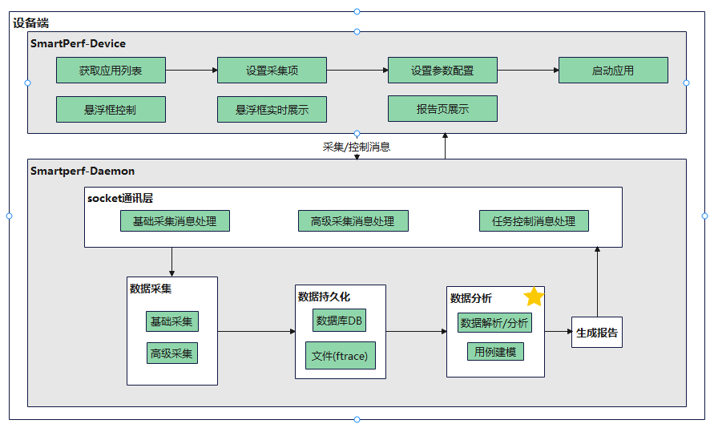
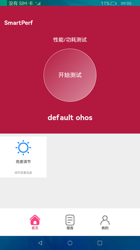
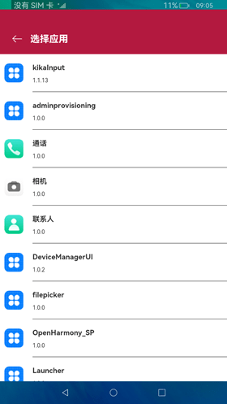
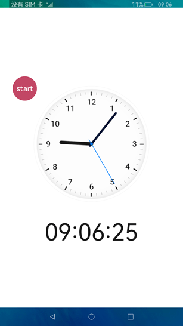
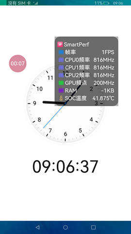
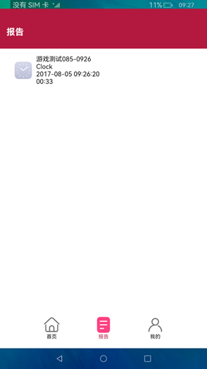
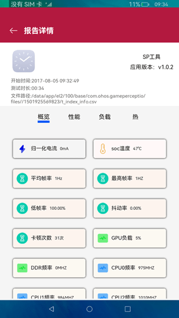

# SmartPerf Device性能工具使用指导

## 工具简介

SmartPerf Device是一款基于系统开发的性能功耗测试工具，操作简单易用。该工具可以监测性能、功耗相关指标，包括FPS、CPU、GPU、RAM、Temp等，通过量化的指标项了解应用、整机性能状况。

<!--Del-->在开发过程中，会使用到有屏或无屏设备，对此SmartPerf Device提供了两种方式：分别是Device-hap端和Device-daemon端。Device-hap端适用于有屏设备，支持可视化操作。测试时是通过悬浮窗的开始和暂停来实时展示性能指标数据，保存后可生成数据报告，在报告中可分析各指标数据详情。<!--DelEnd-->Device-daemon端支持shell命令行方式，同时适用于有屏和无屏设备。

### 指标说明

- CPU：每秒读取一次设备节点下CPU大中小核的频点和各核使用率，衡量应用占用CPU资源的情况，占用过多的CPU资源会导致芯片发烫。
- GPU：每秒读取一次设备节点下GPU的频点和负载信息，衡量应用占用GPU资源的情况，当GPU占用过多时，会导致性能下降，应用程序的运行速度变慢。
- FPS：应用界面每秒刷新次数，衡量应用画面的流畅度，FPS越高通常表示图像流畅度越好，用户体验也越好。
- TEMP：每秒读取一次设备节点下GPU温度、系统芯片温度信息。
- RAM：每秒读取一次应用进程的实际物理内存，衡量应用的内存占比情况。
- snapshot：每2秒截取一张应用界面截图。

## 实现原理

下图展示了SmartPerf Device工具的主要功能组成。Device-hap端设置好采集项和采集参数后，启动应用，FPS、RAM、Trace等指标通过消息发送给Device-daemon端，Device-daemon端进行数据采集、持久化和数据分析<!--Del-->，将生成的报告回传给Device-hap端，Device-hap端进行可视化显示<!--DelEnd-->。



## 约束与限制

1. Device-daemon端<!--Del-->、Device-hap端<!--DelEnd-->在API 9版本开始预置使用。

2. Device-daemon端执行需连接硬件设备<!--Del-->，Device-hap端需在有屏幕设备使用<!--DelEnd-->。

3. Device-daemon端执行前需完成[hdc环境配置](https://gitee.com/openharmony/developtools_hdc)。

<!--Del-->

## SmartPerf Device-hap端

下面的操作步骤和界面内容以RK3568设备为例。

### 获取应用列表

点击设备上"SmartPerf Device-hap端"应用图标，进入"首页"，点击"请选择一个应用"，在应用列表页选择需要测试的应用。





### 设置采集参数

应用选择完成后回到开始测试页面，根据实际业务需要，配置"测试指标"。同时，可修改测试名称（测试名称包含测试的应用名称和测试时间，会呈现在报告列表中），是否抓取trace，选择是否开启截图。配置完成后，点击底部"开始测试"按钮。

### 悬浮窗控制采集

点击悬浮窗"start"开始采集，点击悬浮窗"计时器"（如下图中00:07）暂停采集。再次点击"计时器"，继续开始采集。双击"计时器"，实时展示采集数据。长按"计时器"，结束采集。<br>整个过程中，可拖动悬浮框调整悬浮框位置。




### 查看报告

点击"报告"，查看测试报告列表。点击项目，进入报告详情页，查看测试指标项详情。



<!--DelEnd-->

<!--RP1-->

## SmartPerf Device-daemon端

### 采集前提

#### 进入shell

  ```
  C:\Users\issusser>hdc shell
  #
  ```

#### 拉起和查看daemon进程

  ```
  C:\Users\issusser>hdc shell
  // 拉起daemon进程
  # SP_daemon 
  // 查看daemon进程是否存在
  # ps -ef | grep SP_daemon
  root          1584     1 0 21:50:05 ?     00:00:00 SP_daemon
  root          1595  1574 3 21:51:02 pts/0 00:00:00 grep SP_daemon
  #
  ```

#### 执行和查看帮助命令

<!--RP3-->

  ```
  # SP_daemon --help
  OpenHarmony performance testing tool SmartPerf command-line version
   Usage: SP_daemon [options] [arguments]
    
   options:
    -N              set the collection times(default value is 0) range[1,2147483647], for example: -N 10
    -PKG            set package name, must add, for example: -PKG ohos.samples.ecg
    -c              get device CPU frequency and CPU usage, process CPU usage and CPU load ..
    -g              get device GPU frequency and GPU load
    -f              get app refresh fps(frames per second) and fps jitters and refreshrate
    -profilerfps    get refresh fps and timestamp
    -sections       set collection time period(using with profilerfps)
    -t              get remaining battery power and temperature..
    -p              get battery power consumption and voltage(Not supported by some devices)
    -r              get process memory and total memory
    -snapshot       get screen capture
    -net            get uplink and downlink traffic
    -start          collection start command
    -stop           collection stop command
    -VIEW           set layler, for example: -VIEW DisplayNode
    -OUT            set csv output path.
    -d              get device DDR information
    -screen         get screen resolution
    -deviceinfo     get device information
    -server         start a process to listen to the socket message of the start and stop commands
    -clear          clear the process ID
    -ohtestfps      used by the vilidator to obtain the fps, the collection times can be set
    -editorServer   start a process to listen to the socket message of the editor
    -recordcapacity get the battery level difference
    --version       get version
    --help          get help
    -editor         scenario-based collection identifier, parameter configuration items can be added later
    responseTime   get the page response delay after an application is operated
    completeTime   get the page completion delay after an application is operated
    fpsohtest      used by the vilidator to obtain the fps
    example1:
    SP_daemon -N 20 -c -g -t -p -r -net -snapshot -d
    SP_daemon -N 20 -PKG ohos.samples.ecg -c -g -t -p -f -r -net -snapshot -d
    SP_daemon -start -c
    SP_daemon -stop
    example2: These parameters need to be used separately
    SP_daemon -screen
    SP_daemon -deviceinfo
    SP_daemon -server
    SP_daemon -clear
    SP_daemon -ohtestfps 10
    SP_daemon -editorServer
    SP_daemon -recordcapacity
    example3: These parameters need to be used separately
    SP_daemon -editor responseTime ohos.samples.ecg app name
    SP_daemon -editor completeTime ohos.samples.ecg app name
    SP_daemon -editor fpsohtest
    
    
    
    command exec finished!
   #
  ```
<!--RP3End-->

### 基础采集

#### 通过-N开启采集
<!--RP1End-->

| 命令参数   |必选| 说明                   |
| :-----| :-----| :--------------------- |
| -N    |是| 设置采集次数，一秒采集一次    |
| -PKG  |否| 设置包名                |
| -c    |否| 采集cpu的频点和使用率。<br>设置应用包名时，采集整机和应用CPU信息 <br>不设置应用包名时，采集整机CPU信息     |
| -g    |否| 采集gpu的频点和负载信息   |
| -f    |否| 采集指定应用的fps以及屏幕刷新率，必须设置应用包名        |
| -profilerfps |否| 采集当前界面fps          |
| -t    |否| 采集GPU温度、系统芯片温度           |
| -r    |否| 采集内存。<br>设置应用包名时，采集整机和应用内存信息 <br>不设置应用包名时，采集整机内存信息             |
| -snapshot |否| 屏幕截图             |
| -net |否| 采集网络速率              |
| -VIEW |否| 设置图层，需要先获取应用图层名                |
| -d    |否| 采集DDR                 |
| -sections|否| 设置分段采集          |

##### 使用示例

- 采集2次整机CPU大中小核频率、各核使用率

  ```
    # SP_daemon -N 2 -c

    order:0 timestamp=1503078645909
    order:1 cpu0Frequency=1992000
    order:2 cpu0Usage=34.042553
    order:3 cpu0idleUsage=65.957447
    order:4 cpu0ioWaitUsage=0.000000
    order:5 cpu0irqUsage=0.000000
    order:6 cpu0niceUsage=0.000000
    order:7 cpu0softIrqUsage=0.000000
    order:8 cpu0systemUsage=15.957447
    order:9 cpu0userUsage=18.085106
    order:10 cpu1Frequency=1992000
    order:11 cpu1Usage=43.877551
    order:12 cpu1idleUsage=56.122449
    order:13 cpu1ioWaitUsage=0.000000
    order:14 cpu1irqUsage=0.000000
    order:15 cpu1niceUsage=0.000000
    order:16 cpu1softIrqUsage=0.000000
    order:17 cpu1systemUsage=17.346939
    order:18 cpu1userUsage=26.530612
    order:19 cpu2Frequency=1992000
    order:20 cpu2Usage=38.043478
    order:21 cpu2idleUsage=61.956522
    order:22 cpu2ioWaitUsage=0.000000
    order:23 cpu2irqUsage=0.000000
    order:24 cpu2niceUsage=0.000000
    order:25 cpu2softIrqUsage=0.000000
    order:26 cpu2systemUsage=11.956522
    order:27 cpu2userUsage=26.086957
    order:28 cpu3Frequency=1992000
    order:29 cpu3Usage=68.421053
    order:30 cpu3idleUsage=31.578947
    order:31 cpu3ioWaitUsage=0.000000
    order:32 cpu3irqUsage=0.000000
    order:33 cpu3niceUsage=0.000000
    order:34 cpu3softIrqUsage=0.000000
    order:35 cpu3systemUsage=13.684211
    order:36 cpu3userUsage=54.736842

    ...

    command exec finished!
    #
  ```

- 采集2次整机CPU大中小核频率、各核使用率以及进程CPU使用率、负载

  ```
    # SP_daemon -N 2 -PKG com.ohos.settings -c


    order:0 timestamp=1503078694916
    order:1 ProcAppName=com.ohos.settings
    order:2 ProcCpuLoad=0
    order:3 ProcCpuUsage=0
    order:4 ProcId=0
    order:5 ProcSCpuUsage=0
    order:6 ProcUCpuUsage=0
    order:7 cpu0Frequency=1992000
    order:8 cpu0Usage=31.868132
    order:9 cpu0idleUsage=68.131868
    order:10 cpu0ioWaitUsage=0.000000
    order:11 cpu0irqUsage=0.000000
    order:12 cpu0niceUsage=0.000000
    order:13 cpu0softIrqUsage=0.000000
    order:14 cpu0systemUsage=15.384615
    order:15 cpu0userUsage=16.483516
    order:16 cpu1Frequency=1992000
    order:17 cpu1Usage=44.791667
    order:18 cpu1idleUsage=55.208333
    order:19 cpu1ioWaitUsage=0.000000
    order:20 cpu1irqUsage=0.000000
    order:21 cpu1niceUsage=0.000000
    order:22 cpu1softIrqUsage=0.000000
    order:23 cpu1systemUsage=13.541667
    order:24 cpu1userUsage=31.250000
    order:25 cpu2Frequency=1992000
    order:26 cpu2Usage=37.894737
    order:27 cpu2idleUsage=62.105263
    order:28 cpu2ioWaitUsage=0.000000
    order:29 cpu2irqUsage=0.000000
    order:30 cpu2niceUsage=0.000000
    order:31 cpu2softIrqUsage=1.052632
    order:32 cpu2systemUsage=13.684211
    order:33 cpu2userUsage=23.157895
    order:34 cpu3Frequency=1992000
    order:35 cpu3Usage=81.632653
    order:36 cpu3idleUsage=18.367347
    order:37 cpu3ioWaitUsage=0.000000
    order:38 cpu3irqUsage=0.000000
    order:39 cpu3niceUsage=0.000000
    order:40 cpu3softIrqUsage=0.000000
    order:41 cpu3systemUsage=15.306122
    order:42 cpu3userUsage=66.326531

    ...

    command exec finished!
    #
  ```

  >**说明**
  >
  >- 使用该命令采集时需进入被测应用内。

- 采集1次整机GPU频率和负载
 
  ```
    # SP_daemon -N 1 -g
    
    
    
    order:0 timestamp=1503078740268
    order:1 gpuFrequency=200000000
    order:2 gpuLoad=38.000000
    
    command exec finished!
    #
  ```

- 采集2次整机温度

  ```
    # SP_daemon -N 2 -t

    order:0 timestamp=1502720711191
    order:1 gpu-thermal=42500.000000
    order:2 soc-thermal=43.125000
    
    
    order:0 timestamp=1502720712191
    order:1 gpu-thermal=41875.000000
    order:2 soc-thermal=42.500000

    command exec finished!
    #
  ```

- 采集2次整机内存

  ```
    # SP_daemon -N 2 -r
    order:0 timestamp=1705041562521
    order:1 memAvailable=7339224
    order:2 memFree=7164708
    order:3 memTotal=11641840

    order:0 timestamp=1705041563527
    order:1 memAvailable=7339136
    order:2 memFree=7164684
    order:3 memTotal=11641840

    command exec finished!
    #
  ```

- 采集1次整机和指定应用进程内存

  ```
    # SP_daemon -N 1 -PKG ohos.samples.ecg -r

    order:0 timestamp=1720427095197
    order:1 arktsHeapPss=17555
    order:2 gpuPss=7021
    order:3 graphicPss=163320
    order:4 heapAlloc=120344
    order:5 heapFree=14362
    order:6 heapSize=133436
    order:7 memAvailable=2757504
    order:8 memFree=190852
    order:9 memTotal=11742716
    order:10 nativeHeapPss=49102
    order:11 privateClean=1100020
    order:12 privateDirty=175169
    order:13 pss=422172
    order:14 sharedClean=89348
    order:15 sharedDirty=19084
    order:16 stackPss=1588
    order:17 swap=122076
    order:18 swapPss=122076


    command exec finished!
    #
  ```
  >**说明**
  >
  >- 使用该命令采集时需进入被测应用内。
  >- 该命令集成了历史版本-m的数据（arktsHeapPss、gpuPss、graphicPss...）。

- 采集2次截图

  ```
    # SP_daemon -N 2 -snapshot

    order:0 timestamp=1705041753321
    order:1 capture=data/local/tmp/capture/screenCap_1705041753321.png

    /data/local/tmp/capture created!

    order:0 timestamp=1705041754324
    order:1 capture=NA

    command exec finished!
    #
  ```
  >**说明**
  >
  >- 截图采集是2秒截取一次。
  >
  >- 截图报告存放路径为：data/local/tmp/capture。
  >
  >- 采集结束后：进入 data/local/tmp/capture 查看生成的截图。
  >
  >- 导出截图到D盘：重启一个命令行工具执行命令： hdc file recv data/local/tmp/capture/screenCap_1700725192774.png D:\。

- 采集2次网络速率

  ```
    # SP_daemon -N 2 -net

    order:0 timestamp=1705041904832
    order:1 networkDown=0
    order:2 networkUp=0

    order:0 timestamp=1705041905870
    order:1 networkDown=22931
    order:2 networkUp=2004

    command exec finished!
    #
  ```

- 采集5次指定应用帧率

  ```
    # SP_daemon -N 5 -PKG ohos.samples.ecg -f

    order:0 timestamp=1705306472232
    order:1 fps=43
    order:2 fpsJitters=602261688;;8352083;;8267708;;8305209;;8298437;;8308854;;8313542;;8569271;;8061458;;8300521;;8308333;;8309896;;8429167;;8241667;;8258333;;8318229;;8312500;;8304167;;41760937;;16418750;;8298959;;8319270;;8308334;;8313541;;8302605;;8320312;;8298958;;8326042;;8321354;;8301042;;8310417;;8309895;;8308855;;8331250;;8286458;;8343229;;8278125;;8311458;;8306250;;8312500;;8320834;;8346875;;8283333
    order:3 refreshrate=120

    order:0 timestamp=1705306473234
    order:1 fps=40
    order:2 fpsJitters=674427313;;8191145;;8310417;;8319271;;8301562;;8318750;;8302084;;8314062;;8333334;;8283854;;8307812;;8311979;;8310417;;8307813;;8309375;;8323958;;8306250;;8308333;;8317709;;8296875;;8721875;;7895833;;8320833;;8340625;;8276563;;8409896;;8216145;;8310938;;8301042;;8362500;;8252604;;8317708;;8376042;;8256250;;8292187;;8303125;;8313542;;8310417;;8520312
    order:3 refreshrate=120
    ...

    command exec finished!
    #
  ```
  >**说明**
  >
  >- 使用该命令采集时需进入被测应用内，滑动或切换页面。
  >- 在智能刷新率情况下，刷新率是实时变化的（一秒内可能存在多次变化），refreshrate取值是采集时刻（timestamp）的刷新率。

 
- 采集10次指定图层帧率

  ```
    # SP_daemon -N 10 -VIEW DisplayNode -f
    order:0 timestamp=1705306822850
    order:1 fps=15
    order:2 fpsJitters=876291843;;8314062;;8308334;;8314583;;8310417;;8308333;;8326042;;8314583;;8292708;;8492709;;8143750;;8340104;;8294271;;8302604;;8297396
    order:3 refreshrate=120
 
    order:0 timestamp=1705306823852
    order:1 fps=12
    order:2 fpsJitters=906667363;;8279167;;8311458;;8315625;;8291146;;8313021;;8323438;;8293750;;8303125;;8313541;;8301563;;8317708
    order:3 refreshrate=120
    ...

    command exec finished!
    #
  ```
  >**说明**
  >
  >- DisplayNode 是指定的图层名。
  >
  >- 使用该命令采集时，需在传入的图层上操作页面。
  >
  >- 该命令不能与指定应用帧率一起采集（SP_daemon -N 20 -PKG ohos.samples.ecg -f 或 SP_daemon -N 20 -VIEW DisplayNode -f）。

- 采集1次DDR信息

  ```
    # SP_daemon -N 1 -d
    
    order:0 timestamp=1710916175201
    order:1 ddrFrequency=1531000000
    
    command exec finished!
    #
  ```
<!--RP4--><!--RP4End-->

- 全量采集示例1，采集整机信息，包括cpu、gpu、温度、内存信息、DDR信息、网络速率、屏幕截图
 
  ```
    # SP_daemon -N 10 -c -g -t -r -d -net -snapshot

    order:0 timestamp=1502725274844
    order:1 cpu0Frequency=1992000
    order:2 cpu0Usage=37.634409
    order:3 cpu0idleUsage=62.365591
    order:4 cpu0ioWaitUsage=0.000000
    order:5 cpu0irqUsage=0.000000
    order:7 cpu0softIrqUsage=1.075269
    order:8 cpu0systemUsage=17.204301
    order:9 cpu0userUsage=19.354839
    order:10 cpu1Frequency=1992000
    order:11 cpu1Usage=87.878788
    order:12 cpu1idleUsage=12.121212
    order:13 cpu1ioWaitUsage=0.000000
    order:14 cpu1irqUsage=0.000000
    order:15 cpu1niceUsage=0.000000
    order:16 cpu1softIrqUsage=0.000000
    order:17 cpu1systemUsage=15.151515
    order:18 cpu1userUsage=72.727273
    order:19 cpu2Frequency=1992000
    order:20 cpu2Usage=45.544554
    order:21 cpu2idleUsage=54.455446
    order:22 cpu2ioWaitUsage=0.000000
    order:23 cpu2irqUsage=0.000000
    order:24 cpu2niceUsage=0.000000
    order:25 cpu2softIrqUsage=0.990099
    order:26 cpu2systemUsage=14.851485
    order:27 cpu2userUsage=29.702970
    order:28 cpu3Frequency=1992000
    order:29 cpu3Usage=39.175258
    order:30 cpu3idleUsage=60.824742
    order:31 cpu3ioWaitUsage=0.000000
    order:32 cpu3irqUsage=0.000000
    order:33 cpu3niceUsage=0.000000
    order:34 cpu3softIrqUsage=1.030928
    order:35 cpu3systemUsage=14.432990
    order:36 cpu3userUsage=23.711340
    order:37 gpuFrequency=300000000
    order:38 gpuLoad=25.000000
    order:39 gpu-thermal=43750.000000
    order:40 soc-thermal=45.555000
    order:41 memAvailable=1118792
    order:42 memFree=688032
    order:43 memTotal=1990104
    order:44 ddrFrequency=0
    order:45 networkDown=0
    order:46 networkUp=0
    order:47 capture=data/local/tmp/capture/screenCap_1502725274893.png

    ...

    command exec finished!
    #
  ```

- 全量采集示例2，采集指定应用信息，包括cpu、gpu、温度、fps、内存信息、DDR信息、网络速率、屏幕截图
 
  <!--RP5-->
  ```
    # SP_daemon -N 10 -PKG ohos.samples.ecg -c -g -t -f -r -d -net -snapshot

    order:0 timestamp=1502725340425
    order:1 ProcAppName=com.ohos.settings
    order:2 ProcCpuLoad=0.000000
    order:3 ProcCpuUsage=35.950135
    order:4 ProcId=3912
    order:5 ProcSCpuUsage=6.721698
    order:6 ProcUCpuUsage=29.228437
    order:7 cpu0Frequency=1992000
    order:8 cpu0Usage=64.539007
    order:9 cpu0idleUsage=35.460993
    order:10 cpu0ioWaitUsage=0.000000
    order:11 cpu0irqUsage=0.000000
    order:12 cpu0niceUsage=0.000000
    order:13 cpu0softIrqUsage=0.000000
    order:14 cpu0systemUsage=26.241135
    order:15 cpu0userUsage=38.297872
    order:16 cpu1Frequency=1992000
    order:17 cpu1Usage=73.758865
    order:18 cpu1idleUsage=26.241135
    order:19 cpu1ioWaitUsage=0.000000
    order:20 cpu1irqUsage=0.000000
    order:21 cpu1niceUsage=0.000000
    order:22 cpu1softIrqUsage=0.000000
    order:23 cpu1systemUsage=29.078014
    order:24 cpu1userUsage=44.680851
    order:25 cpu2Frequency=1992000
    order:26 cpu2Usage=75.172414
    order:27 cpu2idleUsage=24.827586
    order:28 cpu2ioWaitUsage=0.000000
    order:29 cpu2irqUsage=0.000000
    order:30 cpu2niceUsage=0.000000
    order:31 cpu2softIrqUsage=0.000000
    order:32 cpu2systemUsage=18.620690
    order:33 cpu2userUsage=56.551724
    order:34 cpu3Frequency=1992000
    order:35 cpu3Usage=80.419580
    order:36 cpu3idleUsage=19.580420
    order:37 cpu3ioWaitUsage=0.000000
    order:38 cpu3irqUsage=0.000000
    order:39 cpu3niceUsage=0.000000
    order:40 cpu3softIrqUsage=0.699301
    order:41 cpu3systemUsage=21.678322
    order:42 cpu3userUsage=58.041958
    order:43 gpuFrequency=800000000
    order:44 gpuLoad=45.000000
    order:45 gpu-thermal=44375.000000
    order:46 soc-thermal=46.111000
    order:47 fps=40
    order:48 fpsJitters=14482127;;28966003;;28971836;;14484751;;28952878;;28970962;;14480959;;28968337;;14476001;;28967461;;28968045;;14477751;;28966878;;28975337;;14475126;;28962795;;28967461;;14496710;;28953169;;28966003;;14483002;;28963961;;28965711;;28964836;;28966295;;14550085;;28898628;;28964544;;28975628;;14497293;;28938878;;43454546;;28966003;;28973295;;28959878;;28964252;;14476585;;28965128;;28970670;;14478626
    order:49 refreshrate=69
    order:50 arktsHeapPss=8482
    order:51 gpuPss=0
    order:52 graphicPss=10800
    order:53 heapAlloc=0
    order:54 heapFree=0
    order:55 heapSize=0
    order:56 memAvailable=1113084
    order:57 memFree=681968
    order:58 memTotal=1990104
    order:59 nativeHeapPss=24630
    order:60 privateClean=7072
    order:61 privateDirty=43304
    order:62 pss=71001
    order:63 sharedClean=93024
    order:64 sharedDirty=45060
    order:65 stackPss=1784
    order:66 swap=0
    order:67 swapPss=0
    order:68 ddrFrequency=0
    order:69 networkDown=0
    order:70 networkUp=0
    order:71 capture=data/local/tmp/capture/screenCap_1502725341222.png

    ...

    command exec finished!
    #
  ```
  <!--RP5End-->

  >**说明**
  >
  >- 使用该命令采集时需进入被测应用内。

- 采集当前界面fps

  ```
    # SP_daemon -profilerfps 10
    set num:10 success
    fps:0|1711692357278
    fps:0|1711692358278
    fps:1|1711692359278
    fps:0|1711692360278
    fps:0|1711692361278
    fps:0|1711692362278
    fps:0|1711692363278
    fps:0|1711692364278
    fps:26|1711692365278
    fps:53|1711692366278
    SP_daemon exec finished!
    #
  ```
  >**说明**
  >
  >- 该条命令里的100表示采集的次数（一秒采集一次），可以设置为其他正整数。
  >
  >- 该命令需单独采集，不跟随全量信息一起采集，采集结果不写入data.csv。

- fps分段采集

  ```
    # SP_daemon -profilerfps 100 -sections 10
    set num:100 success
    fps:0|1711692393278
    fps:0|1711692394278
    fps:0|1711692395278
    fps:44|1711692396278
    sectionsFps:0|1711692396278
    sectionsFps:0|1711692396378
    sectionsFps:40|1711692396478
    sectionsFps:60|1711692396578
    sectionsFps:60|1711692396678
    sectionsFps:60|1711692396778
    sectionsFps:60|1711692396878
    sectionsFps:40|1711692396978
    sectionsFps:60|1711692397078
    sectionsFps:60|1711692397178
    fps:51|1711692397278

    ...

    SP_daemon exec finished!
    #
  ```
  >**说明**
  >
  >- 该条命令里的100表示采集的次数（一秒采集一次），可以设置为其他正整数，10表示分段：目前支持设置 1 - 10（正整数）段采集。
  >
  >- 该命令需单独采集，不跟随全量信息一起采集，采集结果不写入data.csv。

#### 通过-start开启采集

先执行start开始采集命令，然后操作设备或应用，最后执行stop结束采集命令。

| 命令参数   |必选| 说明                   |
| :-----|:-----| :--------------------- |
| -start |是| 开始采集，该命令参数后可添加基础采集命令，一秒采集一次            |
| -stop |是| 结束采集，执行后会生成采集报告              |

##### 使用示例
  
   ```
   开始采集
   # SP_daemon -start -c
   SP_daemon Collection begins
   command exec finished!
   #
      
   结束采集
   # SP_daemon -stop
   SP_daemon Collection ended
   Output Path: data/local/tmp/smartperf/1/t_index_info_csv
   command exec finished!
   #
   ```
   >**说明**
   >
   >- 开始采集示例1（采整机）：SP_daemon -start -c -g -t -r -d -net -snapshot。
   >
   >- 开始采集示例2（采整机和进程）：SP_daemon -start -PKG ohos.samples.ecg -c -g -t -f -r -d -net -snapshot。
   >
   >- 启停服务文件输出路径为：data/local/tmp/smartperf/1/t_index_info.csv，可通过hdc file recv的方式导出查看报告。具体请参考[查看csv采集结果](#查看csv采集结果)。

#### 查看csv采集结果

若采集结果保存在csv文件中，可以按照如下操作导出和查看结果内容。

  - 采集结果默认输出路径：/data/local/tmp/data.csv

  - 查看文件位置

    ```
    C:\Users\issusser>hdc shell
    # cd data/local/tmp
    # ls
    data.csv
    #
    ```

  - 导出文件
    ```
    C:\Users\issusser>hdc file recv data/local/tmp/data.csv D:\
    [I][2023-11-08 16:16:41] HdcFile::TransferSummary success
    FileTransfer finish, Size:429, File count = 1, time:6ms rate:71.50kB/s

    C:\Users\issusser>
    ```

  - 打开data.csv查看采集数据

    在自定义导出路径里找到data.csv文件打开查看采集数据表，data.csv数据名描述如下：

    | 数据项    | 说明             |备注|
    | :-----| :--------------------- |:-----|
    | cpuFrequency      | CPU大中小核频率        |单位：Hz|
    | cpuUasge          | CPU各核使用率          |%|
    | cpuidleUsage      | CPU空闲态使用率        |%| 
    | cpuioWaitUsage    | 等待I/O的使用率        |%|
    | cpuirqUsage       | 硬中断的使用率         |%|  
    | cpuniceUsage      | 低优先级用户态使用率    |%|
    | cpusoftIrqUsage   | 软中断的使用率         |%| 
    | cpusystemUsage    | 系统/内核态使用率      |%|
    | cpuuserUsage      | 用户态使用率           |%| 
    | ProcId            | 进程id                |-|
    | ProcAppName       | app包名                |-| 
    | ProcCpuLoad       | 进程CPU负载占比        |%|
    | ProcCpuUsage      | 进程CPU使用率          |%| 
    | ProcUCpuUsage     | 进程用户态CPU使用率     |%|
    | ProcSCpuUsage     | 进程内核态CPU使用率     |%| 
    | gpuFrequ          | 整机GPU的频率          |%|
    | gpuLoad           | 整机GPU的负载占比      |%|
    | currentNow        | 当前读到的电流值       |单位：mA| 
    | voltageNow        | 当前读到的电压值       |单位：μV| 
    | fps               | 每秒帧数              |单位：fps|
    | fpsJitters        | 每一帧绘制间隔        |单位：ns|
    | refreshrate       | 屏幕刷新率            |单位：Hz|
    | networkDown       | 下行速率              |单位：byte/s|
    | networkUp         | 上行速率              |单位：byte/s|
    | ddrFrequency      | DDR频率               |单位：Hz|
    | gpu-thermal       | GPU温度              |单位：°C|
    | soc-thermal       | 系统芯片温度          |单位：°C|
    | memAvailable      | 整机可用内存         |单位：KB|
    | memFree           | 整机空闲内存         |单位：KB|
    | memTotal          | 整机总内存           |单位：KB|
    | pss               | 进程实际使用内存      |单位：KB|
    | sharedClean       | 共享的未改写页面      |单位：KB|
    | sharedDirty       | 共享的已改写页面      |单位：KB|
    | priviateClean     | 私有的未改写页面      |单位：KB|
    | privateDirty      | 私有的已改写页面      |单位：KB|
    | swapTotal         | 总的交换内存          |单位：KB|
    | swapPss           | 交换的pss内存        |单位：KB|
    | HeapSize          | 堆内存大小           |单位：KB|
    | HeapAlloc         | 可分配的堆内存大小    |单位：KB|
    | HeapFree          | 剩余的堆内存大小      |单位：KB|
    | gpuPss            | 使用的gpu内存大小     |单位：KB|
    | graphicPss        | 使用的图形内存大小     |单位：KB|
    | arktsHeapPss      | 使用的arkts内存大小    |单位：KB|
    | nativeHeapPss     | 使用的native内存大小   |单位：KB|
    | stackPss          | 使用的栈内存大小       |单位：KB|
    | timeStamp         | 当前时间戳            |对应采集时间| 
    <!--RP6--><!--RP6End-->

### 场景化采集

除基本采集外，还支持采集响应和完成时延等内容。场景化采集结果不写入data.csv，采集结果直接在命令框显示。

| 命令参数   |必选| 说明                   |
| :-----|:-----| :--------------------- |
| -editor|是|    场景化采集标识，后可添加参数配置项         |
| -responseTime|否|    响应时延         |
| -completeTime|否|    完成时延         |
| -fpsohtest|否|    vilidator用于获取fps，1秒采集一次，默认采集10次       |

#### 使用示例

- 应用响应时延

  ```
   # SP_daemon -editor responseTime com.ohos.settings 设置
   time:544ms

   command exec finished!
  ```
  >**说明**
  >
  >- 采集前先进入应用内，在命令框回车后切换至应用内页面，等待打印采集结果。

- 应用完成时延

  ```
   # SP_daemon -editor completeTime com.ohos.settings 设置
   time:677ms

   command exec finished!
  ```
  >**说明**
  >
  >- 采集前先进入应用内，在命令框回车后切换至应用内页面，等待打印采集结果。

- vilidator获取应用页面帧率

  ```
   # SP_daemon -editor fpsohtest
   set num:10 successfps:0|1726909713442fps:97|1726909714442fps:113|1726909715442fps:116|1726909716442fps:116|1726909717442fps:118|1726909718442fps:114|1726909719442fps:114|1726909720442fps:115|1726909721442fps:118|1726909722442SP_daemon exec finished!
  ```
  >**说明**
  >
  >- 执行命令后需滑动或切换当前页面，等待10s后打印采集结果。

### 其他采集

| 命令参数   |必选| 说明                   |
| :-----|:-----| :--------------------- |
| -screen |否| 采集屏幕分辨率和刷新率               |
| -deviceinfo|否| 获取设备信息              |
| -server|否|    启停采集用来拉起daemon进程           |
| -clear|否|    清除所有SP_daemon进程           |
| -ohtestfps|否|    vilidator用于获取fps，可设置采集次数(1秒采集一次)          |
| -editorServer|否|    editor工具用来拉起daemon进程         |
| -recordcapacity|否|    获取当前设备电量         |
<!--RP2--><!--RP2End-->

#### 使用示例

- 获取屏幕分辨率

  ```
   # SP_daemon -screen
   activeMode: 1260x2720, refreshrate=120
   command exec finished!
   #
  ```
  >**说明**
  >
  >- activeMode表示当前屏幕分辨率，refreshrate表示屏幕刷新率。
  >
  >- 该命令需单独采集，采集结果不写入data.csv。

- 获取设备信息

  ```
   # SP_daemon -deviceinfo
   abilist: default
   activeMode: 720x1280
   board: hw
   brand: default
   cpu_c1_cluster: 0 1 2 3
   cpu_c1_max: 1992000
   cpu_c1_min: 408000
   cpu_cluster_name: policy0
   deviceTypeName: rk3568
   fullname: OpenHarmony-5.0.2.43
   gpu_max_freq: 800000000
   gpu_min_freq: 200000000
   model: ohos
   name: OpenHarmony 3.2
   sn: 7001005458323933328a26dbb7bd3900
   version: OpenHarmony 5.0.2.43

   command exec finished!
   #
  ```
  >**说明**
  >
  >- 该命令需单独采集，采集结果不写入data.csv。 

- 启动一个进程来监听start和stop命令的socket消息。

  ```
   # SP_daemon -server
   #
   # pidof SP_daemon
   7024
   #
  
   command exec finished!
   #
  ```
  >**说明**
  >
  >- 可执行pidof SP_daemon查看进程id。
  >
  >- 该命令需单独采集，采集结果不写入data.csv。

- 清除SP_daemon进程ID

  ```
   # pidof SP_daemon
   9923 11402   
   # SP_daemon -clear
   #
   # pidof SP_daemon
   #
  
   command exec finished!
   #
  ```
  >**说明**
  >
  >- 可执行pidof SP_daemon查看进程id。
  >
  >- 该命令需单独采集，采集结果不写入data.csv。

- vilidator用于获取当前页面帧率

  ```
   # SP_daemon -ohtestfps 10
   set num:10 success
   fps:1|1501926684532
   fps:18|1501926685532
   fps:37|1501926686532
   fps:41|1501926687532
   fps:42|1501926688532
   fps:16|1501926689532
   fps:40|1501926690532
   fps:40|1501926691532
   fps:42|1501926692532
   fps:41|1501926693532
   SP_daemon exec finished!
   #
  
   command exec finished!
   #
  ```
  >**说明**
  >
  >- 该条命令里的10表示采集的次数（一秒采集一次），可以设置为其他正整数。
  >
  >- 该命令需单独采集，采集结果不写入data.csv。

- 启动一个进程来监听editor工具的socket消息

  ```
   # SP_daemon -editorServer
   Socket Process called!
   Socket TCP Init called!
   Socket Process called!
   Socket Process called!
   —
  ```
  >**说明**
  >
  >- 该命令需单独采集，采集结果不写入data.csv。

- 获取电池电量

  ```
   # SP_daemon -recordcapacity
   recordTime: 1726903063
   recordPower: 5502
  ```
  >**说明**
  >
  >- recordTime表示时间戳，recordPower表示当前时刻的电量。
  >
  >- 该命令需单独采集，采集结果写入/data/local/tmp/powerLeftRecord.csv，可以使用hdc file recv导出到本地。具体请参考[查看csv采集结果](#查看csv采集结果)。